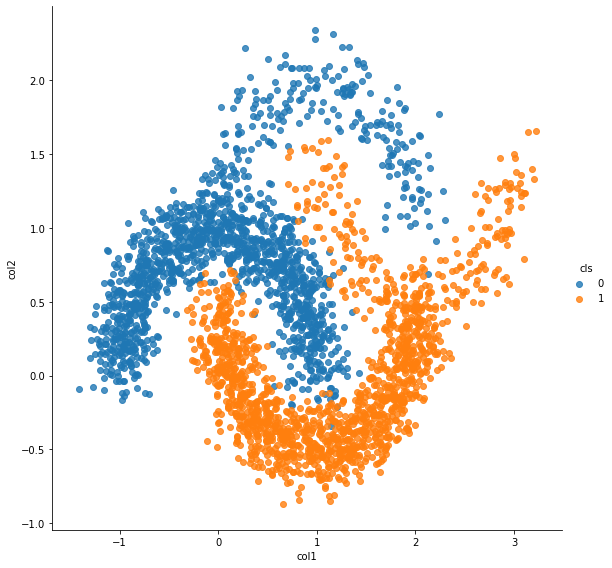
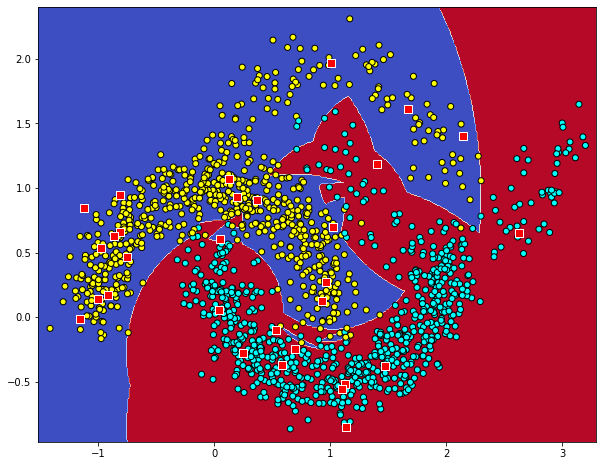

* Just gaussian transfer with the given landmarks and logit
* Use kmeans if LM is not given
  * Also implements a method to randomly select from input X
* If gamma is not given, calculate from LM
  * scale1 / scale2 / scale3


```python
import warnings
warnings.filterwarnings('ignore')
```


```python
%matplotlib inline
import os, sys
import datetime

import numpy as np
import pandas as pd
import matplotlib.pyplot as plt
import seaborn as sns
import pandas as pd

from sklearn import datasets, linear_model
from sklearn.metrics import (
    f1_score,
    classification_report,
    confusion_matrix,
    make_scorer,
    mean_squared_error,
    mean_absolute_error,
    roc_auc_score,
    r2_score
)
from sklearn.metrics.pairwise import cosine_similarity, euclidean_distances
from sklearn.preprocessing import OneHotEncoder
from sklearn.model_selection import StratifiedShuffleSplit, GridSearchCV, validation_curve
from sklearn.feature_selection import RFECV
from sklearn.linear_model import LogisticRegression, Lasso
from sklearn.cluster import MiniBatchKMeans, KMeans
from sklearn.linear_model import LogisticRegression, SGDClassifier, Perceptron
from sklearn.gaussian_process import GaussianProcessClassifier
from sklearn.ensemble import AdaBoostClassifier, BaggingClassifier
from sklearn.base import BaseEstimator, ClassifierMixin
from sklearn.tree import DecisionTreeClassifier
import joblib

from lightgbm import LGBMClassifier
```


```python
sys.path.append('/home/admin/github/wordroid.sblo.jp/lib')
#from gkernel import GaussianKernel, GaussianKernel2, GaussianKernel3
from keras_ex.gkernel.sklearn import SimpleRBFClassifier, make_model_gkernel3, make_model_gkernel1
```

    Using TensorFlow backend.


moon data


```python
from sklearn.datasets import make_moons

n_samples = 2500
X, y = make_moons(n_samples=n_samples, noise=.10, random_state=0)
df = pd.DataFrame(X)
df.columns = ["col1", "col2"]
df['cls'] = y

sns.lmplot("col1", "col2", hue="cls", data=df, fit_reg=False, size=8)
```


    <seaborn.axisgrid.FacetGrid at 0x7f646d174588>


```python
N = y.shape[0]
index = np.arange(N)
xtrain = X[index[index % 2 != 0],:]
ytrain = y[index[index % 2 != 0]]
xtest = X[index[index % 2 == 0],:]
yans = y[index[index % 2 == 0]]
```


```python
def f1_scorer(estimator, X, y):
    pred = estimator.predict(X)
    s = f1_score(y, pred, average='macro')
    return s
```


```python

```

## Just gaussian transfer with the given landmarks


```python
'''set number of landmarks'''
num_lm = 30
num_lm
```


    30


```python
'''
get landmarks
n_clusters=num_lm
'''
kmeans = KMeans(n_clusters=num_lm)
kmeans.fit(xtrain)
landmarks = kmeans.cluster_centers_
```


```python
df = pd.DataFrame(np.r_[xtrain, landmarks])
df.columns = ["col1", "col2"]
df['cls'] = ['c'+str(int(ee)) for ee in ytrain] + ['LM']*landmarks.shape[0]
df.head()

sns.lmplot("col1", "col2", hue="cls", data=df, fit_reg=False, size=8, markers=['.','.','o'])
```


    <seaborn.axisgrid.FacetGrid at 0x7f646ce0cb00>


```python
gamma = 1 / (landmarks.var() * 2)
gamma
```


    0.9698892952265078


```python
'''
gaussian transfer
need
  input x   : xtrain
  landmarks : landmarks
  gamma     : gamma
'''
xtrain_gausses = SimpleRBFClassifier.calc_gauss(None, xtrain, landmarks, gamma)
xtrain_gausses.shape
```


    (1250, 30)


```python
df = pd.DataFrame(xtrain_gausses[:,:5])
df['cls'] = ['c'+str(int(ee)) for ee in ytrain]
df.head()

fig = sns.pairplot(df, markers='o', height=2.2, diag_kind='hist', hue='cls')
```


## and Logit


```python
logit = LogisticRegression()
logit.fit(xtrain_gausses, ytrain)
```


    LogisticRegression(C=1.0, class_weight=None, dual=False, fit_intercept=True,
                       intercept_scaling=1, l1_ratio=None, max_iter=100,
                       multi_class='warn', n_jobs=None, penalty='l2',
                       random_state=None, solver='warn', tol=0.0001, verbose=0,
                       warm_start=False)


```python
pred = logit.predict(xtrain_gausses)
```


```python
print('F1_SCORE :', f1_score(ytrain, pred, average='macro'))
print(classification_report(ytrain, pred))
print(confusion_matrix(ytrain, pred))
```

    F1_SCORE : 0.9887686889016676
                  precision    recall  f1-score   support
    
               0       0.99      0.99      0.99       592
               1       0.99      0.99      0.99       658
    
        accuracy                           0.99      1250
       macro avg       0.99      0.99      0.99      1250
    weighted avg       0.99      0.99      0.99      1250
    
    [[585   7]
     [  7 651]]


```python
from matplotlib.colors import ListedColormap

h = .01
x_min, x_max = xtrain[:, 0].min() - .1, xtrain[:, 0].max() + .1
y_min, y_max = xtrain[:, 1].min() - .1, xtrain[:, 1].max() + .1
xx, yy = np.meshgrid(np.arange(x_min, x_max, h),
                     np.arange(y_min, y_max, h))
xtrain_gausses = SimpleRBFClassifier.calc_gauss(None, np.c_[xx.ravel(), yy.ravel()], landmarks, gamma)
y_pred = logit.predict_proba(xtrain_gausses)
y_pred

#cm = plt.cm.coolwarm
cm = plt.cm.gnuplot
cm_bright = ListedColormap(['#FFFF00', '#00FFFF'])
y_pred = y_pred[:,1].reshape(xx.shape)
plt.figure(figsize=(10, 8))
plt.contourf(xx, yy, y_pred, 100, cmap=cm, alpha=1)
plt.scatter(xtrain[:,0], xtrain[:,1], c=ytrain, cmap=cm_bright, edgecolors='k')
plt.scatter(landmarks[:,0], landmarks[:,1], c='red', s=64, marker='s', edgecolors='w')
```


    <matplotlib.collections.PathCollection at 0x7f6465d497f0>


## SimpleRBFClassifier (the same)


```python
rbf_clf = SimpleRBFClassifier(
    init_lm=landmarks,
    logit=LogisticRegression()
)
rbf_clf.fit(xtrain, ytrain)
```


    SimpleRBFClassifier(init_gamma=None,
                        init_lm=array([[ 0.19649464, -0.22876726],
           [ 1.31290478, -0.39573061],
           [ 0.26693014,  0.95591012],
           [-0.95787918,  0.29233648],
           [ 1.79527398, -0.21331369],
           [ 0.85766202,  0.57373582],
           [-0.4634383 ,  0.93980331],
           [ 0.89767551, -0.48067717],
           [ 0.02394355,  0.19570359],
           [ 0.67970738,  0.74036374],
           [ 1.94765172,  0.20723338],
           [ 0.81755357,  0.05043037],
           [ 1.022...
           [ 1.87886987, -0.00959472],
           [ 0.17784375,  0.02725291],
           [ 0.50393055,  0.88418577],
           [ 0.07387911,  0.4463593 ]]),
                        logit=LogisticRegression(C=1.0, class_weight=None,
                                                 dual=False, fit_intercept=True,
                                                 intercept_scaling=1, l1_ratio=None,
                                                 max_iter=100, multi_class='warn',
                                                 n_jobs=None, penalty='l2',
                                                 random_state=None, solver='warn',
                                                 tol=0.0001, verbose=0,
                                                 warm_start=False),
                        num_lm=2, random_state=None)


```python
pred = rbf_clf.predict(xtrain)

print('F1_SCORE :', f1_score(ytrain, pred, average='macro'))
print(classification_report(ytrain, pred))
print(confusion_matrix(ytrain, pred))
```

    F1_SCORE : 0.9887686889016676
                  precision    recall  f1-score   support
    
               0       0.99      0.99      0.99       592
               1       0.99      0.99      0.99       658
    
        accuracy                           0.99      1250
       macro avg       0.99      0.99      0.99      1250
    weighted avg       0.99      0.99      0.99      1250
    
    [[585   7]
     [  7 651]]


```python
from matplotlib.colors import ListedColormap

h = .01
x_min, x_max = xtrain[:, 0].min() - .1, xtrain[:, 0].max() + .1
y_min, y_max = xtrain[:, 1].min() - .1, xtrain[:, 1].max() + .1
xx, yy = np.meshgrid(np.arange(x_min, x_max, h),
                     np.arange(y_min, y_max, h))
y_pred = rbf_clf.predict_proba(np.c_[xx.ravel(), yy.ravel()])
y_pred

#cm = plt.cm.coolwarm
cm = plt.cm.gnuplot
cm_bright = ListedColormap(['#FFFF00', '#00FFFF'])
y_pred = y_pred[:,1].reshape(xx.shape)
plt.figure(figsize=(10, 8))
plt.contourf(xx, yy, y_pred, 100, cmap=cm, alpha=1)
plt.scatter(xtrain[:,0], xtrain[:,1], c=ytrain, cmap=cm_bright, edgecolors='k')
plt.scatter(landmarks[:,0], landmarks[:,1], c='red', s=64, marker='s', edgecolors='w')
```


    <matplotlib.collections.PathCollection at 0x7f6465c167b8>


```python
'''
landmarks[0]
'''
from matplotlib.colors import ListedColormap
idx = 0

h = .01
x_min, x_max = xtrain[:, 0].min() - .1, xtrain[:, 0].max() + .1
y_min, y_max = xtrain[:, 1].min() - .1, xtrain[:, 1].max() + .1
xx, yy = np.meshgrid(np.arange(x_min, x_max, h),
                     np.arange(y_min, y_max, h))
#y_pred = rbf_clf.gmm._estimate_log_prob(np.c_[xx.ravel(), yy.ravel()])[:,idx]
y_pred = rbf_clf.calc_gauss(np.c_[xx.ravel(), yy.ravel()])[:,idx]
y_pred = np.exp(y_pred)
y_pred

cm = plt.cm.coolwarm
#cm = plt.cm.gnuplot
cm_bright = ListedColormap(['#FFFF00', '#00FFFF'])
y_pred = y_pred.reshape(xx.shape)
plt.figure(figsize=(10, 6.5))
plt.contourf(xx, yy, y_pred, 100, cmap=cm, alpha=1)
plt.scatter(xtrain[:,0], xtrain[:,1], c=ytrain, cmap=cm_bright, edgecolors='k')
plt.scatter(landmarks[idx,0], landmarks[idx,1], c='red', s=64, marker='s', edgecolors='w')
for ii in range(landmarks.shape[0]):
    plt.text(landmarks[ii,0], landmarks[ii,1], str(ii), color='white', fontdict={'weight': 'bold', 'size': 16})
```


```python
'''
landmarks[1]
'''
from matplotlib.colors import ListedColormap
idx = 1

h = .01
x_min, x_max = xtrain[:, 0].min() - .1, xtrain[:, 0].max() + .1
y_min, y_max = xtrain[:, 1].min() - .1, xtrain[:, 1].max() + .1
xx, yy = np.meshgrid(np.arange(x_min, x_max, h),
                     np.arange(y_min, y_max, h))
y_pred = rbf_clf.calc_gauss(np.c_[xx.ravel(), yy.ravel()])[:,idx]
y_pred = np.exp(y_pred)
y_pred

cm = plt.cm.coolwarm
#cm = plt.cm.gnuplot
cm_bright = ListedColormap(['#FFFF00', '#00FFFF'])
y_pred = y_pred.reshape(xx.shape)
plt.figure(figsize=(10, 6.5))
plt.contourf(xx, yy, y_pred, 100, cmap=cm, alpha=1)
plt.scatter(xtrain[:,0], xtrain[:,1], c=ytrain, cmap=cm_bright, edgecolors='k')
plt.scatter(landmarks[idx,0], landmarks[idx,1], c='red', s=64, marker='s', edgecolors='w')
for ii in range(landmarks.shape[0]):
    plt.text(landmarks[ii,0], landmarks[ii,1], str(ii), color='white', fontdict={'weight': 'bold', 'size': 16})
```


```python
rbf_clf.gamma
```


    0.9698892952265078


```python
'''
landmarks[1]
gamma = 3
'''
from matplotlib.colors import ListedColormap
idx = 1

h = .01
x_min, x_max = xtrain[:, 0].min() - .1, xtrain[:, 0].max() + .1
y_min, y_max = xtrain[:, 1].min() - .1, xtrain[:, 1].max() + .1
xx, yy = np.meshgrid(np.arange(x_min, x_max, h),
                     np.arange(y_min, y_max, h))
y_pred = rbf_clf.calc_gauss(np.c_[xx.ravel(), yy.ravel()], gamma=3)[:,idx]
y_pred = np.exp(y_pred)
y_pred

cm = plt.cm.coolwarm
#cm = plt.cm.gnuplot
cm_bright = ListedColormap(['#FFFF00', '#00FFFF'])
y_pred = y_pred.reshape(xx.shape)
plt.figure(figsize=(10, 6.5))
plt.contourf(xx, yy, y_pred, 100, cmap=cm, alpha=1)
plt.scatter(xtrain[:,0], xtrain[:,1], c=ytrain, cmap=cm_bright, edgecolors='k')
plt.scatter(landmarks[idx,0], landmarks[idx,1], c='red', s=64, marker='s', edgecolors='w')
for ii in range(landmarks.shape[0]):
    plt.text(landmarks[ii,0], landmarks[ii,1], str(ii), color='white', fontdict={'weight': 'bold', 'size': 16})
```


## Use kmeans if ``init_lm`` is not given


```python
num_lm
```


    30


```python
rbf_clf = SimpleRBFClassifier(
    num_lm=num_lm
)
```


```python
rbf_clf.fit(xtrain, ytrain)
```


    SimpleRBFClassifier(init_gamma=None,
                        init_lm=KMeans(algorithm='auto', copy_x=True,
                                       init='k-means++', max_iter=300,
                                       n_clusters=30, n_init=10, n_jobs=None,
                                       precompute_distances='auto',
                                       random_state=None, tol=0.0001, verbose=0),
                        logit=LogisticRegression(C=1.0, class_weight=None,
                                                 dual=False, fit_intercept=True,
                                                 intercept_scaling=1, l1_ratio=None,
                                                 max_iter=100, multi_class='warn',
                                                 n_jobs=None, penalty='none',
                                                 random_state=None, solver='lbfgs',
                                                 tol=0.0001, verbose=0,
                                                 warm_start=False),
                        num_lm=30, random_state=None)


```python
rbf_clf.init_lm
```


    KMeans(algorithm='auto', copy_x=True, init='k-means++', max_iter=300,
           n_clusters=30, n_init=10, n_jobs=None, precompute_distances='auto',
           random_state=None, tol=0.0001, verbose=0)


```python
df = pd.DataFrame(np.r_[xtrain, rbf_clf.lm])
df.columns = ["col1", "col2"]
df['cls'] = ['c'+str(int(ee)) for ee in ytrain] + ['LM']*rbf_clf.lm.shape[0]
df.head()

sns.lmplot("col1", "col2", hue="cls", data=df, fit_reg=False, size=8, markers=['.','.','o'])
```


    <seaborn.axisgrid.FacetGrid at 0x7f64644cf668>


## Also implements a method to randomly select from input X


```python
rbf_clf = SimpleRBFClassifier(
    num_lm=num_lm,
    init_lm='select_from_x'
)
```


```python
rbf_clf.fit(xtrain, ytrain)
```


    SimpleRBFClassifier(init_gamma=None, init_lm='select_from_x',
                        logit=LogisticRegression(C=1.0, class_weight=None,
                                                 dual=False, fit_intercept=True,
                                                 intercept_scaling=1, l1_ratio=None,
                                                 max_iter=100, multi_class='warn',
                                                 n_jobs=None, penalty='none',
                                                 random_state=None, solver='lbfgs',
                                                 tol=0.0001, verbose=0,
                                                 warm_start=False),
                        num_lm=30, random_state=None)


```python
df = pd.DataFrame(np.r_[xtrain, rbf_clf.lm])
df.columns = ["col1", "col2"]
df['cls'] = ['c'+str(int(ee)) for ee in ytrain] + ['LM']*rbf_clf.lm.shape[0]
df.head()

sns.lmplot("col1", "col2", hue="cls", data=df, fit_reg=False, size=8, markers=['.','.','o'])
```


    <seaborn.axisgrid.FacetGrid at 0x7f646445fdd8>


```python

```

## moon2


```python
n_samples = 2500
X1, y1 = make_moons(n_samples=n_samples, noise=.15, random_state=0)
df = pd.DataFrame(X1)
df.columns = ["col1", "col2"]
df['cls'] = y1

sns.lmplot("col1", "col2", hue="cls", data=df, fit_reg=False, height=8)
```


    <seaborn.axisgrid.FacetGrid at 0x7f6464438940>


```python
n_samples = 500
X2, y2 = make_moons(n_samples=n_samples, noise=.15, random_state=0)
X2[:,0] += 1
X2[:,1] += 1
df = pd.DataFrame(X2)
df.columns = ["col1", "col2"]
df['cls'] = y2

sns.lmplot("col1", "col2", hue="cls", data=df, fit_reg=False, height=8)
```


    <seaborn.axisgrid.FacetGrid at 0x7f6464352a90>


```python
X = np.r_[X1,X2]
y = np.concatenate([y1, y2])

df = pd.DataFrame(X)
df.columns = ["col1", "col2"]
df['cls'] = y

sns.lmplot("col1", "col2", hue="cls", data=df, fit_reg=False, height=8)
```


    <seaborn.axisgrid.FacetGrid at 0x7f64643220f0>





```python
N = y.shape[0]
index = np.arange(N)
xtrain = X[index[index % 2 != 0],:]
ytrain = y[index[index % 2 != 0]]
xtest = X[index[index % 2 == 0],:]
yans = y[index[index % 2 == 0]]
```

## Bagging


```python
ens_clf = BaggingClassifier(
    SimpleRBFClassifier(
        num_lm=num_lm,
        init_lm='select_from_x'
    ),
    n_estimators=30,
    verbose=2
)
```


```python
%%time
ens_clf.fit(xtrain, ytrain)
```

    [Parallel(n_jobs=1)]: Using backend SequentialBackend with 1 concurrent workers.


    Building estimator 1 of 30 for this parallel run (total 30)...
    Building estimator 2 of 30 for this parallel run (total 30)...
    Building estimator 3 of 30 for this parallel run (total 30)...
    Building estimator 4 of 30 for this parallel run (total 30)...
    Building estimator 5 of 30 for this parallel run (total 30)...
    Building estimator 6 of 30 for this parallel run (total 30)...
    Building estimator 7 of 30 for this parallel run (total 30)...
    Building estimator 8 of 30 for this parallel run (total 30)...
    Building estimator 9 of 30 for this parallel run (total 30)...
    Building estimator 10 of 30 for this parallel run (total 30)...
    Building estimator 11 of 30 for this parallel run (total 30)...
    Building estimator 12 of 30 for this parallel run (total 30)...
    Building estimator 13 of 30 for this parallel run (total 30)...
    Building estimator 14 of 30 for this parallel run (total 30)...
    Building estimator 15 of 30 for this parallel run (total 30)...
    Building estimator 16 of 30 for this parallel run (total 30)...
    Building estimator 17 of 30 for this parallel run (total 30)...
    Building estimator 18 of 30 for this parallel run (total 30)...
    Building estimator 19 of 30 for this parallel run (total 30)...
    Building estimator 20 of 30 for this parallel run (total 30)...
    Building estimator 21 of 30 for this parallel run (total 30)...
    Building estimator 22 of 30 for this parallel run (total 30)...
    Building estimator 23 of 30 for this parallel run (total 30)...
    Building estimator 24 of 30 for this parallel run (total 30)...
    Building estimator 25 of 30 for this parallel run (total 30)...
    Building estimator 26 of 30 for this parallel run (total 30)...
    Building estimator 27 of 30 for this parallel run (total 30)...
    Building estimator 28 of 30 for this parallel run (total 30)...
    Building estimator 29 of 30 for this parallel run (total 30)...
    Building estimator 30 of 30 for this parallel run (total 30)...
    CPU times: user 1.03 s, sys: 46.3 ms, total: 1.08 s
    Wall time: 999 ms


    [Parallel(n_jobs=1)]: Done   1 out of   1 | elapsed:    1.0s remaining:    0.0s
    [Parallel(n_jobs=1)]: Done   1 out of   1 | elapsed:    1.0s finished


    BaggingClassifier(base_estimator=SimpleRBFClassifier(init_gamma=None,
                                                         init_lm='select_from_x',
                                                         logit=LogisticRegression(C=1.0,
                                                                                  class_weight=None,
                                                                                  dual=False,
                                                                                  fit_intercept=True,
                                                                                  intercept_scaling=1,
                                                                                  l1_ratio=None,
                                                                                  max_iter=100,
                                                                                  multi_class='warn',
                                                                                  n_jobs=None,
                                                                                  penalty='none',
                                                                                  random_state=None,
                                                                                  solver='lbfgs',
                                                                                  tol=0.0001,
                                                                                  verbose=0,
                                                                                  warm_start=False),
                                                         num_lm=30,
                                                         random_state=None),
                      bootstrap=True, bootstrap_features=False, max_features=1.0,
                      max_samples=1.0, n_estimators=30, n_jobs=None,
                      oob_score=False, random_state=None, verbose=2,
                      warm_start=False)


```python
ens_clf.estimators_[0].gamma
```


    0.861451734370111


```python
for iest in ens_clf.estimators_:
    print(f1_score(ytrain, iest.predict(xtrain), average='macro'))
```

    0.9846429075382848
    0.9826370029508191
    0.9779724998898625
    0.9786465849661281
    0.9806387089624085
    0.9826473859844271
    0.9792968129113089
    0.9746448499686842
    0.9806424999032126
    0.9746313083479907
    0.9766437360057052
    0.9779703824030084
    0.9826424741328358
    0.9526573875146196
    0.9793013101602968
    0.9772838626341811
    0.9799720855378874
    0.9813108731560061
    0.9713075100924164
    0.9733082312076602
    0.9579715887940248
    0.9773039192126329
    0.9779681860606716
    0.9786347232039369
    0.9819791679181133
    0.9445424170330059
    0.9786389827883604
    0.9786368912404133
    0.9739744486920714
    0.9759733036707452


```python
pred = ens_clf.predict(xtrain)
```

    [Parallel(n_jobs=1)]: Using backend SequentialBackend with 1 concurrent workers.
    [Parallel(n_jobs=1)]: Done   1 out of   1 | elapsed:    0.0s remaining:    0.0s
    [Parallel(n_jobs=1)]: Done   1 out of   1 | elapsed:    0.0s finished


```python
print('F1_SCORE :', f1_score(ytrain, pred, average='macro'))
print(classification_report(ytrain, pred))
print(confusion_matrix(ytrain, pred))
```

    F1_SCORE : 0.9826407126031986
                  precision    recall  f1-score   support
    
               0       0.98      0.98      0.98       720
               1       0.98      0.98      0.98       780
    
        accuracy                           0.98      1500
       macro avg       0.98      0.98      0.98      1500
    weighted avg       0.98      0.98      0.98      1500
    
    [[708  12]
     [ 14 766]]


```python
print('F1_SCORE :', f1_score(yans, ens_clf.predict(xtest), average='macro'))
print(classification_report(yans, ens_clf.predict(xtest)))
print(confusion_matrix(yans, ens_clf.predict(xtest)))
```

    [Parallel(n_jobs=1)]: Using backend SequentialBackend with 1 concurrent workers.


    F1_SCORE : 0.9846429075382848
                  precision    recall  f1-score   support
    
               0       0.99      0.98      0.99       780
               1       0.98      0.98      0.98       720
    
        accuracy                           0.98      1500
       macro avg       0.98      0.98      0.98      1500
    weighted avg       0.98      0.98      0.98      1500
    
    [[768  12]
     [ 11 709]]


    [Parallel(n_jobs=1)]: Done   1 out of   1 | elapsed:    0.1s remaining:    0.0s
    [Parallel(n_jobs=1)]: Done   1 out of   1 | elapsed:    0.1s finished
    [Parallel(n_jobs=1)]: Using backend SequentialBackend with 1 concurrent workers.
    [Parallel(n_jobs=1)]: Done   1 out of   1 | elapsed:    0.0s remaining:    0.0s
    [Parallel(n_jobs=1)]: Done   1 out of   1 | elapsed:    0.0s finished
    [Parallel(n_jobs=1)]: Using backend SequentialBackend with 1 concurrent workers.
    [Parallel(n_jobs=1)]: Done   1 out of   1 | elapsed:    0.0s remaining:    0.0s
    [Parallel(n_jobs=1)]: Done   1 out of   1 | elapsed:    0.0s finished


```python
from matplotlib.colors import ListedColormap

h = .01
x_min, x_max = xtrain[:, 0].min() - .1, xtrain[:, 0].max() + .1
y_min, y_max = xtrain[:, 1].min() - .1, xtrain[:, 1].max() + .1
xx, yy = np.meshgrid(np.arange(x_min, x_max, h),
                     np.arange(y_min, y_max, h))
y_pred = ens_clf.predict_proba(np.c_[xx.ravel(), yy.ravel()])
y_pred

cm = plt.cm.coolwarm
#cm = plt.cm.gnuplot
cm_bright = ListedColormap(['#FFFF00', '#00FFFF'])
y_pred = y_pred[:,1].reshape(xx.shape)
plt.figure(figsize=(10, 8))
plt.contourf(xx, yy, y_pred, 100, cmap=cm, alpha=1)
plt.scatter(xtrain[:,0], xtrain[:,1], c=ytrain, cmap=cm_bright, edgecolors='k')
```

    [Parallel(n_jobs=1)]: Using backend SequentialBackend with 1 concurrent workers.
    [Parallel(n_jobs=1)]: Done   1 out of   1 | elapsed:    1.3s remaining:    0.0s
    [Parallel(n_jobs=1)]: Done   1 out of   1 | elapsed:    1.3s finished


    <matplotlib.collections.PathCollection at 0x7f6464101588>


```python
'''
ens_clf.estimators_[0]
'''
from matplotlib.colors import ListedColormap
idx = 0

h = .01
x_min, x_max = xtrain[:, 0].min() - .1, xtrain[:, 0].max() + .1
y_min, y_max = xtrain[:, 1].min() - .1, xtrain[:, 1].max() + .1
xx, yy = np.meshgrid(np.arange(x_min, x_max, h),
                     np.arange(y_min, y_max, h))
y_pred = ens_clf.estimators_[idx].predict_proba(np.c_[xx.ravel(), yy.ravel()])
y_pred
lm = ens_clf.estimators_[idx].lm

cm = plt.cm.coolwarm
#cm = plt.cm.gnuplot
cm_bright = ListedColormap(['#FFFF00', '#00FFFF'])
y_pred = y_pred[:,1].reshape(xx.shape)
plt.figure(figsize=(10, 8))
plt.contourf(xx, yy, y_pred, 100, cmap=cm, alpha=1)
plt.scatter(xtrain[:,0], xtrain[:,1], c=ytrain, cmap=cm_bright, edgecolors='k')
plt.scatter(lm[:,0], lm[:,1], c='red', s=64, marker='s', edgecolors='w')
```


    <matplotlib.collections.PathCollection at 0x7f64640d6f28>


```python
'''
ens_clf.estimators_[1]
'''
from matplotlib.colors import ListedColormap
idx = 1

h = .01
x_min, x_max = xtrain[:, 0].min() - .1, xtrain[:, 0].max() + .1
y_min, y_max = xtrain[:, 1].min() - .1, xtrain[:, 1].max() + .1
xx, yy = np.meshgrid(np.arange(x_min, x_max, h),
                     np.arange(y_min, y_max, h))
y_pred = ens_clf.estimators_[idx].predict_proba(np.c_[xx.ravel(), yy.ravel()])
y_pred
lm = ens_clf.estimators_[idx].lm

cm = plt.cm.coolwarm
#cm = plt.cm.gnuplot
cm_bright = ListedColormap(['#FFFF00', '#00FFFF'])
y_pred = y_pred[:,1].reshape(xx.shape)
plt.figure(figsize=(10, 8))
plt.contourf(xx, yy, y_pred, 100, cmap=cm, alpha=1)
plt.scatter(xtrain[:,0], xtrain[:,1], c=ytrain, cmap=cm_bright, edgecolors='k')
plt.scatter(lm[:,0], lm[:,1], c='red', s=64, marker='s', edgecolors='w')
```


    <matplotlib.collections.PathCollection at 0x7f645ff131d0>


```python
'''
ens_clf.estimators_[2]
'''
from matplotlib.colors import ListedColormap
idx = 2

h = .01
x_min, x_max = xtrain[:, 0].min() - .1, xtrain[:, 0].max() + .1
y_min, y_max = xtrain[:, 1].min() - .1, xtrain[:, 1].max() + .1
xx, yy = np.meshgrid(np.arange(x_min, x_max, h),
                     np.arange(y_min, y_max, h))
y_pred = ens_clf.estimators_[idx].predict_proba(np.c_[xx.ravel(), yy.ravel()])
y_pred
lm = ens_clf.estimators_[idx].lm

cm = plt.cm.coolwarm
#cm = plt.cm.gnuplot
cm_bright = ListedColormap(['#FFFF00', '#00FFFF'])
y_pred = y_pred[:,1].reshape(xx.shape)
plt.figure(figsize=(10, 8))
plt.contourf(xx, yy, y_pred, 100, cmap=cm, alpha=1)
plt.scatter(xtrain[:,0], xtrain[:,1], c=ytrain, cmap=cm_bright, edgecolors='k')
plt.scatter(lm[:,0], lm[:,1], c='red', s=64, marker='s', edgecolors='w')
```


    <matplotlib.collections.PathCollection at 0x7f645fdf9438>


```python

```

## Bagging (DecisionTree)


```python
ens_clf = BaggingClassifier(
    SimpleRBFClassifier(
        num_lm=num_lm,
        init_lm='select_from_x',
        logit=DecisionTreeClassifier()
    ),
    n_estimators=30,
    verbose=2
)
```


```python
%%time
ens_clf.fit(xtrain, ytrain)
```

    [Parallel(n_jobs=1)]: Using backend SequentialBackend with 1 concurrent workers.


    Building estimator 1 of 30 for this parallel run (total 30)...
    Building estimator 2 of 30 for this parallel run (total 30)...
    Building estimator 3 of 30 for this parallel run (total 30)...
    Building estimator 4 of 30 for this parallel run (total 30)...
    Building estimator 5 of 30 for this parallel run (total 30)...
    Building estimator 6 of 30 for this parallel run (total 30)...
    Building estimator 7 of 30 for this parallel run (total 30)...
    Building estimator 8 of 30 for this parallel run (total 30)...
    Building estimator 9 of 30 for this parallel run (total 30)...
    Building estimator 10 of 30 for this parallel run (total 30)...
    Building estimator 11 of 30 for this parallel run (total 30)...
    Building estimator 12 of 30 for this parallel run (total 30)...
    Building estimator 13 of 30 for this parallel run (total 30)...
    Building estimator 14 of 30 for this parallel run (total 30)...
    Building estimator 15 of 30 for this parallel run (total 30)...
    Building estimator 16 of 30 for this parallel run (total 30)...
    Building estimator 17 of 30 for this parallel run (total 30)...
    Building estimator 18 of 30 for this parallel run (total 30)...
    Building estimator 19 of 30 for this parallel run (total 30)...
    Building estimator 20 of 30 for this parallel run (total 30)...
    Building estimator 21 of 30 for this parallel run (total 30)...
    Building estimator 22 of 30 for this parallel run (total 30)...
    Building estimator 23 of 30 for this parallel run (total 30)...
    Building estimator 24 of 30 for this parallel run (total 30)...
    Building estimator 25 of 30 for this parallel run (total 30)...
    Building estimator 26 of 30 for this parallel run (total 30)...
    Building estimator 27 of 30 for this parallel run (total 30)...
    Building estimator 28 of 30 for this parallel run (total 30)...
    Building estimator 29 of 30 for this parallel run (total 30)...
    Building estimator 30 of 30 for this parallel run (total 30)...
    CPU times: user 405 ms, sys: 5.15 ms, total: 410 ms
    Wall time: 400 ms


    [Parallel(n_jobs=1)]: Done   1 out of   1 | elapsed:    0.4s remaining:    0.0s
    [Parallel(n_jobs=1)]: Done   1 out of   1 | elapsed:    0.4s finished


    BaggingClassifier(base_estimator=SimpleRBFClassifier(init_gamma=None,
                                                         init_lm='select_from_x',
                                                         logit=DecisionTreeClassifier(class_weight=None,
                                                                                      criterion='gini',
                                                                                      max_depth=None,
                                                                                      max_features=None,
                                                                                      max_leaf_nodes=None,
                                                                                      min_impurity_decrease=0.0,
                                                                                      min_impurity_split=None,
                                                                                      min_samples_leaf=1,
                                                                                      min_samples_split=2,
                                                                                      min_weight_fraction_leaf=0.0,
                                                                                      presort=False,
                                                                                      random_state=None,
                                                                                      splitter='best'),
                                                         num_lm=30,
                                                         random_state=None),
                      bootstrap=True, bootstrap_features=False, max_features=1.0,
                      max_samples=1.0, n_estimators=30, n_jobs=None,
                      oob_score=False, random_state=None, verbose=2,
                      warm_start=False)


```python
ens_clf.estimators_[0].gamma
```


    0.7249064622160472


```python
for iest in ens_clf.estimators_:
    print(f1_score(ytrain, iest.predict(xtrain), average='macro'))
```

    0.9879844278184527
    0.9933240285126292
    0.9926537078072386
    0.9899811868953925
    0.9919863090542242
    0.9893184456202067
    0.9886502776676187
    0.9913216657951246
    0.9926560620202238
    0.9919863090542242
    0.9906517094017094
    0.9933204016308907
    0.9926560620202238
    0.9933226495726496
    0.9899874999499376
    0.9926567941343362
    0.985979754765882
    0.9919896185456352
    0.9886466393384598
    0.9893126426094252
    0.9919871794871795
    0.9879767229356033
    0.9899834348271075
    0.9899855391184871
    0.9946586808009843
    0.9926574999632876
    0.9893232924830642
    0.9906496448646069
    0.9886491055717758
    0.9933204016308907


```python
pred = ens_clf.predict(xtrain)
```

    [Parallel(n_jobs=1)]: Using backend SequentialBackend with 1 concurrent workers.
    [Parallel(n_jobs=1)]: Done   1 out of   1 | elapsed:    0.0s remaining:    0.0s
    [Parallel(n_jobs=1)]: Done   1 out of   1 | elapsed:    0.0s finished


```python
print('F1_SCORE :', f1_score(ytrain, pred, average='macro'))
print(classification_report(ytrain, pred))
print(confusion_matrix(ytrain, pred))
```

    F1_SCORE : 1.0
                  precision    recall  f1-score   support
    
               0       1.00      1.00      1.00       720
               1       1.00      1.00      1.00       780
    
        accuracy                           1.00      1500
       macro avg       1.00      1.00      1.00      1500
    weighted avg       1.00      1.00      1.00      1500
    
    [[720   0]
     [  0 780]]


```python
print('F1_SCORE :', f1_score(yans, ens_clf.predict(xtest), average='macro'))
print(classification_report(yans, ens_clf.predict(xtest)))
print(confusion_matrix(yans, ens_clf.predict(xtest)))
```

    [Parallel(n_jobs=1)]: Using backend SequentialBackend with 1 concurrent workers.
    [Parallel(n_jobs=1)]: Done   1 out of   1 | elapsed:    0.0s remaining:    0.0s
    [Parallel(n_jobs=1)]: Done   1 out of   1 | elapsed:    0.0s finished
    [Parallel(n_jobs=1)]: Using backend SequentialBackend with 1 concurrent workers.


    F1_SCORE : 0.9873137062272788
                  precision    recall  f1-score   support
    
               0       0.99      0.99      0.99       780
               1       0.99      0.99      0.99       720
    
        accuracy                           0.99      1500
       macro avg       0.99      0.99      0.99      1500
    weighted avg       0.99      0.99      0.99      1500
    
    [[770  10]
     [  9 711]]


    [Parallel(n_jobs=1)]: Done   1 out of   1 | elapsed:    0.0s remaining:    0.0s
    [Parallel(n_jobs=1)]: Done   1 out of   1 | elapsed:    0.0s finished
    [Parallel(n_jobs=1)]: Using backend SequentialBackend with 1 concurrent workers.
    [Parallel(n_jobs=1)]: Done   1 out of   1 | elapsed:    0.0s remaining:    0.0s
    [Parallel(n_jobs=1)]: Done   1 out of   1 | elapsed:    0.0s finished


```python
from matplotlib.colors import ListedColormap

h = .01
x_min, x_max = xtrain[:, 0].min() - .1, xtrain[:, 0].max() + .1
y_min, y_max = xtrain[:, 1].min() - .1, xtrain[:, 1].max() + .1
xx, yy = np.meshgrid(np.arange(x_min, x_max, h),
                     np.arange(y_min, y_max, h))
y_pred = ens_clf.predict_proba(np.c_[xx.ravel(), yy.ravel()])
y_pred

cm = plt.cm.coolwarm
#cm = plt.cm.gnuplot
cm_bright = ListedColormap(['#FFFF00', '#00FFFF'])
y_pred = y_pred[:,1].reshape(xx.shape)
plt.figure(figsize=(10, 8))
plt.contourf(xx, yy, y_pred, 100, cmap=cm, alpha=1)
plt.scatter(xtrain[:,0], xtrain[:,1], c=ytrain, cmap=cm_bright, edgecolors='k')
```

    [Parallel(n_jobs=1)]: Using backend SequentialBackend with 1 concurrent workers.
    [Parallel(n_jobs=1)]: Done   1 out of   1 | elapsed:    1.4s remaining:    0.0s
    [Parallel(n_jobs=1)]: Done   1 out of   1 | elapsed:    1.4s finished


    <matplotlib.collections.PathCollection at 0x7f645fa600f0>


```python
'''
ens_clf.estimators_[0]
'''
from matplotlib.colors import ListedColormap
idx = 0

h = .01
x_min, x_max = xtrain[:, 0].min() - .1, xtrain[:, 0].max() + .1
y_min, y_max = xtrain[:, 1].min() - .1, xtrain[:, 1].max() + .1
xx, yy = np.meshgrid(np.arange(x_min, x_max, h),
                     np.arange(y_min, y_max, h))
y_pred = ens_clf.estimators_[idx].predict_proba(np.c_[xx.ravel(), yy.ravel()])
y_pred
lm = ens_clf.estimators_[idx].lm

cm = plt.cm.coolwarm
#cm = plt.cm.gnuplot
cm_bright = ListedColormap(['#FFFF00', '#00FFFF'])
y_pred = y_pred[:,1].reshape(xx.shape)
plt.figure(figsize=(10, 8))
plt.contourf(xx, yy, y_pred, 100, cmap=cm, alpha=1)
plt.scatter(xtrain[:,0], xtrain[:,1], c=ytrain, cmap=cm_bright, edgecolors='k')
plt.scatter(lm[:,0], lm[:,1], c='red', s=64, marker='s', edgecolors='w')
```


    <matplotlib.collections.PathCollection at 0x7f645fa34a90>


```python
'''
ens_clf.estimators_[1]
'''
from matplotlib.colors import ListedColormap
idx = 1

h = .01
x_min, x_max = xtrain[:, 0].min() - .1, xtrain[:, 0].max() + .1
y_min, y_max = xtrain[:, 1].min() - .1, xtrain[:, 1].max() + .1
xx, yy = np.meshgrid(np.arange(x_min, x_max, h),
                     np.arange(y_min, y_max, h))
y_pred = ens_clf.estimators_[idx].predict_proba(np.c_[xx.ravel(), yy.ravel()])
y_pred
lm = ens_clf.estimators_[idx].lm

cm = plt.cm.coolwarm
#cm = plt.cm.gnuplot
cm_bright = ListedColormap(['#FFFF00', '#00FFFF'])
y_pred = y_pred[:,1].reshape(xx.shape)
plt.figure(figsize=(10, 8))
plt.contourf(xx, yy, y_pred, 100, cmap=cm, alpha=1)
plt.scatter(xtrain[:,0], xtrain[:,1], c=ytrain, cmap=cm_bright, edgecolors='k')
plt.scatter(lm[:,0], lm[:,1], c='red', s=64, marker='s', edgecolors='w')
```


    <matplotlib.collections.PathCollection at 0x7f6465c231d0>


```python
'''
ens_clf.estimators_[2]
'''
from matplotlib.colors import ListedColormap
idx = 2

h = .01
x_min, x_max = xtrain[:, 0].min() - .1, xtrain[:, 0].max() + .1
y_min, y_max = xtrain[:, 1].min() - .1, xtrain[:, 1].max() + .1
xx, yy = np.meshgrid(np.arange(x_min, x_max, h),
                     np.arange(y_min, y_max, h))
y_pred = ens_clf.estimators_[idx].predict_proba(np.c_[xx.ravel(), yy.ravel()])
y_pred
lm = ens_clf.estimators_[idx].lm

cm = plt.cm.coolwarm
#cm = plt.cm.gnuplot
cm_bright = ListedColormap(['#FFFF00', '#00FFFF'])
y_pred = y_pred[:,1].reshape(xx.shape)
plt.figure(figsize=(10, 8))
plt.contourf(xx, yy, y_pred, 100, cmap=cm, alpha=1)
plt.scatter(xtrain[:,0], xtrain[:,1], c=ytrain, cmap=cm_bright, edgecolors='k')
plt.scatter(lm[:,0], lm[:,1], c='red', s=64, marker='s', edgecolors='w')
```


    <matplotlib.collections.PathCollection at 0x7f646472cef0>





```python

```
