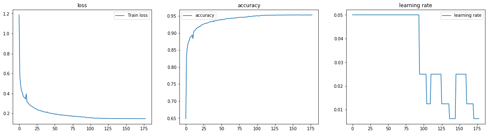
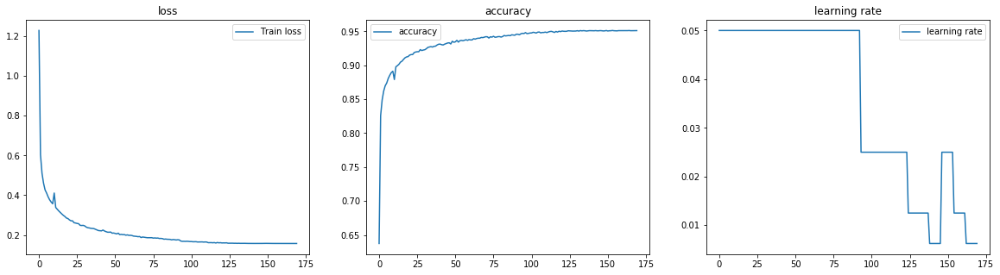

```python
epochs = 100
```


```python
%matplotlib inline
import os, sys

import numpy as np
import matplotlib.pyplot as plt
from sklearn import datasets, linear_model
from sklearn.metrics import f1_score, classification_report, confusion_matrix, make_scorer
from sklearn.preprocessing import OneHotEncoder
from sklearn.model_selection import train_test_split

import keras
from keras.models import Sequential
from keras.utils import to_categorical
from keras.layers import Input, Dense
from keras.models import Model
from keras.optimizers import SGD
from keras import regularizers
from keras.wrappers.scikit_learn import KerasClassifier, KerasRegressor
from keras import backend as K
import tensorflow as tf
```

    Using TensorFlow backend.
    /home/admin/miniconda3/envs/da03/lib/python3.6/site-packages/tensorflow/python/framework/dtypes.py:516: FutureWarning: Passing (type, 1) or '1type' as a synonym of type is deprecated; in a future version of numpy, it will be understood as (type, (1,)) / '(1,)type'.
      _np_qint8 = np.dtype([("qint8", np.int8, 1)])
    /home/admin/miniconda3/envs/da03/lib/python3.6/site-packages/tensorflow/python/framework/dtypes.py:517: FutureWarning: Passing (type, 1) or '1type' as a synonym of type is deprecated; in a future version of numpy, it will be understood as (type, (1,)) / '(1,)type'.
      _np_quint8 = np.dtype([("quint8", np.uint8, 1)])
    /home/admin/miniconda3/envs/da03/lib/python3.6/site-packages/tensorflow/python/framework/dtypes.py:518: FutureWarning: Passing (type, 1) or '1type' as a synonym of type is deprecated; in a future version of numpy, it will be understood as (type, (1,)) / '(1,)type'.
      _np_qint16 = np.dtype([("qint16", np.int16, 1)])
    /home/admin/miniconda3/envs/da03/lib/python3.6/site-packages/tensorflow/python/framework/dtypes.py:519: FutureWarning: Passing (type, 1) or '1type' as a synonym of type is deprecated; in a future version of numpy, it will be understood as (type, (1,)) / '(1,)type'.
      _np_quint16 = np.dtype([("quint16", np.uint16, 1)])
    /home/admin/miniconda3/envs/da03/lib/python3.6/site-packages/tensorflow/python/framework/dtypes.py:520: FutureWarning: Passing (type, 1) or '1type' as a synonym of type is deprecated; in a future version of numpy, it will be understood as (type, (1,)) / '(1,)type'.
      _np_qint32 = np.dtype([("qint32", np.int32, 1)])
    /home/admin/miniconda3/envs/da03/lib/python3.6/site-packages/tensorflow/python/framework/dtypes.py:525: FutureWarning: Passing (type, 1) or '1type' as a synonym of type is deprecated; in a future version of numpy, it will be understood as (type, (1,)) / '(1,)type'.
      np_resource = np.dtype([("resource", np.ubyte, 1)])
    /home/admin/miniconda3/envs/da03/lib/python3.6/site-packages/tensorboard/compat/tensorflow_stub/dtypes.py:541: FutureWarning: Passing (type, 1) or '1type' as a synonym of type is deprecated; in a future version of numpy, it will be understood as (type, (1,)) / '(1,)type'.
      _np_qint8 = np.dtype([("qint8", np.int8, 1)])
    /home/admin/miniconda3/envs/da03/lib/python3.6/site-packages/tensorboard/compat/tensorflow_stub/dtypes.py:542: FutureWarning: Passing (type, 1) or '1type' as a synonym of type is deprecated; in a future version of numpy, it will be understood as (type, (1,)) / '(1,)type'.
      _np_quint8 = np.dtype([("quint8", np.uint8, 1)])
    /home/admin/miniconda3/envs/da03/lib/python3.6/site-packages/tensorboard/compat/tensorflow_stub/dtypes.py:543: FutureWarning: Passing (type, 1) or '1type' as a synonym of type is deprecated; in a future version of numpy, it will be understood as (type, (1,)) / '(1,)type'.
      _np_qint16 = np.dtype([("qint16", np.int16, 1)])
    /home/admin/miniconda3/envs/da03/lib/python3.6/site-packages/tensorboard/compat/tensorflow_stub/dtypes.py:544: FutureWarning: Passing (type, 1) or '1type' as a synonym of type is deprecated; in a future version of numpy, it will be understood as (type, (1,)) / '(1,)type'.
      _np_quint16 = np.dtype([("quint16", np.uint16, 1)])
    /home/admin/miniconda3/envs/da03/lib/python3.6/site-packages/tensorboard/compat/tensorflow_stub/dtypes.py:545: FutureWarning: Passing (type, 1) or '1type' as a synonym of type is deprecated; in a future version of numpy, it will be understood as (type, (1,)) / '(1,)type'.
      _np_qint32 = np.dtype([("qint32", np.int32, 1)])
    /home/admin/miniconda3/envs/da03/lib/python3.6/site-packages/tensorboard/compat/tensorflow_stub/dtypes.py:550: FutureWarning: Passing (type, 1) or '1type' as a synonym of type is deprecated; in a future version of numpy, it will be understood as (type, (1,)) / '(1,)type'.
      np_resource = np.dtype([("resource", np.ubyte, 1)])


```python
sys.path.append('/home/admin/github/wordroid.sblo.jp/lib')
#from gkernel import GaussianKernel, GaussianKernel2, GaussianKernel3
from keras_ex.gkernel import GaussianKernel, GaussianKernel2, GaussianKernel3
from keras_ex.gkernel.sklearn import (
    RBFRegressor, RBFClassifier,
    make_model_gkernel1,
    make_model_gkernel2,
    make_model_gkernel3,
    make_model_out,
    make_model
)
```


```python
# from sklearn.datasets import load_digits
# digits = load_digits()
# X, y = digits.data, digits.target
# X = X / 16
# X.shape, X.min(), X.max()
```


```python
from sklearn.datasets import fetch_mldata
mnist = fetch_mldata('MNIST original')
mnist
```

    /home/admin/miniconda3/envs/da03/lib/python3.6/site-packages/sklearn/utils/deprecation.py:85: DeprecationWarning: Function fetch_mldata is deprecated; fetch_mldata was deprecated in version 0.20 and will be removed in version 0.22. Please use fetch_openml.
      warnings.warn(msg, category=DeprecationWarning)
    /home/admin/miniconda3/envs/da03/lib/python3.6/site-packages/sklearn/utils/deprecation.py:85: DeprecationWarning: Function mldata_filename is deprecated; mldata_filename was deprecated in version 0.20 and will be removed in version 0.22. Please use fetch_openml.
      warnings.warn(msg, category=DeprecationWarning)


    {'DESCR': 'mldata.org dataset: mnist-original',
     'COL_NAMES': ['label', 'data'],
     'target': array([0., 0., 0., ..., 9., 9., 9.]),
     'data': array([[0, 0, 0, ..., 0, 0, 0],
            [0, 0, 0, ..., 0, 0, 0],
            [0, 0, 0, ..., 0, 0, 0],
            ...,
            [0, 0, 0, ..., 0, 0, 0],
            [0, 0, 0, ..., 0, 0, 0],
            [0, 0, 0, ..., 0, 0, 0]], dtype=uint8)}


```python
X, y = mnist.data, mnist.target
X = X / 255
X.shape, X.min(), X.max()
```


    ((70000, 784), 0.0, 1.0)


```python
y.shape
```


    (70000,)


```python
y_cat = to_categorical(y, num_classes=10)
y_cat.shape
```


    (70000, 10)


```python
(
    x_train, x_test,
    y_cat_train, y_cat_test,
    y_train, y_test
) = train_test_split(X, y_cat, y,
                     test_size=0.4,
                     stratify=y, random_state=10002)

(
    x_train.shape, x_test.shape,
    y_cat_train.shape, y_cat_test.shape,
    y_train.shape, y_test.shape
)
```


    ((42000, 784), (28000, 784), (42000, 10), (28000, 10), (42000,), (28000,))


```python

```


```python

```


```python
from sklearn.model_selection import StratifiedShuffleSplit, GridSearchCV, validation_curve
from sklearn.feature_selection import RFECV
from sklearn.linear_model import LogisticRegression, Lasso
import pandas as pd
from sklearn.metrics import mean_squared_error, mean_absolute_error, roc_auc_score, r2_score, make_scorer
from sklearn.metrics.pairwise import cosine_similarity, euclidean_distances
import joblib

from lightgbm import LGBMClassifier
```


```python
import warnings
warnings.filterwarnings('ignore')
```


```python
def f1_scorer(estimator, X, y):
    pred = estimator.predict(X)
    s = f1_score(y, pred, average='macro')
    return s
```


```python

```

## batch_size=500
* use make_model_gkernel2


```python
clf1 = RBFClassifier(
    num_lm=150,
    lm_select_from_x=True,
    random_state=10001,
    #make_model_gkernel=make_model_gkernel3,
    #tol=float(np.sqrt(np.finfo(np.float32).eps)/4),
    #tol=float(np.finfo(np.float32).eps),
    lr=0.05, gamma='scale',
    epochs=epochs, batch_size=500, verbose=0,
    session_clear=False
)
```


```python
np.sqrt(np.finfo(np.float32).eps), np.sqrt(np.finfo(np.float32).eps)/2, np.sqrt(np.finfo(np.float32).eps)/4
```


    (0.00034526698, 0.0001726334885461256, 8.63167442730628e-05)


```python
%%time
#hst = clf1.fit(x_train, y_cat_train)
hst = clf1.fit(x_train, y_train)
```

    CPU times: user 1min 52s, sys: 2.16 s, total: 1min 54s
    Wall time: 1min 4s


```python
fig, ax = plt.subplots(1, 3, figsize=(20,5))
ax[0].set_title('loss')
ax[0].plot(list(range(len(hst["loss"]))), hst["loss"], label="Train loss")
ax[1].set_title('accuracy')
ax[1].plot(list(range(len(hst["loss"]))), hst["acc"], label="accuracy")
ax[2].set_title('learning rate')
ax[2].plot(list(range(len(hst["loss"]))), hst["lr"], label="learning rate")
ax[0].legend()
ax[1].legend()
ax[2].legend()
```


    <matplotlib.legend.Legend at 0x7f1193dcbd68>


```python
pred = clf1.predict(x_train)
pred.shape
```


    (42000,)


```python
pred
```


    array([2., 9., 9., ..., 8., 4., 1.])


```python
print('F1_SCORE :', f1_score(y_train, pred, average='macro'))
print(classification_report(y_train, pred))
print(confusion_matrix(y_train, pred))
```

    F1_SCORE : 0.9387280292440066
                  precision    recall  f1-score   support
    
             0.0       0.97      0.98      0.97      4142
             1.0       0.97      0.98      0.97      4726
             2.0       0.93      0.93      0.93      4194
             3.0       0.93      0.91      0.92      4285
             4.0       0.93      0.94      0.93      4094
             5.0       0.92      0.92      0.92      3788
             6.0       0.96      0.96      0.96      4125
             7.0       0.94      0.95      0.94      4376
             8.0       0.92      0.91      0.92      4095
             9.0       0.92      0.91      0.91      4175
    
        accuracy                           0.94     42000
       macro avg       0.94      0.94      0.94     42000
    weighted avg       0.94      0.94      0.94     42000
    
    [[4042    0   11    3    9   27   22    8   15    5]
     [   1 4610   22   13    8   10    6   14   36    6]
     [  18   18 3906   43   50   16   23   53   57   10]
     [   6   13   85 3920    5  111    7   37   68   33]
     [  10    6   23    4 3858    1   37   11   21  123]
     [  22   10   23   89   30 3475   46   10   55   28]
     [  32    9   12    2   24   51 3975    1   18    1]
     [   5   19   49    8   39    7    1 4138   10  100]
     [  12   35   46   93   18   69   34    9 3739   40]
     [  24   15    9   52  118   24    4  101   35 3793]]


```python
pred_test = clf1.predict(x_test)
pred_test.shape
```


    (28000,)


```python
print('F1_SCORE :', f1_score(y_test, pred_test, average='macro'))
print(classification_report(y_test, pred_test))
print(confusion_matrix(y_test, pred_test))
```

    F1_SCORE : 0.9354465542541494
                  precision    recall  f1-score   support
    
             0.0       0.96      0.98      0.97      2761
             1.0       0.97      0.98      0.97      3151
             2.0       0.93      0.92      0.93      2796
             3.0       0.92      0.91      0.92      2856
             4.0       0.92      0.94      0.93      2730
             5.0       0.91      0.92      0.91      2525
             6.0       0.95      0.96      0.96      2751
             7.0       0.95      0.94      0.94      2917
             8.0       0.92      0.91      0.91      2730
             9.0       0.91      0.91      0.91      2783
    
        accuracy                           0.94     28000
       macro avg       0.94      0.94      0.94     28000
    weighted avg       0.94      0.94      0.94     28000
    
    [[2694    0    8    2    0   19   18    2   13    5]
     [   1 3078    9   13    1   11    4    5   19   10]
     [  16   15 2578   28   45    7   20   22   59    6]
     [   2    3   50 2602    1   91    7   29   47   24]
     [  11    9   18    4 2556    3   21    9   10   89]
     [  18    5   13   64   15 2315   33    5   37   20]
     [  24    5   18    1   26   22 2646    1    6    2]
     [   8   11   47    6   33    4    1 2747    5   55]
     [  11   27   21   73   17   49   18    8 2478   28]
     [  12   11   11   26   83   16    3   74   27 2520]]


```python

```

## clf1


```python
clf1 = RBFClassifier(
    num_lm=250,
    lm_select_from_x=True,
    random_state=10001,
    #make_model_gkernel=make_model_gkernel3,
    #tol=float(np.sqrt(np.finfo(np.float32).eps)/2),
    lr=0.05, gamma='scale',
    epochs=epochs, batch_size=500, verbose=0,
    session_clear=False
)
# clf1 = LGBMClassifier(min_child_samples=50, reg_alpha=0.1)
```


```python
%%time
#hst = clf1.fit(x_train, y_cat_train)
hst = clf1.fit(x_train, y_train)
```

    CPU times: user 2min 38s, sys: 2.23 s, total: 2min 41s
    Wall time: 1min 25s


```python
fig, ax = plt.subplots(1, 3, figsize=(20,5))
ax[0].set_title('loss')
ax[0].plot(list(range(len(hst["loss"]))), hst["loss"], label="Train loss")
ax[1].set_title('accuracy')
ax[1].plot(list(range(len(hst["loss"]))), hst["acc"], label="accuracy")
ax[2].set_title('learning rate')
ax[2].plot(list(range(len(hst["loss"]))), hst["lr"], label="learning rate")
ax[0].legend()
ax[1].legend()
ax[2].legend()
```


    <matplotlib.legend.Legend at 0x7f11c7f89898>


```python
pred = clf1.predict(x_train)
pred.shape
```


    (42000,)


```python
pred
```


    array([2., 9., 9., ..., 8., 4., 1.])


```python
print('F1_SCORE :', f1_score(y_train, pred, average='macro'))
print(classification_report(y_train, pred))
print(confusion_matrix(y_train, pred))
```

    F1_SCORE : 0.9520643476472929
                  precision    recall  f1-score   support
    
             0.0       0.98      0.98      0.98      4142
             1.0       0.98      0.98      0.98      4726
             2.0       0.95      0.95      0.95      4194
             3.0       0.94      0.94      0.94      4285
             4.0       0.95      0.95      0.95      4094
             5.0       0.93      0.94      0.94      3788
             6.0       0.97      0.97      0.97      4125
             7.0       0.95      0.95      0.95      4376
             8.0       0.94      0.93      0.94      4095
             9.0       0.93      0.93      0.93      4175
    
        accuracy                           0.95     42000
       macro avg       0.95      0.95      0.95     42000
    weighted avg       0.95      0.95      0.95     42000
    
    [[4066    0   11    1    5   18   15    7   14    5]
     [   1 4631   22   11    9    9    5   13   21    4]
     [  16   14 3976   34   34   15   18   40   39    8]
     [   2   13   63 4007    3   86    3   26   54   28]
     [   9    5   12    3 3907    3   20   13   17  105]
     [  20    8   16   75   25 3556   31    6   38   13]
     [  23    9    8    1   16   42 4007    0   17    2]
     [   3   13   39    7   26    7    1 4176   12   92]
     [   8   32   33   83   13   57   22   11 3811   25]
     [  18   10   12   41   85   19    2   91   27 3870]]


```python
pred_test = clf1.predict(x_test)
pred_test.shape
```


    (28000,)


```python
print('F1_SCORE :', f1_score(y_test, pred_test, average='macro'))
print(classification_report(y_test, pred_test))
print(confusion_matrix(y_test, pred_test))
```

    F1_SCORE : 0.9482801001707264
                  precision    recall  f1-score   support
    
             0.0       0.97      0.98      0.98      2761
             1.0       0.98      0.98      0.98      3151
             2.0       0.95      0.95      0.95      2796
             3.0       0.94      0.93      0.93      2856
             4.0       0.94      0.95      0.94      2730
             5.0       0.93      0.94      0.93      2525
             6.0       0.97      0.97      0.97      2751
             7.0       0.96      0.95      0.95      2917
             8.0       0.93      0.92      0.93      2730
             9.0       0.93      0.93      0.93      2783
    
        accuracy                           0.95     28000
       macro avg       0.95      0.95      0.95     28000
    weighted avg       0.95      0.95      0.95     28000
    
    [[2699    0    8    1    1   20   15    2   13    2]
     [   1 3094    6   13    3    5    5    5   11    8]
     [  10   10 2649   25   22    4   10   15   46    5]
     [   1    4   37 2651    0   77    5   20   38   23]
     [   8    7   16    1 2583    1   15    7   13   79]
     [  12    3    9   48   14 2370   23    4   29   13]
     [  17    4   13    0   20   19 2668    1    7    2]
     [   7   10   41    8   29    4    0 2763    5   50]
     [  11   18   11   69   17   43   14    7 2515   25]
     [   6    3   12   17   62   15    3   67   22 2576]]


```python

```

## clf2


```python
clf2 = RBFClassifier(
    num_lm=250,
    lm_select_from_x=True,
    random_state=10002,
    #make_model_gkernel=make_model_gkernel3,
    #tol=float(np.sqrt(np.finfo(np.float32).eps)/2),
    lr=0.05, gamma='scale',
    epochs=epochs, batch_size=500, verbose=0,
    session_clear=False
)
# clf2 = LGBMClassifier(min_child_samples=50, reg_alpha=0.1)
```


```python
%%time
#hst = clf2.fit(x_train, y_cat_train)
hst = clf2.fit(x_train, y_train)
```

    CPU times: user 2min 29s, sys: 2.22 s, total: 2min 31s
    Wall time: 1min 20s


```python
fig, ax = plt.subplots(1, 3, figsize=(20,5))
ax[0].set_title('loss')
ax[0].plot(list(range(len(hst["loss"]))), hst["loss"], label="Train loss")
ax[1].set_title('accuracy')
ax[1].plot(list(range(len(hst["loss"]))), hst["acc"], label="accuracy")
ax[2].set_title('learning rate')
ax[2].plot(list(range(len(hst["loss"]))), hst["lr"], label="learning rate")
ax[0].legend()
ax[1].legend()
ax[2].legend()
```


    <matplotlib.legend.Legend at 0x7f11939804a8>





```python
pred = clf2.predict(x_train)
pred.shape
```


    (42000,)


```python
pred
```


    array([2., 9., 9., ..., 8., 4., 1.])


```python
print('F1_SCORE :', f1_score(y_train, pred, average='macro'))
print(classification_report(y_train, pred))
print(confusion_matrix(y_train, pred))
```

    F1_SCORE : 0.9522815887854555
                  precision    recall  f1-score   support
    
             0.0       0.98      0.98      0.98      4142
             1.0       0.98      0.98      0.98      4726
             2.0       0.95      0.95      0.95      4194
             3.0       0.94      0.93      0.94      4285
             4.0       0.95      0.95      0.95      4094
             5.0       0.94      0.94      0.94      3788
             6.0       0.97      0.98      0.97      4125
             7.0       0.95      0.95      0.95      4376
             8.0       0.94      0.93      0.94      4095
             9.0       0.94      0.92      0.93      4175
    
        accuracy                           0.95     42000
       macro avg       0.95      0.95      0.95     42000
    weighted avg       0.95      0.95      0.95     42000
    
    [[4061    0   14    2    8   15   16    7   15    4]
     [   0 4632   22   15    8    3    4   13   24    5]
     [  15   15 3971   31   32    8   23   47   44    8]
     [   5   13   56 3994    2   96    1   29   64   25]
     [   7    6   19    3 3898    3   32   15   12   99]
     [  15   10   17   68   16 3572   30    8   35   17]
     [  19    4   14    1   15   27 4028    0   17    0]
     [   9   19   36    7   25    8    1 4178   11   82]
     [   8   36   37   71   11   52   22    8 3825   25]
     [  16   13   10   38   99   19    4   95   26 3855]]


```python
pred_test = clf2.predict(x_test)
pred_test.shape
```


    (28000,)


```python
print('F1_SCORE :', f1_score(y_test, pred_test, average='macro'))
print(classification_report(y_test, pred_test))
print(confusion_matrix(y_test, pred_test))
```

    F1_SCORE : 0.9495669827222082
                  precision    recall  f1-score   support
    
             0.0       0.98      0.98      0.98      2761
             1.0       0.98      0.98      0.98      3151
             2.0       0.94      0.94      0.94      2796
             3.0       0.94      0.93      0.93      2856
             4.0       0.94      0.95      0.94      2730
             5.0       0.94      0.94      0.94      2525
             6.0       0.96      0.97      0.97      2751
             7.0       0.95      0.95      0.95      2917
             8.0       0.93      0.93      0.93      2730
             9.0       0.93      0.92      0.93      2783
    
        accuracy                           0.95     28000
       macro avg       0.95      0.95      0.95     28000
    weighted avg       0.95      0.95      0.95     28000
    
    [[2709    1    9    1    1   10   13    2   10    5]
     [   1 3096   10   12    1    3    3    4   15    6]
     [   8    9 2632   24   32    5   20   17   47    2]
     [   5    4   30 2656    1   76    4   21   39   20]
     [   3   12   16    2 2581    1   21    5   17   72]
     [   6    6   11   57    8 2370   23    6   28   10]
     [  12    4   10    1   19   20 2676    0    8    1]
     [   4   12   39    8   26    1    2 2766    4   55]
     [   7   16   21   55   13   31   16    5 2551   15]
     [   7    3   13   17   64   11    2   78   23 2565]]


```python

```

## clf3


```python
clf3 = RBFClassifier(
    num_lm=250,
    lm_select_from_x=True,
    random_state=10003,
    #make_model_gkernel=make_model_gkernel3,
    #tol=float(np.sqrt(np.finfo(np.float32).eps)/2),
    lr=0.05, gamma='scale',
    epochs=epochs, batch_size=500, verbose=0,
    session_clear=False
)
# clf3 = LGBMClassifier(min_child_samples=50, reg_alpha=0.1)
```


```python
%%time
#hst = clf3.fit(x_train, y_cat_train)
hst = clf3.fit(x_train, y_train)
```

    CPU times: user 2min 24s, sys: 2.04 s, total: 2min 26s
    Wall time: 1min 19s


```python
fig, ax = plt.subplots(1, 3, figsize=(20,5))
ax[0].set_title('loss')
ax[0].plot(list(range(len(hst["loss"]))), hst["loss"], label="Train loss")
ax[1].set_title('accuracy')
ax[1].plot(list(range(len(hst["loss"]))), hst["acc"], label="accuracy")
ax[2].set_title('learning rate')
ax[2].plot(list(range(len(hst["loss"]))), hst["lr"], label="learning rate")
ax[0].legend()
ax[1].legend()
ax[2].legend()
```


    <matplotlib.legend.Legend at 0x7f11929dbcf8>





```python
pred = clf3.predict(x_train)
pred.shape
```


    (42000,)


```python
pred
```


    array([2., 9., 9., ..., 8., 4., 1.])


```python
print('F1_SCORE :', f1_score(y_train, pred, average='macro'))
print(classification_report(y_train, pred))
print(confusion_matrix(y_train, pred))
```

    F1_SCORE : 0.9506381862895352
                  precision    recall  f1-score   support
    
             0.0       0.98      0.98      0.98      4142
             1.0       0.97      0.98      0.98      4726
             2.0       0.94      0.94      0.94      4194
             3.0       0.94      0.93      0.93      4285
             4.0       0.95      0.96      0.95      4094
             5.0       0.93      0.94      0.93      3788
             6.0       0.97      0.97      0.97      4125
             7.0       0.95      0.95      0.95      4376
             8.0       0.94      0.93      0.94      4095
             9.0       0.93      0.92      0.93      4175
    
        accuracy                           0.95     42000
       macro avg       0.95      0.95      0.95     42000
    weighted avg       0.95      0.95      0.95     42000
    
    [[4067    0    9    5    3   17   14    6   12    9]
     [   0 4628   25    9    7   12    4   15   20    6]
     [  14   14 3963   31   43   11   21   43   48    6]
     [   6   17   76 3965    3   92    4   25   73   24]
     [   6    6   16    2 3910    2   30   13   11   98]
     [  15    9   18   79   15 3548   44    9   38   13]
     [  20    7   17    2   19   44 4002    1   13    0]
     [  11   17   46    6   21    4    0 4177   12   82]
     [   7   34   35   72   11   48   20    8 3826   34]
     [  17   16    9   36   91   24    1   89   31 3861]]


```python
pred_test = clf3.predict(x_test)
pred_test.shape
```


    (28000,)


```python
print('F1_SCORE :', f1_score(y_test, pred_test, average='macro'))
print(classification_report(y_test, pred_test))
print(confusion_matrix(y_test, pred_test))
```

    F1_SCORE : 0.9464415460373636
                  precision    recall  f1-score   support
    
             0.0       0.97      0.98      0.98      2761
             1.0       0.98      0.98      0.98      3151
             2.0       0.93      0.94      0.94      2796
             3.0       0.94      0.92      0.93      2856
             4.0       0.94      0.95      0.95      2730
             5.0       0.93      0.93      0.93      2525
             6.0       0.96      0.97      0.97      2751
             7.0       0.95      0.94      0.95      2917
             8.0       0.93      0.92      0.93      2730
             9.0       0.92      0.92      0.92      2783
    
        accuracy                           0.95     28000
       macro avg       0.95      0.95      0.95     28000
    weighted avg       0.95      0.95      0.95     28000
    
    [[2705    0    8    3    1   17   12    0   10    5]
     [   1 3086   13   11    3    8    3    7   12    7]
     [   7   10 2637   24   26    4   23   14   48    3]
     [   6    5   48 2635    0   66    4   20   51   21]
     [   5    8   13    1 2590    3   18    2   10   80]
     [  14    7    9   48   10 2355   28    5   36   13]
     [   9    5   16    0   25   25 2666    0    5    0]
     [   8    9   47    7   16    1    1 2756    6   66]
     [  13   21   22   56   15   42   16    7 2523   15]
     [  10    6   17   18   63   11    1   77   17 2563]]


```python

```


```python

```


```python
clfs = [clf1, clf2, clf3]
```


```python
pred_proba = [clf.predict_proba(x_train) for clf in clfs]
```


```python
np.stack(pred_proba).mean(axis=0).shape
```


    (42000, 10)


```python
print('F1_SCORE :', f1_score(y_train, np.argmax(np.stack(pred_proba).mean(axis=0), axis=1), average='macro'))
print(classification_report(y_train, np.argmax(np.stack(pred_proba).mean(axis=0), axis=1)))
print(confusion_matrix(y_train, np.argmax(np.stack(pred_proba).mean(axis=0), axis=1)))
```

    F1_SCORE : 0.956677338563369
                  precision    recall  f1-score   support
    
             0.0       0.98      0.98      0.98      4142
             1.0       0.98      0.98      0.98      4726
             2.0       0.95      0.95      0.95      4194
             3.0       0.95      0.94      0.94      4285
             4.0       0.95      0.96      0.96      4094
             5.0       0.94      0.95      0.94      3788
             6.0       0.97      0.98      0.97      4125
             7.0       0.96      0.96      0.96      4376
             8.0       0.95      0.94      0.94      4095
             9.0       0.94      0.93      0.94      4175
    
        accuracy                           0.96     42000
       macro avg       0.96      0.96      0.96     42000
    weighted avg       0.96      0.96      0.96     42000
    
    [[4073    0   10    4    6   13   16    6   10    4]
     [   0 4637   22    9    8    8    4   14   19    5]
     [  16   14 3992   24   32   13   18   38   39    8]
     [   4   15   55 4011    2   83    3   28   62   22]
     [   7    6   15    2 3926    2   29   12    7   88]
     [  18    7   15   63   18 3589   32    7   27   12]
     [  21    6   10    1   14   34 4024    0   15    0]
     [   7   16   36    7   23    5    1 4194    9   78]
     [   6   34   31   68   11   43   21    8 3849   24]
     [  19   11    8   33   80   19    2   79   22 3902]]


```python
pred_proba_test = [clf.predict_proba(x_test) for clf in clfs]
```


```python
np.stack(pred_proba_test).mean(axis=0).shape
```


    (28000, 10)


```python
print('F1_SCORE :', f1_score(y_test, np.argmax(np.stack(pred_proba_test).mean(axis=0), axis=1), average='macro'))
print(classification_report(y_test, np.argmax(np.stack(pred_proba_test).mean(axis=0), axis=1)))
print(confusion_matrix(y_test, np.argmax(np.stack(pred_proba_test).mean(axis=0), axis=1)))
```

    F1_SCORE : 0.9529954102177879
                  precision    recall  f1-score   support
    
             0.0       0.98      0.98      0.98      2761
             1.0       0.98      0.98      0.98      3151
             2.0       0.95      0.95      0.95      2796
             3.0       0.94      0.93      0.94      2856
             4.0       0.95      0.95      0.95      2730
             5.0       0.94      0.95      0.94      2525
             6.0       0.97      0.97      0.97      2751
             7.0       0.96      0.95      0.95      2917
             8.0       0.94      0.93      0.94      2730
             9.0       0.94      0.93      0.93      2783
    
        accuracy                           0.95     28000
       macro avg       0.95      0.95      0.95     28000
    weighted avg       0.95      0.95      0.95     28000
    
    [[2710    1    7    1    0   13   11    2   13    3]
     [   1 3097   10   12    2    4    3    5   11    6]
     [   9   10 2649   21   26    3   17   15   44    2]
     [   4    2   37 2661    0   73    5   17   38   19]
     [   4    9   17    1 2596    1   15    4   11   72]
     [   6    4    6   46   10 2390   22    4   28    9]
     [  12    4   10    0   17   21 2679    1    6    1]
     [   7    8   44    5   20    2    1 2777    3   50]
     [   9   18   10   59   16   31   14    5 2551   17]
     [   8    4   10   17   51   13    2   73   18 2587]]


```python

```
