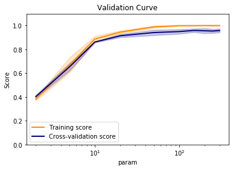

```python
epochs = 100
```


```python
%matplotlib inline
import os, sys

import numpy as np
import matplotlib.pyplot as plt
from sklearn import datasets, linear_model
from sklearn.metrics import f1_score, classification_report, confusion_matrix, make_scorer
from sklearn.preprocessing import OneHotEncoder
import keras
from keras.models import Sequential
from keras.layers import Input, Dense
from keras.models import Model
from keras.optimizers import SGD
from keras import regularizers
from keras.wrappers.scikit_learn import KerasClassifier, KerasRegressor
from keras import backend as K
import tensorflow as tf
```

    Using TensorFlow backend.
    /home/admin/miniconda3/envs/da03/lib/python3.6/site-packages/tensorflow/python/framework/dtypes.py:516: FutureWarning: Passing (type, 1) or '1type' as a synonym of type is deprecated; in a future version of numpy, it will be understood as (type, (1,)) / '(1,)type'.
      _np_qint8 = np.dtype([("qint8", np.int8, 1)])
    /home/admin/miniconda3/envs/da03/lib/python3.6/site-packages/tensorflow/python/framework/dtypes.py:517: FutureWarning: Passing (type, 1) or '1type' as a synonym of type is deprecated; in a future version of numpy, it will be understood as (type, (1,)) / '(1,)type'.
      _np_quint8 = np.dtype([("quint8", np.uint8, 1)])
    /home/admin/miniconda3/envs/da03/lib/python3.6/site-packages/tensorflow/python/framework/dtypes.py:518: FutureWarning: Passing (type, 1) or '1type' as a synonym of type is deprecated; in a future version of numpy, it will be understood as (type, (1,)) / '(1,)type'.
      _np_qint16 = np.dtype([("qint16", np.int16, 1)])
    /home/admin/miniconda3/envs/da03/lib/python3.6/site-packages/tensorflow/python/framework/dtypes.py:519: FutureWarning: Passing (type, 1) or '1type' as a synonym of type is deprecated; in a future version of numpy, it will be understood as (type, (1,)) / '(1,)type'.
      _np_quint16 = np.dtype([("quint16", np.uint16, 1)])
    /home/admin/miniconda3/envs/da03/lib/python3.6/site-packages/tensorflow/python/framework/dtypes.py:520: FutureWarning: Passing (type, 1) or '1type' as a synonym of type is deprecated; in a future version of numpy, it will be understood as (type, (1,)) / '(1,)type'.
      _np_qint32 = np.dtype([("qint32", np.int32, 1)])
    /home/admin/miniconda3/envs/da03/lib/python3.6/site-packages/tensorflow/python/framework/dtypes.py:525: FutureWarning: Passing (type, 1) or '1type' as a synonym of type is deprecated; in a future version of numpy, it will be understood as (type, (1,)) / '(1,)type'.
      np_resource = np.dtype([("resource", np.ubyte, 1)])
    /home/admin/miniconda3/envs/da03/lib/python3.6/site-packages/tensorboard/compat/tensorflow_stub/dtypes.py:541: FutureWarning: Passing (type, 1) or '1type' as a synonym of type is deprecated; in a future version of numpy, it will be understood as (type, (1,)) / '(1,)type'.
      _np_qint8 = np.dtype([("qint8", np.int8, 1)])
    /home/admin/miniconda3/envs/da03/lib/python3.6/site-packages/tensorboard/compat/tensorflow_stub/dtypes.py:542: FutureWarning: Passing (type, 1) or '1type' as a synonym of type is deprecated; in a future version of numpy, it will be understood as (type, (1,)) / '(1,)type'.
      _np_quint8 = np.dtype([("quint8", np.uint8, 1)])
    /home/admin/miniconda3/envs/da03/lib/python3.6/site-packages/tensorboard/compat/tensorflow_stub/dtypes.py:543: FutureWarning: Passing (type, 1) or '1type' as a synonym of type is deprecated; in a future version of numpy, it will be understood as (type, (1,)) / '(1,)type'.
      _np_qint16 = np.dtype([("qint16", np.int16, 1)])
    /home/admin/miniconda3/envs/da03/lib/python3.6/site-packages/tensorboard/compat/tensorflow_stub/dtypes.py:544: FutureWarning: Passing (type, 1) or '1type' as a synonym of type is deprecated; in a future version of numpy, it will be understood as (type, (1,)) / '(1,)type'.
      _np_quint16 = np.dtype([("quint16", np.uint16, 1)])
    /home/admin/miniconda3/envs/da03/lib/python3.6/site-packages/tensorboard/compat/tensorflow_stub/dtypes.py:545: FutureWarning: Passing (type, 1) or '1type' as a synonym of type is deprecated; in a future version of numpy, it will be understood as (type, (1,)) / '(1,)type'.
      _np_qint32 = np.dtype([("qint32", np.int32, 1)])
    /home/admin/miniconda3/envs/da03/lib/python3.6/site-packages/tensorboard/compat/tensorflow_stub/dtypes.py:550: FutureWarning: Passing (type, 1) or '1type' as a synonym of type is deprecated; in a future version of numpy, it will be understood as (type, (1,)) / '(1,)type'.
      np_resource = np.dtype([("resource", np.ubyte, 1)])


```python
sys.path.append('/home/admin/github/wordroid.sblo.jp/lib')
#from gkernel import GaussianKernel, GaussianKernel2, GaussianKernel3
from keras_ex.gkernel.sklearn import RBFClassifier
```


```python
from sklearn.datasets import load_digits
digits = load_digits()
X, y = digits.data, digits.target
X = X / 16
X.shape, X.min(), X.max()
```


    ((1797, 64), 0.0, 1.0)


```python
y.shape
```


    (1797,)


```python
N = y.shape[0]
y2 = keras.utils.to_categorical(y, num_classes=10)
y2.shape
index = np.arange(N)
xtrain = X[index[index % 2 != 0],:]
ytrain = y2[index[index % 2 != 0]]
xtest = X[index[index % 2 == 0],:]
yans = y2[index[index % 2 == 0]]
```


```python

```


```python
from sklearn.model_selection import StratifiedShuffleSplit, GridSearchCV, validation_curve
from sklearn.feature_selection import RFECV
from sklearn.linear_model import LogisticRegression, Lasso
import pandas as pd
from sklearn.metrics import mean_squared_error, mean_absolute_error, roc_auc_score, r2_score, make_scorer
from sklearn.metrics.pairwise import cosine_similarity, euclidean_distances
import joblib

from lightgbm import LGBMClassifier
```


```python
import warnings
warnings.filterwarnings('ignore')
```


```python
def f1_scorer(estimator, X, y):
    pred = estimator.predict(X)
    s = f1_score(y, pred, average='macro')
    return s
```

## BENCHMARK LogisticRegression


```python
cv_splitter = StratifiedShuffleSplit(n_splits=3, test_size=0.35, random_state=0)
cv_splitter.get_n_splits(xtrain, ytrain)
```


    3


```python
param_name = "C"
param_range = np.logspace(-3, 3, 7)
param_range
```


    array([1.e-03, 1.e-02, 1.e-01, 1.e+00, 1.e+01, 1.e+02, 1.e+03])


```python
%%time

train_scores, test_scores = validation_curve(
    LogisticRegression(penalty='l1', multi_class='multinomial', solver='saga', max_iter=10000),
    xtrain, np.argmax(ytrain, axis=1),
    param_name=param_name, param_range=param_range,
    cv=cv_splitter, n_jobs=1, verbose=2, scoring=f1_scorer)
```

    [Parallel(n_jobs=1)]: Using backend SequentialBackend with 1 concurrent workers.
    [Parallel(n_jobs=1)]: Done   1 out of   1 | elapsed:    0.0s remaining:    0.0s


    [CV] C=0.001 .........................................................
    [CV] .......................................... C=0.001, total=   0.0s
    [CV] C=0.01 ..........................................................
    [CV] ........................................... C=0.01, total=   0.0s
    [CV] C=0.1 ...........................................................
    [CV] ............................................ C=0.1, total=   0.4s
    [CV] C=1.0 ...........................................................
    [CV] ............................................ C=1.0, total=   1.2s
    [CV] C=10.0 ..........................................................
    [CV] ........................................... C=10.0, total=   4.0s
    [CV] C=100.0 .........................................................
    [CV] .......................................... C=100.0, total=   4.3s
    [CV] C=1000.0 ........................................................
    [CV] ......................................... C=1000.0, total=   4.0s
    [CV] C=0.001 .........................................................
    [CV] .......................................... C=0.001, total=   0.0s
    [CV] C=0.01 ..........................................................
    [CV] ........................................... C=0.01, total=   0.0s
    [CV] C=0.1 ...........................................................
    [CV] ............................................ C=0.1, total=   0.4s
    [CV] C=1.0 ...........................................................
    [CV] ............................................ C=1.0, total=   1.2s
    [CV] C=10.0 ..........................................................
    [CV] ........................................... C=10.0, total=   5.3s
    [CV] C=100.0 .........................................................
    [CV] .......................................... C=100.0, total=   5.1s
    [CV] C=1000.0 ........................................................
    [CV] ......................................... C=1000.0, total=   4.5s
    [CV] C=0.001 .........................................................
    [CV] .......................................... C=0.001, total=   0.0s
    [CV] C=0.01 ..........................................................
    [CV] ........................................... C=0.01, total=   0.0s
    [CV] C=0.1 ...........................................................
    [CV] ............................................ C=0.1, total=   0.2s
    [CV] C=1.0 ...........................................................
    [CV] ............................................ C=1.0, total=   1.0s
    [CV] C=10.0 ..........................................................
    [CV] ........................................... C=10.0, total=   4.1s
    [CV] C=100.0 .........................................................
    [CV] .......................................... C=100.0, total=   4.7s
    [CV] C=1000.0 ........................................................
    [CV] ......................................... C=1000.0, total=   4.3s
    CPU times: user 44.6 s, sys: 5.04 ms, total: 44.6 s
    Wall time: 44.6 s


    [Parallel(n_jobs=1)]: Done  21 out of  21 | elapsed:   44.6s finished


```python
train_scores_mean = np.mean(train_scores, axis=1)
train_scores_std = np.std(train_scores, axis=1)
test_scores_mean = np.mean(test_scores, axis=1)
test_scores_std = np.std(test_scores, axis=1)
np.c_[param_range, train_scores_mean, test_scores_mean]
```


    array([[1.00000000e-03, 1.81908749e-02, 1.82688944e-02],
           [1.00000000e-02, 1.80964287e-02, 1.80939848e-02],
           [1.00000000e-01, 8.83084412e-01, 8.17783004e-01],
           [1.00000000e+00, 9.85584329e-01, 9.31559398e-01],
           [1.00000000e+01, 1.00000000e+00, 9.41272087e-01],
           [1.00000000e+02, 1.00000000e+00, 9.44531466e-01],
           [1.00000000e+03, 1.00000000e+00, 9.42442747e-01]])


```python
plt.title("Validation Curve")
plt.xlabel("param")
plt.ylabel("Score")
plt.ylim(0.0, 1.1)
lw = 2
plt.semilogx(param_range, train_scores_mean, label="Training score",
             color="darkorange", lw=lw)
plt.fill_between(param_range, train_scores_mean - train_scores_std,
                 train_scores_mean + train_scores_std, alpha=0.2,
                 color="darkorange", lw=lw)
plt.semilogx(param_range, test_scores_mean, label="Cross-validation score",
             color="navy", lw=lw)
plt.fill_between(param_range, test_scores_mean - test_scores_std,
                 test_scores_mean + test_scores_std, alpha=0.2,
                 color="navy", lw=lw)
plt.legend(loc="best")
```


    <matplotlib.legend.Legend at 0x7f024653e390>


```python
'''test data'''
est = LogisticRegression(penalty='l1', multi_class='multinomial', solver='saga', max_iter=10000, C=1000)
est.fit(xtrain, np.argmax(ytrain, axis=1))
```


    LogisticRegression(C=1000, class_weight=None, dual=False, fit_intercept=True,
                       intercept_scaling=1, l1_ratio=None, max_iter=10000,
                       multi_class='multinomial', n_jobs=None, penalty='l1',
                       random_state=None, solver='saga', tol=0.0001, verbose=0,
                       warm_start=False)


```python
pred = est.predict(xtrain)
```


```python
print('F1_SCORE :', f1_score(np.argmax(ytrain, axis=1), pred, average='macro'))
print(classification_report(np.argmax(ytrain, axis=1), pred))
print(confusion_matrix(np.argmax(ytrain, axis=1), pred))
```

    F1_SCORE : 1.0
                  precision    recall  f1-score   support
    
               0       1.00      1.00      1.00        88
               1       1.00      1.00      1.00        89
               2       1.00      1.00      1.00        91
               3       1.00      1.00      1.00        93
               4       1.00      1.00      1.00        88
               5       1.00      1.00      1.00        91
               6       1.00      1.00      1.00        90
               7       1.00      1.00      1.00        91
               8       1.00      1.00      1.00        86
               9       1.00      1.00      1.00        91
    
        accuracy                           1.00       898
       macro avg       1.00      1.00      1.00       898
    weighted avg       1.00      1.00      1.00       898
    
    [[88  0  0  0  0  0  0  0  0  0]
     [ 0 89  0  0  0  0  0  0  0  0]
     [ 0  0 91  0  0  0  0  0  0  0]
     [ 0  0  0 93  0  0  0  0  0  0]
     [ 0  0  0  0 88  0  0  0  0  0]
     [ 0  0  0  0  0 91  0  0  0  0]
     [ 0  0  0  0  0  0 90  0  0  0]
     [ 0  0  0  0  0  0  0 91  0  0]
     [ 0  0  0  0  0  0  0  0 86  0]
     [ 0  0  0  0  0  0  0  0  0 91]]


```python
pred_test = est.predict(xtest)
```


```python
print('F1_SCORE :', f1_score(np.argmax(yans, axis=1), pred_test, average='macro'))
print(classification_report(np.argmax(yans, axis=1), pred_test))
print(confusion_matrix(np.argmax(yans, axis=1), pred_test))
```

    F1_SCORE : 0.9644145537214686
                  precision    recall  f1-score   support
    
               0       1.00      1.00      1.00        90
               1       0.96      0.91      0.93        93
               2       0.98      1.00      0.99        86
               3       0.97      0.99      0.98        90
               4       1.00      0.97      0.98        93
               5       0.95      0.98      0.96        91
               6       1.00      0.98      0.99        91
               7       0.97      0.98      0.97        88
               8       0.88      0.92      0.90        88
               9       0.95      0.92      0.94        89
    
        accuracy                           0.96       899
       macro avg       0.96      0.96      0.96       899
    weighted avg       0.96      0.96      0.96       899
    
    [[90  0  0  0  0  0  0  0  0  0]
     [ 0 85  2  1  0  1  0  0  4  0]
     [ 0  0 86  0  0  0  0  0  0  0]
     [ 0  0  0 89  0  0  0  0  1  0]
     [ 0  0  0  0 90  0  0  1  0  2]
     [ 0  0  0  0  0 89  0  1  0  1]
     [ 0  0  0  0  0  1 89  0  1  0]
     [ 0  0  0  0  0  0  0 86  1  1]
     [ 0  4  0  1  0  1  0  1 81  0]
     [ 0  0  0  1  0  2  0  0  4 82]]


```python

```

## BENCHMARK LGBMClassifier


```python
cv_splitter = StratifiedShuffleSplit(n_splits=3, test_size=0.35, random_state=0)
cv_splitter.get_n_splits(xtrain, ytrain)
```


    3


```python
param_name = "reg_alpha"
param_range = np.logspace(-3, 3, 7)
param_range
```


    array([1.e-03, 1.e-02, 1.e-01, 1.e+00, 1.e+01, 1.e+02, 1.e+03])


```python
%%time

train_scores, test_scores = validation_curve(
    LGBMClassifier(
        min_child_samples=20,
        reg_alpha=0.1
    ),
    xtrain, np.argmax(ytrain, axis=1),
    param_name=param_name, param_range=param_range,
    cv=cv_splitter, n_jobs=1, verbose=2, scoring=f1_scorer)
```

    [Parallel(n_jobs=1)]: Using backend SequentialBackend with 1 concurrent workers.


    [CV] reg_alpha=0.001 .................................................
    [CV] .................................. reg_alpha=0.001, total=   0.5s
    [CV] reg_alpha=0.01 ..................................................


    [Parallel(n_jobs=1)]: Done   1 out of   1 | elapsed:    0.5s remaining:    0.0s


    [CV] ................................... reg_alpha=0.01, total=   0.5s
    [CV] reg_alpha=0.1 ...................................................
    [CV] .................................... reg_alpha=0.1, total=   0.4s
    [CV] reg_alpha=1.0 ...................................................
    [CV] .................................... reg_alpha=1.0, total=   0.3s
    [CV] reg_alpha=10.0 ..................................................
    [CV] ................................... reg_alpha=10.0, total=   0.2s
    [CV] reg_alpha=100.0 .................................................
    [CV] .................................. reg_alpha=100.0, total=   0.1s
    [CV] reg_alpha=1000.0 ................................................
    [CV] ................................. reg_alpha=1000.0, total=   0.1s
    [CV] reg_alpha=0.001 .................................................
    [CV] .................................. reg_alpha=0.001, total=   0.4s
    [CV] reg_alpha=0.01 ..................................................
    [CV] ................................... reg_alpha=0.01, total=   0.4s
    [CV] reg_alpha=0.1 ...................................................
    [CV] .................................... reg_alpha=0.1, total=   0.4s
    [CV] reg_alpha=1.0 ...................................................
    [CV] .................................... reg_alpha=1.0, total=   0.3s
    [CV] reg_alpha=10.0 ..................................................
    [CV] ................................... reg_alpha=10.0, total=   0.2s
    [CV] reg_alpha=100.0 .................................................
    [CV] .................................. reg_alpha=100.0, total=   0.1s
    [CV] reg_alpha=1000.0 ................................................
    [CV] ................................. reg_alpha=1000.0, total=   0.1s
    [CV] reg_alpha=0.001 .................................................
    [CV] .................................. reg_alpha=0.001, total=   0.5s
    [CV] reg_alpha=0.01 ..................................................
    [CV] ................................... reg_alpha=0.01, total=   0.4s
    [CV] reg_alpha=0.1 ...................................................
    [CV] .................................... reg_alpha=0.1, total=   0.4s
    [CV] reg_alpha=1.0 ...................................................
    [CV] .................................... reg_alpha=1.0, total=   0.3s
    [CV] reg_alpha=10.0 ..................................................
    [CV] ................................... reg_alpha=10.0, total=   0.2s
    [CV] reg_alpha=100.0 .................................................
    [CV] .................................. reg_alpha=100.0, total=   0.1s
    [CV] reg_alpha=1000.0 ................................................
    [CV] ................................. reg_alpha=1000.0, total=   0.1s
    CPU times: user 12 s, sys: 2.47 s, total: 14.4 s
    Wall time: 6.09 s


    [Parallel(n_jobs=1)]: Done  21 out of  21 | elapsed:    6.1s finished


```python
train_scores_mean = np.mean(train_scores, axis=1)
train_scores_std = np.std(train_scores, axis=1)
test_scores_mean = np.mean(test_scores, axis=1)
test_scores_std = np.std(test_scores, axis=1)
np.c_[param_range, train_scores_mean, test_scores_mean]
```


    array([[1.00000000e-03, 1.00000000e+00, 9.28927200e-01],
           [1.00000000e-02, 1.00000000e+00, 9.30122641e-01],
           [1.00000000e-01, 1.00000000e+00, 9.22696488e-01],
           [1.00000000e+00, 1.00000000e+00, 9.11894179e-01],
           [1.00000000e+01, 9.52515614e-01, 8.66954158e-01],
           [1.00000000e+02, 1.86625194e-02, 1.89655172e-02],
           [1.00000000e+03, 1.86625194e-02, 1.89655172e-02]])


```python
plt.title("Validation Curve")
plt.xlabel("param")
plt.ylabel("Score")
plt.ylim(0.0, 1.1)
lw = 2
plt.semilogx(param_range, train_scores_mean, label="Training score",
             color="darkorange", lw=lw)
plt.fill_between(param_range, train_scores_mean - train_scores_std,
                 train_scores_mean + train_scores_std, alpha=0.2,
                 color="darkorange", lw=lw)
plt.semilogx(param_range, test_scores_mean, label="Cross-validation score",
             color="navy", lw=lw)
plt.fill_between(param_range, test_scores_mean - test_scores_std,
                 test_scores_mean + test_scores_std, alpha=0.2,
                 color="navy", lw=lw)
plt.legend(loc="best")
```


    <matplotlib.legend.Legend at 0x7f02440e0f60>


```python
'''test data'''
est = LGBMClassifier(
        min_child_samples=20,
        reg_alpha=0.1
    )
est.fit(xtrain, np.argmax(ytrain, axis=1))
```


    LGBMClassifier(boosting_type='gbdt', class_weight=None, colsample_bytree=1.0,
                   importance_type='split', learning_rate=0.1, max_depth=-1,
                   min_child_samples=20, min_child_weight=0.001, min_split_gain=0.0,
                   n_estimators=100, n_jobs=-1, num_leaves=31, objective=None,
                   random_state=None, reg_alpha=0.1, reg_lambda=0.0, silent=True,
                   subsample=1.0, subsample_for_bin=200000, subsample_freq=0)


```python
pred = est.predict(xtrain)
```


```python
print('F1_SCORE :', f1_score(np.argmax(ytrain, axis=1), pred, average='macro'))
print(classification_report(np.argmax(ytrain, axis=1), pred))
print(confusion_matrix(np.argmax(ytrain, axis=1), pred))
```

    F1_SCORE : 1.0
                  precision    recall  f1-score   support
    
               0       1.00      1.00      1.00        88
               1       1.00      1.00      1.00        89
               2       1.00      1.00      1.00        91
               3       1.00      1.00      1.00        93
               4       1.00      1.00      1.00        88
               5       1.00      1.00      1.00        91
               6       1.00      1.00      1.00        90
               7       1.00      1.00      1.00        91
               8       1.00      1.00      1.00        86
               9       1.00      1.00      1.00        91
    
        accuracy                           1.00       898
       macro avg       1.00      1.00      1.00       898
    weighted avg       1.00      1.00      1.00       898
    
    [[88  0  0  0  0  0  0  0  0  0]
     [ 0 89  0  0  0  0  0  0  0  0]
     [ 0  0 91  0  0  0  0  0  0  0]
     [ 0  0  0 93  0  0  0  0  0  0]
     [ 0  0  0  0 88  0  0  0  0  0]
     [ 0  0  0  0  0 91  0  0  0  0]
     [ 0  0  0  0  0  0 90  0  0  0]
     [ 0  0  0  0  0  0  0 91  0  0]
     [ 0  0  0  0  0  0  0  0 86  0]
     [ 0  0  0  0  0  0  0  0  0 91]]


```python
pred_test = est.predict(xtest)
```


```python
print('F1_SCORE :', f1_score(np.argmax(yans, axis=1), pred_test, average='macro'))
print(classification_report(np.argmax(yans, axis=1), pred_test))
print(confusion_matrix(np.argmax(yans, axis=1), pred_test))
```

    F1_SCORE : 0.962305803067745
                  precision    recall  f1-score   support
    
               0       0.99      0.98      0.98        90
               1       0.96      0.95      0.95        93
               2       0.98      0.99      0.98        86
               3       0.93      0.94      0.94        90
               4       0.99      0.94      0.96        93
               5       0.94      0.99      0.96        91
               6       1.00      0.96      0.98        91
               7       0.98      0.99      0.98        88
               8       0.92      0.93      0.93        88
               9       0.95      0.97      0.96        89
    
        accuracy                           0.96       899
       macro avg       0.96      0.96      0.96       899
    weighted avg       0.96      0.96      0.96       899
    
    [[88  0  0  0  0  2  0  0  0  0]
     [ 1 88  2  2  0  0  0  0  0  0]
     [ 0  0 85  1  0  0  0  0  0  0]
     [ 0  0  0 85  0  1  0  0  3  1]
     [ 0  2  0  0 87  0  0  0  1  3]
     [ 0  0  0  0  0 90  0  0  0  1]
     [ 0  0  0  0  1  2 87  0  1  0]
     [ 0  0  0  0  0  0  0 87  1  0]
     [ 0  1  0  3  0  0  0  2 82  0]
     [ 0  1  0  0  0  1  0  0  1 86]]


```python

```


```python

```


```python
cv_splitter = StratifiedShuffleSplit(n_splits=3, test_size=0.35, random_state=0)
cv_splitter.get_n_splits(xtrain, ytrain)
```


    3


```python
param_name = "num_lm"
param_range = [2, 5, 10, 20, 50, 100, 150, 200, 250, 300]
param_range
```


    [2, 5, 10, 20, 50, 100, 150, 200, 250, 300]


```python
%%time

def f1_scorer_2(estimator, X, y):
    pred = estimator.predict(X)
    s = f1_score(np.argmax(y, axis=1), pred, average='macro')
    return s

train_scores, test_scores = validation_curve(
    RBFClassifier(
        num_lm=2,
        lm_select_from_x=True,
        random_state=None,
        gamma='scale',
        epochs=epochs, batch_size=100, verbose=0
    ),
    xtrain, ytrain,
    param_name=param_name, param_range=param_range,
    cv=cv_splitter, n_jobs=1, verbose=2, scoring=f1_scorer_2)
```

    [Parallel(n_jobs=1)]: Using backend SequentialBackend with 1 concurrent workers.


    [CV] num_lm=2 ........................................................
    [CV] ......................................... num_lm=2, total=   4.4s
    [CV] num_lm=5 ........................................................


    [Parallel(n_jobs=1)]: Done   1 out of   1 | elapsed:    4.4s remaining:    0.0s


    [CV] ......................................... num_lm=5, total=   6.5s
    [CV] num_lm=10 .......................................................
    [CV] ........................................ num_lm=10, total=   7.4s
    [CV] num_lm=20 .......................................................
    [CV] ........................................ num_lm=20, total=   7.2s
    [CV] num_lm=50 .......................................................
    [CV] ........................................ num_lm=50, total=   5.4s
    [CV] num_lm=100 ......................................................
    [CV] ....................................... num_lm=100, total=   5.3s
    [CV] num_lm=150 ......................................................
    [CV] ....................................... num_lm=150, total=   4.5s
    [CV] num_lm=200 ......................................................
    [CV] ....................................... num_lm=200, total=   6.1s
    [CV] num_lm=250 ......................................................
    [CV] ....................................... num_lm=250, total=   6.3s
    [CV] num_lm=300 ......................................................
    [CV] ....................................... num_lm=300, total=   6.4s
    [CV] num_lm=2 ........................................................
    [CV] ......................................... num_lm=2, total=   4.4s
    [CV] num_lm=5 ........................................................
    [CV] ......................................... num_lm=5, total=   6.7s
    [CV] num_lm=10 .......................................................
    [CV] ........................................ num_lm=10, total=   6.8s
    [CV] num_lm=20 .......................................................
    [CV] ........................................ num_lm=20, total=   6.9s
    [CV] num_lm=50 .......................................................
    [CV] ........................................ num_lm=50, total=   5.6s
    [CV] num_lm=100 ......................................................
    [CV] ....................................... num_lm=100, total=   5.9s
    [CV] num_lm=150 ......................................................
    [CV] ....................................... num_lm=150, total=   5.6s
    [CV] num_lm=200 ......................................................
    [CV] ....................................... num_lm=200, total=   6.0s
    [CV] num_lm=250 ......................................................
    [CV] ....................................... num_lm=250, total=   6.3s
    [CV] num_lm=300 ......................................................
    [CV] ....................................... num_lm=300, total=   6.2s
    [CV] num_lm=2 ........................................................
    [CV] ......................................... num_lm=2, total=   6.2s
    [CV] num_lm=5 ........................................................
    [CV] ......................................... num_lm=5, total=   7.9s
    [CV] num_lm=10 .......................................................
    [CV] ........................................ num_lm=10, total=   7.2s
    [CV] num_lm=20 .......................................................
    [CV] ........................................ num_lm=20, total=   7.4s
    [CV] num_lm=50 .......................................................
    [CV] ........................................ num_lm=50, total=   5.4s
    [CV] num_lm=100 ......................................................
    [CV] ....................................... num_lm=100, total=   6.4s
    [CV] num_lm=150 ......................................................
    [CV] ....................................... num_lm=150, total=   5.7s
    [CV] num_lm=200 ......................................................
    [CV] ....................................... num_lm=200, total=   6.8s
    [CV] num_lm=250 ......................................................
    [CV] ....................................... num_lm=250, total=   6.3s
    [CV] num_lm=300 ......................................................
    [CV] ....................................... num_lm=300, total=   6.0s
    CPU times: user 3min 51s, sys: 6.31 s, total: 3min 57s
    Wall time: 3min 5s


    [Parallel(n_jobs=1)]: Done  30 out of  30 | elapsed:  3.1min finished


```python
train_scores_mean = np.mean(train_scores, axis=1)
train_scores_std = np.std(train_scores, axis=1)
test_scores_mean = np.mean(test_scores, axis=1)
test_scores_std = np.std(test_scores, axis=1)
np.c_[param_range, train_scores_mean, test_scores_mean]
```


    array([[  2.        ,   0.38157391,   0.40350095],
           [  5.        ,   0.66786985,   0.65215661],
           [ 10.        ,   0.88641193,   0.8612675 ],
           [ 20.        ,   0.94447122,   0.91386936],
           [ 50.        ,   0.98909898,   0.94093839],
           [100.        ,   0.99883975,   0.94910889],
           [150.        ,   0.99885458,   0.95876779],
           [200.        ,   1.        ,   0.95575746],
           [250.        ,   0.99943499,   0.95358355],
           [300.        ,   0.99943499,   0.95781439]])


```python
plt.title("Validation Curve")
plt.xlabel("param")
plt.ylabel("Score")
plt.ylim(0.0, 1.1)
lw = 2
plt.semilogx(param_range, train_scores_mean, label="Training score",
             color="darkorange", lw=lw)
plt.fill_between(param_range, train_scores_mean - train_scores_std,
                 train_scores_mean + train_scores_std, alpha=0.2,
                 color="darkorange", lw=lw)
plt.semilogx(param_range, test_scores_mean, label="Cross-validation score",
             color="navy", lw=lw)
plt.fill_between(param_range, test_scores_mean - test_scores_std,
                 test_scores_mean + test_scores_std, alpha=0.2,
                 color="navy", lw=lw)
plt.legend(loc="best")
```


    <matplotlib.legend.Legend at 0x7f0205d8b6d8>





```python
%%time

'''test data'''
est = RBFClassifier(
    num_lm=150,
    lm_select_from_x=True,
    random_state=None,
    gamma='scale',
    lr=0.05,
    epochs=epochs, batch_size=100, verbose=0
)
hst = est.fit(xtrain, ytrain)
```

    CPU times: user 7.63 s, sys: 184 ms, total: 7.82 s
    Wall time: 6.24 s


```python
fig, ax = plt.subplots(1, 3, figsize=(20,5))
ax[0].set_title('loss')
ax[0].plot(list(range(len(hst["loss"]))), hst["loss"], label="Train loss")
ax[1].set_title('accuracy')
ax[1].plot(list(range(len(hst["loss"]))), hst["acc"], label="accuracy")
ax[2].set_title('learning rate')
ax[2].plot(list(range(len(hst["loss"]))), hst["lr"], label="learning rate")
ax[0].legend()
ax[1].legend()
ax[2].legend()
```


    <matplotlib.legend.Legend at 0x7f0244fc4cf8>


```python
pred = est.predict(xtrain)
```


```python
print('F1_SCORE :', f1_score(np.argmax(ytrain, axis=1), pred, average='macro'))
print(classification_report(np.argmax(ytrain, axis=1), pred))
print(confusion_matrix(np.argmax(ytrain, axis=1), pred))
```

    F1_SCORE : 0.9977705780311726
                  precision    recall  f1-score   support
    
               0       1.00      1.00      1.00        88
               1       1.00      1.00      1.00        89
               2       1.00      1.00      1.00        91
               3       1.00      1.00      1.00        93
               4       1.00      1.00      1.00        88
               5       1.00      0.99      0.99        91
               6       1.00      1.00      1.00        90
               7       1.00      1.00      1.00        91
               8       0.99      1.00      0.99        86
               9       0.99      0.99      0.99        91
    
        accuracy                           1.00       898
       macro avg       1.00      1.00      1.00       898
    weighted avg       1.00      1.00      1.00       898
    
    [[88  0  0  0  0  0  0  0  0  0]
     [ 0 89  0  0  0  0  0  0  0  0]
     [ 0  0 91  0  0  0  0  0  0  0]
     [ 0  0  0 93  0  0  0  0  0  0]
     [ 0  0  0  0 88  0  0  0  0  0]
     [ 0  0  0  0  0 90  0  0  0  1]
     [ 0  0  0  0  0  0 90  0  0  0]
     [ 0  0  0  0  0  0  0 91  0  0]
     [ 0  0  0  0  0  0  0  0 86  0]
     [ 0  0  0  0  0  0  0  0  1 90]]


```python
pred_test = est.predict(xtest)
```


```python
print('F1_SCORE :', f1_score(np.argmax(yans, axis=1), pred_test, average='macro'))
print(classification_report(np.argmax(yans, axis=1), pred_test))
print(confusion_matrix(np.argmax(yans, axis=1), pred_test))
```

    F1_SCORE : 0.9712020658557632
                  precision    recall  f1-score   support
    
               0       1.00      1.00      1.00        90
               1       1.00      0.96      0.98        93
               2       0.99      1.00      0.99        86
               3       0.95      0.98      0.96        90
               4       0.99      0.97      0.98        93
               5       0.94      0.96      0.95        91
               6       1.00      0.95      0.97        91
               7       0.97      0.98      0.97        88
               8       0.96      0.99      0.97        88
               9       0.93      0.94      0.94        89
    
        accuracy                           0.97       899
       macro avg       0.97      0.97      0.97       899
    weighted avg       0.97      0.97      0.97       899
    
    [[90  0  0  0  0  0  0  0  0  0]
     [ 0 89  1  0  0  1  0  0  1  1]
     [ 0  0 86  0  0  0  0  0  0  0]
     [ 0  0  0 88  0  0  0  1  1  0]
     [ 0  0  0  0 90  0  0  1  0  2]
     [ 0  0  0  1  1 87  0  0  0  2]
     [ 0  0  0  0  0  4 86  0  1  0]
     [ 0  0  0  1  0  0  0 86  0  1]
     [ 0  0  0  0  0  0  0  1 87  0]
     [ 0  0  0  3  0  1  0  0  1 84]]


```python

```
