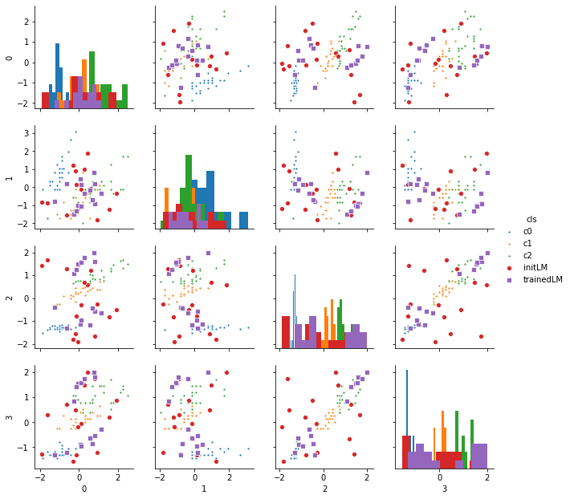

```python
%matplotlib inline
import os, sys

import numpy as np
import pandas as pd
import matplotlib.pyplot as plt
import seaborn as sns
from sklearn import datasets, linear_model
from sklearn.metrics import f1_score, classification_report, confusion_matrix, make_scorer
from sklearn.preprocessing import OneHotEncoder
import keras
from keras.models import Sequential
from keras.layers import Input, Dense
from keras.models import Model
from keras.optimizers import SGD
from keras import regularizers
from keras.wrappers.scikit_learn import KerasClassifier, KerasRegressor
from keras import backend as K
import tensorflow as tf
```

    Using TensorFlow backend.
    /home/admin/miniconda3/envs/da03/lib/python3.6/site-packages/tensorflow/python/framework/dtypes.py:516: FutureWarning: Passing (type, 1) or '1type' as a synonym of type is deprecated; in a future version of numpy, it will be understood as (type, (1,)) / '(1,)type'.
      _np_qint8 = np.dtype([("qint8", np.int8, 1)])
    /home/admin/miniconda3/envs/da03/lib/python3.6/site-packages/tensorflow/python/framework/dtypes.py:517: FutureWarning: Passing (type, 1) or '1type' as a synonym of type is deprecated; in a future version of numpy, it will be understood as (type, (1,)) / '(1,)type'.
      _np_quint8 = np.dtype([("quint8", np.uint8, 1)])
    /home/admin/miniconda3/envs/da03/lib/python3.6/site-packages/tensorflow/python/framework/dtypes.py:518: FutureWarning: Passing (type, 1) or '1type' as a synonym of type is deprecated; in a future version of numpy, it will be understood as (type, (1,)) / '(1,)type'.
      _np_qint16 = np.dtype([("qint16", np.int16, 1)])
    /home/admin/miniconda3/envs/da03/lib/python3.6/site-packages/tensorflow/python/framework/dtypes.py:519: FutureWarning: Passing (type, 1) or '1type' as a synonym of type is deprecated; in a future version of numpy, it will be understood as (type, (1,)) / '(1,)type'.
      _np_quint16 = np.dtype([("quint16", np.uint16, 1)])
    /home/admin/miniconda3/envs/da03/lib/python3.6/site-packages/tensorflow/python/framework/dtypes.py:520: FutureWarning: Passing (type, 1) or '1type' as a synonym of type is deprecated; in a future version of numpy, it will be understood as (type, (1,)) / '(1,)type'.
      _np_qint32 = np.dtype([("qint32", np.int32, 1)])
    /home/admin/miniconda3/envs/da03/lib/python3.6/site-packages/tensorflow/python/framework/dtypes.py:525: FutureWarning: Passing (type, 1) or '1type' as a synonym of type is deprecated; in a future version of numpy, it will be understood as (type, (1,)) / '(1,)type'.
      np_resource = np.dtype([("resource", np.ubyte, 1)])
    /home/admin/miniconda3/envs/da03/lib/python3.6/site-packages/tensorboard/compat/tensorflow_stub/dtypes.py:541: FutureWarning: Passing (type, 1) or '1type' as a synonym of type is deprecated; in a future version of numpy, it will be understood as (type, (1,)) / '(1,)type'.
      _np_qint8 = np.dtype([("qint8", np.int8, 1)])
    /home/admin/miniconda3/envs/da03/lib/python3.6/site-packages/tensorboard/compat/tensorflow_stub/dtypes.py:542: FutureWarning: Passing (type, 1) or '1type' as a synonym of type is deprecated; in a future version of numpy, it will be understood as (type, (1,)) / '(1,)type'.
      _np_quint8 = np.dtype([("quint8", np.uint8, 1)])
    /home/admin/miniconda3/envs/da03/lib/python3.6/site-packages/tensorboard/compat/tensorflow_stub/dtypes.py:543: FutureWarning: Passing (type, 1) or '1type' as a synonym of type is deprecated; in a future version of numpy, it will be understood as (type, (1,)) / '(1,)type'.
      _np_qint16 = np.dtype([("qint16", np.int16, 1)])
    /home/admin/miniconda3/envs/da03/lib/python3.6/site-packages/tensorboard/compat/tensorflow_stub/dtypes.py:544: FutureWarning: Passing (type, 1) or '1type' as a synonym of type is deprecated; in a future version of numpy, it will be understood as (type, (1,)) / '(1,)type'.
      _np_quint16 = np.dtype([("quint16", np.uint16, 1)])
    /home/admin/miniconda3/envs/da03/lib/python3.6/site-packages/tensorboard/compat/tensorflow_stub/dtypes.py:545: FutureWarning: Passing (type, 1) or '1type' as a synonym of type is deprecated; in a future version of numpy, it will be understood as (type, (1,)) / '(1,)type'.
      _np_qint32 = np.dtype([("qint32", np.int32, 1)])
    /home/admin/miniconda3/envs/da03/lib/python3.6/site-packages/tensorboard/compat/tensorflow_stub/dtypes.py:550: FutureWarning: Passing (type, 1) or '1type' as a synonym of type is deprecated; in a future version of numpy, it will be understood as (type, (1,)) / '(1,)type'.
      np_resource = np.dtype([("resource", np.ubyte, 1)])


```python
sys.path.append('/home/admin/github/wordroid.sblo.jp/lib')
from keras_ex.gkernel import GaussianKernel, GaussianKernel2, GaussianKernel3
from keras_ex.gkernel.sklearn import (
    RBFClassifier, RBFRegressor,
    make_model_gkernel3,
    make_model_gkernel2,
    make_model_gkernel1,
    make_model_out,
    make_model
)
```


```python
from sklearn import preprocessing

iris = datasets.load_iris()
X = iris.data.astype(np.float32)
X = preprocessing.scale(X)
Y = iris.target
N = Y.size
Y2 = keras.utils.to_categorical(Y, num_classes=3)

index = np.arange(N)
xtrain = X[index[index % 2 != 0],:]
ytrain = Y2[index[index % 2 != 0]]
xtest = X[index[index % 2 == 0],:]
yans = Y2[index[index % 2 == 0]]
```

    /home/admin/miniconda3/envs/da03/lib/python3.6/site-packages/sklearn/preprocessing/data.py:172: UserWarning: Numerical issues were encountered when centering the data and might not be solved. Dataset may contain too large values. You may need to prescale your features.
      warnings.warn("Numerical issues were encountered "
    /home/admin/miniconda3/envs/da03/lib/python3.6/site-packages/sklearn/preprocessing/data.py:189: UserWarning: Numerical issues were encountered when scaling the data and might not be solved. The standard deviation of the data is probably very close to 0. 
      warnings.warn("Numerical issues were encountered "


```python

```

## Getting Started


```python
'''
number of landmarks is 15
'''
clf = RBFClassifier(
    num_lm=15,
    lm_select_from_x=True
)
```


```python
%%time
#hst = clf.fit(xtrain, ytrain, epochs=500, batch_size=256, verbose=0)
hst = clf.fit(xtrain, ytrain, epochs=50, verbose=0)
```

    WARNING:tensorflow:From /home/admin/miniconda3/envs/da03/lib/python3.6/site-packages/keras/backend/tensorflow_backend.py:517: The name tf.placeholder is deprecated. Please use tf.compat.v1.placeholder instead.
    
    WARNING:tensorflow:From /home/admin/miniconda3/envs/da03/lib/python3.6/site-packages/keras/backend/tensorflow_backend.py:4138: The name tf.random_uniform is deprecated. Please use tf.random.uniform instead.
    
    WARNING:tensorflow:From /home/admin/miniconda3/envs/da03/lib/python3.6/site-packages/keras/backend/tensorflow_backend.py:174: The name tf.get_default_session is deprecated. Please use tf.compat.v1.get_default_session instead.
    
    WARNING:tensorflow:From /home/admin/miniconda3/envs/da03/lib/python3.6/site-packages/keras/backend/tensorflow_backend.py:181: The name tf.ConfigProto is deprecated. Please use tf.compat.v1.ConfigProto instead.
    
    WARNING:tensorflow:From /home/admin/miniconda3/envs/da03/lib/python3.6/site-packages/keras/backend/tensorflow_backend.py:186: The name tf.Session is deprecated. Please use tf.compat.v1.Session instead.
    
    WARNING:tensorflow:From /home/admin/miniconda3/envs/da03/lib/python3.6/site-packages/keras/optimizers.py:790: The name tf.train.Optimizer is deprecated. Please use tf.compat.v1.train.Optimizer instead.
    
    WARNING:tensorflow:From /home/admin/miniconda3/envs/da03/lib/python3.6/site-packages/tensorflow/python/ops/math_grad.py:1250: add_dispatch_support.<locals>.wrapper (from tensorflow.python.ops.array_ops) is deprecated and will be removed in a future version.
    Instructions for updating:
    Use tf.where in 2.0, which has the same broadcast rule as np.where
    CPU times: user 2.62 s, sys: 54 ms, total: 2.67 s
    Wall time: 2.43 s


```python
clf.sk_params
```


    {'num_lm': 15,
     'lm_select_from_x': True,
     'num_cls': 3,
     'nn': None,
     'lr': None,
     'callbacks': None,
     'lm': None,
     'epochs_warmup': 10,
     'loss': None}


```python
fig, ax = plt.subplots(1, 3, figsize=(20,5))
ax[0].set_title('loss')
ax[0].plot(list(range(len(hst["loss"]))), hst["loss"], label="Train loss")
ax[1].set_title('accuracy')
ax[1].plot(list(range(len(hst["loss"]))), hst["acc"], label="accuracy")
ax[2].set_title('learning rate')
ax[2].plot(list(range(len(hst["loss"]))), hst["lr"], label="learning rate")
ax[0].legend()
ax[1].legend()
ax[2].legend()
```


    <matplotlib.legend.Legend at 0x7fe7183caac8>


```python
'''
trained gamma
'''
clf.current_gamma()
```


    0.14305653


```python
'''
landmarks
'''
lm = clf.current_lm()
lm
```


    array([[ 2.128516  , -0.13197948,  1.615319  ,  1.1855668 ],
           [-1.2641851 , -0.13197948, -1.340226  , -1.1838121 ],
           [ 1.159173  ,  0.32841417,  1.2174573 ,  1.4488312 ],
           [-1.0218495 ,  0.78880775, -1.2833885 , -1.3154444 ],
           [-1.1430173 ,  0.09821706, -1.2833885 , -1.4470763 ],
           [-0.9006817 ,  1.7095945 , -1.2833885 , -1.1838121 ],
           [-0.53717774,  0.78880775, -1.2833885 , -1.0521799 ],
           [ 0.43216518, -0.362176  ,  0.30805892,  0.13250954],
           [-0.53717774,  1.9397916 , -1.1697137 , -1.0521799 ],
           [ 0.31099737, -0.13197948,  0.47857097,  0.26414174],
           [-1.1430173 , -1.5131598 , -0.26031524, -0.2623869 ],
           [-0.41600993, -1.743357  ,  0.13754663,  0.13250954],
           [-1.1430173 , -0.13197948, -1.340226  , -1.3154444 ],
           [ 0.5533335 , -0.82256967,  0.6490833 ,  0.7906704 ],
           [-0.41600993, -1.5131598 , -0.03296556, -0.2623869 ]],
          dtype=float32)


```python
df = pd.DataFrame(np.r_[xtrain, lm])
df['cls'] = ['c'+str(ee) for ee in np.argmax(ytrain, axis=1)] + ['LM']*lm.shape[0]
df.head()

fig = sns.pairplot(df, markers=['.']*3+['s'], hue='cls', height=2.2, diag_kind='hist')
```


```python
clf.predict_proba(xtest)[:5]
```


    array([[9.9998677e-01, 1.3252288e-05, 1.5034037e-16],
           [9.9997103e-01, 2.8974093e-05, 1.3698937e-15],
           [9.9999094e-01, 9.0105659e-06, 1.8067192e-16],
           [9.9998558e-01, 1.4433660e-05, 5.5570597e-16],
           [9.9973160e-01, 2.6835105e-04, 1.3084719e-12]], dtype=float32)


```python
pred = clf.predict(xtrain)
pred[:5]
```


    array([0, 0, 0, 0, 0])


```python
print('F1_SCORE :', f1_score(np.argmax(ytrain, axis=1), pred, average='macro'))
print(classification_report(np.argmax(ytrain, axis=1), pred))
print(confusion_matrix(np.argmax(ytrain, axis=1), pred))
```

    F1_SCORE : 0.9465811965811964
                  precision    recall  f1-score   support
    
               0       1.00      1.00      1.00        25
               1       0.96      0.88      0.92        25
               2       0.89      0.96      0.92        25
    
        accuracy                           0.95        75
       macro avg       0.95      0.95      0.95        75
    weighted avg       0.95      0.95      0.95        75
    
    [[25  0  0]
     [ 0 22  3]
     [ 0  1 24]]


```python
pred_test = clf.predict(xtest)
```


```python
print('F1_SCORE :', f1_score(np.argmax(yans, axis=1), pred_test, average='macro'))
print(classification_report(np.argmax(yans, axis=1), pred_test))
print(confusion_matrix(np.argmax(yans, axis=1), pred_test))
```

    F1_SCORE : 0.8926462694578637
                  precision    recall  f1-score   support
    
               0       1.00      1.00      1.00        25
               1       0.90      0.76      0.83        25
               2       0.79      0.92      0.85        25
    
        accuracy                           0.89        75
       macro avg       0.90      0.89      0.89        75
    weighted avg       0.90      0.89      0.89        75
    
    [[25  0  0]
     [ 0 19  6]
     [ 0  2 23]]


```python

```

## set landmarks on input x randomly (num_lm = 25)


```python
num_lm = 25
clf = RBFClassifier(
    num_lm=num_lm,
    lm=xtrain[np.random.choice(np.arange(xtrain.shape[0]), num_lm)]
)
```


```python
%%time
#hst = clf.fit(xtrain, ytrain, epochs=500, batch_size=256, verbose=0)
hst = clf.fit(xtrain, ytrain, epochs=50, verbose=0)
```

    CPU times: user 3 s, sys: 49.8 ms, total: 3.05 s
    Wall time: 2.79 s


```python
clf.model.summary()
```

    _________________________________________________________________
    Layer (type)                 Output Shape              Param #   
    =================================================================
    inp (InputLayer)             (None, 4)                 0         
    _________________________________________________________________
    model_gkernel (Model)        (None, 25)                1         
    _________________________________________________________________
    model_out (Model)            (None, 3)                 78        
    =================================================================
    Total params: 79
    Trainable params: 79
    Non-trainable params: 0
    _________________________________________________________________


```python
fig, ax = plt.subplots(1, 3, figsize=(20,5))
ax[0].set_title('loss')
ax[0].plot(list(range(len(hst["loss"]))), hst["loss"], label="Train loss")
ax[1].set_title('accuracy')
ax[1].plot(list(range(len(hst["loss"]))), hst["acc"], label="accuracy")
ax[2].set_title('learning rate')
ax[2].plot(list(range(len(hst["loss"]))), hst["lr"], label="learning rate")
ax[0].legend()
ax[1].legend()
ax[2].legend()
```


    <matplotlib.legend.Legend at 0x7fe702276278>


```python
'''
trained gamma
'''
clf.current_gamma()
```


    0.17256853


```python
'''
fixed landmarks
'''
lm = clf.current_lm()
lm
```


    array([[ 0.06866181, -0.13197948,  0.25122133,  0.39577395],
           [-0.7795139 ,  1.0190042 , -1.2833885 , -1.3154444 ],
           [ 2.49202   ,  1.7095945 ,  1.5016444 ,  1.0539347 ],
           [-1.1430173 ,  1.2492008 , -1.340226  , -1.4470763 ],
           [-0.53717774,  0.78880775, -1.2833885 , -1.0521799 ],
           [ 0.6745013 , -0.82256967,  0.876433  ,  0.9223026 ],
           [-1.0218495 ,  0.5586107 , -1.340226  , -1.3154444 ],
           [ 1.159173  ,  0.32841417,  1.2174573 ,  1.4488312 ],
           [ 0.9168369 , -0.13197948,  0.36489627,  0.26414174],
           [ 2.2496839 , -0.13197948,  1.331132  ,  1.4488312 ],
           [ 2.2496839 ,  1.7095945 ,  1.6721563 ,  1.3171992 ],
           [ 0.5533335 , -0.362176  ,  1.0469451 ,  0.7906704 ],
           [ 2.2496839 ,  1.7095945 ,  1.6721563 ,  1.3171992 ],
           [-1.5065212 ,  0.32841417, -1.340226  , -1.3154444 ],
           [ 0.43216518, -0.362176  ,  0.30805892,  0.13250954],
           [ 1.2803409 ,  0.09821706,  0.93327034,  1.1855668 ],
           [ 0.79566914, -0.13197948,  0.8195954 ,  1.0539347 ],
           [-0.9006817 ,  1.0190042 , -1.340226  , -1.1838121 ],
           [-1.0218495 ,  0.78880775, -1.2833885 , -1.3154444 ],
           [ 0.6745013 ,  0.32841417,  0.42173362,  0.39577395],
           [ 0.43216518, -0.362176  ,  0.30805892,  0.13250954],
           [ 0.5533335 , -0.82256967,  0.6490833 ,  0.7906704 ],
           [ 2.49202   ,  1.7095945 ,  1.5016444 ,  1.0539347 ],
           [-1.2641851 , -0.13197948, -1.340226  , -1.1838121 ],
           [ 2.2496839 ,  1.7095945 ,  1.6721563 ,  1.3171992 ]],
          dtype=float32)


```python
df = pd.DataFrame(np.r_[xtrain, lm])
df['cls'] = ['c'+str(ee) for ee in np.argmax(ytrain, axis=1)] + ['LM']*lm.shape[0]
df.head()

fig = sns.pairplot(df, markers=['.']*3+['s'], hue='cls', height=2.2, diag_kind='hist')
```


```python
clf.predict_proba(xtest)[:5]
```


    array([[9.9999833e-01, 1.6684043e-06, 8.1173348e-19],
           [9.9999821e-01, 1.8108506e-06, 3.2401932e-18],
           [9.9999893e-01, 1.0599052e-06, 1.3822711e-18],
           [9.9999917e-01, 8.8865187e-07, 1.4888331e-18],
           [9.9997163e-01, 2.8333281e-05, 1.8262264e-14]], dtype=float32)


```python
pred = clf.predict(xtrain)
pred[:5]
```


    array([0, 0, 0, 0, 0])


```python
print('F1_SCORE :', f1_score(np.argmax(ytrain, axis=1), pred, average='macro'))
print(classification_report(np.argmax(ytrain, axis=1), pred))
print(confusion_matrix(np.argmax(ytrain, axis=1), pred))
```

    F1_SCORE : 0.9732905982905983
                  precision    recall  f1-score   support
    
               0       1.00      1.00      1.00        25
               1       1.00      0.92      0.96        25
               2       0.93      1.00      0.96        25
    
        accuracy                           0.97        75
       macro avg       0.98      0.97      0.97        75
    weighted avg       0.98      0.97      0.97        75
    
    [[25  0  0]
     [ 0 23  2]
     [ 0  0 25]]


```python
pred_test = clf.predict(xtest)
```


```python
print('F1_SCORE :', f1_score(np.argmax(yans, axis=1), pred_test, average='macro'))
print(classification_report(np.argmax(yans, axis=1), pred_test))
print(confusion_matrix(np.argmax(yans, axis=1), pred_test))
```

    F1_SCORE : 0.9198717948717948
                  precision    recall  f1-score   support
    
               0       1.00      1.00      1.00        25
               1       0.91      0.84      0.87        25
               2       0.85      0.92      0.88        25
    
        accuracy                           0.92        75
       macro avg       0.92      0.92      0.92        75
    weighted avg       0.92      0.92      0.92        75
    
    [[25  0  0]
     [ 0 21  4]
     [ 0  2 23]]


```python

```

## set landmarks automatically on input x
* num_lm = 25


```python
num_lm = 25
clf = RBFClassifier(
    num_lm=num_lm,
    lm_select_from_x=True,
    random_state=10001
)
```


```python
%%time
#hst = clf.fit(xtrain, ytrain, epochs=500, batch_size=256, verbose=0)
hst = clf.fit(xtrain, ytrain, epochs=50, verbose=0)
```

    CPU times: user 3.54 s, sys: 42.7 ms, total: 3.58 s
    Wall time: 3.26 s


```python
fig, ax = plt.subplots(1, 3, figsize=(20,5))
ax[0].set_title('loss')
ax[0].plot(list(range(len(hst["loss"]))), hst["loss"], label="Train loss")
ax[1].set_title('accuracy')
ax[1].plot(list(range(len(hst["loss"]))), hst["acc"], label="accuracy")
ax[2].set_title('learning rate')
ax[2].plot(list(range(len(hst["loss"]))), hst["lr"], label="learning rate")
ax[0].legend()
ax[1].legend()
ax[2].legend()
```


    <matplotlib.legend.Legend at 0x7fe7018c43c8>


```python
'''
trained gamma
'''
clf.current_gamma()
```


    0.3041119


```python
'''
fixed landmarks
'''
lm = clf.current_lm()
lm
```


    array([[ 0.1898296 ,  0.78880775,  0.42173362,  0.52740616],
           [ 0.31099737, -0.13197948,  0.6490833 ,  0.7906704 ],
           [ 0.6745013 ,  0.32841417,  0.876433  ,  1.4488312 ],
           [-0.41600993,  2.630381  , -1.340226  , -1.3154444 ],
           [-0.17367435,  3.0907753 , -1.2833885 , -1.0521799 ],
           [ 0.1898296 , -1.9735534 ,  0.7059207 ,  0.39577395],
           [-1.5065212 ,  0.09821706, -1.2833885 , -1.3154444 ],
           [-0.41600993, -1.743357  ,  0.13754663,  0.13250954],
           [-1.1430173 , -0.13197948, -1.340226  , -1.3154444 ],
           [ 0.5533335 , -0.59237313,  0.762758  ,  0.39577395],
           [-0.29484212, -1.2829633 ,  0.08070928, -0.1307547 ],
           [-0.17367435, -1.2829633 ,  0.7059207 ,  1.0539347 ],
           [-1.0218495 ,  0.78880775, -1.2833885 , -1.3154444 ],
           [-0.17367435, -1.0527667 , -0.14664039, -0.2623869 ],
           [ 1.159173  ,  0.32841417,  1.2174573 ,  1.4488312 ],
           [-1.2641851 ,  0.78880775, -1.226551  , -1.3154444 ],
           [-0.41600993, -1.2829633 ,  0.13754663,  0.13250954],
           [-1.3853534 ,  0.32841417, -1.226551  , -1.3154444 ],
           [-0.9006817 ,  0.5586107 , -1.1697137 , -0.9205477 ],
           [ 2.2496839 , -0.13197948,  1.331132  ,  1.4488312 ],
           [ 1.0380048 ,  0.09821706,  0.36489627,  0.26414174],
           [ 0.31099737, -0.13197948,  0.47857097,  0.26414174],
           [-1.2641851 , -0.13197948, -1.340226  , -1.1838121 ],
           [ 2.2496839 ,  1.7095945 ,  1.6721563 ,  1.3171992 ],
           [ 0.6745013 ,  0.32841417,  0.42173362,  0.39577395]],
          dtype=float32)


```python
df = pd.DataFrame(np.r_[xtrain, lm])
df['cls'] = ['c'+str(ee) for ee in np.argmax(ytrain, axis=1)] + ['LM']*lm.shape[0]
df.head()

fig = sns.pairplot(df, markers=['.']*3+['s'], hue='cls', height=2.2, diag_kind='hist')
```


```python
clf.predict_proba(xtest)[:5]
```


    array([[9.9999893e-01, 1.0724502e-06, 8.0644345e-20],
           [9.9999952e-01, 4.1965990e-07, 4.9593597e-21],
           [9.9999869e-01, 1.2837357e-06, 4.7279426e-19],
           [9.9999952e-01, 4.6305007e-07, 2.9562240e-20],
           [9.9999237e-01, 7.6530305e-06, 4.7599847e-17]], dtype=float32)


```python
pred = clf.predict(xtrain)
pred[:5]
```


    array([0, 0, 0, 0, 0])


```python
print('F1_SCORE :', f1_score(np.argmax(ytrain, axis=1), pred, average='macro'))
print(classification_report(np.argmax(ytrain, axis=1), pred))
print(confusion_matrix(np.argmax(ytrain, axis=1), pred))
```

    F1_SCORE : 0.9599839935974389
                  precision    recall  f1-score   support
    
               0       1.00      1.00      1.00        25
               1       0.96      0.92      0.94        25
               2       0.92      0.96      0.94        25
    
        accuracy                           0.96        75
       macro avg       0.96      0.96      0.96        75
    weighted avg       0.96      0.96      0.96        75
    
    [[25  0  0]
     [ 0 23  2]
     [ 0  1 24]]


```python
pred_test = clf.predict(xtest)
```


```python
print('F1_SCORE :', f1_score(np.argmax(yans, axis=1), pred_test, average='macro'))
print(classification_report(np.argmax(yans, axis=1), pred_test))
print(confusion_matrix(np.argmax(yans, axis=1), pred_test))
```

    F1_SCORE : 0.9599839935974389
                  precision    recall  f1-score   support
    
               0       1.00      1.00      1.00        25
               1       0.96      0.92      0.94        25
               2       0.92      0.96      0.94        25
    
        accuracy                           0.96        75
       macro avg       0.96      0.96      0.96        75
    weighted avg       0.96      0.96      0.96        75
    
    [[25  0  0]
     [ 0 23  2]
     [ 0  1 24]]


```python

```

## set initial landmarks manually and train
* num_lm = 15
* train landmarks


```python
num_lm = 15
init_lm = np.c_[
    np.random.random((num_lm,))*4-2,
    np.random.random((num_lm,))*4-2,
    np.random.random((num_lm,))*4-2,
    np.random.random((num_lm,))*4-2
]
# init_lm = np.c_[
#     np.random.random((num_lm,)),
#     np.random.random((num_lm,)),
#     np.random.random((num_lm,)),
#     np.random.random((num_lm,))
# ]

clf = RBFClassifier(
    num_lm=num_lm,
    lm=init_lm,
    gamma='scale',
    make_model_gkernel=make_model_gkernel3
)
```


```python
init_lm
```


    array([[-1.6084415 , -0.87639975,  1.6732088 ,  0.30635206],
           [-1.93128797, -0.83482452,  1.41610739, -1.27533133],
           [ 1.91616766, -0.3577581 , -0.49798962,  0.88886277],
           [ 0.12088734, -0.12746697, -0.30529022, -0.04402028],
           [-0.04093748, -1.186966  , -1.89460404, -0.17661304],
           [-0.62198984, -1.52789449,  1.28421764,  0.71472832],
           [ 0.45384571,  1.87431271,  0.57348051,  1.98408932],
           [ 0.60272549, -0.08047153,  1.20021904, -0.65803194],
           [-0.32004681,  1.22824137, -1.81220478, -1.56345965],
           [ 1.55069331, -1.22501943, -0.821303  ,  0.20418341],
           [ 0.27562187,  0.97675314,  0.67032334,  1.48251221],
           [-0.16577302,  0.89800778, -1.56893822,  0.47799613],
           [ 0.81969895, -0.88607181, -1.6501951 ,  1.73954161],
           [ 0.94410778, -1.82104169, -0.27192167, -1.21791495],
           [-0.14141271,  0.14265281, -0.78172515, -1.32005619]])


```python
df = pd.DataFrame(np.r_[xtrain, init_lm])
df['cls'] = ['c'+str(ee) for ee in np.argmax(ytrain, axis=1)] + ['initLM']*init_lm.shape[0]
df.head()

fig = sns.pairplot(df, markers=['.']*3+['o'], hue='cls', height=2.2, diag_kind='hist')
```


```python
%%time
#hst = clf.fit(xtrain, ytrain, epochs=500, batch_size=256, verbose=0)
hst = clf.fit(xtrain, ytrain, epochs=50, verbose=0)
```

    CPU times: user 3.89 s, sys: 43.7 ms, total: 3.94 s
    Wall time: 3.66 s


```python
fig, ax = plt.subplots(1, 3, figsize=(20,5))
ax[0].set_title('loss')
ax[0].plot(list(range(len(hst["loss"]))), hst["loss"], label="Train loss")
ax[1].set_title('accuracy')
ax[1].plot(list(range(len(hst["loss"]))), hst["acc"], label="accuracy")
ax[2].set_title('learning rate')
ax[2].plot(list(range(len(hst["loss"]))), hst["lr"], label="learning rate")
ax[0].legend()
ax[1].legend()
ax[2].legend()
```


    <matplotlib.legend.Legend at 0x7fe701bef0f0>


```python
'''
trained gamma
'''
clf.current_gamma()
```


    0.15825802


```python
'''
trained landmarks
'''
lm = clf.current_lm()
lm
```


    array([[-0.04066087, -1.0319911 ,  1.5064819 ,  1.5435452 ],
           [-1.247558  , -0.78373146, -0.40447232, -1.3193074 ],
           [ 0.7894677 , -0.92142004,  1.5891786 ,  1.79253   ],
           [ 0.82694864,  0.17522582, -0.5804642 , -0.5504655 ],
           [ 0.56516105, -0.16161117, -1.1665126 , -0.6249803 ],
           [ 0.10695734, -1.0769173 ,  1.5615457 ,  1.5687947 ],
           [ 0.78089124,  0.80005336,  1.9985455 ,  1.9978579 ],
           [-0.26513138, -1.4983116 ,  1.0809193 ,  0.8357293 ],
           [-0.6162715 ,  0.17058994, -1.3191886 , -1.2112486 ],
           [ 1.1507958 , -0.37104127, -0.63345206, -0.28267878],
           [ 0.27787444, -0.3684292 ,  1.7669818 ,  1.7541281 ],
           [ 0.08229811,  0.43865782, -1.1326185 , -0.8752555 ],
           [-0.1297691 , -1.3066671 ,  1.2508252 ,  1.4250736 ],
           [ 0.6692457 , -0.71188813, -0.44836977, -0.8557093 ],
           [ 0.10650029,  0.14818802, -0.95418304, -0.9536392 ]],
          dtype=float32)


```python
df = pd.DataFrame(np.r_[xtrain, init_lm, lm])
df['cls'] = ['c'+str(ee) for ee in np.argmax(ytrain, axis=1)] + ['initLM']*init_lm.shape[0] + ['trainedLM']*lm.shape[0]
df.head()

fig = sns.pairplot(df, markers=['.']*3+['o','s'], hue='cls', height=2.2, diag_kind='hist')
```





```python
clf.predict_proba(xtest)[:5]
```


    array([[9.9967456e-01, 3.2548982e-04, 1.0934317e-09],
           [9.9952853e-01, 4.7153115e-04, 2.6063760e-09],
           [9.9964404e-01, 3.5594267e-04, 6.1632801e-09],
           [9.9952710e-01, 4.7293335e-04, 1.3137907e-08],
           [9.9834871e-01, 1.6511979e-03, 6.7196481e-08]], dtype=float32)


```python
pred = clf.predict(xtrain)
pred[:5]
```


    array([0, 0, 0, 0, 0])


```python
print('F1_SCORE :', f1_score(np.argmax(ytrain, axis=1), pred, average='macro'))
print(classification_report(np.argmax(ytrain, axis=1), pred))
print(confusion_matrix(np.argmax(ytrain, axis=1), pred))
```

    F1_SCORE : 0.9599839935974389
                  precision    recall  f1-score   support
    
               0       1.00      1.00      1.00        25
               1       0.96      0.92      0.94        25
               2       0.92      0.96      0.94        25
    
        accuracy                           0.96        75
       macro avg       0.96      0.96      0.96        75
    weighted avg       0.96      0.96      0.96        75
    
    [[25  0  0]
     [ 0 23  2]
     [ 0  1 24]]


```python
pred_test = clf.predict(xtest)
```


```python
print('F1_SCORE :', f1_score(np.argmax(yans, axis=1), pred_test, average='macro'))
print(classification_report(np.argmax(yans, axis=1), pred_test))
print(confusion_matrix(np.argmax(yans, axis=1), pred_test))
```

    F1_SCORE : 0.9866613311991462
                  precision    recall  f1-score   support
    
               0       1.00      1.00      1.00        25
               1       1.00      0.96      0.98        25
               2       0.96      1.00      0.98        25
    
        accuracy                           0.99        75
       macro avg       0.99      0.99      0.99        75
    weighted avg       0.99      0.99      0.99        75
    
    [[25  0  0]
     [ 0 24  1]
     [ 0  0 25]]


```python

```

## select landmarks and gamma with Gaussian Mixture Model


```python
from sklearn.mixture import GaussianMixture, BayesianGaussianMixture
```


```python
num_lm = 25
gmm = GaussianMixture(n_components=num_lm, covariance_type='tied')
gmm.fit(xtrain)
```


    GaussianMixture(covariance_type='tied', init_params='kmeans', max_iter=100,
                    means_init=None, n_components=25, n_init=1,
                    precisions_init=None, random_state=None, reg_covar=1e-06,
                    tol=0.001, verbose=0, verbose_interval=10, warm_start=False,
                    weights_init=None)


```python
init_lm = gmm.means_
init_lm
```


    array([[-0.77623768, -0.8262808 ,  0.08122785,  0.26298563],
           [ 1.08641111,  0.14419869,  0.92188135,  1.39610666],
           [-1.14742854,  0.02241681, -1.32340146, -1.31138419],
           [ 0.19027583, -0.13308519,  0.70681088,  0.79078921],
           [-0.17370737,  3.09071251, -1.28339624, -1.05221581],
           [ 0.37158156, -1.85845518,  0.53540848,  0.26414175],
           [-0.78023725,  1.70716499, -1.24533741, -1.09489729],
           [-1.627689  , -1.74335694, -1.39706337, -1.18381214],
           [ 2.18909988, -0.13197948,  1.47322552,  1.31719898],
           [ 2.128516  ,  1.55612993,  1.50164425,  1.36107651],
           [ 0.00756431, -0.49264385,  0.30813278,  0.08122263],
           [-0.38687549, -1.45840067,  0.08004249, -0.03062908],
           [ 0.70436806,  0.271377  ,  0.39338712,  0.36301952],
           [ 1.68423369, -0.05524706,  1.29324053,  0.70291577],
           [ 0.37150477, -0.70588274,  0.76134716,  0.46119541],
           [-0.94723943,  0.85814747, -1.27839904, -1.19649839],
           [-0.17346901, -0.89940838,  0.70592442,  1.00990337],
           [ 0.7657792 , -0.13140488,  0.88948984,  0.82376044],
           [-1.0823692 , -1.62824726, -0.26029334, -0.26238689],
           [-1.86985807, -0.13186141, -1.51063822, -1.44701635],
           [ 0.28176919, -0.26949114,  0.38804276,  0.25208173],
           [-1.4136382 ,  0.24040873, -1.29001875, -1.32208475],
           [ 0.61312365, -0.81831517,  0.76522137,  0.85580445],
           [-0.41600713,  2.63027176, -1.34017585, -1.31534294],
           [-0.1222634 , -0.95469676,  0.02658914, -0.25612047]])


```python
df = pd.DataFrame(np.r_[xtrain, init_lm])
df['cls'] = ['c'+str(ee) for ee in np.argmax(ytrain, axis=1)] + ['initLM']*init_lm.shape[0]
df.head()

fig = sns.pairplot(df, markers=['.']*3+['s'], hue='cls', height=2.2, diag_kind='hist')
```


```python
gmm.covariances_
```


    array([[ 0.03141494, -0.00353871,  0.00050932, -0.00690652],
           [-0.00353871,  0.03592716,  0.00052754, -0.00221815],
           [ 0.00050932,  0.00052754,  0.01012552,  0.00112276],
           [-0.00690652, -0.00221815,  0.00112276,  0.01569767]])


```python
init_gamma = 1 / (2*np.diag(gmm.covariances_).mean()*num_lm/3)
init_gamma
```


    2.5760666108357713


```python
clf = RBFClassifier(
    num_lm=num_lm,
    lm=init_lm,
    gamma=init_gamma,
    make_model_gkernel=make_model_gkernel3
)
```


```python
%%time
hst = clf.fit(xtrain, ytrain, epochs=50, verbose=0)
```

    CPU times: user 5.18 s, sys: 63.5 ms, total: 5.24 s
    Wall time: 4.8 s


```python
fig, ax = plt.subplots(1, 3, figsize=(20,5))
ax[0].set_title('loss')
ax[0].plot(list(range(len(hst["loss"]))), hst["loss"], label="Train loss")
ax[1].set_title('accuracy')
ax[1].plot(list(range(len(hst["loss"]))), hst["acc"], label="accuracy")
ax[2].set_title('learning rate')
ax[2].plot(list(range(len(hst["loss"]))), hst["lr"], label="learning rate")
ax[0].legend()
ax[1].legend()
ax[2].legend()
```


    <matplotlib.legend.Legend at 0x7fe701198f60>


```python
1 / (4*xtrain.var()), 1/(2*np.sqrt(4/6)*2)
```


    (0.2510118142948827, 0.30618621784789724)


```python
clf.current_gamma()
```


    1.4225135


```python
1 / clf.current_gamma() / 2
```


    0.3514905168128339


```python
'''
landmarks
'''
lm = clf.current_lm()
lm
```


    array([[-0.31616062, -1.0600132 ,  0.27805212,  0.01696088],
           [ 0.20087746, -0.39908105,  0.95419914,  1.2466396 ],
           [-1.4071274 ,  0.08938228, -1.3757474 , -1.3292149 ],
           [ 0.30374885, -0.38969004,  1.0366397 ,  1.08782   ],
           [-0.28793094,  2.805379  , -1.2719425 , -1.0831772 ],
           [-0.05230328, -1.9654174 ,  0.78934723,  0.7850528 ],
           [-0.82610774,  1.3178957 , -1.264404  , -1.1309943 ],
           [-1.6342137 , -1.7258822 , -1.4110105 , -1.1972541 ],
           [ 1.8537523 ,  0.02624811,  1.5558202 ,  1.0533298 ],
           [ 2.1374364 ,  1.4306731 ,  1.4617895 ,  1.2733437 ],
           [-0.31138787, -1.070217  ,  0.23685357,  0.02020987],
           [-0.27130392, -1.1404315 ,  0.18546182, -0.02156122],
           [ 1.0610505 ,  0.2486242 ,  0.41872522,  0.58359385],
           [ 1.5516889 ,  0.28481227,  1.3475218 ,  1.52248   ],
           [ 0.68331623, -0.6203745 ,  1.0104859 ,  0.19279292],
           [-0.8480251 ,  1.2307165 , -1.2670397 , -1.1316948 ],
           [-0.05653455, -1.9558331 ,  0.78732306,  0.7993055 ],
           [ 0.34217194, -0.4002927 ,  1.0579835 ,  1.0212438 ],
           [-0.279832  , -1.0255835 ,  0.34303612,  0.04940929],
           [-1.6288036 , -0.5688219 , -1.4328749 , -1.3442605 ],
           [ 0.8698339 ,  0.39707258,  0.38819507,  0.540739  ],
           [-1.1050704 ,  0.51911086, -1.3072548 , -1.218153  ],
           [ 0.4605429 , -0.4923561 ,  1.0889183 ,  0.83952266],
           [-0.38049245,  2.5707724 , -1.2602526 , -1.0936711 ],
           [-0.26498604, -1.1333601 ,  0.1850389 , -0.00978447]],
          dtype=float32)


```python
df = pd.DataFrame(np.r_[xtrain, init_lm, lm])
df['cls'] = ['c'+str(ee) for ee in np.argmax(ytrain, axis=1)] + ['initLM']*init_lm.shape[0] + ['trainedLM']*lm.shape[0]
df.head()

fig = sns.pairplot(df, markers=['.']*3+['o','s'], hue='cls', height=2.2, diag_kind='hist')
```


```python
clf.predict_proba(xtest)[:5]
```


    array([[9.9996841e-01, 1.0255262e-05, 2.1364651e-05],
           [9.9997342e-01, 9.1031716e-06, 1.7549668e-05],
           [9.9991608e-01, 2.8750817e-05, 5.5173015e-05],
           [9.9970102e-01, 9.0285481e-05, 2.0869005e-04],
           [9.9967813e-01, 1.4495516e-04, 1.7701028e-04]], dtype=float32)


```python
pred = clf.predict(xtrain)
pred[:5]
```


    array([0, 0, 0, 0, 0])


```python
print('F1_SCORE :', f1_score(np.argmax(ytrain, axis=1), pred, average='macro'))
print(classification_report(np.argmax(ytrain, axis=1), pred))
print(confusion_matrix(np.argmax(ytrain, axis=1), pred))
```

    F1_SCORE : 1.0
                  precision    recall  f1-score   support
    
               0       1.00      1.00      1.00        25
               1       1.00      1.00      1.00        25
               2       1.00      1.00      1.00        25
    
        accuracy                           1.00        75
       macro avg       1.00      1.00      1.00        75
    weighted avg       1.00      1.00      1.00        75
    
    [[25  0  0]
     [ 0 25  0]
     [ 0  0 25]]


```python
pred_test = clf.predict(xtest)
```


```python
print('F1_SCORE :', f1_score(np.argmax(yans, axis=1), pred_test, average='macro'))
print(classification_report(np.argmax(yans, axis=1), pred_test))
print(confusion_matrix(np.argmax(yans, axis=1), pred_test))
```

    F1_SCORE : 0.9199999999999999
                  precision    recall  f1-score   support
    
               0       1.00      1.00      1.00        25
               1       0.88      0.88      0.88        25
               2       0.88      0.88      0.88        25
    
        accuracy                           0.92        75
       macro avg       0.92      0.92      0.92        75
    weighted avg       0.92      0.92      0.92        75
    
    [[25  0  0]
     [ 0 22  3]
     [ 0  3 22]]


```python

```


```python

```


```python

```

## set initial landmarks manually and not train gaussian layer
* num_lm = 15


```python
num_lm = 15
init_lm = np.c_[
    np.random.random((num_lm,))*4-2,
    np.random.random((num_lm,))*4-2,
    np.random.random((num_lm,))*4-2,
    np.random.random((num_lm,))*4-2
]

clf = RBFClassifier(
    num_lm=num_lm,
    lm=init_lm,
    gamma='scale',
    make_model_gkernel=make_model_gkernel1
)
```


```python
init_lm
```


    array([[-1.51084838,  1.79410281,  1.67555161,  0.83241328],
           [-1.38573281, -0.61195376,  0.53611093, -1.12579318],
           [-0.69552848,  1.24317857,  0.80613669, -1.42700409],
           [ 1.32165935,  1.73681301, -1.4636189 , -1.05604871],
           [-1.94094223,  0.80136135,  0.56716038,  1.21304534],
           [ 0.03720836,  1.92366703, -1.0464635 , -0.01781021],
           [ 0.73875833,  0.64739553,  0.39666765, -1.93708723],
           [ 0.56139124,  1.98760872,  0.30043091,  0.36906865],
           [-0.25482291,  0.6708986 , -0.92850603, -1.54838577],
           [ 0.26443358, -0.38127979,  1.61690032,  0.7078589 ],
           [ 1.77857332,  0.29640373,  1.29877074, -1.17524402],
           [ 0.18684088, -1.33745525, -0.66288746, -0.01560015],
           [-1.29225868,  0.66225331, -1.85158518,  1.60640169],
           [ 1.84894224,  1.88454222, -0.04951792, -1.16254681],
           [-1.36631356, -0.71426592,  1.42064586,  1.80653473]])


```python
df = pd.DataFrame(np.r_[xtrain, init_lm])
df['cls'] = ['c'+str(ee) for ee in np.argmax(ytrain, axis=1)] + ['initLM']*init_lm.shape[0]
df.head()

fig = sns.pairplot(df, markers=['.']*3+['o'], hue='cls', height=2.2, diag_kind='hist')
```


```python
%%time
#hst = clf.fit(xtrain, ytrain, epochs=500, batch_size=256, verbose=0)
hst = clf.fit(xtrain, ytrain, epochs=50, verbose=0)
```

    CPU times: user 4.49 s, sys: 53.7 ms, total: 4.54 s
    Wall time: 4.25 s


```python
fig, ax = plt.subplots(1, 3, figsize=(20,5))
ax[0].set_title('loss')
ax[0].plot(list(range(len(hst["loss"]))), hst["loss"], label="Train loss")
ax[1].set_title('accuracy')
ax[1].plot(list(range(len(hst["loss"]))), hst["acc"], label="accuracy")
ax[2].set_title('learning rate')
ax[2].plot(list(range(len(hst["loss"]))), hst["lr"], label="learning rate")
ax[0].legend()
ax[1].legend()
ax[2].legend()
```


    <matplotlib.legend.Legend at 0x7fe6f279c6d8>


```python
1 / (4*xtrain.var()), 1/(2*np.sqrt(4/6)*2)
```


    (0.2510118142948827, 0.30618621784789724)


```python
'''
fixed gamma
'''
clf.current_gamma()
```


    0.2510118


```python
'''
fixed landmarks
'''
lm = clf.current_lm()
lm
```


    array([[-1.5108484 ,  1.7941028 ,  1.6755517 ,  0.83241326],
           [-1.3857328 , -0.61195374,  0.53611094, -1.1257932 ],
           [-0.6955285 ,  1.2431786 ,  0.80613667, -1.4270041 ],
           [ 1.3216593 ,  1.7368131 , -1.4636189 , -1.0560488 ],
           [-1.9409423 ,  0.8013613 ,  0.56716037,  1.2130454 ],
           [ 0.03720836,  1.9236671 , -1.0464635 , -0.01781021],
           [ 0.7387583 ,  0.64739555,  0.39666766, -1.9370872 ],
           [ 0.56139123,  1.9876087 ,  0.30043092,  0.36906865],
           [-0.2548229 ,  0.6708986 , -0.928506  , -1.5483857 ],
           [ 0.2644336 , -0.3812798 ,  1.6169003 ,  0.7078589 ],
           [ 1.7785733 ,  0.29640374,  1.2987708 , -1.175244  ],
           [ 0.18684088, -1.3374553 , -0.66288745, -0.01560015],
           [-1.2922586 ,  0.6622533 , -1.8515851 ,  1.6064017 ],
           [ 1.8489423 ,  1.8845422 , -0.04951791, -1.1625468 ],
           [-1.3663136 , -0.71426594,  1.4206458 ,  1.8065348 ]],
          dtype=float32)


```python
df = pd.DataFrame(np.r_[xtrain, init_lm, lm])
df['cls'] = ['c'+str(ee) for ee in np.argmax(ytrain, axis=1)] + ['initLM']*init_lm.shape[0] + ['trainedLM']*lm.shape[0]
df.head()

fig = sns.pairplot(df, markers=['.']*3+['o','s'], hue='cls', height=2.2, diag_kind='hist')
```


```python
clf.predict_proba(xtest)[:5]
```


    array([[9.9973744e-01, 2.6252249e-04, 2.7971181e-08],
           [9.9844128e-01, 1.5555822e-03, 3.0895903e-06],
           [9.9974924e-01, 2.5066524e-04, 9.0079837e-08],
           [9.9909914e-01, 8.9785154e-04, 2.9204759e-06],
           [9.8710632e-01, 1.2641902e-02, 2.5185110e-04]], dtype=float32)


```python
clf.predict_proba(xtest).sum(axis=1)
```


    array([0.99999994, 0.99999994, 1.        , 0.9999999 , 1.0000001 ,
           1.        , 1.0000001 , 0.99999994, 1.        , 1.        ,
           1.        , 0.99999994, 1.        , 1.        , 0.99999994,
           1.        , 0.99999994, 1.        , 1.        , 1.        ,
           0.99999994, 0.99999994, 0.9999999 , 0.99999994, 0.99999994,
           0.99999994, 1.0000001 , 1.        , 1.        , 1.0000001 ,
           1.        , 1.        , 1.        , 1.        , 1.        ,
           1.        , 1.        , 1.        , 0.99999994, 0.9999999 ,
           1.        , 1.        , 1.        , 1.        , 1.0000001 ,
           1.        , 0.99999994, 0.99999994, 0.9999999 , 1.0000001 ,
           1.        , 1.        , 1.        , 0.99999994, 1.0000001 ,
           1.0000001 , 1.0000001 , 1.        , 0.99999994, 0.99999994,
           0.99999994, 1.        , 1.        , 0.99999994, 1.        ,
           1.        , 1.0000001 , 1.        , 1.        , 1.        ,
           1.        , 1.        , 1.        , 0.99999994, 0.99999994],
          dtype=float32)


```python
pred = clf.predict(xtrain)
pred[:5]
```


    array([0, 0, 0, 0, 0])


```python
print('F1_SCORE :', f1_score(np.argmax(ytrain, axis=1), pred, average='macro'))
print(classification_report(np.argmax(ytrain, axis=1), pred))
print(confusion_matrix(np.argmax(ytrain, axis=1), pred))
```

    F1_SCORE : 0.9599839935974389
                  precision    recall  f1-score   support
    
               0       1.00      1.00      1.00        25
               1       0.96      0.92      0.94        25
               2       0.92      0.96      0.94        25
    
        accuracy                           0.96        75
       macro avg       0.96      0.96      0.96        75
    weighted avg       0.96      0.96      0.96        75
    
    [[25  0  0]
     [ 0 23  2]
     [ 0  1 24]]


```python
pred_test = clf.predict(xtest)
```


```python
print('F1_SCORE :', f1_score(np.argmax(yans, axis=1), pred_test, average='macro'))
print(classification_report(np.argmax(yans, axis=1), pred_test))
print(confusion_matrix(np.argmax(yans, axis=1), pred_test))
```

    F1_SCORE : 0.9866613311991462
                  precision    recall  f1-score   support
    
               0       1.00      1.00      1.00        25
               1       1.00      0.96      0.98        25
               2       0.96      1.00      0.98        25
    
        accuracy                           0.99        75
       macro avg       0.99      0.99      0.99        75
    weighted avg       0.99      0.99      0.99        75
    
    [[25  0  0]
     [ 0 24  1]
     [ 0  0 25]]


```python

```

## vector input


```python
num_lm = 15
init_lm = np.c_[
    np.random.random((num_lm,))*4-2,
    np.random.random((num_lm,))*4-2,
    np.random.random((num_lm,))*4-2,
    np.random.random((num_lm,))*4-2
]

clf = RBFClassifier(
    num_lm=num_lm,
    lm=init_lm,
    gamma='scale',
    make_model_gkernel=make_model_gkernel1
)
```


```python
init_lm
```


    array([[ 1.76135455, -1.70783911,  1.31734763, -0.41082255],
           [-1.96678448, -1.47810268, -0.85078596,  1.91789303],
           [ 0.39291222,  1.94753922,  0.61277764,  1.9485358 ],
           [-1.35860579, -0.57861843, -1.14343056,  1.2562411 ],
           [-0.93778083,  1.34024666,  0.89390341,  0.90214294],
           [ 0.36654328,  0.01256304, -1.44953147, -1.27219348],
           [-0.38492634, -1.35099552,  0.31246812, -1.53630027],
           [ 1.12249024, -0.200594  ,  0.29282664,  0.44313205],
           [ 0.87915328, -1.67198781, -1.42805948,  0.42022712],
           [-0.5749908 , -1.76497662, -0.74365995,  1.52189971],
           [-0.82887014,  1.46543486,  0.79097099,  0.63895144],
           [-1.78460152,  1.60206482, -0.12046382, -0.17495312],
           [ 0.85642725,  0.09342891,  0.03691278,  1.11417854],
           [ 1.01736018, -1.37688055, -1.20388174, -0.66166615],
           [ 0.58147697, -1.00428113, -1.76497915, -0.37108716]])


```python
df = pd.DataFrame(np.r_[xtrain, init_lm])
df['cls'] = ['c'+str(ee) for ee in np.argmax(ytrain, axis=1)] + ['initLM']*init_lm.shape[0]
df.head()

fig = sns.pairplot(df, markers=['.']*3+['o'], hue='cls', height=2.2, diag_kind='hist')
```


```python
ytrain[:5]
```


    array([[1., 0., 0.],
           [1., 0., 0.],
           [1., 0., 0.],
           [1., 0., 0.],
           [1., 0., 0.]], dtype=float32)


```python
np.argmax(ytrain, axis=1)[:5]
```


    array([0, 0, 0, 0, 0])


```python
%%time
#hst = clf.fit(xtrain, np.argmax(ytrain, axis=1), epochs=500, batch_size=256, verbose=0)
hst = clf.fit(xtrain, np.argmax(ytrain, axis=1), epochs=50, verbose=0)
```

    CPU times: user 5.43 s, sys: 48 ms, total: 5.48 s
    Wall time: 5.06 s


```python
fig, ax = plt.subplots(1, 3, figsize=(20,5))
ax[0].set_title('loss')
ax[0].plot(list(range(len(hst["loss"]))), hst["loss"], label="Train loss")
ax[1].set_title('accuracy')
ax[1].plot(list(range(len(hst["loss"]))), hst["acc"], label="accuracy")
ax[2].set_title('learning rate')
ax[2].plot(list(range(len(hst["loss"]))), hst["lr"], label="learning rate")
ax[0].legend()
ax[1].legend()
ax[2].legend()
```


    <matplotlib.legend.Legend at 0x7fe7005ffe80>


```python
1 / (4*xtrain.var()), 1/(2*np.sqrt(4/6)*2)
```


    (0.2510118142948827, 0.30618621784789724)


```python
'''
fixed gamma
'''
clf.current_gamma()
```


    0.2510118


```python
'''
fixed landmarks
'''
lm = clf.current_lm()
lm
```


    array([[ 1.7613546 , -1.7078391 ,  1.3173476 , -0.41082254],
           [-1.9667845 , -1.4781027 , -0.850786  ,  1.917893  ],
           [ 0.3929122 ,  1.9475392 ,  0.61277765,  1.9485358 ],
           [-1.3586057 , -0.5786184 , -1.1434306 ,  1.2562411 ],
           [-0.93778086,  1.3402467 ,  0.89390343,  0.90214294],
           [ 0.3665433 ,  0.01256305, -1.4495314 , -1.2721934 ],
           [-0.38492635, -1.3509955 ,  0.3124681 , -1.5363003 ],
           [ 1.1224903 , -0.20059401,  0.29282665,  0.44313204],
           [ 0.87915325, -1.6719878 , -1.4280595 ,  0.4202271 ],
           [-0.5749908 , -1.7649766 , -0.74366   ,  1.5218997 ],
           [-0.8288701 ,  1.4654349 ,  0.790971  ,  0.6389514 ],
           [-1.7846016 ,  1.6020648 , -0.12046382, -0.17495312],
           [ 0.85642725,  0.09342891,  0.03691278,  1.1141785 ],
           [ 1.0173602 , -1.3768805 , -1.2038817 , -0.66166615],
           [ 0.581477  , -1.0042812 , -1.7649791 , -0.37108716]],
          dtype=float32)


```python
df = pd.DataFrame(np.r_[xtrain, init_lm, lm])
df['cls'] = ['c'+str(ee) for ee in np.argmax(ytrain, axis=1)] + ['initLM']*init_lm.shape[0] + ['trainedLM']*lm.shape[0]
df.head()

fig = sns.pairplot(df, markers=['.']*3+['o','s'], hue='cls', height=2.2, diag_kind='hist')
```


```python
clf.predict_proba(xtest)[:5]
```


    array([[9.99351561e-01, 6.47129375e-04, 1.27254509e-06],
           [9.98440802e-01, 1.55520393e-03, 4.04117873e-06],
           [9.99599755e-01, 3.96016869e-04, 4.33383411e-06],
           [9.99511123e-01, 4.82080970e-04, 6.82835343e-06],
           [9.93856251e-01, 6.03182940e-03, 1.11910325e-04]], dtype=float32)


```python
pred = clf.predict(xtrain)
pred[:5]
```


    array([0, 0, 0, 0, 0])


```python
print('F1_SCORE :', f1_score(np.argmax(ytrain, axis=1), pred, average='macro'))
print(classification_report(np.argmax(ytrain, axis=1), pred))
print(confusion_matrix(np.argmax(ytrain, axis=1), pred))
```

    F1_SCORE : 0.9599839935974389
                  precision    recall  f1-score   support
    
               0       1.00      1.00      1.00        25
               1       0.96      0.92      0.94        25
               2       0.92      0.96      0.94        25
    
        accuracy                           0.96        75
       macro avg       0.96      0.96      0.96        75
    weighted avg       0.96      0.96      0.96        75
    
    [[25  0  0]
     [ 0 23  2]
     [ 0  1 24]]


```python
pred_test = clf.predict(xtest)
```


```python
print('F1_SCORE :', f1_score(np.argmax(yans, axis=1), pred_test, average='macro'))
print(classification_report(np.argmax(yans, axis=1), pred_test))
print(confusion_matrix(np.argmax(yans, axis=1), pred_test))
```

    F1_SCORE : 0.9598554797270173
                  precision    recall  f1-score   support
    
               0       1.00      1.00      1.00        25
               1       1.00      0.88      0.94        25
               2       0.89      1.00      0.94        25
    
        accuracy                           0.96        75
       macro avg       0.96      0.96      0.96        75
    weighted avg       0.96      0.96      0.96        75
    
    [[25  0  0]
     [ 0 22  3]
     [ 0  0 25]]


```python

```

## sigmoid + binary_crossentropy


```python
num_lm = 15
init_lm = np.c_[
    np.random.random((num_lm,))*4-2,
    np.random.random((num_lm,))*4-2,
    np.random.random((num_lm,))*4-2,
    np.random.random((num_lm,))*4-2
]

clf = RBFClassifier(
    num_lm=num_lm,
    lm=init_lm,
    gamma='scale',
    activation='sigmoid', loss='binary_crossentropy',
    make_model_gkernel=make_model_gkernel3
)
```


```python
init_lm
```


    array([[ 1.4739844 , -0.01830523, -0.52362983, -1.38579453],
           [-1.03900013,  0.36667534, -1.65947886,  1.09758548],
           [ 0.16489248, -0.10032257,  1.62210465, -0.15281184],
           [-1.14413502,  1.11579574,  1.29361111,  0.98617694],
           [ 1.41601079, -1.34330349,  1.387439  ,  1.536147  ],
           [ 1.43751612,  1.34209567, -1.64341822,  1.10384292],
           [-0.87077287, -0.31935424, -0.51469289,  1.38939604],
           [ 1.25152141, -1.95430447, -0.97415561,  1.77114548],
           [-0.26311371,  1.21650361, -0.83744566,  0.65071862],
           [ 1.77203056, -1.60156529, -1.16126113,  0.84702378],
           [ 0.4185312 ,  1.51638343, -0.67978594,  0.83669716],
           [ 1.09482529,  0.64844833, -0.4657671 , -0.45439749],
           [-0.79996828,  0.91761861, -1.98607296,  1.52417163],
           [-0.38987682, -1.97565721,  1.84427193,  0.67534935],
           [-1.97619463, -0.83079734,  0.04897045, -1.78503677]])


```python
df = pd.DataFrame(np.r_[xtrain, init_lm])
df['cls'] = ['c'+str(ee) for ee in np.argmax(ytrain, axis=1)] + ['initLM']*init_lm.shape[0]
df.head()

fig = sns.pairplot(df, markers=['.']*3+['o'], hue='cls', height=2.2, diag_kind='hist')
```


```python
%%time
#hst = clf.fit(xtrain, ytrain, epochs=500, batch_size=256, verbose=0)
hst = clf.fit(xtrain, ytrain, epochs=50, verbose=0)
```

    CPU times: user 5.64 s, sys: 50.7 ms, total: 5.69 s
    Wall time: 5.39 s


```python
fig, ax = plt.subplots(1, 3, figsize=(20,5))
ax[0].set_title('loss')
ax[0].plot(list(range(len(hst["loss"]))), hst["loss"], label="Train loss")
ax[1].set_title('accuracy')
ax[1].plot(list(range(len(hst["loss"]))), hst["acc"], label="accuracy")
ax[2].set_title('learning rate')
ax[2].plot(list(range(len(hst["loss"]))), hst["lr"], label="learning rate")
ax[0].legend()
ax[1].legend()
ax[2].legend()
```


    <matplotlib.legend.Legend at 0x7fe6f0e975c0>


```python
'''
gamma
'''
clf.current_gamma()
```


    0.29200107


```python
lm = clf.current_lm()
lm
```


    array([[ 0.6592646 , -0.05816777, -0.29924914, -0.35650766],
           [-1.1280944 ,  0.45061174, -1.6838443 , -1.4839694 ],
           [-0.2168941 , -0.85967094, -0.27212545, -0.4077757 ],
           [ 0.24898688, -0.72187245,  1.4631524 ,  1.528732  ],
           [ 0.27468544, -0.8426814 ,  1.4530185 ,  1.5167077 ],
           [ 1.8889787 ,  0.9309462 ,  1.9527204 ,  1.5352037 ],
           [-0.17525776, -0.8934452 , -0.31532446, -0.40908304],
           [-0.845188  , -1.3182125 , -0.08624731, -0.1853514 ],
           [-0.6275227 ,  0.6042733 , -1.3562014 , -1.2190433 ],
           [ 0.84073097,  0.3115243 , -0.22054403, -0.13920252],
           [-0.40342182,  2.5933263 , -1.4480805 , -1.2390604 ],
           [ 0.7843883 , -0.0160489 , -0.30673692, -0.30976948],
           [-1.3601624 ,  0.10493789, -1.7912419 , -1.5728396 ],
           [ 0.22168405, -0.6542991 ,  1.4522545 ,  1.557988  ],
           [-0.82325834, -0.5823223 , -1.2321876 , -1.13789   ]],
          dtype=float32)


```python
df = pd.DataFrame(np.r_[xtrain, init_lm, lm])
df['cls'] = ['c'+str(ee) for ee in np.argmax(ytrain, axis=1)] + ['initLM']*init_lm.shape[0] + ['trainedLM']*lm.shape[0]
df.head()

fig = sns.pairplot(df, markers=['.']*3+['o','s'], hue='cls', height=2.2, diag_kind='hist')
```


```python
clf.predict_proba(xtrain)[:5]
```


    array([[9.9996990e-01, 2.7460158e-03, 1.1920929e-07],
           [9.9997902e-01, 8.7723136e-04, 5.6624413e-07],
           [9.9936855e-01, 4.9781203e-03, 3.4368038e-04],
           [9.9998623e-01, 8.5514784e-04, 4.1723251e-07],
           [9.9998528e-01, 1.2941062e-03, 1.7881393e-07]], dtype=float32)


```python
clf.predict_proba(xtrain).sum(axis=1)
```


    array([1.0027161 , 1.0008569 , 1.0046903 , 1.0008419 , 1.0012796 ,
           1.0006166 , 1.0005523 , 1.0612893 , 1.0011716 , 1.0015662 ,
           1.0017654 , 1.0101737 , 1.0067483 , 1.0014626 , 1.0008117 ,
           1.0113671 , 1.0141567 , 1.0008371 , 1.0004839 , 1.0011947 ,
           1.0454457 , 1.0039841 , 1.0028989 , 1.0004754 , 1.0008719 ,
           0.9862292 , 0.993403  , 0.9940059 , 0.96100366, 0.975418  ,
           0.99122477, 0.99865055, 0.99652314, 0.9992133 , 0.99720895,
           0.99924   , 0.99895877, 0.99848163, 1.0209389 , 0.99947464,
           0.995213  , 1.081706  , 0.8783222 , 0.9988779 , 0.994053  ,
           0.99407053, 0.9596441 , 0.9967482 , 0.99889296, 0.9970166 ,
           1.0069405 , 1.0028992 , 0.99601805, 0.9933274 , 0.9953169 ,
           1.0012722 , 1.0014906 , 0.99851453, 0.98578167, 0.9840933 ,
           1.0003113 , 1.0300832 , 0.99305844, 1.0146958 , 0.972016  ,
           0.97524947, 1.070505  , 0.99394816, 1.0020263 , 0.99809825,
           0.9970143 , 0.9995406 , 0.9990675 , 1.0011462 , 0.99925995],
          dtype=float32)


```python
pred = clf.predict(xtrain)
pred[:5]
```


    array([0, 0, 0, 0, 0])


```python
print('F1_SCORE :', f1_score(np.argmax(ytrain, axis=1), pred, average='macro'))
print(classification_report(np.argmax(ytrain, axis=1), pred))
print(confusion_matrix(np.argmax(ytrain, axis=1), pred))
```

    F1_SCORE : 0.9599839935974389
                  precision    recall  f1-score   support
    
               0       1.00      1.00      1.00        25
               1       0.96      0.92      0.94        25
               2       0.92      0.96      0.94        25
    
        accuracy                           0.96        75
       macro avg       0.96      0.96      0.96        75
    weighted avg       0.96      0.96      0.96        75
    
    [[25  0  0]
     [ 0 23  2]
     [ 0  1 24]]


```python
pred_test = clf.predict(xtest)
```


```python
print('F1_SCORE :', f1_score(np.argmax(yans, axis=1), pred_test, average='macro'))
print(classification_report(np.argmax(yans, axis=1), pred_test))
print(confusion_matrix(np.argmax(yans, axis=1), pred_test))
```

    F1_SCORE : 0.9866613311991462
                  precision    recall  f1-score   support
    
               0       1.00      1.00      1.00        25
               1       1.00      0.96      0.98        25
               2       0.96      1.00      0.98        25
    
        accuracy                           0.99        75
       macro avg       0.99      0.99      0.99        75
    weighted avg       0.99      0.99      0.99        75
    
    [[25  0  0]
     [ 0 24  1]
     [ 0  0 25]]


```python

```

## Regressor


```python
est = RBFRegressor(
    num_lm=30,
    lm=xtrain[np.random.choice(np.arange(xtrain.shape[0]), 30)],
    make_model_gkernel=make_model_gkernel3
)
# est = RBFRegressor(
#     num_lm=10,
#     lm=xtrain[:10],
#     make_model_gkernel=make_model_gkernel3,
#     loss='mae'
# )
```


```python
%%time
#hst = est.fit(xtrain, np.argmax(ytrain, axis=1), epochs=500, batch_size=256, verbose=0)
hst = est.fit(xtrain, np.argmax(ytrain, axis=1), epochs=50, verbose=0)
```

    CPU times: user 4.95 s, sys: 30.2 ms, total: 4.98 s
    Wall time: 4.87 s


```python
fig, ax = plt.subplots(1, 3, figsize=(20,5))
ax[0].set_title('loss')
ax[0].plot(list(range(len(hst["loss"]))), hst["loss"], label="Train loss")
ax[1].set_title('accuracy')
ax[1].plot(list(range(len(hst["loss"]))), hst["acc"], label="accuracy")
ax[2].set_title('learning rate')
ax[2].plot(list(range(len(hst["loss"]))), hst["lr"], label="learning rate")
ax[0].legend()
ax[1].legend()
ax[2].legend()
```


    <matplotlib.legend.Legend at 0x7fe6f2846b00>


```python
est.model.summary()
```

    _________________________________________________________________
    Layer (type)                 Output Shape              Param #   
    =================================================================
    inp (InputLayer)             (None, 4)                 0         
    _________________________________________________________________
    model_gkernel (Model)        (None, 30)                121       
    _________________________________________________________________
    model_out (Model)            (None, 1)                 31        
    =================================================================
    Total params: 152
    Trainable params: 152
    Non-trainable params: 0
    _________________________________________________________________


```python
est.predict(xtrain)
```


    array([ 1.48732662e-02,  1.16698146e-02, -1.48077905e-02, -1.03875399e-02,
            6.94879889e-03,  3.99294496e-03, -4.42928672e-02,  1.15262628e-01,
           -2.38139629e-02, -2.39667594e-02, -2.41996348e-02,  2.92885303e-02,
            3.47429812e-02, -2.52410471e-02,  1.71572864e-02, -2.15892494e-02,
            4.29524183e-02, -1.09826326e-02, -1.84132755e-02, -1.41524971e-02,
            9.59791541e-02,  1.54744089e-02,  2.61204541e-02,  1.94498897e-03,
           -8.11651349e-03,  1.06594694e+00,  1.23118770e+00,  1.18934345e+00,
            8.58554482e-01,  1.16645992e+00,  1.07837677e+00,  1.24381614e+00,
            9.81656313e-01,  8.22809696e-01,  1.01606774e+00,  9.28740621e-01,
            1.08053863e+00,  1.01008010e+00,  1.60717344e+00,  7.44980633e-01,
            9.37041402e-01,  1.75094092e+00,  9.36220765e-01,  1.12551475e+00,
            1.22587395e+00,  1.12624705e+00,  8.81541133e-01,  8.18317771e-01,
            9.58256483e-01,  1.05353796e+00,  1.99859405e+00,  1.98386514e+00,
            2.05995631e+00,  1.95879960e+00,  2.01054764e+00,  2.03186774e+00,
            2.00605941e+00,  1.89190352e+00,  2.03346944e+00,  1.47074485e+00,
            1.87614310e+00,  1.82670486e+00,  2.05930209e+00,  1.64865017e+00,
            1.75731373e+00,  1.96148479e+00,  1.55066848e+00,  1.96169126e+00,
            1.82703710e+00,  2.03260279e+00,  1.94562995e+00,  2.16858768e+00,
            2.03588271e+00,  1.94425893e+00,  1.69135225e+00], dtype=float32)


```python
est.__dict__
```


    {'build_fn': <function keras_ex.gkernel.sklearn.make_model(make_model_gkernel=<function make_model_gkernel2 at 0x7fe74e3beea0>, make_model_out=<function make_model_out at 0x7fe74e3cb048>, reg_l1=0.0, reg_l2=0.0, nn=2, num_lm=2, lm=None, gamma=None, random_state=None, num_cls=2, activation='softmax', opt=0.02, lr=0.05, loss='categorical_crossentropy', session_clear=False, batch_size_middle=32, lm_select_from_x=None, tol=None, epochs_warmup=10)>,
     'sk_params': {'num_lm': 30,
      'lm': array([[ 2.2496839e+00,  1.7095945e+00,  1.6721563e+00,  1.3171992e+00],
             [-1.0218495e+00,  7.8880775e-01, -1.2833885e+00, -1.3154444e+00],
             [-1.1430173e+00, -1.5131598e+00, -2.6031524e-01, -2.6238689e-01],
             [-2.9484212e-01, -1.2829633e+00,  8.0709279e-02, -1.3075469e-01],
             [ 6.7450130e-01, -8.2256967e-01,  8.7643301e-01,  9.2230260e-01],
             [-5.3717774e-01,  7.8880775e-01, -1.2833885e+00, -1.0521799e+00],
             [-1.5065212e+00,  3.2841417e-01, -1.3402261e+00, -1.3154444e+00],
             [ 1.8982960e-01,  7.8880775e-01,  4.2173362e-01,  5.2740616e-01],
             [ 3.1099737e-01, -5.9237313e-01,  5.3540832e-01,  8.7750290e-04],
             [ 1.0380048e+00, -1.3197948e-01,  7.0592070e-01,  6.5903836e-01],
             [-1.0218495e+00,  1.0190042e+00, -1.2265511e+00, -7.8891551e-01],
             [ 2.2496839e+00, -1.3197948e-01,  1.3311321e+00,  1.4488312e+00],
             [ 6.7450130e-01, -8.2256967e-01,  8.7643301e-01,  9.2230260e-01],
             [-1.2641851e+00,  7.8880775e-01, -1.2265511e+00, -1.3154444e+00],
             [-1.1430173e+00,  9.8217063e-02, -1.2833885e+00, -1.4470763e+00],
             [-1.7367435e-01, -5.9237313e-01,  1.9438398e-01,  1.3250954e-01],
             [ 6.8661809e-02, -1.3197948e-01,  2.5122133e-01,  3.9577395e-01],
             [-1.7367435e-01, -5.9237313e-01,  4.2173362e-01,  1.3250954e-01],
             [-1.8700246e+00, -1.3197948e-01, -1.5107380e+00, -1.4470763e+00],
             [-1.1430173e+00,  9.8217063e-02, -1.2833885e+00, -1.4470763e+00],
             [-2.9484212e-01, -5.9237313e-01,  6.4908332e-01,  1.0539347e+00],
             [-1.6276890e+00, -1.7433569e+00, -1.3970634e+00, -1.1838121e+00],
             [-7.7951390e-01,  1.0190042e+00, -1.2833885e+00, -1.3154444e+00],
             [ 6.7450130e-01, -8.2256967e-01,  8.7643301e-01,  9.2230260e-01],
             [-1.2641851e+00,  7.8880775e-01, -1.2265511e+00, -1.3154444e+00],
             [ 3.1099737e-01, -1.3197948e-01,  4.7857097e-01,  2.6414174e-01],
             [-1.6276890e+00, -1.7433569e+00, -1.3970634e+00, -1.1838121e+00],
             [ 4.3216518e-01, -3.6217600e-01,  3.0805892e-01,  1.3250954e-01],
             [ 6.7450130e-01, -8.2256967e-01,  8.7643301e-01,  9.2230260e-01],
             [-2.9484212e-01, -1.2829633e+00,  8.0709279e-02, -1.3075469e-01]],
            dtype=float32),
      'make_model_gkernel': <function keras_ex.gkernel.sklearn.make_model_gkernel3(nn=4, num_lm=2, random_state=None, lm=None, gamma=None)>,
      'num_cls': 1,
      'activation': 'linear',
      'loss': 'mse',
      'nn': None,
      'lr': None,
      'callbacks': None,
      'epochs_warmup': 10},
     'model': <keras.engine.training.Model at 0x7fe6f2cb3710>}


```python
est.score(xtrain, np.argmax(ytrain, axis=1))
```

    75/75 [==============================] - 0s 5ms/step


    -0.03096311981479327


```python
est.score(xtest, np.argmax(yans, axis=1))
```

    75/75 [==============================] - 0s 108us/step


    -0.03541698922713598


```python

```

## AdaBoostClassifier
confirm if it can be used with adaboost


```python
from sklearn.ensemble import AdaBoostClassifier
```


```python
clf = AdaBoostClassifier(
    RBFClassifier(
        num_lm=30,
        lm_select_from_x=True,
        random_state=None,
        lr=0.05, gamma='scale',
        epochs=50, verbose=0,
        session_clear=False
    ),
    n_estimators=5
)
```


```python
clf.fit(xtrain, np.argmax(ytrain, axis=1))
```


    AdaBoostClassifier(algorithm='SAMME.R',
                       base_estimator=<keras_ex.gkernel.sklearn.RBFClassifier object at 0x7fe7003a2ef0>,
                       learning_rate=1.0, n_estimators=5, random_state=None)


```python
pred = clf.predict(xtrain)
pred[:5]
```


    array([0, 0, 0, 0, 0])


```python
print('F1_SCORE :', f1_score(np.argmax(ytrain, axis=1), pred, average='macro'))
print(classification_report(np.argmax(ytrain, axis=1), pred))
print(confusion_matrix(np.argmax(ytrain, axis=1), pred))
```

    F1_SCORE : 0.9732905982905983
                  precision    recall  f1-score   support
    
               0       1.00      1.00      1.00        25
               1       1.00      0.92      0.96        25
               2       0.93      1.00      0.96        25
    
        accuracy                           0.97        75
       macro avg       0.98      0.97      0.97        75
    weighted avg       0.98      0.97      0.97        75
    
    [[25  0  0]
     [ 0 23  2]
     [ 0  0 25]]


```python
pred_test = clf.predict(xtest)
```


```python
print('F1_SCORE :', f1_score(np.argmax(yans, axis=1), pred_test, average='macro'))
print(classification_report(np.argmax(yans, axis=1), pred_test))
print(confusion_matrix(np.argmax(yans, axis=1), pred_test))
```

    F1_SCORE : 0.9330924662116954
                  precision    recall  f1-score   support
    
               0       1.00      1.00      1.00        25
               1       0.95      0.84      0.89        25
               2       0.86      0.96      0.91        25
    
        accuracy                           0.93        75
       macro avg       0.94      0.93      0.93        75
    weighted avg       0.94      0.93      0.93        75
    
    [[25  0  0]
     [ 0 21  4]
     [ 0  1 24]]


```python

```
