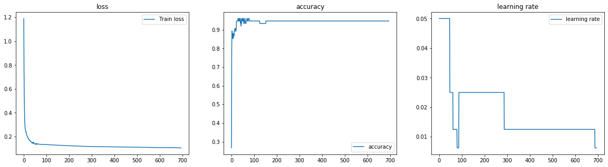

```python
%matplotlib inline
import os, sys

import numpy as np
import pandas as pd
import matplotlib.pyplot as plt
import seaborn as sns
from sklearn import datasets, linear_model
from sklearn.metrics import f1_score, classification_report, confusion_matrix, make_scorer
from sklearn.preprocessing import OneHotEncoder
import keras
from keras.models import Sequential
from keras.layers import Input, Dense
from keras.models import Model
from keras.optimizers import SGD
from keras import regularizers
from keras.wrappers.scikit_learn import KerasClassifier, KerasRegressor
from keras import backend as K
import tensorflow as tf
```

    Using TensorFlow backend.
    /home/admin/miniconda3/envs/da03/lib/python3.6/site-packages/tensorflow/python/framework/dtypes.py:516: FutureWarning: Passing (type, 1) or '1type' as a synonym of type is deprecated; in a future version of numpy, it will be understood as (type, (1,)) / '(1,)type'.
      _np_qint8 = np.dtype([("qint8", np.int8, 1)])
    /home/admin/miniconda3/envs/da03/lib/python3.6/site-packages/tensorflow/python/framework/dtypes.py:517: FutureWarning: Passing (type, 1) or '1type' as a synonym of type is deprecated; in a future version of numpy, it will be understood as (type, (1,)) / '(1,)type'.
      _np_quint8 = np.dtype([("quint8", np.uint8, 1)])
    /home/admin/miniconda3/envs/da03/lib/python3.6/site-packages/tensorflow/python/framework/dtypes.py:518: FutureWarning: Passing (type, 1) or '1type' as a synonym of type is deprecated; in a future version of numpy, it will be understood as (type, (1,)) / '(1,)type'.
      _np_qint16 = np.dtype([("qint16", np.int16, 1)])
    /home/admin/miniconda3/envs/da03/lib/python3.6/site-packages/tensorflow/python/framework/dtypes.py:519: FutureWarning: Passing (type, 1) or '1type' as a synonym of type is deprecated; in a future version of numpy, it will be understood as (type, (1,)) / '(1,)type'.
      _np_quint16 = np.dtype([("quint16", np.uint16, 1)])
    /home/admin/miniconda3/envs/da03/lib/python3.6/site-packages/tensorflow/python/framework/dtypes.py:520: FutureWarning: Passing (type, 1) or '1type' as a synonym of type is deprecated; in a future version of numpy, it will be understood as (type, (1,)) / '(1,)type'.
      _np_qint32 = np.dtype([("qint32", np.int32, 1)])
    /home/admin/miniconda3/envs/da03/lib/python3.6/site-packages/tensorflow/python/framework/dtypes.py:525: FutureWarning: Passing (type, 1) or '1type' as a synonym of type is deprecated; in a future version of numpy, it will be understood as (type, (1,)) / '(1,)type'.
      np_resource = np.dtype([("resource", np.ubyte, 1)])
    /home/admin/miniconda3/envs/da03/lib/python3.6/site-packages/tensorboard/compat/tensorflow_stub/dtypes.py:541: FutureWarning: Passing (type, 1) or '1type' as a synonym of type is deprecated; in a future version of numpy, it will be understood as (type, (1,)) / '(1,)type'.
      _np_qint8 = np.dtype([("qint8", np.int8, 1)])
    /home/admin/miniconda3/envs/da03/lib/python3.6/site-packages/tensorboard/compat/tensorflow_stub/dtypes.py:542: FutureWarning: Passing (type, 1) or '1type' as a synonym of type is deprecated; in a future version of numpy, it will be understood as (type, (1,)) / '(1,)type'.
      _np_quint8 = np.dtype([("quint8", np.uint8, 1)])
    /home/admin/miniconda3/envs/da03/lib/python3.6/site-packages/tensorboard/compat/tensorflow_stub/dtypes.py:543: FutureWarning: Passing (type, 1) or '1type' as a synonym of type is deprecated; in a future version of numpy, it will be understood as (type, (1,)) / '(1,)type'.
      _np_qint16 = np.dtype([("qint16", np.int16, 1)])
    /home/admin/miniconda3/envs/da03/lib/python3.6/site-packages/tensorboard/compat/tensorflow_stub/dtypes.py:544: FutureWarning: Passing (type, 1) or '1type' as a synonym of type is deprecated; in a future version of numpy, it will be understood as (type, (1,)) / '(1,)type'.
      _np_quint16 = np.dtype([("quint16", np.uint16, 1)])
    /home/admin/miniconda3/envs/da03/lib/python3.6/site-packages/tensorboard/compat/tensorflow_stub/dtypes.py:545: FutureWarning: Passing (type, 1) or '1type' as a synonym of type is deprecated; in a future version of numpy, it will be understood as (type, (1,)) / '(1,)type'.
      _np_qint32 = np.dtype([("qint32", np.int32, 1)])
    /home/admin/miniconda3/envs/da03/lib/python3.6/site-packages/tensorboard/compat/tensorflow_stub/dtypes.py:550: FutureWarning: Passing (type, 1) or '1type' as a synonym of type is deprecated; in a future version of numpy, it will be understood as (type, (1,)) / '(1,)type'.
      np_resource = np.dtype([("resource", np.ubyte, 1)])


```python
sys.path.append('/home/admin/github/wordroid.sblo.jp/lib')
from keras_ex.gkernel import GaussianKernel, GaussianKernel2, GaussianKernel3
from keras_ex.gkernel.sklearn import (
    RBFClassifier, RBFRegressor,
    make_model_gkernel3,
    make_model_gkernel2,
    make_model_gkernel1,
    make_model_out,
    make_model
)
```


```python
from sklearn import preprocessing

iris = datasets.load_iris()
X = iris.data.astype(np.float32)
X = preprocessing.scale(X)
Y = iris.target
N = Y.size
# Y2 = keras.utils.to_categorical(Y, num_classes=3)

index = np.arange(N)
xtrain = X[index[index % 2 != 0],:]
ytrain = Y[index[index % 2 != 0]]
xtest = X[index[index % 2 == 0],:]
yans = Y[index[index % 2 == 0]]
```

    /home/admin/miniconda3/envs/da03/lib/python3.6/site-packages/sklearn/preprocessing/data.py:172: UserWarning: Numerical issues were encountered when centering the data and might not be solved. Dataset may contain too large values. You may need to prescale your features.
      warnings.warn("Numerical issues were encountered "
    /home/admin/miniconda3/envs/da03/lib/python3.6/site-packages/sklearn/preprocessing/data.py:189: UserWarning: Numerical issues were encountered when scaling the data and might not be solved. The standard deviation of the data is probably very close to 0. 
      warnings.warn("Numerical issues were encountered "


```python

```

## create classifier


```python
clf = RBFClassifier(
    num_lm=15,
    lm_select_from_x=True
)
```


```python
%%time
#hst = clf.fit(xtrain, ytrain, epochs=500, batch_size=256, verbose=0)
hst = clf.fit(xtrain, ytrain, epochs=50, verbose=0)
```

    WARNING:tensorflow:From /home/admin/miniconda3/envs/da03/lib/python3.6/site-packages/keras/backend/tensorflow_backend.py:517: The name tf.placeholder is deprecated. Please use tf.compat.v1.placeholder instead.
    
    WARNING:tensorflow:From /home/admin/miniconda3/envs/da03/lib/python3.6/site-packages/keras/backend/tensorflow_backend.py:4138: The name tf.random_uniform is deprecated. Please use tf.random.uniform instead.
    
    WARNING:tensorflow:From /home/admin/miniconda3/envs/da03/lib/python3.6/site-packages/keras/backend/tensorflow_backend.py:174: The name tf.get_default_session is deprecated. Please use tf.compat.v1.get_default_session instead.
    
    WARNING:tensorflow:From /home/admin/miniconda3/envs/da03/lib/python3.6/site-packages/keras/backend/tensorflow_backend.py:181: The name tf.ConfigProto is deprecated. Please use tf.compat.v1.ConfigProto instead.
    
    WARNING:tensorflow:From /home/admin/miniconda3/envs/da03/lib/python3.6/site-packages/keras/backend/tensorflow_backend.py:186: The name tf.Session is deprecated. Please use tf.compat.v1.Session instead.
    
    WARNING:tensorflow:From /home/admin/miniconda3/envs/da03/lib/python3.6/site-packages/keras/optimizers.py:790: The name tf.train.Optimizer is deprecated. Please use tf.compat.v1.train.Optimizer instead.
    
    WARNING:tensorflow:From /home/admin/miniconda3/envs/da03/lib/python3.6/site-packages/tensorflow/python/ops/math_grad.py:1250: add_dispatch_support.<locals>.wrapper (from tensorflow.python.ops.array_ops) is deprecated and will be removed in a future version.
    Instructions for updating:
    Use tf.where in 2.0, which has the same broadcast rule as np.where
    CPU times: user 3.37 s, sys: 69.6 ms, total: 3.44 s
    Wall time: 2.96 s


```python
fig, ax = plt.subplots(1, 3, figsize=(20,5))
ax[0].set_title('loss')
ax[0].plot(list(range(len(hst["loss"]))), hst["loss"], label="Train loss")
ax[1].set_title('accuracy')
ax[1].plot(list(range(len(hst["loss"]))), hst["acc"], label="accuracy")
ax[2].set_title('learning rate')
ax[2].plot(list(range(len(hst["loss"]))), hst["lr"], label="learning rate")
ax[0].legend()
ax[1].legend()
ax[2].legend()
```


    <matplotlib.legend.Legend at 0x7f62200ba7f0>





```python
clf.predict_proba(xtrain)[:5]
```


    array([[9.9933523e-01, 6.6469144e-04, 2.5624564e-15],
           [9.9980408e-01, 1.9591086e-04, 6.6310027e-16],
           [9.9802482e-01, 1.9751820e-03, 8.5306880e-11],
           [9.9974126e-01, 2.5874199e-04, 1.1969627e-15],
           [9.9966788e-01, 3.3213786e-04, 7.2522998e-16]], dtype=float32)


```python
pred = clf.predict(xtrain)
pred[:5]
```


    array([0, 0, 0, 0, 0])


```python
print('F1_SCORE :', f1_score(ytrain, pred, average='macro'))
print(classification_report(ytrain, pred))
print(confusion_matrix(ytrain, pred))
```

    F1_SCORE : 0.9465811965811964
                  precision    recall  f1-score   support
    
               0       1.00      1.00      1.00        25
               1       0.96      0.88      0.92        25
               2       0.89      0.96      0.92        25
    
        accuracy                           0.95        75
       macro avg       0.95      0.95      0.95        75
    weighted avg       0.95      0.95      0.95        75
    
    [[25  0  0]
     [ 0 22  3]
     [ 0  1 24]]


```python
pred_test = clf.predict(xtest)
```


```python
print('F1_SCORE :', f1_score(yans, pred_test, average='macro'))
print(classification_report(yans, pred_test))
print(confusion_matrix(yans, pred_test))
```

    F1_SCORE : 0.8926462694578637
                  precision    recall  f1-score   support
    
               0       1.00      1.00      1.00        25
               1       0.90      0.76      0.83        25
               2       0.79      0.92      0.85        25
    
        accuracy                           0.89        75
       macro avg       0.90      0.89      0.89        75
    weighted avg       0.90      0.89      0.89        75
    
    [[25  0  0]
     [ 0 19  6]
     [ 0  2 23]]


```python
clf.model.save('demo_iris_002-model_save_nn')
```


```python

```
