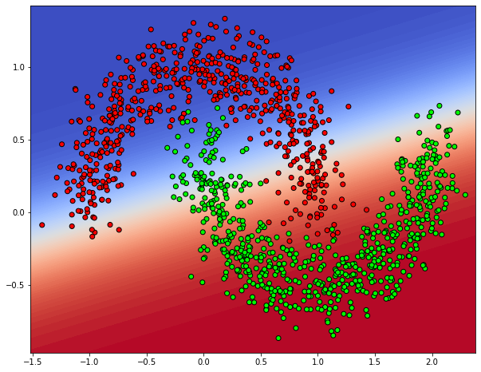

```python
epochs = 100
```


```python
%matplotlib inline
import os, sys

import numpy as np
import pandas as pd
import matplotlib.pyplot as plt
import seaborn as sns
from sklearn import datasets, linear_model
from sklearn.metrics import f1_score, classification_report, confusion_matrix, make_scorer
from sklearn.preprocessing import OneHotEncoder
import keras
from keras.models import Sequential
from keras.layers import Input, Dense
from keras.models import Model
from keras.optimizers import SGD
from keras import regularizers
from keras.wrappers.scikit_learn import KerasClassifier, KerasRegressor
from keras import backend as K
import tensorflow as tf
```

    Using TensorFlow backend.
    /home/admin/miniconda3/envs/da03/lib/python3.6/site-packages/tensorflow/python/framework/dtypes.py:516: FutureWarning: Passing (type, 1) or '1type' as a synonym of type is deprecated; in a future version of numpy, it will be understood as (type, (1,)) / '(1,)type'.
      _np_qint8 = np.dtype([("qint8", np.int8, 1)])
    /home/admin/miniconda3/envs/da03/lib/python3.6/site-packages/tensorflow/python/framework/dtypes.py:517: FutureWarning: Passing (type, 1) or '1type' as a synonym of type is deprecated; in a future version of numpy, it will be understood as (type, (1,)) / '(1,)type'.
      _np_quint8 = np.dtype([("quint8", np.uint8, 1)])
    /home/admin/miniconda3/envs/da03/lib/python3.6/site-packages/tensorflow/python/framework/dtypes.py:518: FutureWarning: Passing (type, 1) or '1type' as a synonym of type is deprecated; in a future version of numpy, it will be understood as (type, (1,)) / '(1,)type'.
      _np_qint16 = np.dtype([("qint16", np.int16, 1)])
    /home/admin/miniconda3/envs/da03/lib/python3.6/site-packages/tensorflow/python/framework/dtypes.py:519: FutureWarning: Passing (type, 1) or '1type' as a synonym of type is deprecated; in a future version of numpy, it will be understood as (type, (1,)) / '(1,)type'.
      _np_quint16 = np.dtype([("quint16", np.uint16, 1)])
    /home/admin/miniconda3/envs/da03/lib/python3.6/site-packages/tensorflow/python/framework/dtypes.py:520: FutureWarning: Passing (type, 1) or '1type' as a synonym of type is deprecated; in a future version of numpy, it will be understood as (type, (1,)) / '(1,)type'.
      _np_qint32 = np.dtype([("qint32", np.int32, 1)])
    /home/admin/miniconda3/envs/da03/lib/python3.6/site-packages/tensorflow/python/framework/dtypes.py:525: FutureWarning: Passing (type, 1) or '1type' as a synonym of type is deprecated; in a future version of numpy, it will be understood as (type, (1,)) / '(1,)type'.
      np_resource = np.dtype([("resource", np.ubyte, 1)])
    /home/admin/miniconda3/envs/da03/lib/python3.6/site-packages/tensorboard/compat/tensorflow_stub/dtypes.py:541: FutureWarning: Passing (type, 1) or '1type' as a synonym of type is deprecated; in a future version of numpy, it will be understood as (type, (1,)) / '(1,)type'.
      _np_qint8 = np.dtype([("qint8", np.int8, 1)])
    /home/admin/miniconda3/envs/da03/lib/python3.6/site-packages/tensorboard/compat/tensorflow_stub/dtypes.py:542: FutureWarning: Passing (type, 1) or '1type' as a synonym of type is deprecated; in a future version of numpy, it will be understood as (type, (1,)) / '(1,)type'.
      _np_quint8 = np.dtype([("quint8", np.uint8, 1)])
    /home/admin/miniconda3/envs/da03/lib/python3.6/site-packages/tensorboard/compat/tensorflow_stub/dtypes.py:543: FutureWarning: Passing (type, 1) or '1type' as a synonym of type is deprecated; in a future version of numpy, it will be understood as (type, (1,)) / '(1,)type'.
      _np_qint16 = np.dtype([("qint16", np.int16, 1)])
    /home/admin/miniconda3/envs/da03/lib/python3.6/site-packages/tensorboard/compat/tensorflow_stub/dtypes.py:544: FutureWarning: Passing (type, 1) or '1type' as a synonym of type is deprecated; in a future version of numpy, it will be understood as (type, (1,)) / '(1,)type'.
      _np_quint16 = np.dtype([("quint16", np.uint16, 1)])
    /home/admin/miniconda3/envs/da03/lib/python3.6/site-packages/tensorboard/compat/tensorflow_stub/dtypes.py:545: FutureWarning: Passing (type, 1) or '1type' as a synonym of type is deprecated; in a future version of numpy, it will be understood as (type, (1,)) / '(1,)type'.
      _np_qint32 = np.dtype([("qint32", np.int32, 1)])
    /home/admin/miniconda3/envs/da03/lib/python3.6/site-packages/tensorboard/compat/tensorflow_stub/dtypes.py:550: FutureWarning: Passing (type, 1) or '1type' as a synonym of type is deprecated; in a future version of numpy, it will be understood as (type, (1,)) / '(1,)type'.
      np_resource = np.dtype([("resource", np.ubyte, 1)])


```python
sys.path.append('/home/admin/github/wordroid.sblo.jp/lib')
#from gkernel import GaussianKernel, GaussianKernel2, GaussianKernel3
from keras_ex.gkernel.sklearn import RBFClassifier, make_model_gkernel3, make_model_gkernel1
```


```python
from sklearn.datasets import make_moons

n_samples = 2500
X, y = make_moons(n_samples=n_samples, noise=.15, random_state=0)
df = pd.DataFrame(X)
df.columns = ["col1", "col2"]
df['cls'] = y

sns.lmplot("col1", "col2", hue="cls", data=df, fit_reg=False, height=8)
```


    <seaborn.axisgrid.FacetGrid at 0x7fb6bd119e48>


```python
X.shape, X.min(), X.max()
```


    ((2500, 2), -1.4162335410213718, 2.3583974973883515)


```python
y.shape
```


    (2500,)


```python
N = y.shape[0]
y2 = keras.utils.to_categorical(y, num_classes=2)
y2.shape
index = np.arange(N)
xtrain = X[index[index % 2 != 0],:]
ytrain = y2[index[index % 2 != 0]]
xtest = X[index[index % 2 == 0],:]
yans = y2[index[index % 2 == 0]]
```


```python

```


```python
from sklearn.model_selection import StratifiedShuffleSplit, GridSearchCV, validation_curve
from sklearn.feature_selection import RFECV
from sklearn.linear_model import LogisticRegression, Lasso
import pandas as pd
from sklearn.metrics import mean_squared_error, mean_absolute_error, roc_auc_score, r2_score, make_scorer
from sklearn.metrics.pairwise import cosine_similarity, euclidean_distances
import joblib

from lightgbm import LGBMClassifier
```


```python
import warnings
warnings.filterwarnings('ignore')
```


```python
def f1_scorer(estimator, X, y):
    pred = estimator.predict(X)
    s = f1_score(y, pred, average='macro')
    return s
```


```python

```

## confirm vector input and matrix input


```python
clf = RBFClassifier(
    num_lm=10,
    lm=xtrain[np.random.choice(np.arange(xtrain.shape[0]), 10)],
    make_model_gkernel=make_model_gkernel3,
    reg_l1=0.00,
    gamma='scale',
    #lr=0.02,
    random_state=101
)
clf
```


    <keras_ex.gkernel.sklearn.RBFClassifier at 0x7fb6bc365748>


### matrix input


```python
ytrain[:5]
```


    array([[0., 1.],
           [1., 0.],
           [0., 1.],
           [1., 0.],
           [1., 0.]], dtype=float32)


```python
%%time
hst = clf.fit(xtrain, ytrain, epochs=epochs, batch_size=250, verbose=0)
```

    WARNING:tensorflow:From /home/admin/miniconda3/envs/da03/lib/python3.6/site-packages/keras/backend/tensorflow_backend.py:517: The name tf.placeholder is deprecated. Please use tf.compat.v1.placeholder instead.
    
    WARNING:tensorflow:From /home/admin/miniconda3/envs/da03/lib/python3.6/site-packages/keras/backend/tensorflow_backend.py:4138: The name tf.random_uniform is deprecated. Please use tf.random.uniform instead.
    
    WARNING:tensorflow:From /home/admin/miniconda3/envs/da03/lib/python3.6/site-packages/keras/backend/tensorflow_backend.py:174: The name tf.get_default_session is deprecated. Please use tf.compat.v1.get_default_session instead.
    
    WARNING:tensorflow:From /home/admin/miniconda3/envs/da03/lib/python3.6/site-packages/keras/backend/tensorflow_backend.py:181: The name tf.ConfigProto is deprecated. Please use tf.compat.v1.ConfigProto instead.
    
    WARNING:tensorflow:From /home/admin/miniconda3/envs/da03/lib/python3.6/site-packages/keras/backend/tensorflow_backend.py:186: The name tf.Session is deprecated. Please use tf.compat.v1.Session instead.
    
    WARNING:tensorflow:From /home/admin/miniconda3/envs/da03/lib/python3.6/site-packages/keras/optimizers.py:790: The name tf.train.Optimizer is deprecated. Please use tf.compat.v1.train.Optimizer instead.
    
    WARNING:tensorflow:From /home/admin/miniconda3/envs/da03/lib/python3.6/site-packages/tensorflow/python/ops/math_grad.py:1250: add_dispatch_support.<locals>.wrapper (from tensorflow.python.ops.array_ops) is deprecated and will be removed in a future version.
    Instructions for updating:
    Use tf.where in 2.0, which has the same broadcast rule as np.where
    CPU times: user 2.68 s, sys: 40.3 ms, total: 2.72 s
    Wall time: 2.5 s


```python
fig, ax = plt.subplots(1, 3, figsize=(20,5))
ax[0].set_title('loss')
ax[0].plot(list(range(len(hst["loss"]))), hst["loss"], label="Train loss")
ax[1].set_title('accuracy')
ax[1].plot(list(range(len(hst["loss"]))), hst["acc"], label="accuracy")
ax[2].set_title('learning rate')
ax[2].plot(list(range(len(hst["loss"]))), hst["lr"], label="learning rate")
ax[0].legend()
ax[1].legend()
ax[2].legend()
```


    <matplotlib.legend.Legend at 0x7fb6ac318198>


```python
clf.sk_params
```


    {'num_lm': 10, 'lm': array([[-0.95977415,  0.21325315],
            [-0.02593168, -0.25965886],
            [-0.4731229 ,  0.67961212],
            [-0.07061039,  1.08235132],
            [-0.32565905,  0.93846543],
            [ 2.12205182,  0.05867748],
            [-0.41907257,  1.11399777],
            [ 0.28686016,  0.94793683],
            [-0.05643714,  1.14903465],
            [ 0.17333069, -0.01154565]]), 'make_model_gkernel': <function keras_ex.gkernel.sklearn.make_model_gkernel3(nn=4, num_lm=2, random_state=None, lm=None, gamma=None)>, 'reg_l1': 0.0, 'gamma': 'scale', 'random_state': 101, 'num_cls': 2, 'nn': None, 'lr': None, 'callbacks': None, 'epochs_warmup': 10, 'loss': None}


```python
clf.sk_params
```


    {'num_lm': 10, 'lm': array([[-0.95977415,  0.21325315],
            [-0.02593168, -0.25965886],
            [-0.4731229 ,  0.67961212],
            [-0.07061039,  1.08235132],
            [-0.32565905,  0.93846543],
            [ 2.12205182,  0.05867748],
            [-0.41907257,  1.11399777],
            [ 0.28686016,  0.94793683],
            [-0.05643714,  1.14903465],
            [ 0.17333069, -0.01154565]]), 'make_model_gkernel': <function keras_ex.gkernel.sklearn.make_model_gkernel3(nn=4, num_lm=2, random_state=None, lm=None, gamma=None)>, 'reg_l1': 0.0, 'gamma': 'scale', 'random_state': 101, 'num_cls': 2, 'nn': None, 'lr': None, 'callbacks': None, 'epochs_warmup': 10, 'loss': None}


```python
clf.current_gamma()
```


    2.9879243


```python
clf.predict(xtrain)[:10]
```


    array([1, 0, 1, 0, 0, 0, 0, 1, 0, 0])


```python
clf.predict_proba(xtrain)[:5]
```


    array([[1.5744286e-04, 9.9984252e-01],
           [9.9593782e-01, 4.0622326e-03],
           [3.6649909e-02, 9.6335012e-01],
           [9.9839348e-01, 1.6064920e-03],
           [9.5554256e-01, 4.4457402e-02]], dtype=float32)


```python
clf.score(xtrain, ytrain)
```

    1250/1250 [==============================] - 0s 134us/step


    0.9912


```python
clf.score(xtest, yans)
```

    1250/1250 [==============================] - 0s 19us/step


    0.992


```python
print('F1_SCORE :', f1_score(np.argmax(ytrain,axis=1), clf.predict(xtrain), average='macro'))
print(classification_report(np.argmax(ytrain,axis=1), clf.predict(xtrain)))
print(confusion_matrix(np.argmax(ytrain,axis=1), clf.predict(xtrain)))
```

    F1_SCORE : 0.9911746451084107
                  precision    recall  f1-score   support
    
               0       0.99      0.99      0.99       592
               1       0.99      0.99      0.99       658
    
        accuracy                           0.99      1250
       macro avg       0.99      0.99      0.99      1250
    weighted avg       0.99      0.99      0.99      1250
    
    [[586   6]
     [  5 653]]


```python
print('F1_SCORE :', f1_score(np.argmax(yans,axis=1), clf.predict(xtest), average='macro'))
print(classification_report(np.argmax(yans,axis=1), clf.predict(xtest)))
print(confusion_matrix(np.argmax(yans,axis=1), clf.predict(xtest)))
```

    F1_SCORE : 0.9919802701814897
                  precision    recall  f1-score   support
    
               0       1.00      0.99      0.99       658
               1       0.99      0.99      0.99       592
    
        accuracy                           0.99      1250
       macro avg       0.99      0.99      0.99      1250
    weighted avg       0.99      0.99      0.99      1250
    
    [[651   7]
     [  3 589]]


```python
lm = clf.current_lm()
lm.shape
```


    (10, 2)


```python
from matplotlib.colors import ListedColormap

h = .01
x_min, x_max = xtrain[:, 0].min() - .1, xtrain[:, 0].max() + .1
y_min, y_max = xtrain[:, 1].min() - .1, xtrain[:, 1].max() + .1
xx, yy = np.meshgrid(np.arange(x_min, x_max, h),
                     np.arange(y_min, y_max, h))
y_pred = clf.predict_proba(np.c_[xx.ravel(), yy.ravel()])
y_pred

#cm = plt.cm.coolwarm
cm = plt.cm.gnuplot
cm_bright = ListedColormap(['#FFFF00', '#00FFFF'])
y_pred = y_pred[:,1].reshape(xx.shape)
plt.figure(figsize=(10, 8))
plt.contourf(xx, yy, y_pred, 100, cmap=cm, alpha=1)
plt.scatter(xtrain[:,0], xtrain[:,1], c=np.argmax(ytrain, axis=1), cmap=cm_bright, edgecolors='k')
plt.scatter(lm[:,0], lm[:,1], c='red', s=64, marker='s', edgecolors='w')
```


    <matplotlib.collections.PathCollection at 0x7fb6ac2737f0>


```python

```

### vector input


```python
np.argmax(ytrain, axis=1)[:5]
```


    array([1, 0, 1, 0, 0])


```python
%%time
hst = clf.fit(xtrain, np.argmax(ytrain, axis=1), epochs=epochs, batch_size=250, verbose=0)
```

    CPU times: user 2.78 s, sys: 40.4 ms, total: 2.82 s
    Wall time: 2.6 s


```python
fig, ax = plt.subplots(1, 3, figsize=(20,5))
ax[0].set_title('loss')
ax[0].plot(list(range(len(hst["loss"]))), hst["loss"], label="Train loss")
ax[1].set_title('accuracy')
ax[1].plot(list(range(len(hst["loss"]))), hst["acc"], label="accuracy")
ax[2].set_title('learning rate')
ax[2].plot(list(range(len(hst["loss"]))), hst["lr"], label="learning rate")
ax[0].legend()
ax[1].legend()
ax[2].legend()
```


    <matplotlib.legend.Legend at 0x7fb6868896d8>


```python
clf.sk_params
```


    {'num_lm': 10, 'lm': array([[-0.95977415,  0.21325315],
            [-0.02593168, -0.25965886],
            [-0.4731229 ,  0.67961212],
            [-0.07061039,  1.08235132],
            [-0.32565905,  0.93846543],
            [ 2.12205182,  0.05867748],
            [-0.41907257,  1.11399777],
            [ 0.28686016,  0.94793683],
            [-0.05643714,  1.14903465],
            [ 0.17333069, -0.01154565]]), 'make_model_gkernel': <function keras_ex.gkernel.sklearn.make_model_gkernel3(nn=4, num_lm=2, random_state=None, lm=None, gamma=None)>, 'reg_l1': 0.0, 'gamma': 'scale', 'random_state': 101, 'num_cls': 2, 'nn': None, 'lr': None, 'callbacks': None, 'epochs_warmup': 10, 'loss': None}


```python
clf.current_gamma()
```


    2.90319


```python
clf.predict(xtrain)[:10]
```


    array([1, 0, 1, 0, 0, 0, 0, 1, 0, 0])


```python
clf.predict_proba(xtrain)[:5]
```


    array([[5.8894660e-05, 9.9994111e-01],
           [9.8958254e-01, 1.0417438e-02],
           [2.8298428e-02, 9.7170156e-01],
           [9.9821895e-01, 1.7810762e-03],
           [9.5021796e-01, 4.9782041e-02]], dtype=float32)


```python
clf.score(xtrain, np.argmax(ytrain, axis=1))
```

    1250/1250 [==============================] - 0s 141us/step


    0.992


```python
clf.score(xtest, np.argmax(yans,axis=1))
```

    1250/1250 [==============================] - 0s 26us/step


    0.992


```python
print('F1_SCORE :', f1_score(np.argmax(ytrain,axis=1), clf.predict(xtrain), average='macro'))
print(classification_report(np.argmax(ytrain,axis=1), clf.predict(xtrain)))
print(confusion_matrix(np.argmax(ytrain,axis=1), clf.predict(xtrain)))
```

    F1_SCORE : 0.9919762548495517
                  precision    recall  f1-score   support
    
               0       0.99      0.99      0.99       592
               1       0.99      0.99      0.99       658
    
        accuracy                           0.99      1250
       macro avg       0.99      0.99      0.99      1250
    weighted avg       0.99      0.99      0.99      1250
    
    [[586   6]
     [  4 654]]


```python
print('F1_SCORE :', f1_score(np.argmax(yans,axis=1), clf.predict(xtest), average='macro'))
print(classification_report(np.argmax(yans,axis=1), clf.predict(xtest)))
print(confusion_matrix(np.argmax(yans,axis=1), clf.predict(xtest)))
```

    F1_SCORE : 0.9919802701814897
                  precision    recall  f1-score   support
    
               0       1.00      0.99      0.99       658
               1       0.99      0.99      0.99       592
    
        accuracy                           0.99      1250
       macro avg       0.99      0.99      0.99      1250
    weighted avg       0.99      0.99      0.99      1250
    
    [[651   7]
     [  3 589]]


```python
lm = clf.current_lm()
lm.shape
```


    (10, 2)


```python
from matplotlib.colors import ListedColormap

h = .01
x_min, x_max = xtrain[:, 0].min() - .1, xtrain[:, 0].max() + .1
y_min, y_max = xtrain[:, 1].min() - .1, xtrain[:, 1].max() + .1
xx, yy = np.meshgrid(np.arange(x_min, x_max, h),
                     np.arange(y_min, y_max, h))
y_pred = clf.predict_proba(np.c_[xx.ravel(), yy.ravel()])
y_pred

#cm = plt.cm.coolwarm
cm = plt.cm.gnuplot
cm_bright = ListedColormap(['#FFFF00', '#00FFFF'])
y_pred = y_pred[:,1].reshape(xx.shape)
plt.figure(figsize=(10, 8))
plt.contourf(xx, yy, y_pred, 100, cmap=cm, alpha=1)
plt.scatter(xtrain[:,0], xtrain[:,1], c=np.argmax(ytrain, axis=1), cmap=cm_bright, edgecolors='k')
plt.scatter(lm[:,0], lm[:,1], c='red', s=64, marker='s', edgecolors='w')
```


    <matplotlib.collections.PathCollection at 0x7fb6867ca8d0>


```python
clf.sk_params
```


    {'num_lm': 10, 'lm': array([[-0.95977415,  0.21325315],
            [-0.02593168, -0.25965886],
            [-0.4731229 ,  0.67961212],
            [-0.07061039,  1.08235132],
            [-0.32565905,  0.93846543],
            [ 2.12205182,  0.05867748],
            [-0.41907257,  1.11399777],
            [ 0.28686016,  0.94793683],
            [-0.05643714,  1.14903465],
            [ 0.17333069, -0.01154565]]), 'make_model_gkernel': <function keras_ex.gkernel.sklearn.make_model_gkernel3(nn=4, num_lm=2, random_state=None, lm=None, gamma=None)>, 'reg_l1': 0.0, 'gamma': 'scale', 'random_state': 101, 'num_cls': 2, 'nn': None, 'lr': None, 'callbacks': None, 'epochs_warmup': 10, 'loss': None}


```python

```

## Select initial LM with GaussianMixture
* train LM
* num_lm = 15


```python
num_lm = 15

from sklearn.mixture import GaussianMixture, BayesianGaussianMixture
gm = GaussianMixture(n_components=num_lm, covariance_type='tied')
gm.fit(xtrain)
gm.means_
```


    array([[ 0.46133777, -0.35625731],
           [-0.02561836,  0.99901805],
           [ 1.70174265, -0.20681857],
           [-0.81491892,  0.62352183],
           [ 0.78484036,  0.6501422 ],
           [-0.02537666,  0.39342451],
           [ 1.37164273, -0.40455051],
           [ 0.13086364,  0.02167534],
           [ 0.94693782, -0.49780171],
           [ 0.37806335,  0.91025565],
           [ 0.95487911,  0.19921527],
           [-0.99017587,  0.19501794],
           [-0.43846439,  0.90628151],
           [ 2.00608955,  0.44935197],
           [ 1.93211355,  0.15679916]])


```python
init_gamma = 1 / (2*np.diag(gm.covariances_).mean()*num_lm/2)
init_gamma
```


    2.655491781810156


```python
clf = RBFClassifier(
    num_lm=num_lm,
    lm=gm.means_,
    make_model_gkernel=make_model_gkernel3,
    #gamma='scale',
    gamma=init_gamma,
    random_state=101
)
clf
```


    <keras_ex.gkernel.sklearn.RBFClassifier at 0x7fb6864b6898>


```python
np.argmax(ytrain, axis=1)[:5]
```


    array([1, 0, 1, 0, 0])


```python
%%time
hst = clf.fit(xtrain, np.argmax(ytrain, axis=1), epochs=epochs, batch_size=250, verbose=0)
```

    CPU times: user 2.88 s, sys: 37 ms, total: 2.91 s
    Wall time: 2.74 s


```python
fig, ax = plt.subplots(1, 3, figsize=(20,5))
ax[0].set_title('loss')
ax[0].plot(list(range(len(hst["loss"]))), hst["loss"], label="Train loss")
ax[1].set_title('accuracy')
ax[1].plot(list(range(len(hst["loss"]))), hst["acc"], label="accuracy")
ax[2].set_title('learning rate')
ax[2].plot(list(range(len(hst["loss"]))), hst["lr"], label="learning rate")
ax[0].legend()
ax[1].legend()
ax[2].legend()
```


    <matplotlib.legend.Legend at 0x7fb685608be0>


```python
clf.sk_params
```


    {'num_lm': 15, 'lm': array([[ 0.46133777, -0.35625731],
            [-0.02561836,  0.99901805],
            [ 1.70174265, -0.20681857],
            [-0.81491892,  0.62352183],
            [ 0.78484036,  0.6501422 ],
            [-0.02537666,  0.39342451],
            [ 1.37164273, -0.40455051],
            [ 0.13086364,  0.02167534],
            [ 0.94693782, -0.49780171],
            [ 0.37806335,  0.91025565],
            [ 0.95487911,  0.19921527],
            [-0.99017587,  0.19501794],
            [-0.43846439,  0.90628151],
            [ 2.00608955,  0.44935197],
            [ 1.93211355,  0.15679916]]), 'make_model_gkernel': <function keras_ex.gkernel.sklearn.make_model_gkernel3(nn=4, num_lm=2, random_state=None, lm=None, gamma=None)>, 'gamma': 2.655491781810156, 'random_state': 101, 'loss': None, 'num_cls': 2, 'nn': None, 'lr': None, 'callbacks': None, 'epochs_warmup': 10}


```python
clf.current_gamma()
```


    3.6356597


```python
clf.predict(xtrain)[:10]
```


    array([1, 0, 1, 0, 0, 0, 0, 1, 0, 0])


```python
clf.predict_proba(xtrain)[:5]
```


    array([[3.3222364e-05, 9.9996674e-01],
           [9.9855250e-01, 1.4474618e-03],
           [2.8184203e-02, 9.7181576e-01],
           [9.9938393e-01, 6.1601290e-04],
           [9.7272444e-01, 2.7275553e-02]], dtype=float32)


```python
clf.score(xtrain, np.argmax(ytrain, axis=1))
```

    1250/1250 [==============================] - 0s 173us/step


    0.9904


```python
clf.score(xtest, np.argmax(yans,axis=1))
```

    1250/1250 [==============================] - 0s 27us/step


    0.992


```python
print('F1_SCORE :', f1_score(np.argmax(ytrain,axis=1), clf.predict(xtrain), average='macro'))
print(classification_report(np.argmax(ytrain,axis=1), clf.predict(xtrain)))
print(confusion_matrix(np.argmax(ytrain,axis=1), clf.predict(xtrain)))
```

    F1_SCORE : 0.9903731619157151
                  precision    recall  f1-score   support
    
               0       0.99      0.99      0.99       592
               1       0.99      0.99      0.99       658
    
        accuracy                           0.99      1250
       macro avg       0.99      0.99      0.99      1250
    weighted avg       0.99      0.99      0.99      1250
    
    [[586   6]
     [  6 652]]


```python
print('F1_SCORE :', f1_score(np.argmax(yans,axis=1), clf.predict(xtest), average='macro'))
print(classification_report(np.argmax(yans,axis=1), clf.predict(xtest)))
print(confusion_matrix(np.argmax(yans,axis=1), clf.predict(xtest)))
```

    F1_SCORE : 0.9919802701814897
                  precision    recall  f1-score   support
    
               0       1.00      0.99      0.99       658
               1       0.99      0.99      0.99       592
    
        accuracy                           0.99      1250
       macro avg       0.99      0.99      0.99      1250
    weighted avg       0.99      0.99      0.99      1250
    
    [[651   7]
     [  3 589]]


```python
lm = clf.current_lm()
lm.shape
```


    (15, 2)


```python
from matplotlib.colors import ListedColormap

h = .01
x_min, x_max = xtrain[:, 0].min() - .1, xtrain[:, 0].max() + .1
y_min, y_max = xtrain[:, 1].min() - .1, xtrain[:, 1].max() + .1
xx, yy = np.meshgrid(np.arange(x_min, x_max, h),
                     np.arange(y_min, y_max, h))
y_pred = clf.predict_proba(np.c_[xx.ravel(), yy.ravel()])
y_pred

#cm = plt.cm.coolwarm
cm = plt.cm.gnuplot
cm_bright = ListedColormap(['#FFFF00', '#00FFFF'])
y_pred = y_pred[:,1].reshape(xx.shape)
plt.figure(figsize=(10, 8))
plt.contourf(xx, yy, y_pred, 100, cmap=cm, alpha=1)
plt.scatter(xtrain[:,0], xtrain[:,1], c=np.argmax(ytrain, axis=1), cmap=cm_bright, edgecolors='k')
plt.scatter(lm[:,0], lm[:,1], c='red', s=64, marker='s', edgecolors='w')
plt.scatter(gm.means_[:,0], gm.means_[:,1], c='green', s=64, marker='s', edgecolors='w')
```


    <matplotlib.collections.PathCollection at 0x7fb6853e3278>


```python
clf.sk_params
```


    {'num_lm': 15, 'lm': array([[ 0.46133777, -0.35625731],
            [-0.02561836,  0.99901805],
            [ 1.70174265, -0.20681857],
            [-0.81491892,  0.62352183],
            [ 0.78484036,  0.6501422 ],
            [-0.02537666,  0.39342451],
            [ 1.37164273, -0.40455051],
            [ 0.13086364,  0.02167534],
            [ 0.94693782, -0.49780171],
            [ 0.37806335,  0.91025565],
            [ 0.95487911,  0.19921527],
            [-0.99017587,  0.19501794],
            [-0.43846439,  0.90628151],
            [ 2.00608955,  0.44935197],
            [ 1.93211355,  0.15679916]]), 'make_model_gkernel': <function keras_ex.gkernel.sklearn.make_model_gkernel3(nn=4, num_lm=2, random_state=None, lm=None, gamma=None)>, 'gamma': 2.655491781810156, 'random_state': 101, 'loss': None, 'num_cls': 2, 'nn': None, 'lr': None, 'callbacks': None, 'epochs_warmup': 10}


```python

```

## BENCHMARK LogisticRegression


```python
cv_splitter = StratifiedShuffleSplit(n_splits=3, test_size=0.35, random_state=0)
cv_splitter.get_n_splits(xtrain, ytrain)
```


    3


```python
param_name = "C"
param_range = np.logspace(-3, 3, 7)
param_range
```


    array([1.e-03, 1.e-02, 1.e-01, 1.e+00, 1.e+01, 1.e+02, 1.e+03])


```python
%%time

train_scores, test_scores = validation_curve(
    LogisticRegression(penalty='l1', multi_class='multinomial', solver='saga', max_iter=10000),
    xtrain, np.argmax(ytrain, axis=1),
    param_name=param_name, param_range=param_range,
    cv=cv_splitter, n_jobs=1, verbose=2, scoring=f1_scorer)
```

    [CV] C=0.001 .........................................................
    [CV] .......................................... C=0.001, total=   0.0s
    [CV] C=0.01 ..........................................................
    [CV] ........................................... C=0.01, total=   0.0s
    [CV] C=0.1 ...........................................................
    [CV] ............................................ C=0.1, total=   0.0s
    [CV] C=1.0 ...........................................................
    [CV] ............................................ C=1.0, total=   0.0s
    [CV] C=10.0 ..........................................................
    [CV] ........................................... C=10.0, total=   0.0s
    [CV] C=100.0 .........................................................
    [CV] .......................................... C=100.0, total=   0.0s
    [CV] C=1000.0 ........................................................
    [CV] ......................................... C=1000.0, total=   0.0s
    [CV] C=0.001 .........................................................
    [CV] .......................................... C=0.001, total=   0.0s
    [CV] C=0.01 ..........................................................
    [CV] ........................................... C=0.01, total=   0.0s
    [CV] C=0.1 ...........................................................
    [CV] ............................................ C=0.1, total=   0.0s
    [CV] C=1.0 ...........................................................
    [CV] ............................................ C=1.0, total=   0.0s
    [CV] C=10.0 ..........................................................
    [CV] ........................................... C=10.0, total=   0.0s
    [CV] C=100.0 .........................................................
    [CV] .......................................... C=100.0, total=   0.0s
    [CV] C=1000.0 ........................................................
    [CV] ......................................... C=1000.0, total=   0.0s
    [CV] C=0.001 .........................................................
    [CV] .......................................... C=0.001, total=   0.0s
    [CV] C=0.01 ..........................................................
    [CV] ........................................... C=0.01, total=   0.0s
    [CV] C=0.1 ...........................................................
    [CV] ............................................ C=0.1, total=   0.0s
    [CV] C=1.0 ...........................................................
    [CV] ............................................ C=1.0, total=   0.0s
    [CV] C=10.0 ..........................................................
    [CV] ........................................... C=10.0, total=   0.0s
    [CV] C=100.0 .........................................................
    [CV] .......................................... C=100.0, total=   0.0s
    [CV] C=1000.0 ........................................................
    [CV] ......................................... C=1000.0, total=   0.0s
    CPU times: user 142 ms, sys: 3.15 ms, total: 145 ms
    Wall time: 136 ms


    [Parallel(n_jobs=1)]: Using backend SequentialBackend with 1 concurrent workers.
    [Parallel(n_jobs=1)]: Done   1 out of   1 | elapsed:    0.0s remaining:    0.0s
    [Parallel(n_jobs=1)]: Done  21 out of  21 | elapsed:    0.1s finished


```python
train_scores_mean = np.mean(train_scores, axis=1)
train_scores_std = np.std(train_scores, axis=1)
test_scores_mean = np.mean(test_scores, axis=1)
test_scores_std = np.std(test_scores, axis=1)
np.c_[param_range, train_scores_mean, test_scores_mean]
```


    array([[1.00000000e-03, 3.36967655e-01, 3.37171064e-01],
           [1.00000000e-02, 8.45316039e-01, 8.41468954e-01],
           [1.00000000e-01, 8.85580495e-01, 8.67805089e-01],
           [1.00000000e+00, 8.89309088e-01, 8.71608912e-01],
           [1.00000000e+01, 8.89309088e-01, 8.71608912e-01],
           [1.00000000e+02, 8.89309088e-01, 8.70826707e-01],
           [1.00000000e+03, 8.89309088e-01, 8.70826707e-01]])


```python
plt.title("Validation Curve")
plt.xlabel("param")
plt.ylabel("Score")
plt.ylim(0.0, 1.1)
lw = 2
plt.semilogx(param_range, train_scores_mean, label="Training score",
             color="darkorange", lw=lw)
plt.fill_between(param_range, train_scores_mean - train_scores_std,
                 train_scores_mean + train_scores_std, alpha=0.2,
                 color="darkorange", lw=lw)
plt.semilogx(param_range, test_scores_mean, label="Cross-validation score",
             color="navy", lw=lw)
plt.fill_between(param_range, test_scores_mean - test_scores_std,
                 test_scores_mean + test_scores_std, alpha=0.2,
                 color="navy", lw=lw)
plt.legend(loc="best")
```


    <matplotlib.legend.Legend at 0x7fb6853c0e80>


```python
'''test data'''
est = LogisticRegression(penalty='l1', multi_class='multinomial', solver='saga', max_iter=10000, C=1.0)
est.fit(xtrain, np.argmax(ytrain, axis=1))
```


    LogisticRegression(C=1.0, class_weight=None, dual=False, fit_intercept=True,
                       intercept_scaling=1, l1_ratio=None, max_iter=10000,
                       multi_class='multinomial', n_jobs=None, penalty='l1',
                       random_state=None, solver='saga', tol=0.0001, verbose=0,
                       warm_start=False)


```python
pred = est.predict(xtrain)
```


```python
print('F1_SCORE :', f1_score(np.argmax(ytrain, axis=1), pred, average='macro'))
print(classification_report(np.argmax(ytrain, axis=1), pred))
print(confusion_matrix(np.argmax(ytrain, axis=1), pred))
```

    F1_SCORE : 0.8820611664487606
                  precision    recall  f1-score   support
    
               0       0.88      0.88      0.88       592
               1       0.89      0.89      0.89       658
    
        accuracy                           0.88      1250
       macro avg       0.88      0.88      0.88      1250
    weighted avg       0.88      0.88      0.88      1250
    
    [[518  74]
     [ 73 585]]


```python
pred_test = est.predict(xtest)
```


```python
print('F1_SCORE :', f1_score(np.argmax(yans, axis=1), pred_test, average='macro'))
print(classification_report(np.argmax(yans, axis=1), pred_test))
print(confusion_matrix(np.argmax(yans, axis=1), pred_test))
```

    F1_SCORE : 0.8781376352030869
                  precision    recall  f1-score   support
    
               0       0.89      0.88      0.88       658
               1       0.87      0.88      0.87       592
    
        accuracy                           0.88      1250
       macro avg       0.88      0.88      0.88      1250
    weighted avg       0.88      0.88      0.88      1250
    
    [[578  80]
     [ 72 520]]


```python
from matplotlib.colors import ListedColormap

h = .01
x_min, x_max = xtrain[:, 0].min() - .1, xtrain[:, 0].max() + .1
y_min, y_max = xtrain[:, 1].min() - .1, xtrain[:, 1].max() + .1
xx, yy = np.meshgrid(np.arange(x_min, x_max, h),
                     np.arange(y_min, y_max, h))
y_pred = est.predict_proba(np.c_[xx.ravel(), yy.ravel()])
y_pred

cm = plt.cm.coolwarm
cm_bright = ListedColormap(['#FF0000', '#0000FF', '#00FF00'])
y_pred = y_pred[:,1].reshape(xx.shape)
plt.figure(figsize=(10, 8))
plt.contourf(xx, yy, y_pred, 100, cmap=cm, alpha=1)
plt.scatter(xtrain[:,0], xtrain[:,1], c=np.argmax(ytrain, axis=1), cmap=cm_bright, edgecolors='k')
```


    <matplotlib.collections.PathCollection at 0x7fb68506a048>





```python

```

## BENCHMARK LGBMClassifier


```python
cv_splitter = StratifiedShuffleSplit(n_splits=3, test_size=0.35, random_state=0)
cv_splitter.get_n_splits(xtrain, ytrain)
```


    3


```python
param_name = "reg_alpha"
param_range = np.logspace(-3, 3, 7)
param_range
```


    array([1.e-03, 1.e-02, 1.e-01, 1.e+00, 1.e+01, 1.e+02, 1.e+03])


```python
%%time

train_scores, test_scores = validation_curve(
    LGBMClassifier(
        min_child_samples=20,
        reg_alpha=0.1
    ),
    xtrain, np.argmax(ytrain, axis=1),
    param_name=param_name, param_range=param_range,
    cv=cv_splitter, n_jobs=1, verbose=2, scoring=f1_scorer)
```

    [Parallel(n_jobs=1)]: Using backend SequentialBackend with 1 concurrent workers.
    [Parallel(n_jobs=1)]: Done   1 out of   1 | elapsed:    0.1s remaining:    0.0s


    [CV] reg_alpha=0.001 .................................................
    [CV] .................................. reg_alpha=0.001, total=   0.1s
    [CV] reg_alpha=0.01 ..................................................
    [CV] ................................... reg_alpha=0.01, total=   0.0s
    [CV] reg_alpha=0.1 ...................................................
    [CV] .................................... reg_alpha=0.1, total=   0.0s
    [CV] reg_alpha=1.0 ...................................................
    [CV] .................................... reg_alpha=1.0, total=   0.0s
    [CV] reg_alpha=10.0 ..................................................
    [CV] ................................... reg_alpha=10.0, total=   0.0s
    [CV] reg_alpha=100.0 .................................................
    [CV] .................................. reg_alpha=100.0, total=   0.0s
    [CV] reg_alpha=1000.0 ................................................
    [CV] ................................. reg_alpha=1000.0, total=   0.0s
    [CV] reg_alpha=0.001 .................................................
    [CV] .................................. reg_alpha=0.001, total=   0.0s
    [CV] reg_alpha=0.01 ..................................................
    [CV] ................................... reg_alpha=0.01, total=   0.0s
    [CV] reg_alpha=0.1 ...................................................
    [CV] .................................... reg_alpha=0.1, total=   0.0s
    [CV] reg_alpha=1.0 ...................................................
    [CV] .................................... reg_alpha=1.0, total=   0.0s
    [CV] reg_alpha=10.0 ..................................................
    [CV] ................................... reg_alpha=10.0, total=   0.0s
    [CV] reg_alpha=100.0 .................................................
    [CV] .................................. reg_alpha=100.0, total=   0.0s
    [CV] reg_alpha=1000.0 ................................................
    [CV] ................................. reg_alpha=1000.0, total=   0.0s
    [CV] reg_alpha=0.001 .................................................
    [CV] .................................. reg_alpha=0.001, total=   0.0s
    [CV] reg_alpha=0.01 ..................................................
    [CV] ................................... reg_alpha=0.01, total=   0.0s
    [CV] reg_alpha=0.1 ...................................................
    [CV] .................................... reg_alpha=0.1, total=   0.0s
    [CV] reg_alpha=1.0 ...................................................
    [CV] .................................... reg_alpha=1.0, total=   0.0s
    [CV] reg_alpha=10.0 ..................................................
    [CV] ................................... reg_alpha=10.0, total=   0.0s
    [CV] reg_alpha=100.0 .................................................
    [CV] .................................. reg_alpha=100.0, total=   0.0s
    [CV] reg_alpha=1000.0 ................................................
    [CV] ................................. reg_alpha=1000.0, total=   0.0s
    CPU times: user 473 ms, sys: 1.81 ms, total: 474 ms
    Wall time: 467 ms


    [Parallel(n_jobs=1)]: Done  21 out of  21 | elapsed:    0.5s finished


```python
train_scores_mean = np.mean(train_scores, axis=1)
train_scores_std = np.std(train_scores, axis=1)
test_scores_mean = np.mean(test_scores, axis=1)
test_scores_std = np.std(test_scores, axis=1)
np.c_[param_range, train_scores_mean, test_scores_mean]
```


    array([[1.00000000e-03, 1.00000000e+00, 9.81685511e-01],
           [1.00000000e-02, 1.00000000e+00, 9.81685511e-01],
           [1.00000000e-01, 1.00000000e+00, 9.80920936e-01],
           [1.00000000e+00, 9.98353344e-01, 9.82441722e-01],
           [1.00000000e+01, 9.91767549e-01, 9.82434278e-01],
           [1.00000000e+02, 8.46597913e-01, 8.21811172e-01],
           [1.00000000e+03, 3.44632768e-01, 3.45291480e-01]])


```python
plt.title("Validation Curve")
plt.xlabel("param")
plt.ylabel("Score")
plt.ylim(0.0, 1.1)
lw = 2
plt.semilogx(param_range, train_scores_mean, label="Training score",
             color="darkorange", lw=lw)
plt.fill_between(param_range, train_scores_mean - train_scores_std,
                 train_scores_mean + train_scores_std, alpha=0.2,
                 color="darkorange", lw=lw)
plt.semilogx(param_range, test_scores_mean, label="Cross-validation score",
             color="navy", lw=lw)
plt.fill_between(param_range, test_scores_mean - test_scores_std,
                 test_scores_mean + test_scores_std, alpha=0.2,
                 color="navy", lw=lw)
plt.legend(loc="best")
```


    <matplotlib.legend.Legend at 0x7fb6851c5780>


```python
'''test data'''
est = LGBMClassifier(
        min_child_samples=20,
        reg_alpha=0.1
    )
est.fit(xtrain, np.argmax(ytrain, axis=1))
```


    LGBMClassifier(boosting_type='gbdt', class_weight=None, colsample_bytree=1.0,
                   importance_type='split', learning_rate=0.1, max_depth=-1,
                   min_child_samples=20, min_child_weight=0.001, min_split_gain=0.0,
                   n_estimators=100, n_jobs=-1, num_leaves=31, objective=None,
                   random_state=None, reg_alpha=0.1, reg_lambda=0.0, silent=True,
                   subsample=1.0, subsample_for_bin=200000, subsample_freq=0)


```python
pred = est.predict(xtrain)
```


```python
print('F1_SCORE :', f1_score(np.argmax(ytrain, axis=1), pred, average='macro'))
print(classification_report(np.argmax(ytrain, axis=1), pred))
print(confusion_matrix(np.argmax(ytrain, axis=1), pred))
```

    F1_SCORE : 1.0
                  precision    recall  f1-score   support
    
               0       1.00      1.00      1.00       592
               1       1.00      1.00      1.00       658
    
        accuracy                           1.00      1250
       macro avg       1.00      1.00      1.00      1250
    weighted avg       1.00      1.00      1.00      1250
    
    [[592   0]
     [  0 658]]


```python
pred_test = est.predict(xtest)
```


```python
print('F1_SCORE :', f1_score(np.argmax(yans, axis=1), pred_test, average='macro'))
print(classification_report(np.argmax(yans, axis=1), pred_test))
print(confusion_matrix(np.argmax(yans, axis=1), pred_test))
```

    F1_SCORE : 0.9919802701814897
                  precision    recall  f1-score   support
    
               0       1.00      0.99      0.99       658
               1       0.99      0.99      0.99       592
    
        accuracy                           0.99      1250
       macro avg       0.99      0.99      0.99      1250
    weighted avg       0.99      0.99      0.99      1250
    
    [[651   7]
     [  3 589]]


```python
from matplotlib.colors import ListedColormap

h = .01
x_min, x_max = xtrain[:, 0].min() - .1, xtrain[:, 0].max() + .1
y_min, y_max = xtrain[:, 1].min() - .1, xtrain[:, 1].max() + .1
xx, yy = np.meshgrid(np.arange(x_min, x_max, h),
                     np.arange(y_min, y_max, h))
y_pred = est.predict_proba(np.c_[xx.ravel(), yy.ravel()])
y_pred

cm = plt.cm.coolwarm
cm_bright = ListedColormap(['#FF0000', '#0000FF', '#00FF00'])
y_pred = y_pred[:,1].reshape(xx.shape)
plt.figure(figsize=(10, 8))
plt.contourf(xx, yy, y_pred, 100, cmap=cm, alpha=1)
plt.scatter(xtrain[:,0], xtrain[:,1], c=np.argmax(ytrain, axis=1), cmap=cm_bright, edgecolors='k')
```


    <matplotlib.collections.PathCollection at 0x7fb684f02668>


```python

```

## validation_curve + RBFClassifier
* looking for valid num_lm
* using ``fixed landmarks``


```python
cv_splitter = StratifiedShuffleSplit(n_splits=3, test_size=0.35, random_state=0)
cv_splitter.get_n_splits(xtrain, ytrain)
```


    3


```python
param_name = "num_lm"
param_range = [2, 5, 10, 20, 50, 100, 150, 200, 250, 300]
param_range
```


    [2, 5, 10, 20, 50, 100, 150, 200, 250, 300]


```python
%%time

def f1_scorer_2(estimator, X, y):
    pred = estimator.predict(X)
    s = f1_score(np.argmax(y, axis=1), pred, average='macro')
    return s

train_scores, test_scores = validation_curve(
    RBFClassifier(
        num_lm=2,
        lm_select_from_x=True,
        random_state=None,
        lr=0.05, gamma='scale',
        epochs=epochs, batch_size=250, verbose=0
    ),
    xtrain, ytrain,
    param_name=param_name, param_range=param_range,
    cv=cv_splitter, n_jobs=1, verbose=2, scoring=f1_scorer_2)
```

    [Parallel(n_jobs=1)]: Using backend SequentialBackend with 1 concurrent workers.


    [CV] num_lm=2 ........................................................
    [CV] ......................................... num_lm=2, total=   4.0s
    [CV] num_lm=5 ........................................................


    [Parallel(n_jobs=1)]: Done   1 out of   1 | elapsed:    4.0s remaining:    0.0s


    [CV] ......................................... num_lm=5, total=   3.3s
    [CV] num_lm=10 .......................................................
    [CV] ........................................ num_lm=10, total=   4.2s
    [CV] num_lm=20 .......................................................
    [CV] ........................................ num_lm=20, total=   4.2s
    [CV] num_lm=50 .......................................................
    [CV] ........................................ num_lm=50, total=   4.4s
    [CV] num_lm=100 ......................................................
    [CV] ....................................... num_lm=100, total=   5.1s
    [CV] num_lm=150 ......................................................
    [CV] ....................................... num_lm=150, total=   5.9s
    [CV] num_lm=200 ......................................................
    [CV] ....................................... num_lm=200, total=   6.4s
    [CV] num_lm=250 ......................................................
    [CV] ....................................... num_lm=250, total=   7.1s
    [CV] num_lm=300 ......................................................
    [CV] ....................................... num_lm=300, total=   7.9s
    [CV] num_lm=2 ........................................................
    [CV] ......................................... num_lm=2, total=   6.1s
    [CV] num_lm=5 ........................................................
    [CV] ......................................... num_lm=5, total=   7.7s
    [CV] num_lm=10 .......................................................
    [CV] ........................................ num_lm=10, total=   6.5s
    [CV] num_lm=20 .......................................................
    [CV] ........................................ num_lm=20, total=   7.1s
    [CV] num_lm=50 .......................................................
    [CV] ........................................ num_lm=50, total=   8.0s
    [CV] num_lm=100 ......................................................
    [CV] ....................................... num_lm=100, total=   8.2s
    [CV] num_lm=150 ......................................................
    [CV] ....................................... num_lm=150, total=  10.5s
    [CV] num_lm=200 ......................................................
    [CV] ....................................... num_lm=200, total=   9.6s
    [CV] num_lm=250 ......................................................
    [CV] ....................................... num_lm=250, total=  10.0s
    [CV] num_lm=300 ......................................................
    [CV] ....................................... num_lm=300, total=  11.7s
    [CV] num_lm=2 ........................................................
    [CV] ......................................... num_lm=2, total=   9.2s
    [CV] num_lm=5 ........................................................
    [CV] ......................................... num_lm=5, total=   9.1s
    [CV] num_lm=10 .......................................................
    [CV] ........................................ num_lm=10, total=  12.2s
    [CV] num_lm=20 .......................................................
    [CV] ........................................ num_lm=20, total=  10.3s
    [CV] num_lm=50 .......................................................
    [CV] ........................................ num_lm=50, total=  10.6s
    [CV] num_lm=100 ......................................................
    [CV] ....................................... num_lm=100, total=  11.0s
    [CV] num_lm=150 ......................................................
    [CV] ....................................... num_lm=150, total=  11.6s
    [CV] num_lm=200 ......................................................
    [CV] ....................................... num_lm=200, total=  12.5s
    [CV] num_lm=250 ......................................................
    [CV] ....................................... num_lm=250, total=  13.3s
    [CV] num_lm=300 ......................................................
    [CV] ....................................... num_lm=300, total=  13.6s
    CPU times: user 4min 21s, sys: 1.57 s, total: 4min 23s
    Wall time: 4min 11s


    [Parallel(n_jobs=1)]: Done  30 out of  30 | elapsed:  4.2min finished


```python
train_scores_mean = np.mean(train_scores, axis=1)
train_scores_std = np.std(train_scores, axis=1)
test_scores_mean = np.mean(test_scores, axis=1)
test_scores_std = np.std(test_scores, axis=1)
np.c_[param_range, train_scores_mean, test_scores_mean]
```


    array([[  2.        ,   0.77139796,   0.77189738],
           [  5.        ,   0.88197494,   0.89230199],
           [ 10.        ,   0.94650991,   0.95504894],
           [ 20.        ,   0.99053266,   0.98701528],
           [ 50.        ,   0.99135495,   0.98931082],
           [100.        ,   0.99094457,   0.98854742],
           [150.        ,   0.99135581,   0.98930922],
           [200.        ,   0.99135506,   0.98854742],
           [250.        ,   0.99135506,   0.98854742],
           [300.        ,   0.99094457,   0.98854742]])


```python
plt.title("Validation Curve")
plt.xlabel("param")
plt.ylabel("Score")
plt.ylim(0.0, 1.1)
lw = 2
plt.semilogx(param_range, train_scores_mean, label="Training score",
             color="darkorange", lw=lw)
plt.fill_between(param_range, train_scores_mean - train_scores_std,
                 train_scores_mean + train_scores_std, alpha=0.2,
                 color="darkorange", lw=lw)
plt.semilogx(param_range, test_scores_mean, label="Cross-validation score",
             color="navy", lw=lw)
plt.fill_between(param_range, test_scores_mean - test_scores_std,
                 test_scores_mean + test_scores_std, alpha=0.2,
                 color="navy", lw=lw)
plt.legend(loc="best")
```


    <matplotlib.legend.Legend at 0x7fb6639c9c18>


```python
%%time
'''test data'''
est = RBFClassifier(
    num_lm=50,
    lm_select_from_x=True,
    random_state=None,
    lr=0.05, gamma='scale',
    epochs=epochs, batch_size=250, verbose=0
)
hst = est.fit(xtrain, ytrain)
```

    CPU times: user 12.1 s, sys: 39.1 ms, total: 12.2 s
    Wall time: 11.8 s


```python
fig, ax = plt.subplots(1, 3, figsize=(20,5))
ax[0].set_title('loss')
ax[0].plot(list(range(len(hst["loss"]))), hst["loss"], label="Train loss")
ax[1].set_title('accuracy')
ax[1].plot(list(range(len(hst["loss"]))), hst["acc"], label="accuracy")
ax[2].set_title('learning rate')
ax[2].plot(list(range(len(hst["loss"]))), hst["lr"], label="learning rate")
ax[0].legend()
ax[1].legend()
ax[2].legend()
```


    <matplotlib.legend.Legend at 0x7fb663095b38>


```python
pred = est.predict(xtrain)
```


```python
print('F1_SCORE :', f1_score(np.argmax(ytrain, axis=1), pred, average='macro'))
print(classification_report(np.argmax(ytrain, axis=1), pred))
print(confusion_matrix(np.argmax(ytrain, axis=1), pred))
```

    F1_SCORE : 0.991173104095102
                  precision    recall  f1-score   support
    
               0       0.99      0.99      0.99       592
               1       0.99      0.99      0.99       658
    
        accuracy                           0.99      1250
       macro avg       0.99      0.99      0.99      1250
    weighted avg       0.99      0.99      0.99      1250
    
    [[585   7]
     [  4 654]]


```python
pred_test = est.predict(xtest)
```


```python
print('F1_SCORE :', f1_score(np.argmax(yans, axis=1), pred_test, average='macro'))
print(classification_report(np.argmax(yans, axis=1), pred_test))
print(confusion_matrix(np.argmax(yans, axis=1), pred_test))
```

    F1_SCORE : 0.9903778305215216
                  precision    recall  f1-score   support
    
               0       1.00      0.99      0.99       658
               1       0.98      0.99      0.99       592
    
        accuracy                           0.99      1250
       macro avg       0.99      0.99      0.99      1250
    weighted avg       0.99      0.99      0.99      1250
    
    [[649   9]
     [  3 589]]


```python
lm = est.current_lm()
lm.shape
```


    (50, 2)


```python
from matplotlib.colors import ListedColormap

h = .01
x_min, x_max = xtrain[:, 0].min() - .1, xtrain[:, 0].max() + .1
y_min, y_max = xtrain[:, 1].min() - .1, xtrain[:, 1].max() + .1
xx, yy = np.meshgrid(np.arange(x_min, x_max, h),
                     np.arange(y_min, y_max, h))
y_pred = est.predict_proba(np.c_[xx.ravel(), yy.ravel()])
y_pred

#cm = plt.cm.coolwarm
cm = plt.cm.gnuplot
cm_bright = ListedColormap(['#FFFF00', '#00FFFF'])
y_pred = y_pred[:,1].reshape(xx.shape)
plt.figure(figsize=(10, 8))
plt.contourf(xx, yy, y_pred, 100, cmap=cm, alpha=1)
plt.scatter(xtrain[:,0], xtrain[:,1], c=np.argmax(ytrain, axis=1), cmap=cm_bright, edgecolors='k')
plt.scatter(lm[:,0], lm[:,1], c='red', s=64, marker='s', edgecolors='w')
```


    <matplotlib.collections.PathCollection at 0x7fb662fd6a20>


```python

```


```python
num_lm = 50
x_min, x_max = xtrain[:, 0].min(), xtrain[:, 0].max()
y_min, y_max = xtrain[:, 1].min(), xtrain[:, 1].max()

init_lm = np.c_[
    np.random.random((num_lm,))*(x_max-x_min)+x_min,
    np.random.random((num_lm,))*(y_max-y_min)+y_min
]
```

## set gamma to 'scale' (no train)


```python
%%time
est = RBFClassifier(
    num_lm=num_lm,
    lm=init_lm,
    #lm_select_from_x=True,
    random_state=None,
    lr=0.05, gamma='scale',
    make_model_gkernel=make_model_gkernel1,
    epochs=epochs, batch_size=250, verbose=0
)
hst = est.fit(xtrain, ytrain)
```

    CPU times: user 12.4 s, sys: 45.1 ms, total: 12.4 s
    Wall time: 12.1 s


```python
fig, ax = plt.subplots(1, 3, figsize=(20,5))
ax[0].set_title('loss')
ax[0].plot(list(range(len(hst["loss"]))), hst["loss"], label="Train loss")
ax[1].set_title('accuracy')
ax[1].plot(list(range(len(hst["loss"]))), hst["acc"], label="accuracy")
ax[2].set_title('learning rate')
ax[2].plot(list(range(len(hst["loss"]))), hst["lr"], label="learning rate")
ax[0].legend()
ax[1].legend()
ax[2].legend()
```


    <matplotlib.legend.Legend at 0x7fb6627a5b70>


```python
est.current_gamma(), 1 / (2*xtrain.var())
```


    (0.9167896, 0.916789619521976)


```python
pred = est.predict(xtrain)
```


```python
print('F1_SCORE :', f1_score(np.argmax(ytrain, axis=1), pred, average='macro'))
print(classification_report(np.argmax(ytrain, axis=1), pred))
print(confusion_matrix(np.argmax(ytrain, axis=1), pred))
```

    F1_SCORE : 0.9895700351281217
                  precision    recall  f1-score   support
    
               0       0.99      0.99      0.99       592
               1       0.99      0.99      0.99       658
    
        accuracy                           0.99      1250
       macro avg       0.99      0.99      0.99      1250
    weighted avg       0.99      0.99      0.99      1250
    
    [[585   7]
     [  6 652]]


```python
pred_test = est.predict(xtest)
```


```python
print('F1_SCORE :', f1_score(np.argmax(yans, axis=1), pred_test, average='macro'))
print(classification_report(np.argmax(yans, axis=1), pred_test))
print(confusion_matrix(np.argmax(yans, axis=1), pred_test))
```

    F1_SCORE : 0.9903763242177877
                  precision    recall  f1-score   support
    
               0       0.99      0.99      0.99       658
               1       0.99      0.99      0.99       592
    
        accuracy                           0.99      1250
       macro avg       0.99      0.99      0.99      1250
    weighted avg       0.99      0.99      0.99      1250
    
    [[650   8]
     [  4 588]]


```python
lm = est.current_lm()
lm.shape
```


    (50, 2)


```python
np.c_[lm, init_lm][:5]
```


    array([[-1.28440976, -0.6864875 , -1.28440971, -0.68648751],
           [-0.06470361,  0.72696519, -0.06470361,  0.72696519],
           [ 0.05096878,  0.54412156,  0.05096878,  0.54412156],
           [ 1.37441707,  0.59787345,  1.37441708,  0.59787343],
           [ 1.26189947, -0.63013721,  1.26189942, -0.63013722]])


```python
from matplotlib.colors import ListedColormap

h = .01
x_min, x_max = xtrain[:, 0].min() - .1, xtrain[:, 0].max() + .1
y_min, y_max = xtrain[:, 1].min() - .1, xtrain[:, 1].max() + .1
xx, yy = np.meshgrid(np.arange(x_min, x_max, h),
                     np.arange(y_min, y_max, h))
y_pred = est.predict_proba(np.c_[xx.ravel(), yy.ravel()])
y_pred

#cm = plt.cm.coolwarm
cm = plt.cm.gnuplot
cm_bright = ListedColormap(['#FFFF00', '#00FFFF'])
y_pred = y_pred[:,1].reshape(xx.shape)
plt.figure(figsize=(10, 8))
plt.contourf(xx, yy, y_pred, 100, cmap=cm, alpha=1)
plt.scatter(xtrain[:,0], xtrain[:,1], c=np.argmax(ytrain, axis=1), cmap=cm_bright, edgecolors='k')
plt.scatter(lm[:,0], lm[:,1], c='red', s=64, marker='s', edgecolors='w')
```


    <matplotlib.collections.PathCollection at 0x7fb662666c18>


```python

```

## set gamma to None (no train)


```python
%%time
est = RBFClassifier(
    num_lm=num_lm,
    lm=init_lm,
    #lm_select_from_x=True,
    random_state=None,
    lr=0.05, gamma=None,
    make_model_gkernel=make_model_gkernel1,
    epochs=epochs, batch_size=250, verbose=0
)
hst = est.fit(xtrain, ytrain)
```

    CPU times: user 17.5 s, sys: 160 ms, total: 17.6 s
    Wall time: 16.4 s


```python
fig, ax = plt.subplots(1, 3, figsize=(20,5))
ax[0].set_title('loss')
ax[0].plot(list(range(len(hst["loss"]))), hst["loss"], label="Train loss")
ax[1].set_title('accuracy')
ax[1].plot(list(range(len(hst["loss"]))), hst["acc"], label="accuracy")
ax[2].set_title('learning rate')
ax[2].plot(list(range(len(hst["loss"]))), hst["lr"], label="learning rate")
ax[0].legend()
ax[1].legend()
ax[2].legend()
```


    <matplotlib.legend.Legend at 0x7fb661dc0748>


```python
est.current_gamma(), 1/(2*np.sqrt(2/6)*2)
```


    (0.4330127, 0.43301270189221935)


```python
pred = est.predict(xtrain)
```


```python
print('F1_SCORE :', f1_score(np.argmax(ytrain, axis=1), pred, average='macro'))
print(classification_report(np.argmax(ytrain, axis=1), pred))
print(confusion_matrix(np.argmax(ytrain, axis=1), pred))
```

    F1_SCORE : 0.9823507968454777
                  precision    recall  f1-score   support
    
               0       0.98      0.98      0.98       592
               1       0.98      0.98      0.98       658
    
        accuracy                           0.98      1250
       macro avg       0.98      0.98      0.98      1250
    weighted avg       0.98      0.98      0.98      1250
    
    [[581  11]
     [ 11 647]]


```python
pred_test = est.predict(xtest)
```


```python
print('F1_SCORE :', f1_score(np.argmax(yans, axis=1), pred_test, average='macro'))
print(classification_report(np.argmax(yans, axis=1), pred_test))
print(confusion_matrix(np.argmax(yans, axis=1), pred_test))
```

    F1_SCORE : 0.9815531420292571
                  precision    recall  f1-score   support
    
               0       0.98      0.98      0.98       658
               1       0.98      0.98      0.98       592
    
        accuracy                           0.98      1250
       macro avg       0.98      0.98      0.98      1250
    weighted avg       0.98      0.98      0.98      1250
    
    [[645  13]
     [ 10 582]]


```python
lm = est.current_lm()
lm.shape
```


    (50, 2)


```python
np.c_[lm, init_lm][:5]
```


    array([[-1.28440976, -0.6864875 , -1.28440971, -0.68648751],
           [-0.06470361,  0.72696519, -0.06470361,  0.72696519],
           [ 0.05096878,  0.54412156,  0.05096878,  0.54412156],
           [ 1.37441707,  0.59787345,  1.37441708,  0.59787343],
           [ 1.26189947, -0.63013721,  1.26189942, -0.63013722]])


```python
from matplotlib.colors import ListedColormap

h = .01
x_min, x_max = xtrain[:, 0].min() - .1, xtrain[:, 0].max() + .1
y_min, y_max = xtrain[:, 1].min() - .1, xtrain[:, 1].max() + .1
xx, yy = np.meshgrid(np.arange(x_min, x_max, h),
                     np.arange(y_min, y_max, h))
y_pred = est.predict_proba(np.c_[xx.ravel(), yy.ravel()])
y_pred

#cm = plt.cm.coolwarm
cm = plt.cm.gnuplot
cm_bright = ListedColormap(['#FFFF00', '#00FFFF'])
y_pred = y_pred[:,1].reshape(xx.shape)
plt.figure(figsize=(10, 8))
plt.contourf(xx, yy, y_pred, 100, cmap=cm, alpha=1)
plt.scatter(xtrain[:,0], xtrain[:,1], c=np.argmax(ytrain, axis=1), cmap=cm_bright, edgecolors='k')
plt.scatter(lm[:,0], lm[:,1], c='red', s=64, marker='s', edgecolors='w')
```


    <matplotlib.collections.PathCollection at 0x7fb661cf57f0>


```python

```
