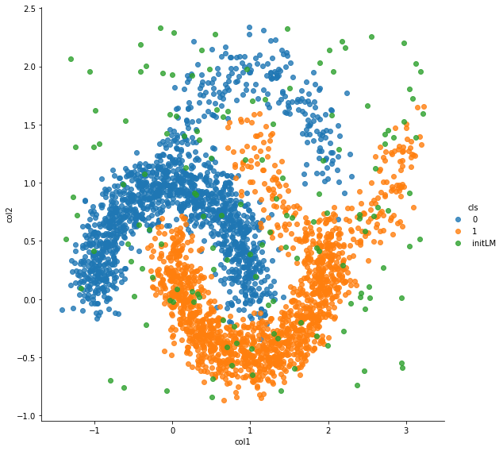
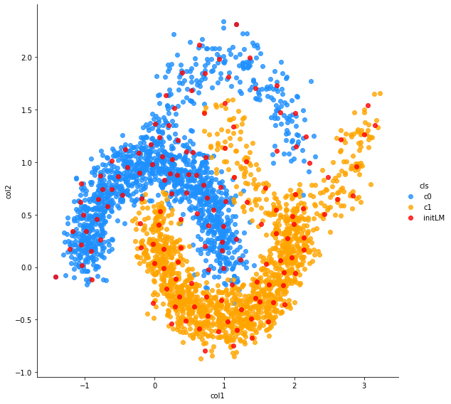

```python
epochs = 100
```


```python
%matplotlib inline
import os, sys

import numpy as np
import pandas as pd
import matplotlib.pyplot as plt
import seaborn as sns
from sklearn import datasets, linear_model
from sklearn.metrics import f1_score, classification_report, confusion_matrix, make_scorer
from sklearn.preprocessing import OneHotEncoder
import keras
from keras.models import Sequential
from keras.layers import Input, Dense
from keras.models import Model
from keras.optimizers import SGD
from keras import regularizers
from keras.wrappers.scikit_learn import KerasClassifier, KerasRegressor
from keras import backend as K
import tensorflow as tf
```

    Using TensorFlow backend.
    /home/admin/miniconda3/envs/da03/lib/python3.6/site-packages/tensorflow/python/framework/dtypes.py:516: FutureWarning: Passing (type, 1) or '1type' as a synonym of type is deprecated; in a future version of numpy, it will be understood as (type, (1,)) / '(1,)type'.
      _np_qint8 = np.dtype([("qint8", np.int8, 1)])
    /home/admin/miniconda3/envs/da03/lib/python3.6/site-packages/tensorflow/python/framework/dtypes.py:517: FutureWarning: Passing (type, 1) or '1type' as a synonym of type is deprecated; in a future version of numpy, it will be understood as (type, (1,)) / '(1,)type'.
      _np_quint8 = np.dtype([("quint8", np.uint8, 1)])
    /home/admin/miniconda3/envs/da03/lib/python3.6/site-packages/tensorflow/python/framework/dtypes.py:518: FutureWarning: Passing (type, 1) or '1type' as a synonym of type is deprecated; in a future version of numpy, it will be understood as (type, (1,)) / '(1,)type'.
      _np_qint16 = np.dtype([("qint16", np.int16, 1)])
    /home/admin/miniconda3/envs/da03/lib/python3.6/site-packages/tensorflow/python/framework/dtypes.py:519: FutureWarning: Passing (type, 1) or '1type' as a synonym of type is deprecated; in a future version of numpy, it will be understood as (type, (1,)) / '(1,)type'.
      _np_quint16 = np.dtype([("quint16", np.uint16, 1)])
    /home/admin/miniconda3/envs/da03/lib/python3.6/site-packages/tensorflow/python/framework/dtypes.py:520: FutureWarning: Passing (type, 1) or '1type' as a synonym of type is deprecated; in a future version of numpy, it will be understood as (type, (1,)) / '(1,)type'.
      _np_qint32 = np.dtype([("qint32", np.int32, 1)])
    /home/admin/miniconda3/envs/da03/lib/python3.6/site-packages/tensorflow/python/framework/dtypes.py:525: FutureWarning: Passing (type, 1) or '1type' as a synonym of type is deprecated; in a future version of numpy, it will be understood as (type, (1,)) / '(1,)type'.
      np_resource = np.dtype([("resource", np.ubyte, 1)])
    /home/admin/miniconda3/envs/da03/lib/python3.6/site-packages/tensorboard/compat/tensorflow_stub/dtypes.py:541: FutureWarning: Passing (type, 1) or '1type' as a synonym of type is deprecated; in a future version of numpy, it will be understood as (type, (1,)) / '(1,)type'.
      _np_qint8 = np.dtype([("qint8", np.int8, 1)])
    /home/admin/miniconda3/envs/da03/lib/python3.6/site-packages/tensorboard/compat/tensorflow_stub/dtypes.py:542: FutureWarning: Passing (type, 1) or '1type' as a synonym of type is deprecated; in a future version of numpy, it will be understood as (type, (1,)) / '(1,)type'.
      _np_quint8 = np.dtype([("quint8", np.uint8, 1)])
    /home/admin/miniconda3/envs/da03/lib/python3.6/site-packages/tensorboard/compat/tensorflow_stub/dtypes.py:543: FutureWarning: Passing (type, 1) or '1type' as a synonym of type is deprecated; in a future version of numpy, it will be understood as (type, (1,)) / '(1,)type'.
      _np_qint16 = np.dtype([("qint16", np.int16, 1)])
    /home/admin/miniconda3/envs/da03/lib/python3.6/site-packages/tensorboard/compat/tensorflow_stub/dtypes.py:544: FutureWarning: Passing (type, 1) or '1type' as a synonym of type is deprecated; in a future version of numpy, it will be understood as (type, (1,)) / '(1,)type'.
      _np_quint16 = np.dtype([("quint16", np.uint16, 1)])
    /home/admin/miniconda3/envs/da03/lib/python3.6/site-packages/tensorboard/compat/tensorflow_stub/dtypes.py:545: FutureWarning: Passing (type, 1) or '1type' as a synonym of type is deprecated; in a future version of numpy, it will be understood as (type, (1,)) / '(1,)type'.
      _np_qint32 = np.dtype([("qint32", np.int32, 1)])
    /home/admin/miniconda3/envs/da03/lib/python3.6/site-packages/tensorboard/compat/tensorflow_stub/dtypes.py:550: FutureWarning: Passing (type, 1) or '1type' as a synonym of type is deprecated; in a future version of numpy, it will be understood as (type, (1,)) / '(1,)type'.
      np_resource = np.dtype([("resource", np.ubyte, 1)])


```python
sys.path.append('/home/admin/github/wordroid.sblo.jp/lib')
#from gkernel import GaussianKernel, GaussianKernel2, GaussianKernel3
from keras_ex.gkernel.sklearn import RBFClassifier, make_model_gkernel3, make_model_gkernel1
```


```python
from sklearn.datasets import make_moons

n_samples = 2500
X1, y1 = make_moons(n_samples=n_samples, noise=.15, random_state=0)
df = pd.DataFrame(X1)
df.columns = ["col1", "col2"]
df['cls'] = y1

sns.lmplot("col1", "col2", hue="cls", data=df, fit_reg=False, height=8)
```


    <seaborn.axisgrid.FacetGrid at 0x7f466b084f98>


```python
n_samples = 500
X2, y2 = make_moons(n_samples=n_samples, noise=.15, random_state=0)
X2[:,0] += 1
X2[:,1] += 1
df = pd.DataFrame(X2)
df.columns = ["col1", "col2"]
df['cls'] = y2

sns.lmplot("col1", "col2", hue="cls", data=df, fit_reg=False, height=8)
```


    <seaborn.axisgrid.FacetGrid at 0x7f466ad3c080>


```python
X = np.r_[X1,X2]
y = np.concatenate([y1, y2])

df = pd.DataFrame(X)
df.columns = ["col1", "col2"]
df['cls'] = y

sns.lmplot("col1", "col2", hue="cls", data=df, fit_reg=False, height=8)
```


    <seaborn.axisgrid.FacetGrid at 0x7f46694a2be0>


```python
X.shape, X.min(), X.max()
```


    ((3000, 2), -1.4162335410213718, 3.2229096450864403)


```python
y.shape
```


    (3000,)


```python
N = y.shape[0]
y2 = keras.utils.to_categorical(y, num_classes=2)
y2.shape
index = np.arange(N)
xtrain = X[index[index % 2 != 0],:]
ytrain = y2[index[index % 2 != 0]]
xtest = X[index[index % 2 == 0],:]
yans = y2[index[index % 2 == 0]]
```


```python

```


```python
from sklearn.model_selection import StratifiedShuffleSplit, GridSearchCV, validation_curve
from sklearn.feature_selection import RFECV
from sklearn.linear_model import LogisticRegression, Lasso
import pandas as pd
from sklearn.metrics import mean_squared_error, mean_absolute_error, roc_auc_score, r2_score, make_scorer
from sklearn.metrics.pairwise import cosine_similarity, euclidean_distances
import joblib

from lightgbm import LGBMClassifier
```


```python
import warnings
warnings.filterwarnings('ignore')
```


```python
def f1_scorer(estimator, X, y):
    pred = estimator.predict(X)
    s = f1_score(y, pred, average='macro')
    return s
```


```python

```

### vector input


```python
np.argmax(ytrain, axis=1)[:5]
```


    array([1, 0, 1, 0, 0])


```python
clf = RBFClassifier(
    num_lm=200,
    lm_select_from_x=True,
    random_state=None,
    lr=0.05, gamma='scale'
)
```


```python
%%time
hst = clf.fit(xtrain, np.argmax(ytrain, axis=1), epochs=epochs, batch_size=300, verbose=0)
```

    WARNING:tensorflow:From /home/admin/miniconda3/envs/da03/lib/python3.6/site-packages/keras/backend/tensorflow_backend.py:517: The name tf.placeholder is deprecated. Please use tf.compat.v1.placeholder instead.
    
    WARNING:tensorflow:From /home/admin/miniconda3/envs/da03/lib/python3.6/site-packages/keras/backend/tensorflow_backend.py:4138: The name tf.random_uniform is deprecated. Please use tf.random.uniform instead.
    
    WARNING:tensorflow:From /home/admin/miniconda3/envs/da03/lib/python3.6/site-packages/keras/backend/tensorflow_backend.py:174: The name tf.get_default_session is deprecated. Please use tf.compat.v1.get_default_session instead.
    
    WARNING:tensorflow:From /home/admin/miniconda3/envs/da03/lib/python3.6/site-packages/keras/backend/tensorflow_backend.py:181: The name tf.ConfigProto is deprecated. Please use tf.compat.v1.ConfigProto instead.
    
    WARNING:tensorflow:From /home/admin/miniconda3/envs/da03/lib/python3.6/site-packages/keras/backend/tensorflow_backend.py:186: The name tf.Session is deprecated. Please use tf.compat.v1.Session instead.
    
    WARNING:tensorflow:From /home/admin/miniconda3/envs/da03/lib/python3.6/site-packages/keras/optimizers.py:790: The name tf.train.Optimizer is deprecated. Please use tf.compat.v1.train.Optimizer instead.
    
    WARNING:tensorflow:From /home/admin/miniconda3/envs/da03/lib/python3.6/site-packages/tensorflow/python/ops/math_grad.py:1250: add_dispatch_support.<locals>.wrapper (from tensorflow.python.ops.array_ops) is deprecated and will be removed in a future version.
    Instructions for updating:
    Use tf.where in 2.0, which has the same broadcast rule as np.where
    CPU times: user 4.44 s, sys: 86 ms, total: 4.53 s
    Wall time: 3.65 s


```python
fig, ax = plt.subplots(1, 3, figsize=(20,5))
ax[0].set_title('loss')
ax[0].plot(list(range(len(hst["loss"]))), hst["loss"], label="Train loss")
ax[1].set_title('accuracy')
ax[1].plot(list(range(len(hst["loss"]))), hst["acc"], label="accuracy")
ax[2].set_title('learning rate')
ax[2].plot(list(range(len(hst["loss"]))), hst["lr"], label="learning rate")
ax[0].legend()
ax[1].legend()
ax[2].legend()
```


    <matplotlib.legend.Legend at 0x7f466037e240>





```python
clf.sk_params
```


    {'num_lm': 200,
     'lm_select_from_x': True,
     'random_state': None,
     'lr': 0.05,
     'gamma': 'scale',
     'loss': None,
     'num_cls': 2,
     'nn': None,
     'callbacks': None,
     'lm': None,
     'epochs_warmup': 10}


```python
clf.current_gamma()
```


    4.1515336


```python
clf.predict(xtrain)[:10]
```


    array([1, 0, 1, 0, 0, 0, 0, 1, 0, 0])


```python
clf.predict_proba(xtrain)[:5]
```


    array([[8.6174936e-05, 9.9991381e-01],
           [9.9959272e-01, 4.0734146e-04],
           [1.6470941e-02, 9.8352909e-01],
           [9.9985301e-01, 1.4700922e-04],
           [9.8718750e-01, 1.2812551e-02]], dtype=float32)


```python
clf.score(xtrain, np.argmax(ytrain, axis=1))
```

    1500/1500 [==============================] - 0s 261us/step


    0.9866666666666667


```python
clf.score(xtest, np.argmax(yans,axis=1))
```

    1500/1500 [==============================] - 0s 58us/step


    0.9873333333333333


```python
print('F1_SCORE :', f1_score(np.argmax(ytrain,axis=1), clf.predict(xtrain), average='macro'))
print(classification_report(np.argmax(ytrain,axis=1), clf.predict(xtrain)))
print(confusion_matrix(np.argmax(ytrain,axis=1), clf.predict(xtrain)))
```

    F1_SCORE : 0.9866452991452992
                  precision    recall  f1-score   support
    
               0       0.99      0.99      0.99       720
               1       0.99      0.99      0.99       780
    
        accuracy                           0.99      1500
       macro avg       0.99      0.99      0.99      1500
    weighted avg       0.99      0.99      0.99      1500
    
    [[710  10]
     [ 10 770]]


```python
print('F1_SCORE :', f1_score(np.argmax(yans,axis=1), clf.predict(xtest), average='macro'))
print(classification_report(np.argmax(yans,axis=1), clf.predict(xtest)))
print(confusion_matrix(np.argmax(yans,axis=1), clf.predict(xtest)))
```

    F1_SCORE : 0.9873162807774898
                  precision    recall  f1-score   support
    
               0       0.99      0.98      0.99       780
               1       0.98      0.99      0.99       720
    
        accuracy                           0.99      1500
       macro avg       0.99      0.99      0.99      1500
    weighted avg       0.99      0.99      0.99      1500
    
    [[768  12]
     [  7 713]]


```python
lm = clf.current_lm()
lm.shape
```


    (200, 2)


```python
from matplotlib.colors import ListedColormap

h = .01
x_min, x_max = xtrain[:, 0].min() - .1, xtrain[:, 0].max() + .1
y_min, y_max = xtrain[:, 1].min() - .1, xtrain[:, 1].max() + .1
xx, yy = np.meshgrid(np.arange(x_min, x_max, h),
                     np.arange(y_min, y_max, h))
y_pred = clf.predict_proba(np.c_[xx.ravel(), yy.ravel()])
y_pred

#cm = plt.cm.coolwarm
cm = plt.cm.nipy_spectral
cm_bright = ListedColormap(['#FFFF00', '#00FFFF'])
y_pred = y_pred[:,1].reshape(xx.shape)
plt.figure(figsize=(10, 8))
plt.contourf(xx, yy, y_pred, 100, cmap=cm, alpha=1)
plt.scatter(xtrain[:,0], xtrain[:,1], c=np.argmax(ytrain, axis=1), cmap=cm_bright, edgecolors='k')
plt.scatter(lm[:,0], lm[:,1], c='red', s=64, marker='s', edgecolors='w')
```


    <matplotlib.collections.PathCollection at 0x7f46602c36d8>


```python

```

## BENCHMARK LogisticRegression


```python
cv_splitter = StratifiedShuffleSplit(n_splits=3, test_size=0.35, random_state=0)
cv_splitter.get_n_splits(xtrain, ytrain)
```


    3


```python
param_name = "C"
param_range = np.logspace(-3, 3, 7)
param_range
```


    array([1.e-03, 1.e-02, 1.e-01, 1.e+00, 1.e+01, 1.e+02, 1.e+03])


```python
%%time

train_scores, test_scores = validation_curve(
    LogisticRegression(penalty='l1', multi_class='multinomial', solver='saga', max_iter=10000),
    xtrain, np.argmax(ytrain, axis=1),
    param_name=param_name, param_range=param_range,
    cv=cv_splitter, n_jobs=1, verbose=2, scoring=f1_scorer)
```

    [CV] C=0.001 .........................................................
    [CV] .......................................... C=0.001, total=   0.0s
    [CV] C=0.01 ..........................................................
    [CV] ........................................... C=0.01, total=   0.0s
    [CV] C=0.1 ...........................................................
    [CV] ............................................ C=0.1, total=   0.0s
    [CV] C=1.0 ...........................................................
    [CV] ............................................ C=1.0, total=   0.0s
    [CV] C=10.0 ..........................................................
    [CV] ........................................... C=10.0, total=   0.0s
    [CV] C=100.0 .........................................................
    [CV] .......................................... C=100.0, total=   0.0s
    [CV] C=1000.0 ........................................................
    [CV] ......................................... C=1000.0, total=   0.0s
    [CV] C=0.001 .........................................................
    [CV] .......................................... C=0.001, total=   0.0s
    [CV] C=0.01 ..........................................................
    [CV] ........................................... C=0.01, total=   0.0s
    [CV] C=0.1 ...........................................................
    [CV] ............................................ C=0.1, total=   0.0s
    [CV] C=1.0 ...........................................................
    [CV] ............................................ C=1.0, total=   0.0s
    [CV] C=10.0 ..........................................................
    [CV] ........................................... C=10.0, total=   0.0s
    [CV] C=100.0 .........................................................
    [CV] .......................................... C=100.0, total=   0.0s
    [CV] C=1000.0 ........................................................
    [CV] ......................................... C=1000.0, total=   0.0s
    [CV] C=0.001 .........................................................
    [CV] .......................................... C=0.001, total=   0.0s
    [CV] C=0.01 ..........................................................
    [CV] ........................................... C=0.01, total=   0.0s
    [CV] C=0.1 ...........................................................
    [CV] ............................................ C=0.1, total=   0.0s
    [CV] C=1.0 ...........................................................
    [CV] ............................................ C=1.0, total=   0.0s
    [CV] C=10.0 ..........................................................
    [CV] ........................................... C=10.0, total=   0.0s
    [CV] C=100.0 .........................................................
    [CV] .......................................... C=100.0, total=   0.0s
    [CV] C=1000.0 ........................................................
    [CV] ......................................... C=1000.0, total=   0.0s
    CPU times: user 146 ms, sys: 3.1 ms, total: 149 ms
    Wall time: 141 ms


    [Parallel(n_jobs=1)]: Using backend SequentialBackend with 1 concurrent workers.
    [Parallel(n_jobs=1)]: Done   1 out of   1 | elapsed:    0.0s remaining:    0.0s
    [Parallel(n_jobs=1)]: Done  21 out of  21 | elapsed:    0.1s finished


```python
train_scores_mean = np.mean(train_scores, axis=1)
train_scores_std = np.std(train_scores, axis=1)
test_scores_mean = np.mean(test_scores, axis=1)
test_scores_std = np.std(test_scores, axis=1)
np.c_[param_range, train_scores_mean, test_scores_mean]
```


    array([[1.00000000e-03, 3.36178284e-01, 3.36178284e-01],
           [1.00000000e-02, 8.32691583e-01, 8.44029982e-01],
           [1.00000000e-01, 8.55155357e-01, 8.70265545e-01],
           [1.00000000e+00, 8.57895043e-01, 8.74090601e-01],
           [1.00000000e+01, 8.57556420e-01, 8.74090601e-01],
           [1.00000000e+02, 8.57556420e-01, 8.74090601e-01],
           [1.00000000e+03, 8.57556420e-01, 8.74090601e-01]])


```python
plt.title("Validation Curve")
plt.xlabel("param")
plt.ylabel("Score")
plt.ylim(0.0, 1.1)
lw = 2
plt.semilogx(param_range, train_scores_mean, label="Training score",
             color="darkorange", lw=lw)
plt.fill_between(param_range, train_scores_mean - train_scores_std,
                 train_scores_mean + train_scores_std, alpha=0.2,
                 color="darkorange", lw=lw)
plt.semilogx(param_range, test_scores_mean, label="Cross-validation score",
             color="navy", lw=lw)
plt.fill_between(param_range, test_scores_mean - test_scores_std,
                 test_scores_mean + test_scores_std, alpha=0.2,
                 color="navy", lw=lw)
plt.legend(loc="best")
```


    <matplotlib.legend.Legend at 0x7f4660152e10>


```python
'''test data'''
est = LogisticRegression(penalty='l1', multi_class='multinomial', solver='saga', max_iter=10000, C=1.0)
est.fit(xtrain, np.argmax(ytrain, axis=1))
```


    LogisticRegression(C=1.0, class_weight=None, dual=False, fit_intercept=True,
                       intercept_scaling=1, l1_ratio=None, max_iter=10000,
                       multi_class='multinomial', n_jobs=None, penalty='l1',
                       random_state=None, solver='saga', tol=0.0001, verbose=0,
                       warm_start=False)


```python
pred = est.predict(xtrain)
```


```python
print('F1_SCORE :', f1_score(np.argmax(ytrain, axis=1), pred, average='macro'))
print(classification_report(np.argmax(ytrain, axis=1), pred))
print(confusion_matrix(np.argmax(ytrain, axis=1), pred))
```

    F1_SCORE : 0.8637820512820513
                  precision    recall  f1-score   support
    
               0       0.86      0.86      0.86       720
               1       0.87      0.87      0.87       780
    
        accuracy                           0.86      1500
       macro avg       0.86      0.86      0.86      1500
    weighted avg       0.86      0.86      0.86      1500
    
    [[618 102]
     [102 678]]


```python
pred_test = est.predict(xtest)
```


```python
print('F1_SCORE :', f1_score(np.argmax(yans, axis=1), pred_test, average='macro'))
print(classification_report(np.argmax(yans, axis=1), pred_test))
print(confusion_matrix(np.argmax(yans, axis=1), pred_test))
```

    F1_SCORE : 0.8512110618904157
                  precision    recall  f1-score   support
    
               0       0.87      0.85      0.86       780
               1       0.84      0.86      0.85       720
    
        accuracy                           0.85      1500
       macro avg       0.85      0.85      0.85      1500
    weighted avg       0.85      0.85      0.85      1500
    
    [[660 120]
     [103 617]]


```python
from matplotlib.colors import ListedColormap

h = .01
x_min, x_max = xtrain[:, 0].min() - .1, xtrain[:, 0].max() + .1
y_min, y_max = xtrain[:, 1].min() - .1, xtrain[:, 1].max() + .1
xx, yy = np.meshgrid(np.arange(x_min, x_max, h),
                     np.arange(y_min, y_max, h))
y_pred = est.predict_proba(np.c_[xx.ravel(), yy.ravel()])
y_pred

cm = plt.cm.coolwarm
cm_bright = ListedColormap(['#FFFF00', '#00FFFF'])
y_pred = y_pred[:,1].reshape(xx.shape)
plt.figure(figsize=(10, 8))
plt.contourf(xx, yy, y_pred, 100, cmap=cm, alpha=1)
plt.scatter(xtrain[:,0], xtrain[:,1], c=np.argmax(ytrain, axis=1), cmap=cm_bright, edgecolors='k')
```


    <matplotlib.collections.PathCollection at 0x7f463c1f3e10>


```python

```


```python

```


```python

```

## BENCHMARK LGBMClassifier


```python
cv_splitter = StratifiedShuffleSplit(n_splits=3, test_size=0.35, random_state=0)
cv_splitter.get_n_splits(xtrain, ytrain)
```


    3


```python
param_name = "reg_alpha"
param_range = np.logspace(-3, 3, 7)
param_range
```


    array([1.e-03, 1.e-02, 1.e-01, 1.e+00, 1.e+01, 1.e+02, 1.e+03])


```python
%%time

train_scores, test_scores = validation_curve(
    LGBMClassifier(
        min_child_samples=20,
        reg_alpha=0.1
    ),
    xtrain, np.argmax(ytrain, axis=1),
    param_name=param_name, param_range=param_range,
    cv=cv_splitter, n_jobs=1, verbose=2, scoring=f1_scorer)
```

    [Parallel(n_jobs=1)]: Using backend SequentialBackend with 1 concurrent workers.
    [Parallel(n_jobs=1)]: Done   1 out of   1 | elapsed:    0.1s remaining:    0.0s


    [CV] reg_alpha=0.001 .................................................
    [CV] .................................. reg_alpha=0.001, total=   0.1s
    [CV] reg_alpha=0.01 ..................................................
    [CV] ................................... reg_alpha=0.01, total=   0.0s
    [CV] reg_alpha=0.1 ...................................................
    [CV] .................................... reg_alpha=0.1, total=   0.0s
    [CV] reg_alpha=1.0 ...................................................
    [CV] .................................... reg_alpha=1.0, total=   0.0s
    [CV] reg_alpha=10.0 ..................................................
    [CV] ................................... reg_alpha=10.0, total=   0.0s
    [CV] reg_alpha=100.0 .................................................
    [CV] .................................. reg_alpha=100.0, total=   0.0s
    [CV] reg_alpha=1000.0 ................................................
    [CV] ................................. reg_alpha=1000.0, total=   0.0s
    [CV] reg_alpha=0.001 .................................................
    [CV] .................................. reg_alpha=0.001, total=   0.0s
    [CV] reg_alpha=0.01 ..................................................
    [CV] ................................... reg_alpha=0.01, total=   0.0s
    [CV] reg_alpha=0.1 ...................................................
    [CV] .................................... reg_alpha=0.1, total=   0.0s
    [CV] reg_alpha=1.0 ...................................................
    [CV] .................................... reg_alpha=1.0, total=   0.0s
    [CV] reg_alpha=10.0 ..................................................
    [CV] ................................... reg_alpha=10.0, total=   0.0s
    [CV] reg_alpha=100.0 .................................................
    [CV] .................................. reg_alpha=100.0, total=   0.0s
    [CV] reg_alpha=1000.0 ................................................
    [CV] ................................. reg_alpha=1000.0, total=   0.0s
    [CV] reg_alpha=0.001 .................................................
    [CV] .................................. reg_alpha=0.001, total=   0.0s
    [CV] reg_alpha=0.01 ..................................................
    [CV] ................................... reg_alpha=0.01, total=   0.0s
    [CV] reg_alpha=0.1 ...................................................
    [CV] .................................... reg_alpha=0.1, total=   0.0s
    [CV] reg_alpha=1.0 ...................................................
    [CV] .................................... reg_alpha=1.0, total=   0.0s
    [CV] reg_alpha=10.0 ..................................................
    [CV] ................................... reg_alpha=10.0, total=   0.0s
    [CV] reg_alpha=100.0 .................................................
    [CV] .................................. reg_alpha=100.0, total=   0.0s
    [CV] reg_alpha=1000.0 ................................................
    [CV] ................................. reg_alpha=1000.0, total=   0.0s
    CPU times: user 616 ms, sys: 727 µs, total: 617 ms
    Wall time: 609 ms


    [Parallel(n_jobs=1)]: Done  21 out of  21 | elapsed:    0.6s finished


```python
train_scores_mean = np.mean(train_scores, axis=1)
train_scores_std = np.std(train_scores, axis=1)
test_scores_mean = np.mean(test_scores, axis=1)
test_scores_std = np.std(test_scores, axis=1)
np.c_[param_range, train_scores_mean, test_scores_mean]
```


    array([[1.00000000e-03, 1.00000000e+00, 9.71384753e-01],
           [1.00000000e-02, 1.00000000e+00, 9.70112099e-01],
           [1.00000000e-01, 1.00000000e+00, 9.72657400e-01],
           [1.00000000e+00, 9.95205303e-01, 9.73927975e-01],
           [1.00000000e+01, 9.59274856e-01, 9.48517685e-01],
           [1.00000000e+02, 8.50759366e-01, 8.32541210e-01],
           [1.00000000e+03, 3.42105263e-01, 3.42105263e-01]])


```python
plt.title("Validation Curve")
plt.xlabel("param")
plt.ylabel("Score")
plt.ylim(0.0, 1.1)
lw = 2
plt.semilogx(param_range, train_scores_mean, label="Training score",
             color="darkorange", lw=lw)
plt.fill_between(param_range, train_scores_mean - train_scores_std,
                 train_scores_mean + train_scores_std, alpha=0.2,
                 color="darkorange", lw=lw)
plt.semilogx(param_range, test_scores_mean, label="Cross-validation score",
             color="navy", lw=lw)
plt.fill_between(param_range, test_scores_mean - test_scores_std,
                 test_scores_mean + test_scores_std, alpha=0.2,
                 color="navy", lw=lw)
plt.legend(loc="best")
```


    <matplotlib.legend.Legend at 0x7f463c150b00>





```python
'''test data'''
est = LGBMClassifier(
        min_child_samples=20,
        reg_alpha=0.1
    )
est.fit(xtrain, np.argmax(ytrain, axis=1))
```


    LGBMClassifier(boosting_type='gbdt', class_weight=None, colsample_bytree=1.0,
                   importance_type='split', learning_rate=0.1, max_depth=-1,
                   min_child_samples=20, min_child_weight=0.001, min_split_gain=0.0,
                   n_estimators=100, n_jobs=-1, num_leaves=31, objective=None,
                   random_state=None, reg_alpha=0.1, reg_lambda=0.0, silent=True,
                   subsample=1.0, subsample_for_bin=200000, subsample_freq=0)


```python
pred = est.predict(xtrain)
```


```python
print('F1_SCORE :', f1_score(np.argmax(ytrain, axis=1), pred, average='macro'))
print(classification_report(np.argmax(ytrain, axis=1), pred))
print(confusion_matrix(np.argmax(ytrain, axis=1), pred))
```

    F1_SCORE : 1.0
                  precision    recall  f1-score   support
    
               0       1.00      1.00      1.00       720
               1       1.00      1.00      1.00       780
    
        accuracy                           1.00      1500
       macro avg       1.00      1.00      1.00      1500
    weighted avg       1.00      1.00      1.00      1500
    
    [[720   0]
     [  0 780]]


```python
pred_test = est.predict(xtest)
```


```python
print('F1_SCORE :', f1_score(np.argmax(yans, axis=1), pred_test, average='macro'))
print(classification_report(np.argmax(yans, axis=1), pred_test))
print(confusion_matrix(np.argmax(yans, axis=1), pred_test))
```

    F1_SCORE : 0.9879820318022146
                  precision    recall  f1-score   support
    
               0       0.99      0.99      0.99       780
               1       0.99      0.99      0.99       720
    
        accuracy                           0.99      1500
       macro avg       0.99      0.99      0.99      1500
    weighted avg       0.99      0.99      0.99      1500
    
    [[770  10]
     [  8 712]]


```python
from matplotlib.colors import ListedColormap

h = .01
x_min, x_max = xtrain[:, 0].min() - .1, xtrain[:, 0].max() + .1
y_min, y_max = xtrain[:, 1].min() - .1, xtrain[:, 1].max() + .1
xx, yy = np.meshgrid(np.arange(x_min, x_max, h),
                     np.arange(y_min, y_max, h))
y_pred = est.predict_proba(np.c_[xx.ravel(), yy.ravel()])
y_pred

cm = plt.cm.coolwarm
cm_bright = ListedColormap(['#FFFF00', '#00FFFF'])
y_pred = y_pred[:,1].reshape(xx.shape)
plt.figure(figsize=(10, 8))
plt.contourf(xx, yy, y_pred, 100, cmap=cm, alpha=1)
plt.scatter(xtrain[:,0], xtrain[:,1], c=np.argmax(ytrain, axis=1), cmap=cm_bright, edgecolors='k')
```


    <matplotlib.collections.PathCollection at 0x7f462e9f3438>


```python

```


```python

```

## validation_curve + RBFClassifier
* looking for valid num_lm
* ``fixed landmarks``


```python
cv_splitter = StratifiedShuffleSplit(n_splits=3, test_size=0.35, random_state=0)
cv_splitter.get_n_splits(xtrain, ytrain)
```


    3


```python
param_name = "num_lm"
param_range = [2, 5, 10, 20, 50, 100, 150, 200, 250, 300]
param_range
```


    [2, 5, 10, 20, 50, 100, 150, 200, 250, 300]


```python
%%time

def f1_scorer_2(estimator, X, y):
    pred = estimator.predict(X)
    s = f1_score(np.argmax(y, axis=1), pred, average='macro')
    return s

train_scores, test_scores = validation_curve(
    RBFClassifier(
        num_lm=2,
        lm_select_from_x=True,
        random_state=None,
        lr=0.05, gamma='scale',
        epochs=epochs, batch_size=300, verbose=0
    ),
    xtrain, ytrain,
    param_name=param_name, param_range=param_range,
    cv=cv_splitter, n_jobs=1, verbose=2, scoring=f1_scorer_2)
```

    [Parallel(n_jobs=1)]: Using backend SequentialBackend with 1 concurrent workers.


    [CV] num_lm=2 ........................................................
    [CV] ......................................... num_lm=2, total=   2.3s
    [CV] num_lm=5 ........................................................


    [Parallel(n_jobs=1)]: Done   1 out of   1 | elapsed:    2.3s remaining:    0.0s


    [CV] ......................................... num_lm=5, total=   2.5s
    [CV] num_lm=10 .......................................................
    [CV] ........................................ num_lm=10, total=   3.0s
    [CV] num_lm=20 .......................................................
    [CV] ........................................ num_lm=20, total=   4.3s
    [CV] num_lm=50 .......................................................
    [CV] ........................................ num_lm=50, total=   4.5s
    [CV] num_lm=100 ......................................................
    [CV] ....................................... num_lm=100, total=   4.8s
    [CV] num_lm=150 ......................................................
    [CV] ....................................... num_lm=150, total=   5.8s
    [CV] num_lm=200 ......................................................
    [CV] ....................................... num_lm=200, total=   6.7s
    [CV] num_lm=250 ......................................................
    [CV] ....................................... num_lm=250, total=   6.9s
    [CV] num_lm=300 ......................................................
    [CV] ....................................... num_lm=300, total=   8.0s
    [CV] num_lm=2 ........................................................
    [CV] ......................................... num_lm=2, total=   5.4s
    [CV] num_lm=5 ........................................................
    [CV] ......................................... num_lm=5, total=   6.0s
    [CV] num_lm=10 .......................................................
    [CV] ........................................ num_lm=10, total=   6.7s
    [CV] num_lm=20 .......................................................
    [CV] ........................................ num_lm=20, total=   7.4s
    [CV] num_lm=50 .......................................................
    [CV] ........................................ num_lm=50, total=   7.3s
    [CV] num_lm=100 ......................................................
    [CV] ....................................... num_lm=100, total=   8.3s
    [CV] num_lm=150 ......................................................
    [CV] ....................................... num_lm=150, total=   8.6s
    [CV] num_lm=200 ......................................................
    [CV] ....................................... num_lm=200, total=   9.4s
    [CV] num_lm=250 ......................................................
    [CV] ....................................... num_lm=250, total=  10.0s
    [CV] num_lm=300 ......................................................
    [CV] ....................................... num_lm=300, total=  10.8s
    [CV] num_lm=2 ........................................................
    [CV] ......................................... num_lm=2, total=   8.0s
    [CV] num_lm=5 ........................................................
    [CV] ......................................... num_lm=5, total=   9.3s
    [CV] num_lm=10 .......................................................
    [CV] ........................................ num_lm=10, total=   9.9s
    [CV] num_lm=20 .......................................................
    [CV] ........................................ num_lm=20, total=  10.9s
    [CV] num_lm=50 .......................................................
    [CV] ........................................ num_lm=50, total=  10.5s
    [CV] num_lm=100 ......................................................
    [CV] ....................................... num_lm=100, total=  13.0s
    [CV] num_lm=150 ......................................................
    [CV] ....................................... num_lm=150, total=  12.1s
    [CV] num_lm=200 ......................................................
    [CV] ....................................... num_lm=200, total=  12.7s
    [CV] num_lm=250 ......................................................
    [CV] ....................................... num_lm=250, total=  13.4s
    [CV] num_lm=300 ......................................................
    [CV] ....................................... num_lm=300, total=  15.0s
    CPU times: user 4min 23s, sys: 2.26 s, total: 4min 25s
    Wall time: 4min 3s


    [Parallel(n_jobs=1)]: Done  30 out of  30 | elapsed:  4.1min finished


```python
train_scores_mean = np.mean(train_scores, axis=1)
train_scores_std = np.std(train_scores, axis=1)
test_scores_mean = np.mean(test_scores, axis=1)
test_scores_std = np.std(test_scores, axis=1)
np.c_[param_range, train_scores_mean, test_scores_mean]
```


    array([[  2.        ,   0.78244541,   0.79181778],
           [  5.        ,   0.87563015,   0.85794538],
           [ 10.        ,   0.89644774,   0.90008144],
           [ 20.        ,   0.95724335,   0.95553852],
           [ 50.        ,   0.97912303,   0.9720411 ],
           [100.        ,   0.98596239,   0.98410065],
           [150.        ,   0.98733118,   0.98601217],
           [200.        ,   0.98733118,   0.98601152],
           [250.        ,   0.98698911,   0.98664662],
           [300.        ,   0.98630521,   0.98728183]])


```python
plt.title("Validation Curve")
plt.xlabel("param")
plt.ylabel("Score")
plt.ylim(0.0, 1.1)
lw = 2
plt.semilogx(param_range, train_scores_mean, label="Training score",
             color="darkorange", lw=lw)
plt.fill_between(param_range, train_scores_mean - train_scores_std,
                 train_scores_mean + train_scores_std, alpha=0.2,
                 color="darkorange", lw=lw)
plt.semilogx(param_range, test_scores_mean, label="Cross-validation score",
             color="navy", lw=lw)
plt.fill_between(param_range, test_scores_mean - test_scores_std,
                 test_scores_mean + test_scores_std, alpha=0.2,
                 color="navy", lw=lw)
plt.legend(loc="best")
```


    <matplotlib.legend.Legend at 0x7f4610d57630>


```python
%%time
'''test data'''
est = RBFClassifier(
    num_lm=200,
    lm_select_from_x=True,
    random_state=None,
    lr=0.05, gamma='scale',
    epochs=epochs, batch_size=300, verbose=0
)
hst = est.fit(xtrain, ytrain)
```

    CPU times: user 14.3 s, sys: 109 ms, total: 14.5 s
    Wall time: 13.2 s


```python
fig, ax = plt.subplots(1, 3, figsize=(20,5))
ax[0].set_title('loss')
ax[0].plot(list(range(len(hst["loss"]))), hst["loss"], label="Train loss")
ax[1].set_title('accuracy')
ax[1].plot(list(range(len(hst["loss"]))), hst["acc"], label="accuracy")
ax[2].set_title('learning rate')
ax[2].plot(list(range(len(hst["loss"]))), hst["lr"], label="learning rate")
ax[0].legend()
ax[1].legend()
ax[2].legend()
```


    <matplotlib.legend.Legend at 0x7f4610438780>


```python
pred = est.predict(xtrain)
```


```python
print('F1_SCORE :', f1_score(np.argmax(ytrain, axis=1), pred, average='macro'))
print(classification_report(np.argmax(ytrain, axis=1), pred))
print(confusion_matrix(np.argmax(ytrain, axis=1), pred))
```

    F1_SCORE : 0.9859783068827819
                  precision    recall  f1-score   support
    
               0       0.98      0.99      0.99       720
               1       0.99      0.99      0.99       780
    
        accuracy                           0.99      1500
       macro avg       0.99      0.99      0.99      1500
    weighted avg       0.99      0.99      0.99      1500
    
    [[710  10]
     [ 11 769]]


```python
pred_test = est.predict(xtest)
```


```python
print('F1_SCORE :', f1_score(np.argmax(yans, axis=1), pred_test, average='macro'))
print(classification_report(np.argmax(yans, axis=1), pred_test))
print(confusion_matrix(np.argmax(yans, axis=1), pred_test))
```

    F1_SCORE : 0.9886502776676187
                  precision    recall  f1-score   support
    
               0       0.99      0.99      0.99       780
               1       0.99      0.99      0.99       720
    
        accuracy                           0.99      1500
       macro avg       0.99      0.99      0.99      1500
    weighted avg       0.99      0.99      0.99      1500
    
    [[770  10]
     [  7 713]]


```python
lm = est.current_lm()
lm.shape
```


    (200, 2)


```python
from matplotlib.colors import ListedColormap

h = .01
x_min, x_max = xtrain[:, 0].min() - .1, xtrain[:, 0].max() + .1
y_min, y_max = xtrain[:, 1].min() - .1, xtrain[:, 1].max() + .1
xx, yy = np.meshgrid(np.arange(x_min, x_max, h),
                     np.arange(y_min, y_max, h))
y_pred = est.predict_proba(np.c_[xx.ravel(), yy.ravel()])
y_pred

#cm = plt.cm.coolwarm
#cm = plt.cm.gist_earth
#cm = plt.cm.gist_stern
#cm = plt.cm.BrBG
#cm = plt.cm.ocean
#cm = plt.cm.gnuplot
cm = plt.cm.nipy_spectral
cm_bright = ListedColormap(['#FFFF00', '#00FFFF'])
y_pred = y_pred[:,1].reshape(xx.shape)
plt.figure(figsize=(10, 8))
plt.contourf(xx, yy, y_pred, 100, cmap=cm, alpha=1)
plt.scatter(xtrain[:,0], xtrain[:,1], c=np.argmax(ytrain, axis=1), cmap=cm_bright, edgecolors='k')
plt.scatter(lm[:,0], lm[:,1], c='red', s=64, marker='s', edgecolors='w')
```


    <matplotlib.collections.PathCollection at 0x7f4610385ba8>


```python

```
