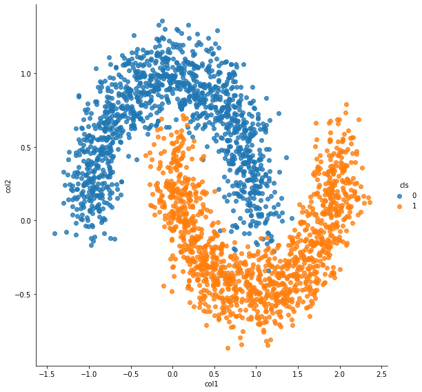

```python
epochs = 100
```


```python
%matplotlib inline
import os, sys

import numpy as np
import pandas as pd
import matplotlib.pyplot as plt
import seaborn as sns
from sklearn import datasets, linear_model
from sklearn.metrics import f1_score, classification_report, confusion_matrix, make_scorer
from sklearn.preprocessing import OneHotEncoder
import keras
from keras.models import Sequential
from keras.layers import Input, Dense
from keras.models import Model
from keras.optimizers import SGD
from keras import regularizers
from keras.wrappers.scikit_learn import KerasClassifier, KerasRegressor
from keras import backend as K
import tensorflow as tf
```

    Using TensorFlow backend.
    /home/admin/miniconda3/envs/da03/lib/python3.6/site-packages/tensorflow/python/framework/dtypes.py:516: FutureWarning: Passing (type, 1) or '1type' as a synonym of type is deprecated; in a future version of numpy, it will be understood as (type, (1,)) / '(1,)type'.
      _np_qint8 = np.dtype([("qint8", np.int8, 1)])
    /home/admin/miniconda3/envs/da03/lib/python3.6/site-packages/tensorflow/python/framework/dtypes.py:517: FutureWarning: Passing (type, 1) or '1type' as a synonym of type is deprecated; in a future version of numpy, it will be understood as (type, (1,)) / '(1,)type'.
      _np_quint8 = np.dtype([("quint8", np.uint8, 1)])
    /home/admin/miniconda3/envs/da03/lib/python3.6/site-packages/tensorflow/python/framework/dtypes.py:518: FutureWarning: Passing (type, 1) or '1type' as a synonym of type is deprecated; in a future version of numpy, it will be understood as (type, (1,)) / '(1,)type'.
      _np_qint16 = np.dtype([("qint16", np.int16, 1)])
    /home/admin/miniconda3/envs/da03/lib/python3.6/site-packages/tensorflow/python/framework/dtypes.py:519: FutureWarning: Passing (type, 1) or '1type' as a synonym of type is deprecated; in a future version of numpy, it will be understood as (type, (1,)) / '(1,)type'.
      _np_quint16 = np.dtype([("quint16", np.uint16, 1)])
    /home/admin/miniconda3/envs/da03/lib/python3.6/site-packages/tensorflow/python/framework/dtypes.py:520: FutureWarning: Passing (type, 1) or '1type' as a synonym of type is deprecated; in a future version of numpy, it will be understood as (type, (1,)) / '(1,)type'.
      _np_qint32 = np.dtype([("qint32", np.int32, 1)])
    /home/admin/miniconda3/envs/da03/lib/python3.6/site-packages/tensorflow/python/framework/dtypes.py:525: FutureWarning: Passing (type, 1) or '1type' as a synonym of type is deprecated; in a future version of numpy, it will be understood as (type, (1,)) / '(1,)type'.
      np_resource = np.dtype([("resource", np.ubyte, 1)])
    /home/admin/miniconda3/envs/da03/lib/python3.6/site-packages/tensorboard/compat/tensorflow_stub/dtypes.py:541: FutureWarning: Passing (type, 1) or '1type' as a synonym of type is deprecated; in a future version of numpy, it will be understood as (type, (1,)) / '(1,)type'.
      _np_qint8 = np.dtype([("qint8", np.int8, 1)])
    /home/admin/miniconda3/envs/da03/lib/python3.6/site-packages/tensorboard/compat/tensorflow_stub/dtypes.py:542: FutureWarning: Passing (type, 1) or '1type' as a synonym of type is deprecated; in a future version of numpy, it will be understood as (type, (1,)) / '(1,)type'.
      _np_quint8 = np.dtype([("quint8", np.uint8, 1)])
    /home/admin/miniconda3/envs/da03/lib/python3.6/site-packages/tensorboard/compat/tensorflow_stub/dtypes.py:543: FutureWarning: Passing (type, 1) or '1type' as a synonym of type is deprecated; in a future version of numpy, it will be understood as (type, (1,)) / '(1,)type'.
      _np_qint16 = np.dtype([("qint16", np.int16, 1)])
    /home/admin/miniconda3/envs/da03/lib/python3.6/site-packages/tensorboard/compat/tensorflow_stub/dtypes.py:544: FutureWarning: Passing (type, 1) or '1type' as a synonym of type is deprecated; in a future version of numpy, it will be understood as (type, (1,)) / '(1,)type'.
      _np_quint16 = np.dtype([("quint16", np.uint16, 1)])
    /home/admin/miniconda3/envs/da03/lib/python3.6/site-packages/tensorboard/compat/tensorflow_stub/dtypes.py:545: FutureWarning: Passing (type, 1) or '1type' as a synonym of type is deprecated; in a future version of numpy, it will be understood as (type, (1,)) / '(1,)type'.
      _np_qint32 = np.dtype([("qint32", np.int32, 1)])
    /home/admin/miniconda3/envs/da03/lib/python3.6/site-packages/tensorboard/compat/tensorflow_stub/dtypes.py:550: FutureWarning: Passing (type, 1) or '1type' as a synonym of type is deprecated; in a future version of numpy, it will be understood as (type, (1,)) / '(1,)type'.
      np_resource = np.dtype([("resource", np.ubyte, 1)])


```python
sys.path.append('/home/admin/github/wordroid.sblo.jp/lib')
#from gkernel import GaussianKernel, GaussianKernel2, GaussianKernel3
from keras_ex.gkernel.sklearn import RBFClassifier, make_model_gkernel3, make_model_gkernel1
```

## prepare moon data


```python
from sklearn.datasets import make_moons

n_samples = 2500
X1, y1 = make_moons(n_samples=n_samples, noise=.15, random_state=0)
df = pd.DataFrame(X1)
df.columns = ["col1", "col2"]
df['cls'] = y1

sns.lmplot("col1", "col2", hue="cls", data=df, fit_reg=False, height=8)
```


    <seaborn.axisgrid.FacetGrid at 0x7f7c55550dd8>





```python
n_samples = 500
X2, y2 = make_moons(n_samples=n_samples, noise=.15, random_state=0)
X2[:,0] += 1
X2[:,1] += 1
df = pd.DataFrame(X2)
df.columns = ["col1", "col2"]
df['cls'] = y2

sns.lmplot("col1", "col2", hue="cls", data=df, fit_reg=False, height=8)
```


    <seaborn.axisgrid.FacetGrid at 0x7f7c551f2e80>


```python
X = np.r_[X1,X2]
y = np.concatenate([y1, y2])

df = pd.DataFrame(X)
df.columns = ["col1", "col2"]
df['cls'] = y

sns.lmplot("col1", "col2", hue="cls", data=df, fit_reg=False, height=8)
```


    <seaborn.axisgrid.FacetGrid at 0x7f7c5416ee80>


```python
X.shape, X.min(), X.max()
```


    ((3000, 2), -1.4162335410213718, 3.2229096450864403)


```python
y.shape
```


    (3000,)


```python
N = y.shape[0]
index = np.arange(N)
xtrain = X[index[index % 2 != 0],:]
ytrain = y[index[index % 2 != 0]]
xtest = X[index[index % 2 == 0],:]
yans = y[index[index % 2 == 0]]
```


```python

```


```python
from sklearn.model_selection import StratifiedShuffleSplit, GridSearchCV, validation_curve
#from sklearn.feature_selection import RFECV
#from sklearn.linear_model import LogisticRegression, Lasso
import pandas as pd
from sklearn.metrics import mean_squared_error, mean_absolute_error, roc_auc_score, r2_score, make_scorer
from sklearn.metrics.pairwise import cosine_similarity, euclidean_distances
import joblib

#from lightgbm import LGBMClassifier
```


```python
import warnings
warnings.filterwarnings('ignore')
```


```python
def f1_scorer(estimator, X, y):
    pred = estimator.predict(X)
    s = f1_score(y, pred, average='macro')
    return s
```


```python

```

## Getting Started
select landmarks randomly


```python
num_lm = 150
```


```python
lm_init = np.c_[
    np.random.random((num_lm,)) * (X[:,0].max()-X[:,0].min()) + X[:,0].min(),
    np.random.random((num_lm,)) * (X[:,1].max()-X[:,1].min()) + X[:,1].min()
]
lm_init.shape
```


    (150, 2)


```python
X = np.r_[X1, X2, lm_init]
y = list(np.concatenate([y1, y2])) + ['initLM']*lm_init.shape[0]

df = pd.DataFrame(X)
df.columns = ["col1", "col2"]
df['cls'] = y

sns.lmplot("col1", "col2", hue="cls", data=df, fit_reg=False, height=8)
```


    <seaborn.axisgrid.FacetGrid at 0x7f7c5418d080>


```python
clf = RBFClassifier(
    num_lm=num_lm,
    lm=lm_init
)
```


```python
%%time
hst = clf.fit(xtrain, ytrain, epochs=epochs, batch_size=300, verbose=0)
```

    WARNING:tensorflow:From /home/admin/miniconda3/envs/da03/lib/python3.6/site-packages/keras/backend/tensorflow_backend.py:517: The name tf.placeholder is deprecated. Please use tf.compat.v1.placeholder instead.
    
    WARNING:tensorflow:From /home/admin/miniconda3/envs/da03/lib/python3.6/site-packages/keras/backend/tensorflow_backend.py:4138: The name tf.random_uniform is deprecated. Please use tf.random.uniform instead.
    
    WARNING:tensorflow:From /home/admin/miniconda3/envs/da03/lib/python3.6/site-packages/keras/backend/tensorflow_backend.py:174: The name tf.get_default_session is deprecated. Please use tf.compat.v1.get_default_session instead.
    
    WARNING:tensorflow:From /home/admin/miniconda3/envs/da03/lib/python3.6/site-packages/keras/backend/tensorflow_backend.py:181: The name tf.ConfigProto is deprecated. Please use tf.compat.v1.ConfigProto instead.
    
    WARNING:tensorflow:From /home/admin/miniconda3/envs/da03/lib/python3.6/site-packages/keras/backend/tensorflow_backend.py:186: The name tf.Session is deprecated. Please use tf.compat.v1.Session instead.
    
    WARNING:tensorflow:From /home/admin/miniconda3/envs/da03/lib/python3.6/site-packages/keras/optimizers.py:790: The name tf.train.Optimizer is deprecated. Please use tf.compat.v1.train.Optimizer instead.
    
    WARNING:tensorflow:From /home/admin/miniconda3/envs/da03/lib/python3.6/site-packages/tensorflow/python/ops/math_grad.py:1250: add_dispatch_support.<locals>.wrapper (from tensorflow.python.ops.array_ops) is deprecated and will be removed in a future version.
    Instructions for updating:
    Use tf.where in 2.0, which has the same broadcast rule as np.where
    CPU times: user 4.18 s, sys: 78.1 ms, total: 4.26 s
    Wall time: 3.42 s


```python
fig, ax = plt.subplots(1, 3, figsize=(20,5))
ax[0].set_title('loss')
ax[0].plot(list(range(len(hst["loss"]))), hst["loss"], label="Train loss")
ax[1].set_title('accuracy')
ax[1].plot(list(range(len(hst["loss"]))), hst["acc"], label="accuracy")
ax[2].set_title('learning rate')
ax[2].plot(list(range(len(hst["loss"]))), hst["lr"], label="learning rate")
ax[0].legend()
ax[1].legend()
ax[2].legend()
```


    <matplotlib.legend.Legend at 0x7f7c16bd9780>


```python
clf.current_gamma()
```


    2.9795341


```python
print('F1_SCORE :', f1_score(ytrain, clf.predict(xtrain), average='macro'))
print(classification_report(ytrain, clf.predict(xtrain)))
print(confusion_matrix(ytrain, clf.predict(xtrain)))
```

    F1_SCORE : 0.9866452991452992
                  precision    recall  f1-score   support
    
               0       0.99      0.99      0.99       720
               1       0.99      0.99      0.99       780
    
        accuracy                           0.99      1500
       macro avg       0.99      0.99      0.99      1500
    weighted avg       0.99      0.99      0.99      1500
    
    [[710  10]
     [ 10 770]]


```python
print('F1_SCORE :', f1_score(yans, clf.predict(xtest), average='macro'))
print(classification_report(yans, clf.predict(xtest)))
print(confusion_matrix(yans, clf.predict(xtest)))
```

    F1_SCORE : 0.9873137062272788
                  precision    recall  f1-score   support
    
               0       0.99      0.99      0.99       780
               1       0.99      0.99      0.99       720
    
        accuracy                           0.99      1500
       macro avg       0.99      0.99      0.99      1500
    weighted avg       0.99      0.99      0.99      1500
    
    [[770  10]
     [  9 711]]


```python
'''
same as lm_init
'''
lm = clf.current_lm()
lm.shape
```


    (150, 2)


```python
from matplotlib.colors import ListedColormap

h = .01
x_min, x_max = xtrain[:, 0].min() - .1, xtrain[:, 0].max() + .1
y_min, y_max = xtrain[:, 1].min() - .1, xtrain[:, 1].max() + .1
xx, yy = np.meshgrid(np.arange(x_min, x_max, h),
                     np.arange(y_min, y_max, h))
y_pred = clf.predict_proba(np.c_[xx.ravel(), yy.ravel()])
y_pred

#cm = plt.cm.coolwarm
cm = plt.cm.nipy_spectral
cm_bright = ListedColormap(['#FFFF00', '#00FFFF'])
y_pred = y_pred[:,1].reshape(xx.shape)
plt.figure(figsize=(10, 8))
plt.contourf(xx, yy, y_pred, 100, cmap=cm, alpha=1)
plt.scatter(xtrain[:,0], xtrain[:,1], c=ytrain, cmap=cm_bright, edgecolors='k')
plt.scatter(lm[:,0], lm[:,1], c='red', s=64, marker='s', edgecolors='w')
```


    <matplotlib.collections.PathCollection at 0x7f7c16aa4b70>


```python

```

## select landmarks on input x


```python
clf = RBFClassifier(
    num_lm=num_lm,
    lm_select_from_x=True
)
```


```python
%%time
hst = clf.fit(xtrain, ytrain, epochs=epochs, batch_size=300, verbose=0)
```

    CPU times: user 4.47 s, sys: 55.4 ms, total: 4.53 s
    Wall time: 3.65 s


```python
fig, ax = plt.subplots(1, 3, figsize=(20,5))
ax[0].set_title('loss')
ax[0].plot(list(range(len(hst["loss"]))), hst["loss"], label="Train loss")
ax[1].set_title('accuracy')
ax[1].plot(list(range(len(hst["loss"]))), hst["acc"], label="accuracy")
ax[2].set_title('learning rate')
ax[2].plot(list(range(len(hst["loss"]))), hst["lr"], label="learning rate")
ax[0].legend()
ax[1].legend()
ax[2].legend()
```


    <matplotlib.legend.Legend at 0x7f7c162a72b0>


```python
clf.current_gamma()
```


    4.1815434


```python
print('F1_SCORE :', f1_score(ytrain, clf.predict(xtrain), average='macro'))
print(classification_report(ytrain, clf.predict(xtrain)))
print(confusion_matrix(ytrain, clf.predict(xtrain)))
```

    F1_SCORE : 0.9879807692307693
                  precision    recall  f1-score   support
    
               0       0.99      0.99      0.99       720
               1       0.99      0.99      0.99       780
    
        accuracy                           0.99      1500
       macro avg       0.99      0.99      0.99      1500
    weighted avg       0.99      0.99      0.99      1500
    
    [[711   9]
     [  9 771]]


```python
print('F1_SCORE :', f1_score(yans, clf.predict(xtest), average='macro'))
print(classification_report(yans, clf.predict(xtest)))
print(confusion_matrix(yans, clf.predict(xtest)))
```

    F1_SCORE : 0.9886491055717758
                  precision    recall  f1-score   support
    
               0       0.99      0.99      0.99       780
               1       0.99      0.99      0.99       720
    
        accuracy                           0.99      1500
       macro avg       0.99      0.99      0.99      1500
    weighted avg       0.99      0.99      0.99      1500
    
    [[771   9]
     [  8 712]]


```python
lm = clf.current_lm()
lm.shape
```


    (150, 2)


```python
from matplotlib.colors import ListedColormap

h = .01
x_min, x_max = xtrain[:, 0].min() - .1, xtrain[:, 0].max() + .1
y_min, y_max = xtrain[:, 1].min() - .1, xtrain[:, 1].max() + .1
xx, yy = np.meshgrid(np.arange(x_min, x_max, h),
                     np.arange(y_min, y_max, h))
y_pred = clf.predict_proba(np.c_[xx.ravel(), yy.ravel()])
y_pred

#cm = plt.cm.coolwarm
cm = plt.cm.nipy_spectral
cm_bright = ListedColormap(['#FFFF00', '#00FFFF'])
y_pred = y_pred[:,1].reshape(xx.shape)
plt.figure(figsize=(10, 8))
plt.contourf(xx, yy, y_pred, 100, cmap=cm, alpha=1)
plt.scatter(xtrain[:,0], xtrain[:,1], c=ytrain, cmap=cm_bright, edgecolors='k')
plt.scatter(lm[:,0], lm[:,1], c='red', s=64, marker='s', edgecolors='w')
```


    <matplotlib.collections.PathCollection at 0x7f7c161a5128>


```python

```

## select landmarks on input x (2)
* train landmarks


```python
clf = RBFClassifier(
    num_lm=num_lm,
    lm_select_from_x=True,
    make_model_gkernel=make_model_gkernel3
)
```


```python
%%time
hst = clf.fit(xtrain, ytrain, epochs=epochs, batch_size=300, verbose=0)
```

    CPU times: user 5.15 s, sys: 79.6 ms, total: 5.23 s
    Wall time: 4.22 s


```python
fig, ax = plt.subplots(1, 3, figsize=(20,5))
ax[0].set_title('loss')
ax[0].plot(list(range(len(hst["loss"]))), hst["loss"], label="Train loss")
ax[1].set_title('accuracy')
ax[1].plot(list(range(len(hst["loss"]))), hst["acc"], label="accuracy")
ax[2].set_title('learning rate')
ax[2].plot(list(range(len(hst["loss"]))), hst["lr"], label="learning rate")
ax[0].legend()
ax[1].legend()
ax[2].legend()
```


    <matplotlib.legend.Legend at 0x7f7c154542e8>


```python
clf.current_gamma()
```


    3.6390421


```python
print('F1_SCORE :', f1_score(ytrain, clf.predict(xtrain), average='macro'))
print(classification_report(ytrain, clf.predict(xtrain)))
print(confusion_matrix(ytrain, clf.predict(xtrain)))
```

    F1_SCORE : 0.9879794635813364
                  precision    recall  f1-score   support
    
               0       0.99      0.99      0.99       720
               1       0.99      0.99      0.99       780
    
        accuracy                           0.99      1500
       macro avg       0.99      0.99      0.99      1500
    weighted avg       0.99      0.99      0.99      1500
    
    [[710  10]
     [  8 772]]


```python
print('F1_SCORE :', f1_score(yans, clf.predict(xtest), average='macro'))
print(classification_report(yans, clf.predict(xtest)))
print(confusion_matrix(yans, clf.predict(xtest)))
```

    F1_SCORE : 0.9893184456202067
                  precision    recall  f1-score   support
    
               0       0.99      0.99      0.99       780
               1       0.99      0.99      0.99       720
    
        accuracy                           0.99      1500
       macro avg       0.99      0.99      0.99      1500
    weighted avg       0.99      0.99      0.99      1500
    
    [[770  10]
     [  6 714]]


```python
lm = clf.current_lm()
lm.shape
```


    (150, 2)


```python
from matplotlib.colors import ListedColormap

h = .01
x_min, x_max = xtrain[:, 0].min() - .1, xtrain[:, 0].max() + .1
y_min, y_max = xtrain[:, 1].min() - .1, xtrain[:, 1].max() + .1
xx, yy = np.meshgrid(np.arange(x_min, x_max, h),
                     np.arange(y_min, y_max, h))
y_pred = clf.predict_proba(np.c_[xx.ravel(), yy.ravel()])
y_pred

#cm = plt.cm.coolwarm
cm = plt.cm.nipy_spectral
cm_bright = ListedColormap(['#FFFF00', '#00FFFF'])
y_pred = y_pred[:,1].reshape(xx.shape)
plt.figure(figsize=(10, 8))
plt.contourf(xx, yy, y_pred, 100, cmap=cm, alpha=1)
plt.scatter(xtrain[:,0], xtrain[:,1], c=ytrain, cmap=cm_bright, edgecolors='k')
plt.scatter(lm[:,0], lm[:,1], c='red', s=64, marker='s', edgecolors='w')
```


    <matplotlib.collections.PathCollection at 0x7f7c1538f160>


```python

```

## Select initial LM with Gaussian Mixture Model
not train landmarks


```python
from sklearn.mixture import GaussianMixture, BayesianGaussianMixture
gm = GaussianMixture(n_components=num_lm, covariance_type='tied')
gm.fit(xtrain)
lm_init = gm.means_
lm_init.shape
```


    (150, 2)


```python
X = np.r_[X1, X2, lm_init]
y = ['c'+ str(ee) for ee in np.concatenate([y1, y2])] + ['initLM']*lm_init.shape[0]

df = pd.DataFrame(X)
df.columns = ["col1", "col2"]
df['cls'] = y

#sns.lmplot("col1", "col2", hue="cls", data=df, fit_reg=False, height=8)
sns.lmplot("col1", "col2", hue="cls", data=df, fit_reg=False, height=8,
           palette=dict(c0="dodgerblue", c1="orange", initLM='r'))
```


    <seaborn.axisgrid.FacetGrid at 0x7f7bfcbb7748>


```python
clf = RBFClassifier(
    num_lm=num_lm,
    lm=lm_init
)
```


```python
%%time
hst = clf.fit(xtrain, ytrain, epochs=epochs, batch_size=300, verbose=0)
```

    CPU times: user 4.98 s, sys: 56.8 ms, total: 5.04 s
    Wall time: 4.26 s


```python
fig, ax = plt.subplots(1, 3, figsize=(20,5))
ax[0].set_title('loss')
ax[0].plot(list(range(len(hst["loss"]))), hst["loss"], label="Train loss")
ax[1].set_title('accuracy')
ax[1].plot(list(range(len(hst["loss"]))), hst["acc"], label="accuracy")
ax[2].set_title('learning rate')
ax[2].plot(list(range(len(hst["loss"]))), hst["lr"], label="learning rate")
ax[0].legend()
ax[1].legend()
ax[2].legend()
```


    <matplotlib.legend.Legend at 0x7f7c0ffa5470>


```python
clf.current_gamma()
```


    4.4233775


```python
print('F1_SCORE :', f1_score(ytrain, clf.predict(xtrain), average='macro'))
print(classification_report(ytrain, clf.predict(xtrain)))
print(confusion_matrix(ytrain, clf.predict(xtrain)))
```

    F1_SCORE : 0.9879794635813364
                  precision    recall  f1-score   support
    
               0       0.99      0.99      0.99       720
               1       0.99      0.99      0.99       780
    
        accuracy                           0.99      1500
       macro avg       0.99      0.99      0.99      1500
    weighted avg       0.99      0.99      0.99      1500
    
    [[710  10]
     [  8 772]]


```python
print('F1_SCORE :', f1_score(yans, clf.predict(xtest), average='macro'))
print(classification_report(yans, clf.predict(xtest)))
print(confusion_matrix(yans, clf.predict(xtest)))
```

    F1_SCORE : 0.9873150162167503
                  precision    recall  f1-score   support
    
               0       0.99      0.99      0.99       780
               1       0.98      0.99      0.99       720
    
        accuracy                           0.99      1500
       macro avg       0.99      0.99      0.99      1500
    weighted avg       0.99      0.99      0.99      1500
    
    [[769  11]
     [  8 712]]


```python
lm = clf.current_lm()
lm.shape
```


    (150, 2)


```python
from matplotlib.colors import ListedColormap

h = .01
x_min, x_max = xtrain[:, 0].min() - .1, xtrain[:, 0].max() + .1
y_min, y_max = xtrain[:, 1].min() - .1, xtrain[:, 1].max() + .1
xx, yy = np.meshgrid(np.arange(x_min, x_max, h),
                     np.arange(y_min, y_max, h))
y_pred = clf.predict_proba(np.c_[xx.ravel(), yy.ravel()])
y_pred

#cm = plt.cm.coolwarm
cm = plt.cm.nipy_spectral
cm_bright = ListedColormap(['#FFFF00', '#00FFFF'])
y_pred = y_pred[:,1].reshape(xx.shape)
plt.figure(figsize=(10, 8))
plt.contourf(xx, yy, y_pred, 100, cmap=cm, alpha=1)
plt.scatter(xtrain[:,0], xtrain[:,1], c=ytrain, cmap=cm_bright, edgecolors='k')
plt.scatter(lm[:,0], lm[:,1], c='red', s=64, marker='s', edgecolors='w')
```


    <matplotlib.collections.PathCollection at 0x7f7c0fee4828>


```python

```

## validation_curve + RBFClassifier
* looking for valid num_lm
* ``fixed landmarks``


```python
cv_splitter = StratifiedShuffleSplit(n_splits=3, test_size=0.35, random_state=0)
cv_splitter.get_n_splits(xtrain, ytrain)
```


    3


```python
param_name = "num_lm"
param_range = [2, 5, 10, 20, 50, 100, 150, 200, 250, 300]
param_range
```


    [2, 5, 10, 20, 50, 100, 150, 200, 250, 300]


```python
%%time

def f1_scorer_2(estimator, X, y):
    pred = estimator.predict(X)
    s = f1_score(np.argmax(y, axis=1), pred, average='macro')
    return s

train_scores, test_scores = validation_curve(
    RBFClassifier(
        num_lm=2,
        lm_select_from_x=True,
        random_state=None,
        lr=0.05, gamma='scale',
        epochs=epochs, batch_size=300, verbose=0
    ),
    xtrain, ytrain,
    param_name=param_name, param_range=param_range,
    cv=cv_splitter, n_jobs=1, verbose=2, scoring=f1_scorer)
```

    [Parallel(n_jobs=1)]: Using backend SequentialBackend with 1 concurrent workers.


    [CV] num_lm=2 ........................................................
    [CV] ......................................... num_lm=2, total=   2.9s
    [CV] num_lm=5 ........................................................


    [Parallel(n_jobs=1)]: Done   1 out of   1 | elapsed:    2.9s remaining:    0.0s


    [CV] ......................................... num_lm=5, total=   3.1s
    [CV] num_lm=10 .......................................................
    [CV] ........................................ num_lm=10, total=   3.2s
    [CV] num_lm=20 .......................................................
    [CV] ........................................ num_lm=20, total=   4.2s
    [CV] num_lm=50 .......................................................
    [CV] ........................................ num_lm=50, total=   4.5s
    [CV] num_lm=100 ......................................................
    [CV] ....................................... num_lm=100, total=   5.0s
    [CV] num_lm=150 ......................................................
    [CV] ....................................... num_lm=150, total=   5.6s
    [CV] num_lm=200 ......................................................
    [CV] ....................................... num_lm=200, total=   6.4s
    [CV] num_lm=250 ......................................................
    [CV] ....................................... num_lm=250, total=   6.8s
    [CV] num_lm=300 ......................................................
    [CV] ....................................... num_lm=300, total=   7.3s
    [CV] num_lm=2 ........................................................
    [CV] ......................................... num_lm=2, total=   5.4s
    [CV] num_lm=5 ........................................................
    [CV] ......................................... num_lm=5, total=   6.5s
    [CV] num_lm=10 .......................................................
    [CV] ........................................ num_lm=10, total=   6.0s
    [CV] num_lm=20 .......................................................
    [CV] ........................................ num_lm=20, total=   9.0s
    [CV] num_lm=50 .......................................................
    [CV] ........................................ num_lm=50, total=   8.0s
    [CV] num_lm=100 ......................................................
    [CV] ....................................... num_lm=100, total=   7.4s
    [CV] num_lm=150 ......................................................
    [CV] ....................................... num_lm=150, total=   8.2s
    [CV] num_lm=200 ......................................................
    [CV] ....................................... num_lm=200, total=   8.9s
    [CV] num_lm=250 ......................................................
    [CV] ....................................... num_lm=250, total=   9.3s
    [CV] num_lm=300 ......................................................
    [CV] ....................................... num_lm=300, total=   9.9s
    [CV] num_lm=2 ........................................................
    [CV] ......................................... num_lm=2, total=   7.9s
    [CV] num_lm=5 ........................................................
    [CV] ......................................... num_lm=5, total=   8.3s
    [CV] num_lm=10 .......................................................
    [CV] ........................................ num_lm=10, total=   9.1s
    [CV] num_lm=20 .......................................................
    [CV] ........................................ num_lm=20, total=  10.8s
    [CV] num_lm=50 .......................................................
    [CV] ........................................ num_lm=50, total=   9.8s
    [CV] num_lm=100 ......................................................
    [CV] ....................................... num_lm=100, total=  10.0s
    [CV] num_lm=150 ......................................................
    [CV] ....................................... num_lm=150, total=  10.8s
    [CV] num_lm=200 ......................................................
    [CV] ....................................... num_lm=200, total=  12.1s
    [CV] num_lm=250 ......................................................
    [CV] ....................................... num_lm=250, total=  11.7s
    [CV] num_lm=300 ......................................................
    [CV] ....................................... num_lm=300, total=  12.9s
    CPU times: user 4min 9s, sys: 1.79 s, total: 4min 11s
    Wall time: 3min 51s


    [Parallel(n_jobs=1)]: Done  30 out of  30 | elapsed:  3.9min finished


```python
train_scores_mean = np.mean(train_scores, axis=1)
train_scores_std = np.std(train_scores, axis=1)
test_scores_mean = np.mean(test_scores, axis=1)
test_scores_std = np.std(test_scores, axis=1)
np.c_[param_range, train_scores_mean, test_scores_mean]
```


    array([[  2.        ,   0.81696151,   0.82143362],
           [  5.        ,   0.85457658,   0.87164962],
           [ 10.        ,   0.92624955,   0.91898048],
           [ 20.        ,   0.94277791,   0.94275056],
           [ 50.        ,   0.97465861,   0.9783814 ],
           [100.        ,   0.98698832,   0.98474402],
           [150.        ,   0.98733137,   0.97901488],
           [200.        ,   0.98835692,   0.9853789 ],
           [250.        ,   0.98938378,   0.98474211],
           [300.        ,   0.98835689,   0.98410723]])


```python
plt.title("Validation Curve")
plt.xlabel("param")
plt.ylabel("Score")
plt.ylim(0.0, 1.1)
lw = 2
plt.semilogx(param_range, train_scores_mean, label="Training score",
             color="darkorange", lw=lw)
plt.fill_between(param_range, train_scores_mean - train_scores_std,
                 train_scores_mean + train_scores_std, alpha=0.2,
                 color="darkorange", lw=lw)
plt.semilogx(param_range, test_scores_mean, label="Cross-validation score",
             color="navy", lw=lw)
plt.fill_between(param_range, test_scores_mean - test_scores_std,
                 test_scores_mean + test_scores_std, alpha=0.2,
                 color="navy", lw=lw)
plt.legend(loc="best")
```


    <matplotlib.legend.Legend at 0x7f7bfdfa1e48>


```python
%%time
'''test data'''
est = RBFClassifier(
    num_lm=200,
    lm_select_from_x=True,
    random_state=None,
    lr=0.05, gamma='scale',
    epochs=epochs, batch_size=300, verbose=0
)
hst = est.fit(xtrain, ytrain)
```

    CPU times: user 12.3 s, sys: 88.3 ms, total: 12.4 s
    Wall time: 11.5 s


```python
fig, ax = plt.subplots(1, 3, figsize=(20,5))
ax[0].set_title('loss')
ax[0].plot(list(range(len(hst["loss"]))), hst["loss"], label="Train loss")
ax[1].set_title('accuracy')
ax[1].plot(list(range(len(hst["loss"]))), hst["acc"], label="accuracy")
ax[2].set_title('learning rate')
ax[2].plot(list(range(len(hst["loss"]))), hst["lr"], label="learning rate")
ax[0].legend()
ax[1].legend()
ax[2].legend()
```


    <matplotlib.legend.Legend at 0x7f7bfd7e7f28>


```python
pred = est.predict(xtrain)
```


```python
print('F1_SCORE :', f1_score(ytrain, pred, average='macro'))
print(classification_report(ytrain, pred))
print(confusion_matrix(ytrain, pred))
```

    F1_SCORE : 0.9859783068827819
                  precision    recall  f1-score   support
    
               0       0.98      0.99      0.99       720
               1       0.99      0.99      0.99       780
    
        accuracy                           0.99      1500
       macro avg       0.99      0.99      0.99      1500
    weighted avg       0.99      0.99      0.99      1500
    
    [[710  10]
     [ 11 769]]


```python
pred_test = est.predict(xtest)
```


```python
print('F1_SCORE :', f1_score(yans, pred_test, average='macro'))
print(classification_report(yans, pred_test))
print(confusion_matrix(yans, pred_test))
```

    F1_SCORE : 0.9873150162167503
                  precision    recall  f1-score   support
    
               0       0.99      0.99      0.99       780
               1       0.98      0.99      0.99       720
    
        accuracy                           0.99      1500
       macro avg       0.99      0.99      0.99      1500
    weighted avg       0.99      0.99      0.99      1500
    
    [[769  11]
     [  8 712]]


```python
lm = est.current_lm()
lm.shape
```


    (200, 2)


```python
from matplotlib.colors import ListedColormap

h = .01
x_min, x_max = xtrain[:, 0].min() - .1, xtrain[:, 0].max() + .1
y_min, y_max = xtrain[:, 1].min() - .1, xtrain[:, 1].max() + .1
xx, yy = np.meshgrid(np.arange(x_min, x_max, h),
                     np.arange(y_min, y_max, h))
y_pred = est.predict_proba(np.c_[xx.ravel(), yy.ravel()])
y_pred

#cm = plt.cm.coolwarm
#cm = plt.cm.gist_earth
#cm = plt.cm.gist_stern
#cm = plt.cm.BrBG
#cm = plt.cm.ocean
#cm = plt.cm.gnuplot
cm = plt.cm.nipy_spectral
cm_bright = ListedColormap(['#FFFF00', '#00FFFF'])
y_pred = y_pred[:,1].reshape(xx.shape)
plt.figure(figsize=(10, 8))
plt.contourf(xx, yy, y_pred, 100, cmap=cm, alpha=1)
plt.scatter(xtrain[:,0], xtrain[:,1], c=ytrain, cmap=cm_bright, edgecolors='k')
plt.scatter(lm[:,0], lm[:,1], c='red', s=64, marker='s', edgecolors='w')
```


    <matplotlib.collections.PathCollection at 0x7f7bfd49fcc0>


```python

```
