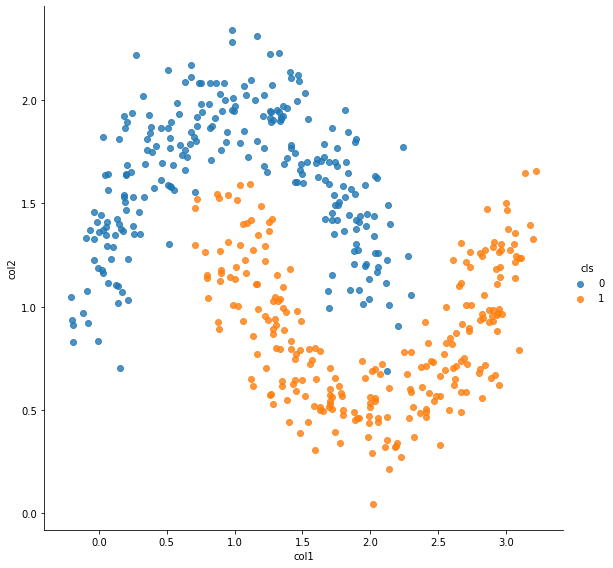
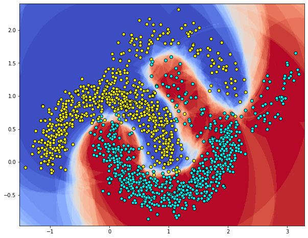
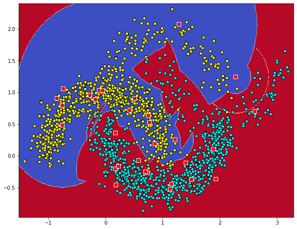
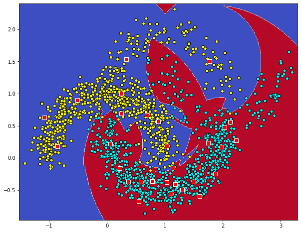

## Compare different classifier with moon2 data
* prepare moon data
* Getting Started with RBFClassifier
* select landmarks on input x
* select landmarks on input x and train landmarks
* Select initial LM with Gaussian Mixture Model
* validation_curve + RBFClassifier
* LogisticRegression
* LGBMClassifier
* Bagging + SimpleRBFClassifier + logit
* Bagging + SimpleRBFClassifier + DecisionTree
* RandomForest


```python
epochs = 100
```


```python
%matplotlib inline
import os, sys

import numpy as np
import pandas as pd
import matplotlib.pyplot as plt
import seaborn as sns
from sklearn import datasets, linear_model
from sklearn.metrics import f1_score, classification_report, confusion_matrix, make_scorer
from sklearn.preprocessing import OneHotEncoder
import keras
from keras.models import Sequential
from keras.layers import Input, Dense
from keras.models import Model
from keras.optimizers import SGD
from keras import regularizers
from keras.wrappers.scikit_learn import KerasClassifier, KerasRegressor
from keras import backend as K
import tensorflow as tf
```

    Using TensorFlow backend.
    /home/admin/miniconda3/envs/da03/lib/python3.6/site-packages/tensorflow/python/framework/dtypes.py:516: FutureWarning: Passing (type, 1) or '1type' as a synonym of type is deprecated; in a future version of numpy, it will be understood as (type, (1,)) / '(1,)type'.
      _np_qint8 = np.dtype([("qint8", np.int8, 1)])
    /home/admin/miniconda3/envs/da03/lib/python3.6/site-packages/tensorflow/python/framework/dtypes.py:517: FutureWarning: Passing (type, 1) or '1type' as a synonym of type is deprecated; in a future version of numpy, it will be understood as (type, (1,)) / '(1,)type'.
      _np_quint8 = np.dtype([("quint8", np.uint8, 1)])
    /home/admin/miniconda3/envs/da03/lib/python3.6/site-packages/tensorflow/python/framework/dtypes.py:518: FutureWarning: Passing (type, 1) or '1type' as a synonym of type is deprecated; in a future version of numpy, it will be understood as (type, (1,)) / '(1,)type'.
      _np_qint16 = np.dtype([("qint16", np.int16, 1)])
    /home/admin/miniconda3/envs/da03/lib/python3.6/site-packages/tensorflow/python/framework/dtypes.py:519: FutureWarning: Passing (type, 1) or '1type' as a synonym of type is deprecated; in a future version of numpy, it will be understood as (type, (1,)) / '(1,)type'.
      _np_quint16 = np.dtype([("quint16", np.uint16, 1)])
    /home/admin/miniconda3/envs/da03/lib/python3.6/site-packages/tensorflow/python/framework/dtypes.py:520: FutureWarning: Passing (type, 1) or '1type' as a synonym of type is deprecated; in a future version of numpy, it will be understood as (type, (1,)) / '(1,)type'.
      _np_qint32 = np.dtype([("qint32", np.int32, 1)])
    /home/admin/miniconda3/envs/da03/lib/python3.6/site-packages/tensorflow/python/framework/dtypes.py:525: FutureWarning: Passing (type, 1) or '1type' as a synonym of type is deprecated; in a future version of numpy, it will be understood as (type, (1,)) / '(1,)type'.
      np_resource = np.dtype([("resource", np.ubyte, 1)])
    /home/admin/miniconda3/envs/da03/lib/python3.6/site-packages/tensorboard/compat/tensorflow_stub/dtypes.py:541: FutureWarning: Passing (type, 1) or '1type' as a synonym of type is deprecated; in a future version of numpy, it will be understood as (type, (1,)) / '(1,)type'.
      _np_qint8 = np.dtype([("qint8", np.int8, 1)])
    /home/admin/miniconda3/envs/da03/lib/python3.6/site-packages/tensorboard/compat/tensorflow_stub/dtypes.py:542: FutureWarning: Passing (type, 1) or '1type' as a synonym of type is deprecated; in a future version of numpy, it will be understood as (type, (1,)) / '(1,)type'.
      _np_quint8 = np.dtype([("quint8", np.uint8, 1)])
    /home/admin/miniconda3/envs/da03/lib/python3.6/site-packages/tensorboard/compat/tensorflow_stub/dtypes.py:543: FutureWarning: Passing (type, 1) or '1type' as a synonym of type is deprecated; in a future version of numpy, it will be understood as (type, (1,)) / '(1,)type'.
      _np_qint16 = np.dtype([("qint16", np.int16, 1)])
    /home/admin/miniconda3/envs/da03/lib/python3.6/site-packages/tensorboard/compat/tensorflow_stub/dtypes.py:544: FutureWarning: Passing (type, 1) or '1type' as a synonym of type is deprecated; in a future version of numpy, it will be understood as (type, (1,)) / '(1,)type'.
      _np_quint16 = np.dtype([("quint16", np.uint16, 1)])
    /home/admin/miniconda3/envs/da03/lib/python3.6/site-packages/tensorboard/compat/tensorflow_stub/dtypes.py:545: FutureWarning: Passing (type, 1) or '1type' as a synonym of type is deprecated; in a future version of numpy, it will be understood as (type, (1,)) / '(1,)type'.
      _np_qint32 = np.dtype([("qint32", np.int32, 1)])
    /home/admin/miniconda3/envs/da03/lib/python3.6/site-packages/tensorboard/compat/tensorflow_stub/dtypes.py:550: FutureWarning: Passing (type, 1) or '1type' as a synonym of type is deprecated; in a future version of numpy, it will be understood as (type, (1,)) / '(1,)type'.
      np_resource = np.dtype([("resource", np.ubyte, 1)])


```python
sys.path.append('/home/admin/github/wordroid.sblo.jp/lib')

from keras_ex.gkernel.sklearn import (
    RBFClassifier, make_model_gkernel3, make_model_gkernel1,
    SimpleRBFClassifier
)
```

## prepare moon data


```python
from sklearn.datasets import make_moons

n_samples = 2500
X1, y1 = make_moons(n_samples=n_samples, noise=.15, random_state=0)
df = pd.DataFrame(X1)
df.columns = ["col1", "col2"]
df['cls'] = y1

sns.lmplot("col1", "col2", hue="cls", data=df, fit_reg=False, height=8)
```


    <seaborn.axisgrid.FacetGrid at 0x7faa2821b7b8>


```python
n_samples = 500
X2, y2 = make_moons(n_samples=n_samples, noise=.15, random_state=0)
X2[:,0] += 1
X2[:,1] += 1
df = pd.DataFrame(X2)
df.columns = ["col1", "col2"]
df['cls'] = y2

sns.lmplot("col1", "col2", hue="cls", data=df, fit_reg=False, height=8)
```


    <seaborn.axisgrid.FacetGrid at 0x7faa27e4a828>





```python
X = np.r_[X1,X2]
y = np.concatenate([y1, y2])

df = pd.DataFrame(X)
df.columns = ["col1", "col2"]
df['cls'] = y

sns.lmplot("col1", "col2", hue="cls", data=df, fit_reg=False, height=8)
```


    <seaborn.axisgrid.FacetGrid at 0x7faa27e4e2b0>


```python
X.shape, X.min(), X.max()
```


    ((3000, 2), -1.4162335410213718, 3.2229096450864403)


```python
y.shape
```


    (3000,)


```python
N = y.shape[0]
index = np.arange(N)
xtrain = X[index[index % 2 != 0],:]
ytrain = y[index[index % 2 != 0]]
xtest = X[index[index % 2 == 0],:]
yans = y[index[index % 2 == 0]]
```


```python

```


```python
from sklearn.model_selection import StratifiedShuffleSplit, GridSearchCV, validation_curve
from sklearn.feature_selection import RFECV
from sklearn.linear_model import LogisticRegression, Lasso
import pandas as pd
from sklearn.metrics import mean_squared_error, mean_absolute_error, roc_auc_score, r2_score, make_scorer
from sklearn.metrics.pairwise import cosine_similarity, euclidean_distances
import joblib

from lightgbm import LGBMClassifier
from sklearn.ensemble import (
    AdaBoostClassifier, BaggingClassifier,
    RandomForestClassifier
)
from sklearn.tree import DecisionTreeClassifier
```


```python
import warnings
warnings.filterwarnings('ignore')
```


```python
def f1_scorer(estimator, X, y):
    pred = estimator.predict(X)
    s = f1_score(y, pred, average='macro')
    return s
```


```python

```

## Getting Started with RBFClassifier
select landmarks randomly


```python
num_lm = 150
```


```python
lm_init = np.c_[
    np.random.random((num_lm,)) * (X[:,0].max()-X[:,0].min()) + X[:,0].min(),
    np.random.random((num_lm,)) * (X[:,1].max()-X[:,1].min()) + X[:,1].min()
]
lm_init.shape
```


    (150, 2)


```python
X = np.r_[X1, X2, lm_init]
y = list(np.concatenate([y1, y2])) + ['initLM']*lm_init.shape[0]

df = pd.DataFrame(X)
df.columns = ["col1", "col2"]
df['cls'] = y

sns.lmplot("col1", "col2", hue="cls", data=df, fit_reg=False, height=8)
```


    <seaborn.axisgrid.FacetGrid at 0x7faa261c39e8>


```python
clf = RBFClassifier(
    num_lm=num_lm,
    lm=lm_init
)
```


```python
%%time
hst = clf.fit(xtrain, ytrain, epochs=epochs, batch_size=300, verbose=0)
```

    WARNING:tensorflow:From /home/admin/miniconda3/envs/da03/lib/python3.6/site-packages/keras/backend/tensorflow_backend.py:517: The name tf.placeholder is deprecated. Please use tf.compat.v1.placeholder instead.
    
    WARNING:tensorflow:From /home/admin/miniconda3/envs/da03/lib/python3.6/site-packages/keras/backend/tensorflow_backend.py:4138: The name tf.random_uniform is deprecated. Please use tf.random.uniform instead.
    
    WARNING:tensorflow:From /home/admin/miniconda3/envs/da03/lib/python3.6/site-packages/keras/backend/tensorflow_backend.py:174: The name tf.get_default_session is deprecated. Please use tf.compat.v1.get_default_session instead.
    
    WARNING:tensorflow:From /home/admin/miniconda3/envs/da03/lib/python3.6/site-packages/keras/backend/tensorflow_backend.py:181: The name tf.ConfigProto is deprecated. Please use tf.compat.v1.ConfigProto instead.
    
    WARNING:tensorflow:From /home/admin/miniconda3/envs/da03/lib/python3.6/site-packages/keras/backend/tensorflow_backend.py:186: The name tf.Session is deprecated. Please use tf.compat.v1.Session instead.
    
    WARNING:tensorflow:From /home/admin/miniconda3/envs/da03/lib/python3.6/site-packages/keras/optimizers.py:790: The name tf.train.Optimizer is deprecated. Please use tf.compat.v1.train.Optimizer instead.
    
    WARNING:tensorflow:From /home/admin/miniconda3/envs/da03/lib/python3.6/site-packages/tensorflow/python/ops/math_grad.py:1250: add_dispatch_support.<locals>.wrapper (from tensorflow.python.ops.array_ops) is deprecated and will be removed in a future version.
    Instructions for updating:
    Use tf.where in 2.0, which has the same broadcast rule as np.where
    CPU times: user 4.07 s, sys: 62.5 ms, total: 4.13 s
    Wall time: 3.27 s


```python
fig, ax = plt.subplots(1, 3, figsize=(20,5))
ax[0].set_title('loss')
ax[0].plot(list(range(len(hst["loss"]))), hst["loss"], label="Train loss")
ax[1].set_title('accuracy')
ax[1].plot(list(range(len(hst["loss"]))), hst["acc"], label="accuracy")
ax[2].set_title('learning rate')
ax[2].plot(list(range(len(hst["loss"]))), hst["lr"], label="learning rate")
ax[0].legend()
ax[1].legend()
ax[2].legend()
```


    <matplotlib.legend.Legend at 0x7fa9ed47ed30>


```python
clf.current_gamma()
```


    3.229707


```python
print('F1_SCORE :', f1_score(ytrain, clf.predict(xtrain), average='macro'))
print(classification_report(ytrain, clf.predict(xtrain)))
print(confusion_matrix(ytrain, clf.predict(xtrain)))
```

    F1_SCORE : 0.9879807692307693
                  precision    recall  f1-score   support
    
               0       0.99      0.99      0.99       720
               1       0.99      0.99      0.99       780
    
        accuracy                           0.99      1500
       macro avg       0.99      0.99      0.99      1500
    weighted avg       0.99      0.99      0.99      1500
    
    [[711   9]
     [  9 771]]


```python
print('F1_SCORE :', f1_score(yans, clf.predict(xtest), average='macro'))
print(classification_report(yans, clf.predict(xtest)))
print(confusion_matrix(yans, clf.predict(xtest)))
```

    F1_SCORE : 0.9873137062272788
                  precision    recall  f1-score   support
    
               0       0.99      0.99      0.99       780
               1       0.99      0.99      0.99       720
    
        accuracy                           0.99      1500
       macro avg       0.99      0.99      0.99      1500
    weighted avg       0.99      0.99      0.99      1500
    
    [[770  10]
     [  9 711]]


```python
'''
same as lm_init
'''
lm = clf.current_lm()
lm.shape
```


    (150, 2)


```python
from matplotlib.colors import ListedColormap

h = .01
x_min, x_max = xtrain[:, 0].min() - .1, xtrain[:, 0].max() + .1
y_min, y_max = xtrain[:, 1].min() - .1, xtrain[:, 1].max() + .1
xx, yy = np.meshgrid(np.arange(x_min, x_max, h),
                     np.arange(y_min, y_max, h))
y_pred = clf.predict_proba(np.c_[xx.ravel(), yy.ravel()])
y_pred

#cm = plt.cm.coolwarm
cm = plt.cm.nipy_spectral
cm_bright = ListedColormap(['#FFFF00', '#00FFFF'])
y_pred = y_pred[:,1].reshape(xx.shape)
plt.figure(figsize=(10, 8))
plt.contourf(xx, yy, y_pred, 100, cmap=cm, alpha=1)
plt.scatter(xtrain[:,0], xtrain[:,1], c=ytrain, cmap=cm_bright, edgecolors='k')
plt.scatter(lm[:,0], lm[:,1], c='red', s=64, marker='s', edgecolors='w')
```


    <matplotlib.collections.PathCollection at 0x7fa9ed3d25f8>


```python

```

## select landmarks on input x


```python
clf = RBFClassifier(
    num_lm=num_lm,
    lm_select_from_x=True
)
```


```python
%%time
hst = clf.fit(xtrain, ytrain, epochs=epochs, batch_size=300, verbose=0)
```

    CPU times: user 4.1 s, sys: 56.8 ms, total: 4.16 s
    Wall time: 3.39 s


```python
fig, ax = plt.subplots(1, 3, figsize=(20,5))
ax[0].set_title('loss')
ax[0].plot(list(range(len(hst["loss"]))), hst["loss"], label="Train loss")
ax[1].set_title('accuracy')
ax[1].plot(list(range(len(hst["loss"]))), hst["acc"], label="accuracy")
ax[2].set_title('learning rate')
ax[2].plot(list(range(len(hst["loss"]))), hst["lr"], label="learning rate")
ax[0].legend()
ax[1].legend()
ax[2].legend()
```


    <matplotlib.legend.Legend at 0x7fa9ecb545c0>


```python
clf.current_gamma()
```


    4.2564797


```python
print('F1_SCORE :', f1_score(ytrain, clf.predict(xtrain), average='macro'))
print(classification_report(ytrain, clf.predict(xtrain)))
print(confusion_matrix(ytrain, clf.predict(xtrain)))
```

    F1_SCORE : 0.9853113722027067
                  precision    recall  f1-score   support
    
               0       0.98      0.99      0.98       720
               1       0.99      0.98      0.99       780
    
        accuracy                           0.99      1500
       macro avg       0.99      0.99      0.99      1500
    weighted avg       0.99      0.99      0.99      1500
    
    [[710  10]
     [ 12 768]]


```python
print('F1_SCORE :', f1_score(yans, clf.predict(xtest), average='macro'))
print(classification_report(yans, clf.predict(xtest)))
print(confusion_matrix(yans, clf.predict(xtest)))
```

    F1_SCORE : 0.9879820318022146
                  precision    recall  f1-score   support
    
               0       0.99      0.99      0.99       780
               1       0.99      0.99      0.99       720
    
        accuracy                           0.99      1500
       macro avg       0.99      0.99      0.99      1500
    weighted avg       0.99      0.99      0.99      1500
    
    [[770  10]
     [  8 712]]


```python
lm = clf.current_lm()
lm.shape
```


    (150, 2)


```python
from matplotlib.colors import ListedColormap

h = .01
x_min, x_max = xtrain[:, 0].min() - .1, xtrain[:, 0].max() + .1
y_min, y_max = xtrain[:, 1].min() - .1, xtrain[:, 1].max() + .1
xx, yy = np.meshgrid(np.arange(x_min, x_max, h),
                     np.arange(y_min, y_max, h))
y_pred = clf.predict_proba(np.c_[xx.ravel(), yy.ravel()])
y_pred

#cm = plt.cm.coolwarm
cm = plt.cm.nipy_spectral
cm_bright = ListedColormap(['#FFFF00', '#00FFFF'])
y_pred = y_pred[:,1].reshape(xx.shape)
plt.figure(figsize=(10, 8))
plt.contourf(xx, yy, y_pred, 100, cmap=cm, alpha=1)
plt.scatter(xtrain[:,0], xtrain[:,1], c=ytrain, cmap=cm_bright, edgecolors='k')
plt.scatter(lm[:,0], lm[:,1], c='red', s=64, marker='s', edgecolors='w')
```


    <matplotlib.collections.PathCollection at 0x7fa9eca3cef0>


```python

```

## select landmarks on input x and train landmarks


```python
clf = RBFClassifier(
    num_lm=num_lm,
    lm_select_from_x=True,
    make_model_gkernel=make_model_gkernel3
)
```


```python
%%time
hst = clf.fit(xtrain, ytrain, epochs=epochs, batch_size=300, verbose=0)
```

    CPU times: user 4.93 s, sys: 86.1 ms, total: 5.01 s
    Wall time: 4.18 s


```python
fig, ax = plt.subplots(1, 3, figsize=(20,5))
ax[0].set_title('loss')
ax[0].plot(list(range(len(hst["loss"]))), hst["loss"], label="Train loss")
ax[1].set_title('accuracy')
ax[1].plot(list(range(len(hst["loss"]))), hst["acc"], label="accuracy")
ax[2].set_title('learning rate')
ax[2].plot(list(range(len(hst["loss"]))), hst["lr"], label="learning rate")
ax[0].legend()
ax[1].legend()
ax[2].legend()
```


    <matplotlib.legend.Legend at 0x7fa9ec169cf8>


```python
clf.current_gamma()
```


    4.129294


```python
print('F1_SCORE :', f1_score(ytrain, clf.predict(xtrain), average='macro'))
print(classification_report(ytrain, clf.predict(xtrain)))
print(confusion_matrix(ytrain, clf.predict(xtrain)))
```

    F1_SCORE : 0.9886478928040552
                  precision    recall  f1-score   support
    
               0       0.99      0.99      0.99       720
               1       0.99      0.99      0.99       780
    
        accuracy                           0.99      1500
       macro avg       0.99      0.99      0.99      1500
    weighted avg       0.99      0.99      0.99      1500
    
    [[711   9]
     [  8 772]]


```python
print('F1_SCORE :', f1_score(yans, clf.predict(xtest), average='macro'))
print(classification_report(yans, clf.predict(xtest)))
print(confusion_matrix(yans, clf.predict(xtest)))
```

    F1_SCORE : 0.9893184456202067
                  precision    recall  f1-score   support
    
               0       0.99      0.99      0.99       780
               1       0.99      0.99      0.99       720
    
        accuracy                           0.99      1500
       macro avg       0.99      0.99      0.99      1500
    weighted avg       0.99      0.99      0.99      1500
    
    [[770  10]
     [  6 714]]


```python
lm = clf.current_lm()
lm.shape
```


    (150, 2)


```python
from matplotlib.colors import ListedColormap

h = .01
x_min, x_max = xtrain[:, 0].min() - .1, xtrain[:, 0].max() + .1
y_min, y_max = xtrain[:, 1].min() - .1, xtrain[:, 1].max() + .1
xx, yy = np.meshgrid(np.arange(x_min, x_max, h),
                     np.arange(y_min, y_max, h))
y_pred = clf.predict_proba(np.c_[xx.ravel(), yy.ravel()])
y_pred

#cm = plt.cm.coolwarm
cm = plt.cm.nipy_spectral
cm_bright = ListedColormap(['#FFFF00', '#00FFFF'])
y_pred = y_pred[:,1].reshape(xx.shape)
plt.figure(figsize=(10, 8))
plt.contourf(xx, yy, y_pred, 100, cmap=cm, alpha=1)
plt.scatter(xtrain[:,0], xtrain[:,1], c=ytrain, cmap=cm_bright, edgecolors='k')
plt.scatter(lm[:,0], lm[:,1], c='red', s=64, marker='s', edgecolors='w')
```


    <matplotlib.collections.PathCollection at 0x7fa9ec0af128>


```python

```

## Select initial LM with Gaussian Mixture Model
not train landmarks


```python
from sklearn.mixture import GaussianMixture, BayesianGaussianMixture
gm = GaussianMixture(n_components=num_lm, covariance_type='tied')
gm.fit(xtrain)
lm_init = gm.means_
lm_init.shape
```


    (150, 2)


```python
X = np.r_[X1, X2, lm_init]
y = ['c'+ str(ee) for ee in np.concatenate([y1, y2])] + ['initLM']*lm_init.shape[0]

df = pd.DataFrame(X)
df.columns = ["col1", "col2"]
df['cls'] = y

#sns.lmplot("col1", "col2", hue="cls", data=df, fit_reg=False, height=8)
sns.lmplot("col1", "col2", hue="cls", data=df, fit_reg=False, height=8,
           palette=dict(c0="dodgerblue", c1="orange", initLM='r'))
```


    <seaborn.axisgrid.FacetGrid at 0x7fa9df509ba8>


```python
clf = RBFClassifier(
    num_lm=num_lm,
    lm=lm_init
)
```


```python
%%time
hst = clf.fit(xtrain, ytrain, epochs=epochs, batch_size=300, verbose=0)
```

    CPU times: user 4.65 s, sys: 53.8 ms, total: 4.7 s
    Wall time: 4.03 s


```python
fig, ax = plt.subplots(1, 3, figsize=(20,5))
ax[0].set_title('loss')
ax[0].plot(list(range(len(hst["loss"]))), hst["loss"], label="Train loss")
ax[1].set_title('accuracy')
ax[1].plot(list(range(len(hst["loss"]))), hst["acc"], label="accuracy")
ax[2].set_title('learning rate')
ax[2].plot(list(range(len(hst["loss"]))), hst["lr"], label="learning rate")
ax[0].legend()
ax[1].legend()
ax[2].legend()
```


    <matplotlib.legend.Legend at 0x7fa9dedaa7b8>


```python
clf.current_gamma()
```


    4.5026402


```python
print('F1_SCORE :', f1_score(ytrain, clf.predict(xtrain), average='macro'))
print(classification_report(ytrain, clf.predict(xtrain)))
print(confusion_matrix(ytrain, clf.predict(xtrain)))
```

    F1_SCORE : 0.9886466393384598
                  precision    recall  f1-score   support
    
               0       0.99      0.99      0.99       720
               1       0.99      0.99      0.99       780
    
        accuracy                           0.99      1500
       macro avg       0.99      0.99      0.99      1500
    weighted avg       0.99      0.99      0.99      1500
    
    [[710  10]
     [  7 773]]


```python
print('F1_SCORE :', f1_score(yans, clf.predict(xtest), average='macro'))
print(classification_report(yans, clf.predict(xtest)))
print(confusion_matrix(yans, clf.predict(xtest)))
```

    F1_SCORE : 0.9873150162167503
                  precision    recall  f1-score   support
    
               0       0.99      0.99      0.99       780
               1       0.98      0.99      0.99       720
    
        accuracy                           0.99      1500
       macro avg       0.99      0.99      0.99      1500
    weighted avg       0.99      0.99      0.99      1500
    
    [[769  11]
     [  8 712]]


```python
lm = clf.current_lm()
lm.shape
```


    (150, 2)


```python
from matplotlib.colors import ListedColormap

h = .01
x_min, x_max = xtrain[:, 0].min() - .1, xtrain[:, 0].max() + .1
y_min, y_max = xtrain[:, 1].min() - .1, xtrain[:, 1].max() + .1
xx, yy = np.meshgrid(np.arange(x_min, x_max, h),
                     np.arange(y_min, y_max, h))
y_pred = clf.predict_proba(np.c_[xx.ravel(), yy.ravel()])
y_pred

#cm = plt.cm.coolwarm
cm = plt.cm.nipy_spectral
cm_bright = ListedColormap(['#FFFF00', '#00FFFF'])
y_pred = y_pred[:,1].reshape(xx.shape)
plt.figure(figsize=(10, 8))
plt.contourf(xx, yy, y_pred, 100, cmap=cm, alpha=1)
plt.scatter(xtrain[:,0], xtrain[:,1], c=ytrain, cmap=cm_bright, edgecolors='k')
plt.scatter(lm[:,0], lm[:,1], c='red', s=64, marker='s', edgecolors='w')
```


    <matplotlib.collections.PathCollection at 0x7fa9deced0b8>


```python

```

## validation_curve + RBFClassifier
* looking for valid num_lm


```python
cv_splitter = StratifiedShuffleSplit(n_splits=3, test_size=0.35, random_state=0)
cv_splitter.get_n_splits(xtrain, ytrain)
```


    3


```python
param_name = "num_lm"
param_range = [2, 5, 10, 20, 50, 100, 150, 200, 250, 300]
param_range
```


    [2, 5, 10, 20, 50, 100, 150, 200, 250, 300]


```python
%%time

def f1_scorer_2(estimator, X, y):
    pred = estimator.predict(X)
    s = f1_score(np.argmax(y, axis=1), pred, average='macro')
    return s

train_scores, test_scores = validation_curve(
    RBFClassifier(
        num_lm=2,
        lm_select_from_x=True,
        random_state=None,
        lr=0.05, gamma='scale',
        make_model_gkernel=make_model_gkernel3,
        epochs=epochs, batch_size=300, verbose=0
    ),
    xtrain, ytrain,
    param_name=param_name, param_range=param_range,
    cv=cv_splitter, n_jobs=1, verbose=2, scoring=f1_scorer)
```

    [Parallel(n_jobs=1)]: Using backend SequentialBackend with 1 concurrent workers.


    [CV] num_lm=2 ........................................................
    [CV] ......................................... num_lm=2, total=   3.3s
    [CV] num_lm=5 ........................................................


    [Parallel(n_jobs=1)]: Done   1 out of   1 | elapsed:    3.3s remaining:    0.0s


    [CV] ......................................... num_lm=5, total=   4.6s
    [CV] num_lm=10 .......................................................
    [CV] ........................................ num_lm=10, total=   4.4s
    [CV] num_lm=20 .......................................................
    [CV] ........................................ num_lm=20, total=   5.3s
    [CV] num_lm=50 .......................................................
    [CV] ........................................ num_lm=50, total=   5.1s
    [CV] num_lm=100 ......................................................
    [CV] ....................................... num_lm=100, total=   5.9s
    [CV] num_lm=150 ......................................................
    [CV] ....................................... num_lm=150, total=   6.5s
    [CV] num_lm=200 ......................................................
    [CV] ....................................... num_lm=200, total=   7.4s
    [CV] num_lm=250 ......................................................
    [CV] ....................................... num_lm=250, total=   8.3s
    [CV] num_lm=300 ......................................................
    [CV] ....................................... num_lm=300, total=   9.9s
    [CV] num_lm=2 ........................................................
    [CV] ......................................... num_lm=2, total=   6.5s
    [CV] num_lm=5 ........................................................
    [CV] ......................................... num_lm=5, total=   7.2s
    [CV] num_lm=10 .......................................................
    [CV] ........................................ num_lm=10, total=   7.7s
    [CV] num_lm=20 .......................................................
    [CV] ........................................ num_lm=20, total=   7.6s
    [CV] num_lm=50 .......................................................
    [CV] ........................................ num_lm=50, total=   8.5s
    [CV] num_lm=100 ......................................................
    [CV] ....................................... num_lm=100, total=   8.5s
    [CV] num_lm=150 ......................................................
    [CV] ....................................... num_lm=150, total=   9.5s
    [CV] num_lm=200 ......................................................
    [CV] ....................................... num_lm=200, total=  10.2s
    [CV] num_lm=250 ......................................................
    [CV] ....................................... num_lm=250, total=  10.4s
    [CV] num_lm=300 ......................................................
    [CV] ....................................... num_lm=300, total=  11.7s
    [CV] num_lm=2 ........................................................
    [CV] ......................................... num_lm=2, total=   9.5s
    [CV] num_lm=5 ........................................................
    [CV] ......................................... num_lm=5, total=  11.6s
    [CV] num_lm=10 .......................................................
    [CV] ........................................ num_lm=10, total=  11.4s
    [CV] num_lm=20 .......................................................
    [CV] ........................................ num_lm=20, total=  11.6s
    [CV] num_lm=50 .......................................................
    [CV] ........................................ num_lm=50, total=  11.5s
    [CV] num_lm=100 ......................................................
    [CV] ....................................... num_lm=100, total=  12.3s
    [CV] num_lm=150 ......................................................
    [CV] ....................................... num_lm=150, total=  13.0s
    [CV] num_lm=200 ......................................................
    [CV] ....................................... num_lm=200, total=  14.5s
    [CV] num_lm=250 ......................................................
    [CV] ....................................... num_lm=250, total=  14.1s
    [CV] num_lm=300 ......................................................
    [CV] ....................................... num_lm=300, total=  15.5s
    CPU times: user 4min 57s, sys: 2.45 s, total: 5min
    Wall time: 4min 34s


    [Parallel(n_jobs=1)]: Done  30 out of  30 | elapsed:  4.6min finished


```python
train_scores_mean = np.mean(train_scores, axis=1)
train_scores_std = np.std(train_scores, axis=1)
test_scores_mean = np.mean(test_scores, axis=1)
test_scores_std = np.std(test_scores, axis=1)
np.c_[param_range, train_scores_mean, test_scores_mean]
```


    array([[  2.        ,   0.86992493,   0.87846182],
           [  5.        ,   0.94665946,   0.93713276],
           [ 10.        ,   0.98356448,   0.98092713],
           [ 20.        ,   0.98904096,   0.98474396],
           [ 50.        ,   0.98972528,   0.98601282],
           [100.        ,   0.98972528,   0.98537738],
           [150.        ,   0.98972528,   0.98537923],
           [200.        ,   0.98972528,   0.98601417],
           [250.        ,   0.98972528,   0.98601417],
           [300.        ,   0.9900681 ,   0.98601417]])


```python
plt.title("Validation Curve")
plt.xlabel("param")
plt.ylabel("Score")
plt.ylim(0.0, 1.1)
lw = 2
plt.semilogx(param_range, train_scores_mean, label="Training score",
             color="darkorange", lw=lw)
plt.fill_between(param_range, train_scores_mean - train_scores_std,
                 train_scores_mean + train_scores_std, alpha=0.2,
                 color="darkorange", lw=lw)
plt.semilogx(param_range, test_scores_mean, label="Cross-validation score",
             color="navy", lw=lw)
plt.fill_between(param_range, test_scores_mean - test_scores_std,
                 test_scores_mean + test_scores_std, alpha=0.2,
                 color="navy", lw=lw)
plt.legend(loc="best")
```


    <matplotlib.legend.Legend at 0x7fa9cf806ef0>


```python
%%time
'''test data'''
est = RBFClassifier(
    num_lm=50,
    lm_select_from_x=True,
    random_state=None,
    lr=0.05, gamma='scale',
    make_model_gkernel=make_model_gkernel3,
    epochs=epochs, batch_size=300, verbose=0
)
hst = est.fit(xtrain, ytrain)
```

    CPU times: user 12.9 s, sys: 98.3 ms, total: 13 s
    Wall time: 12.4 s


```python
fig, ax = plt.subplots(1, 3, figsize=(20,5))
ax[0].set_title('loss')
ax[0].plot(list(range(len(hst["loss"]))), hst["loss"], label="Train loss")
ax[1].set_title('accuracy')
ax[1].plot(list(range(len(hst["loss"]))), hst["acc"], label="accuracy")
ax[2].set_title('learning rate')
ax[2].plot(list(range(len(hst["loss"]))), hst["lr"], label="learning rate")
ax[0].legend()
ax[1].legend()
ax[2].legend()
```


    <matplotlib.legend.Legend at 0x7fa9cef598d0>


```python
pred = est.predict(xtrain)
```


```python
print('F1_SCORE :', f1_score(ytrain, pred, average='macro'))
print(classification_report(ytrain, pred))
print(confusion_matrix(ytrain, pred))
```

    F1_SCORE : 0.989313879845265
                  precision    recall  f1-score   support
    
               0       0.99      0.99      0.99       720
               1       0.99      0.99      0.99       780
    
        accuracy                           0.99      1500
       macro avg       0.99      0.99      0.99      1500
    weighted avg       0.99      0.99      0.99      1500
    
    [[710  10]
     [  6 774]]


```python
pred_test = est.predict(xtest)
```


```python
print('F1_SCORE :', f1_score(yans, pred_test, average='macro'))
print(classification_report(yans, pred_test))
print(confusion_matrix(yans, pred_test))
```

    F1_SCORE : 0.9893184456202067
                  precision    recall  f1-score   support
    
               0       0.99      0.99      0.99       780
               1       0.99      0.99      0.99       720
    
        accuracy                           0.99      1500
       macro avg       0.99      0.99      0.99      1500
    weighted avg       0.99      0.99      0.99      1500
    
    [[770  10]
     [  6 714]]


```python
lm = est.current_lm()
lm.shape
```


    (50, 2)


```python
from matplotlib.colors import ListedColormap

h = .01
x_min, x_max = xtrain[:, 0].min() - .1, xtrain[:, 0].max() + .1
y_min, y_max = xtrain[:, 1].min() - .1, xtrain[:, 1].max() + .1
xx, yy = np.meshgrid(np.arange(x_min, x_max, h),
                     np.arange(y_min, y_max, h))
y_pred = est.predict_proba(np.c_[xx.ravel(), yy.ravel()])
y_pred

#cm = plt.cm.coolwarm
#cm = plt.cm.gist_earth
#cm = plt.cm.gist_stern
#cm = plt.cm.BrBG
#cm = plt.cm.ocean
#cm = plt.cm.gnuplot
cm = plt.cm.nipy_spectral
cm_bright = ListedColormap(['#FFFF00', '#00FFFF'])
y_pred = y_pred[:,1].reshape(xx.shape)
plt.figure(figsize=(10, 8))
plt.contourf(xx, yy, y_pred, 100, cmap=cm, alpha=1)
plt.scatter(xtrain[:,0], xtrain[:,1], c=ytrain, cmap=cm_bright, edgecolors='k')
plt.scatter(lm[:,0], lm[:,1], c='red', s=64, marker='s', edgecolors='w')
```


    <matplotlib.collections.PathCollection at 0x7fa9cee95198>


```python

```

## LogisticRegression


```python
cv_splitter = StratifiedShuffleSplit(n_splits=3, test_size=0.35, random_state=0)
cv_splitter.get_n_splits(xtrain, ytrain)
```


    3


```python
param_name = "C"
param_range = np.logspace(-3, 3, 7)
param_range
```


    array([1.e-03, 1.e-02, 1.e-01, 1.e+00, 1.e+01, 1.e+02, 1.e+03])


```python
%%time

train_scores, test_scores = validation_curve(
    LogisticRegression(penalty='l1', multi_class='multinomial', solver='saga', max_iter=10000),
    xtrain, ytrain,
    param_name=param_name, param_range=param_range,
    cv=cv_splitter, n_jobs=1, verbose=2, scoring=f1_scorer)
```

    [CV] C=0.001 .........................................................
    [CV] .......................................... C=0.001, total=   0.0s
    [CV] C=0.01 ..........................................................
    [CV] ........................................... C=0.01, total=   0.0s
    [CV] C=0.1 ...........................................................
    [CV] ............................................ C=0.1, total=   0.0s
    [CV] C=1.0 ...........................................................
    [CV] ............................................ C=1.0, total=   0.0s
    [CV] C=10.0 ..........................................................
    [CV] ........................................... C=10.0, total=   0.0s
    [CV] C=100.0 .........................................................
    [CV] .......................................... C=100.0, total=   0.0s
    [CV] C=1000.0 ........................................................
    [CV] ......................................... C=1000.0, total=   0.0s
    [CV] C=0.001 .........................................................
    [CV] .......................................... C=0.001, total=   0.0s
    [CV] C=0.01 ..........................................................
    [CV] ........................................... C=0.01, total=   0.0s
    [CV] C=0.1 ...........................................................
    [CV] ............................................ C=0.1, total=   0.0s
    [CV] C=1.0 ...........................................................
    [CV] ............................................ C=1.0, total=   0.0s
    [CV] C=10.0 ..........................................................
    [CV] ........................................... C=10.0, total=   0.0s
    [CV] C=100.0 .........................................................
    [CV] .......................................... C=100.0, total=   0.0s
    [CV] C=1000.0 ........................................................
    [CV] ......................................... C=1000.0, total=   0.0s
    [CV] C=0.001 .........................................................
    [CV] .......................................... C=0.001, total=   0.0s
    [CV] C=0.01 ..........................................................
    [CV] ........................................... C=0.01, total=   0.0s
    [CV] C=0.1 ...........................................................
    [CV] ............................................ C=0.1, total=   0.0s
    [CV] C=1.0 ...........................................................
    [CV] ............................................ C=1.0, total=   0.0s
    [CV] C=10.0 ..........................................................
    [CV] ........................................... C=10.0, total=   0.0s
    [CV] C=100.0 .........................................................
    [CV] .......................................... C=100.0, total=   0.0s
    [CV] C=1000.0 ........................................................
    [CV] ......................................... C=1000.0, total=   0.0s
    CPU times: user 143 ms, sys: 2.03 ms, total: 145 ms
    Wall time: 141 ms


    [Parallel(n_jobs=1)]: Using backend SequentialBackend with 1 concurrent workers.
    [Parallel(n_jobs=1)]: Done   1 out of   1 | elapsed:    0.0s remaining:    0.0s
    [Parallel(n_jobs=1)]: Done  21 out of  21 | elapsed:    0.1s finished


```python
train_scores_mean = np.mean(train_scores, axis=1)
train_scores_std = np.std(train_scores, axis=1)
test_scores_mean = np.mean(test_scores, axis=1)
test_scores_std = np.std(test_scores, axis=1)
np.c_[param_range, train_scores_mean, test_scores_mean]
```


    array([[1.00000000e-03, 3.30251304e-01, 3.30251304e-01],
           [1.00000000e-02, 8.32342982e-01, 8.44029982e-01],
           [1.00000000e-01, 8.55494121e-01, 8.70265545e-01],
           [1.00000000e+00, 8.57556721e-01, 8.74090601e-01],
           [1.00000000e+01, 8.57556420e-01, 8.74090601e-01],
           [1.00000000e+02, 8.57556420e-01, 8.74090601e-01],
           [1.00000000e+03, 8.57556420e-01, 8.74090601e-01]])


```python
plt.title("Validation Curve")
plt.xlabel("param")
plt.ylabel("Score")
plt.ylim(0.0, 1.1)
lw = 2
plt.semilogx(param_range, train_scores_mean, label="Training score",
             color="darkorange", lw=lw)
plt.fill_between(param_range, train_scores_mean - train_scores_std,
                 train_scores_mean + train_scores_std, alpha=0.2,
                 color="darkorange", lw=lw)
plt.semilogx(param_range, test_scores_mean, label="Cross-validation score",
             color="navy", lw=lw)
plt.fill_between(param_range, test_scores_mean - test_scores_std,
                 test_scores_mean + test_scores_std, alpha=0.2,
                 color="navy", lw=lw)
plt.legend(loc="best")
```


    <matplotlib.legend.Legend at 0x7fa9ced70eb8>


```python
'''test data'''
est = LogisticRegression(penalty='l1', multi_class='multinomial', solver='saga', max_iter=10000, C=1.0)
est.fit(xtrain, ytrain)
```


    LogisticRegression(C=1.0, class_weight=None, dual=False, fit_intercept=True,
                       intercept_scaling=1, l1_ratio=None, max_iter=10000,
                       multi_class='multinomial', n_jobs=None, penalty='l1',
                       random_state=None, solver='saga', tol=0.0001, verbose=0,
                       warm_start=False)


```python
pred = est.predict(xtrain)
```


```python
print('F1_SCORE :', f1_score(ytrain, pred, average='macro'))
print(classification_report(ytrain, pred))
print(confusion_matrix(ytrain, pred))
```

    F1_SCORE : 0.8637820512820513
                  precision    recall  f1-score   support
    
               0       0.86      0.86      0.86       720
               1       0.87      0.87      0.87       780
    
        accuracy                           0.86      1500
       macro avg       0.86      0.86      0.86      1500
    weighted avg       0.86      0.86      0.86      1500
    
    [[618 102]
     [102 678]]


```python
pred_test = est.predict(xtest)
```


```python
print('F1_SCORE :', f1_score(yans, pred_test, average='macro'))
print(classification_report(yans, pred_test))
print(confusion_matrix(yans, pred_test))
```

    F1_SCORE : 0.8512110618904157
                  precision    recall  f1-score   support
    
               0       0.87      0.85      0.86       780
               1       0.84      0.86      0.85       720
    
        accuracy                           0.85      1500
       macro avg       0.85      0.85      0.85      1500
    weighted avg       0.85      0.85      0.85      1500
    
    [[660 120]
     [103 617]]


```python
from matplotlib.colors import ListedColormap

h = .01
x_min, x_max = xtrain[:, 0].min() - .1, xtrain[:, 0].max() + .1
y_min, y_max = xtrain[:, 1].min() - .1, xtrain[:, 1].max() + .1
xx, yy = np.meshgrid(np.arange(x_min, x_max, h),
                     np.arange(y_min, y_max, h))
y_pred = est.predict_proba(np.c_[xx.ravel(), yy.ravel()])
y_pred

cm = plt.cm.coolwarm
cm_bright = ListedColormap(['#FFFF00', '#00FFFF'])
y_pred = y_pred[:,1].reshape(xx.shape)
plt.figure(figsize=(10, 8))
plt.contourf(xx, yy, y_pred, 100, cmap=cm, alpha=1)
plt.scatter(xtrain[:,0], xtrain[:,1], c=ytrain, cmap=cm_bright, edgecolors='k')
```


    <matplotlib.collections.PathCollection at 0x7fa9cea9d160>


```python

```

## LGBMClassifier


```python
cv_splitter = StratifiedShuffleSplit(n_splits=3, test_size=0.35, random_state=0)
cv_splitter.get_n_splits(xtrain, ytrain)
```


    3


```python
param_name = "reg_alpha"
param_range = np.logspace(-3, 3, 7)
param_range
```


    array([1.e-03, 1.e-02, 1.e-01, 1.e+00, 1.e+01, 1.e+02, 1.e+03])


```python
%%time

train_scores, test_scores = validation_curve(
    LGBMClassifier(
        min_child_samples=20,
        reg_alpha=0.1
    ),
    xtrain, ytrain,
    param_name=param_name, param_range=param_range,
    cv=cv_splitter, n_jobs=1, verbose=2, scoring=f1_scorer)
```

    [Parallel(n_jobs=1)]: Using backend SequentialBackend with 1 concurrent workers.
    [Parallel(n_jobs=1)]: Done   1 out of   1 | elapsed:    0.1s remaining:    0.0s


    [CV] reg_alpha=0.001 .................................................
    [CV] .................................. reg_alpha=0.001, total=   0.1s
    [CV] reg_alpha=0.01 ..................................................
    [CV] ................................... reg_alpha=0.01, total=   0.0s
    [CV] reg_alpha=0.1 ...................................................
    [CV] .................................... reg_alpha=0.1, total=   0.0s
    [CV] reg_alpha=1.0 ...................................................
    [CV] .................................... reg_alpha=1.0, total=   0.0s
    [CV] reg_alpha=10.0 ..................................................
    [CV] ................................... reg_alpha=10.0, total=   0.0s
    [CV] reg_alpha=100.0 .................................................
    [CV] .................................. reg_alpha=100.0, total=   0.0s
    [CV] reg_alpha=1000.0 ................................................
    [CV] ................................. reg_alpha=1000.0, total=   0.0s
    [CV] reg_alpha=0.001 .................................................
    [CV] .................................. reg_alpha=0.001, total=   0.0s
    [CV] reg_alpha=0.01 ..................................................
    [CV] ................................... reg_alpha=0.01, total=   0.0s
    [CV] reg_alpha=0.1 ...................................................
    [CV] .................................... reg_alpha=0.1, total=   0.0s
    [CV] reg_alpha=1.0 ...................................................
    [CV] .................................... reg_alpha=1.0, total=   0.0s
    [CV] reg_alpha=10.0 ..................................................
    [CV] ................................... reg_alpha=10.0, total=   0.0s
    [CV] reg_alpha=100.0 .................................................
    [CV] .................................. reg_alpha=100.0, total=   0.0s
    [CV] reg_alpha=1000.0 ................................................
    [CV] ................................. reg_alpha=1000.0, total=   0.0s
    [CV] reg_alpha=0.001 .................................................
    [CV] .................................. reg_alpha=0.001, total=   0.0s
    [CV] reg_alpha=0.01 ..................................................
    [CV] ................................... reg_alpha=0.01, total=   0.0s
    [CV] reg_alpha=0.1 ...................................................
    [CV] .................................... reg_alpha=0.1, total=   0.0s
    [CV] reg_alpha=1.0 ...................................................
    [CV] .................................... reg_alpha=1.0, total=   0.0s
    [CV] reg_alpha=10.0 ..................................................
    [CV] ................................... reg_alpha=10.0, total=   0.0s
    [CV] reg_alpha=100.0 .................................................
    [CV] .................................. reg_alpha=100.0, total=   0.0s
    [CV] reg_alpha=1000.0 ................................................
    [CV] ................................. reg_alpha=1000.0, total=   0.0s
    CPU times: user 619 ms, sys: 3.92 ms, total: 623 ms
    Wall time: 616 ms


    [Parallel(n_jobs=1)]: Done  21 out of  21 | elapsed:    0.6s finished


```python
train_scores_mean = np.mean(train_scores, axis=1)
train_scores_std = np.std(train_scores, axis=1)
test_scores_mean = np.mean(test_scores, axis=1)
test_scores_std = np.std(test_scores, axis=1)
np.c_[param_range, train_scores_mean, test_scores_mean]
```


    array([[1.00000000e-03, 1.00000000e+00, 9.71384753e-01],
           [1.00000000e-02, 1.00000000e+00, 9.70112099e-01],
           [1.00000000e-01, 1.00000000e+00, 9.72657400e-01],
           [1.00000000e+00, 9.95205303e-01, 9.73927975e-01],
           [1.00000000e+01, 9.59274856e-01, 9.48517685e-01],
           [1.00000000e+02, 8.50759366e-01, 8.32541210e-01],
           [1.00000000e+03, 3.42105263e-01, 3.42105263e-01]])


```python
plt.title("Validation Curve")
plt.xlabel("param")
plt.ylabel("Score")
plt.ylim(0.0, 1.1)
lw = 2
plt.semilogx(param_range, train_scores_mean, label="Training score",
             color="darkorange", lw=lw)
plt.fill_between(param_range, train_scores_mean - train_scores_std,
                 train_scores_mean + train_scores_std, alpha=0.2,
                 color="darkorange", lw=lw)
plt.semilogx(param_range, test_scores_mean, label="Cross-validation score",
             color="navy", lw=lw)
plt.fill_between(param_range, test_scores_mean - test_scores_std,
                 test_scores_mean + test_scores_std, alpha=0.2,
                 color="navy", lw=lw)
plt.legend(loc="best")
```


    <matplotlib.legend.Legend at 0x7fa9cea7de80>


```python
'''test data'''
est = LGBMClassifier(
        min_child_samples=20,
        reg_alpha=0.1
    )
est.fit(xtrain, ytrain)
```


    LGBMClassifier(boosting_type='gbdt', class_weight=None, colsample_bytree=1.0,
                   importance_type='split', learning_rate=0.1, max_depth=-1,
                   min_child_samples=20, min_child_weight=0.001, min_split_gain=0.0,
                   n_estimators=100, n_jobs=-1, num_leaves=31, objective=None,
                   random_state=None, reg_alpha=0.1, reg_lambda=0.0, silent=True,
                   subsample=1.0, subsample_for_bin=200000, subsample_freq=0)


```python
pred = est.predict(xtrain)
```


```python
print('F1_SCORE :', f1_score(ytrain, pred, average='macro'))
print(classification_report(ytrain, pred))
print(confusion_matrix(ytrain, pred))
```

    F1_SCORE : 1.0
                  precision    recall  f1-score   support
    
               0       1.00      1.00      1.00       720
               1       1.00      1.00      1.00       780
    
        accuracy                           1.00      1500
       macro avg       1.00      1.00      1.00      1500
    weighted avg       1.00      1.00      1.00      1500
    
    [[720   0]
     [  0 780]]


```python
pred_test = est.predict(xtest)
```


```python
print('F1_SCORE :', f1_score(yans, pred_test, average='macro'))
print(classification_report(yans, pred_test))
print(confusion_matrix(yans, pred_test))
```

    F1_SCORE : 0.9879820318022146
                  precision    recall  f1-score   support
    
               0       0.99      0.99      0.99       780
               1       0.99      0.99      0.99       720
    
        accuracy                           0.99      1500
       macro avg       0.99      0.99      0.99      1500
    weighted avg       0.99      0.99      0.99      1500
    
    [[770  10]
     [  8 712]]


```python
from matplotlib.colors import ListedColormap

h = .01
x_min, x_max = xtrain[:, 0].min() - .1, xtrain[:, 0].max() + .1
y_min, y_max = xtrain[:, 1].min() - .1, xtrain[:, 1].max() + .1
xx, yy = np.meshgrid(np.arange(x_min, x_max, h),
                     np.arange(y_min, y_max, h))
y_pred = est.predict_proba(np.c_[xx.ravel(), yy.ravel()])
y_pred

cm = plt.cm.coolwarm
cm_bright = ListedColormap(['#FFFF00', '#00FFFF'])
y_pred = y_pred[:,1].reshape(xx.shape)
plt.figure(figsize=(10, 8))
plt.contourf(xx, yy, y_pred, 100, cmap=cm, alpha=1)
plt.scatter(xtrain[:,0], xtrain[:,1], c=ytrain, cmap=cm_bright, edgecolors='k')
```


    <matplotlib.collections.PathCollection at 0x7fa9ce7516d8>


```python

```

## Bagging + SimpleRBFClassifier + logit


```python
num_lm = 30
ens_clf = BaggingClassifier(
    SimpleRBFClassifier(
        num_lm=num_lm,
        init_lm='select_from_x'
    ),
    n_estimators=30,
    verbose=2
)
```


```python
%%time
ens_clf.fit(xtrain, ytrain)
```

    [Parallel(n_jobs=1)]: Using backend SequentialBackend with 1 concurrent workers.


    Building estimator 1 of 30 for this parallel run (total 30)...
    Building estimator 2 of 30 for this parallel run (total 30)...
    Building estimator 3 of 30 for this parallel run (total 30)...
    Building estimator 4 of 30 for this parallel run (total 30)...
    Building estimator 5 of 30 for this parallel run (total 30)...
    Building estimator 6 of 30 for this parallel run (total 30)...
    Building estimator 7 of 30 for this parallel run (total 30)...
    Building estimator 8 of 30 for this parallel run (total 30)...
    Building estimator 9 of 30 for this parallel run (total 30)...
    Building estimator 10 of 30 for this parallel run (total 30)...
    Building estimator 11 of 30 for this parallel run (total 30)...
    Building estimator 12 of 30 for this parallel run (total 30)...
    Building estimator 13 of 30 for this parallel run (total 30)...
    Building estimator 14 of 30 for this parallel run (total 30)...
    Building estimator 15 of 30 for this parallel run (total 30)...
    Building estimator 16 of 30 for this parallel run (total 30)...
    Building estimator 17 of 30 for this parallel run (total 30)...
    Building estimator 18 of 30 for this parallel run (total 30)...
    Building estimator 19 of 30 for this parallel run (total 30)...
    Building estimator 20 of 30 for this parallel run (total 30)...
    Building estimator 21 of 30 for this parallel run (total 30)...
    Building estimator 22 of 30 for this parallel run (total 30)...
    Building estimator 23 of 30 for this parallel run (total 30)...
    Building estimator 24 of 30 for this parallel run (total 30)...
    Building estimator 25 of 30 for this parallel run (total 30)...
    Building estimator 26 of 30 for this parallel run (total 30)...
    Building estimator 27 of 30 for this parallel run (total 30)...
    Building estimator 28 of 30 for this parallel run (total 30)...
    Building estimator 29 of 30 for this parallel run (total 30)...
    Building estimator 30 of 30 for this parallel run (total 30)...
    CPU times: user 798 ms, sys: 1.73 ms, total: 800 ms
    Wall time: 797 ms


    [Parallel(n_jobs=1)]: Done   1 out of   1 | elapsed:    0.8s remaining:    0.0s
    [Parallel(n_jobs=1)]: Done   1 out of   1 | elapsed:    0.8s finished


    BaggingClassifier(base_estimator=SimpleRBFClassifier(init_gamma=None,
                                                         init_lm='select_from_x',
                                                         logit=LogisticRegression(C=1.0,
                                                                                  class_weight=None,
                                                                                  dual=False,
                                                                                  fit_intercept=True,
                                                                                  intercept_scaling=1,
                                                                                  l1_ratio=None,
                                                                                  max_iter=100,
                                                                                  multi_class='warn',
                                                                                  n_jobs=None,
                                                                                  penalty='none',
                                                                                  random_state=None,
                                                                                  solver='lbfgs',
                                                                                  tol=0.0001,
                                                                                  verbose=0,
                                                                                  warm_start=False),
                                                         num_lm=30,
                                                         random_state=None),
                      bootstrap=True, bootstrap_features=False, max_features=1.0,
                      max_samples=1.0, n_estimators=30, n_jobs=None,
                      oob_score=False, random_state=None, verbose=2,
                      warm_start=False)


```python
ens_clf.estimators_[0].gamma
```


    0.7418404587924001


```python
for iest in ens_clf.estimators_:
    print(f1_score(ytrain, iest.predict(xtrain), average='macro'))
```

    0.9806387089624085
    0.966605874516453
    0.9806387089624085
    0.9826388888888888
    0.9686002247422212
    0.9766417408087475
    0.965954227350104
    0.984641266734898
    0.9806367095047939
    0.9866467020024606
    0.9806302946644254
    0.9792990986426886
    0.9679815573770492
    0.9799759355242923
    0.9813091099398153
    0.9779703824030084
    0.9713139415578265
    0.97862775969053
    0.9786324786324786
    0.9753024998765125
    0.983974358974359
    0.976630511471303
    0.9779659108157999
    0.976630511471303
    0.978642936596218
    0.9813053828034448
    0.9793163359578605
    0.9806424999032126
    0.9819739704132767
    0.9833140443686235


```python
pred = ens_clf.predict(xtrain)
```

    [Parallel(n_jobs=1)]: Using backend SequentialBackend with 1 concurrent workers.
    [Parallel(n_jobs=1)]: Done   1 out of   1 | elapsed:    0.0s remaining:    0.0s
    [Parallel(n_jobs=1)]: Done   1 out of   1 | elapsed:    0.0s finished


```python
print('F1_SCORE :', f1_score(ytrain, pred, average='macro'))
print(classification_report(ytrain, pred))
print(confusion_matrix(ytrain, pred))
```

    F1_SCORE : 0.9826407126031986
                  precision    recall  f1-score   support
    
               0       0.98      0.98      0.98       720
               1       0.98      0.98      0.98       780
    
        accuracy                           0.98      1500
       macro avg       0.98      0.98      0.98      1500
    weighted avg       0.98      0.98      0.98      1500
    
    [[708  12]
     [ 14 766]]


```python
print('F1_SCORE :', f1_score(yans, ens_clf.predict(xtest), average='macro'))
print(classification_report(yans, ens_clf.predict(xtest)))
print(confusion_matrix(yans, ens_clf.predict(xtest)))
```

    F1_SCORE : 0.9853128627277841
                  precision    recall  f1-score   support
    
               0       0.99      0.98      0.99       780
               1       0.98      0.99      0.98       720
    
        accuracy                           0.99      1500
       macro avg       0.99      0.99      0.99      1500
    weighted avg       0.99      0.99      0.99      1500
    
    [[767  13]
     [  9 711]]


    [Parallel(n_jobs=1)]: Using backend SequentialBackend with 1 concurrent workers.
    [Parallel(n_jobs=1)]: Done   1 out of   1 | elapsed:    0.0s remaining:    0.0s
    [Parallel(n_jobs=1)]: Done   1 out of   1 | elapsed:    0.0s finished
    [Parallel(n_jobs=1)]: Using backend SequentialBackend with 1 concurrent workers.
    [Parallel(n_jobs=1)]: Done   1 out of   1 | elapsed:    0.0s remaining:    0.0s
    [Parallel(n_jobs=1)]: Done   1 out of   1 | elapsed:    0.0s finished
    [Parallel(n_jobs=1)]: Using backend SequentialBackend with 1 concurrent workers.
    [Parallel(n_jobs=1)]: Done   1 out of   1 | elapsed:    0.0s remaining:    0.0s
    [Parallel(n_jobs=1)]: Done   1 out of   1 | elapsed:    0.0s finished


```python
from matplotlib.colors import ListedColormap

h = .01
x_min, x_max = xtrain[:, 0].min() - .1, xtrain[:, 0].max() + .1
y_min, y_max = xtrain[:, 1].min() - .1, xtrain[:, 1].max() + .1
xx, yy = np.meshgrid(np.arange(x_min, x_max, h),
                     np.arange(y_min, y_max, h))
y_pred = ens_clf.predict_proba(np.c_[xx.ravel(), yy.ravel()])
y_pred

cm = plt.cm.coolwarm
#cm = plt.cm.gnuplot
cm_bright = ListedColormap(['#FFFF00', '#00FFFF'])
y_pred = y_pred[:,1].reshape(xx.shape)
plt.figure(figsize=(10, 8))
plt.contourf(xx, yy, y_pred, 100, cmap=cm, alpha=1)
plt.scatter(xtrain[:,0], xtrain[:,1], c=ytrain, cmap=cm_bright, edgecolors='k')
```

    [Parallel(n_jobs=1)]: Using backend SequentialBackend with 1 concurrent workers.
    [Parallel(n_jobs=1)]: Done   1 out of   1 | elapsed:    1.2s remaining:    0.0s
    [Parallel(n_jobs=1)]: Done   1 out of   1 | elapsed:    1.2s finished


    <matplotlib.collections.PathCollection at 0x7fa9ccc9f828>


```python
from matplotlib.colors import ListedColormap
idx = 0

h = .01
x_min, x_max = xtrain[:, 0].min() - .1, xtrain[:, 0].max() + .1
y_min, y_max = xtrain[:, 1].min() - .1, xtrain[:, 1].max() + .1
xx, yy = np.meshgrid(np.arange(x_min, x_max, h),
                     np.arange(y_min, y_max, h))
y_pred = ens_clf.estimators_[idx].predict_proba(np.c_[xx.ravel(), yy.ravel()])
y_pred
lm = ens_clf.estimators_[idx].lm

cm = plt.cm.coolwarm
#cm = plt.cm.gnuplot
cm_bright = ListedColormap(['#FFFF00', '#00FFFF'])
y_pred = y_pred[:,1].reshape(xx.shape)
plt.figure(figsize=(10, 8))
plt.contourf(xx, yy, y_pred, 100, cmap=cm, alpha=1)
plt.scatter(xtrain[:,0], xtrain[:,1], c=ytrain, cmap=cm_bright, edgecolors='k')
plt.scatter(lm[:,0], lm[:,1], c='red', s=64, marker='s', edgecolors='w')
```


    <matplotlib.collections.PathCollection at 0x7fa9ccc81d30>


```python
from matplotlib.colors import ListedColormap
idx = 1

h = .01
x_min, x_max = xtrain[:, 0].min() - .1, xtrain[:, 0].max() + .1
y_min, y_max = xtrain[:, 1].min() - .1, xtrain[:, 1].max() + .1
xx, yy = np.meshgrid(np.arange(x_min, x_max, h),
                     np.arange(y_min, y_max, h))
y_pred = ens_clf.estimators_[idx].predict_proba(np.c_[xx.ravel(), yy.ravel()])
y_pred
lm = ens_clf.estimators_[idx].lm

cm = plt.cm.coolwarm
#cm = plt.cm.gnuplot
cm_bright = ListedColormap(['#FFFF00', '#00FFFF'])
y_pred = y_pred[:,1].reshape(xx.shape)
plt.figure(figsize=(10, 8))
plt.contourf(xx, yy, y_pred, 100, cmap=cm, alpha=1)
plt.scatter(xtrain[:,0], xtrain[:,1], c=ytrain, cmap=cm_bright, edgecolors='k')
plt.scatter(lm[:,0], lm[:,1], c='red', s=64, marker='s', edgecolors='w')
```


    <matplotlib.collections.PathCollection at 0x7fa9ccae88d0>


```python
from matplotlib.colors import ListedColormap
idx = 2

h = .01
x_min, x_max = xtrain[:, 0].min() - .1, xtrain[:, 0].max() + .1
y_min, y_max = xtrain[:, 1].min() - .1, xtrain[:, 1].max() + .1
xx, yy = np.meshgrid(np.arange(x_min, x_max, h),
                     np.arange(y_min, y_max, h))
y_pred = ens_clf.estimators_[idx].predict_proba(np.c_[xx.ravel(), yy.ravel()])
y_pred
lm = ens_clf.estimators_[idx].lm

cm = plt.cm.coolwarm
#cm = plt.cm.gnuplot
cm_bright = ListedColormap(['#FFFF00', '#00FFFF'])
y_pred = y_pred[:,1].reshape(xx.shape)
plt.figure(figsize=(10, 8))
plt.contourf(xx, yy, y_pred, 100, cmap=cm, alpha=1)
plt.scatter(xtrain[:,0], xtrain[:,1], c=ytrain, cmap=cm_bright, edgecolors='k')
plt.scatter(lm[:,0], lm[:,1], c='red', s=64, marker='s', edgecolors='w')
```


    <matplotlib.collections.PathCollection at 0x7fa9cc95c9e8>


```python

```

## Bagging + SimpleRBFClassifier + DecisionTree


```python
num_lm = 30
ens_clf = BaggingClassifier(
    SimpleRBFClassifier(
        num_lm=num_lm,
        logit = DecisionTreeClassifier(max_leaf_nodes=int(num_lm/2)),
        init_lm='select_from_x'
    ),
    n_estimators=30,
    verbose=2
)
```


```python
%%time
ens_clf.fit(xtrain, ytrain)
```

    [Parallel(n_jobs=1)]: Using backend SequentialBackend with 1 concurrent workers.


    Building estimator 1 of 30 for this parallel run (total 30)...
    Building estimator 2 of 30 for this parallel run (total 30)...
    Building estimator 3 of 30 for this parallel run (total 30)...
    Building estimator 4 of 30 for this parallel run (total 30)...
    Building estimator 5 of 30 for this parallel run (total 30)...
    Building estimator 6 of 30 for this parallel run (total 30)...
    Building estimator 7 of 30 for this parallel run (total 30)...
    Building estimator 8 of 30 for this parallel run (total 30)...
    Building estimator 9 of 30 for this parallel run (total 30)...
    Building estimator 10 of 30 for this parallel run (total 30)...
    Building estimator 11 of 30 for this parallel run (total 30)...
    Building estimator 12 of 30 for this parallel run (total 30)...
    Building estimator 13 of 30 for this parallel run (total 30)...
    Building estimator 14 of 30 for this parallel run (total 30)...
    Building estimator 15 of 30 for this parallel run (total 30)...
    Building estimator 16 of 30 for this parallel run (total 30)...
    Building estimator 17 of 30 for this parallel run (total 30)...
    Building estimator 18 of 30 for this parallel run (total 30)...
    Building estimator 19 of 30 for this parallel run (total 30)...
    Building estimator 20 of 30 for this parallel run (total 30)...
    Building estimator 21 of 30 for this parallel run (total 30)...
    Building estimator 22 of 30 for this parallel run (total 30)...
    Building estimator 23 of 30 for this parallel run (total 30)...
    Building estimator 24 of 30 for this parallel run (total 30)...
    Building estimator 25 of 30 for this parallel run (total 30)...
    Building estimator 26 of 30 for this parallel run (total 30)...
    Building estimator 27 of 30 for this parallel run (total 30)...
    Building estimator 28 of 30 for this parallel run (total 30)...
    Building estimator 29 of 30 for this parallel run (total 30)...
    Building estimator 30 of 30 for this parallel run (total 30)...
    CPU times: user 373 ms, sys: 973 s, total: 374 ms
    Wall time: 366 ms


    [Parallel(n_jobs=1)]: Done   1 out of   1 | elapsed:    0.4s remaining:    0.0s
    [Parallel(n_jobs=1)]: Done   1 out of   1 | elapsed:    0.4s finished


    BaggingClassifier(base_estimator=SimpleRBFClassifier(init_gamma=None,
                                                         init_lm='select_from_x',
                                                         logit=DecisionTreeClassifier(class_weight=None,
                                                                                      criterion='gini',
                                                                                      max_depth=None,
                                                                                      max_features=None,
                                                                                      max_leaf_nodes=15,
                                                                                      min_impurity_decrease=0.0,
                                                                                      min_impurity_split=None,
                                                                                      min_samples_leaf=1,
                                                                                      min_samples_split=2,
                                                                                      min_weight_fraction_leaf=0.0,
                                                                                      presort=False,
                                                                                      random_state=None,
                                                                                      splitter='best'),
                                                         num_lm=30,
                                                         random_state=None),
                      bootstrap=True, bootstrap_features=False, max_features=1.0,
                      max_samples=1.0, n_estimators=30, n_jobs=None,
                      oob_score=False, random_state=None, verbose=2,
                      warm_start=False)


```python
ens_clf.estimators_[0].gamma
```


    0.8126318934648888


```python
for iest in ens_clf.estimators_:
    print(f1_score(ytrain, iest.predict(xtrain), average='macro'))
```

    0.9846474999232375
    0.9926553036052665
    0.987308011405867
    0.9913180183176458
    0.9886466393384598
    0.9853098290598291
    0.9919844819570689
    0.9846429075382848
    0.9873123507810029
    0.9913180183176458
    0.9679888458911905
    0.9879752878805154
    0.9793013101602968
    0.9886524999432627
    0.9899845049162728
    0.9899811868953925
    0.9886491055717758
    0.9839807484194338
    0.9839726181084483
    0.9859811524382782
    0.9846395708696807
    0.9873186737201538
    0.9846395708696807
    0.981954887218045
    0.984630264301539
    0.9799538135865034
    0.987308011405867
    0.9846489208191336
    0.9859824999299125
    0.9873137062272788


```python
pred = ens_clf.predict(xtrain)
```

    [Parallel(n_jobs=1)]: Using backend SequentialBackend with 1 concurrent workers.
    [Parallel(n_jobs=1)]: Done   1 out of   1 | elapsed:    0.0s remaining:    0.0s
    [Parallel(n_jobs=1)]: Done   1 out of   1 | elapsed:    0.0s finished


```python
print('F1_SCORE :', f1_score(ytrain, pred, average='macro'))
print(classification_report(ytrain, pred))
print(confusion_matrix(ytrain, pred))
```

    F1_SCORE : 0.9939893972968317
                  precision    recall  f1-score   support
    
               0       1.00      0.99      0.99       720
               1       0.99      1.00      0.99       780
    
        accuracy                           0.99      1500
       macro avg       0.99      0.99      0.99      1500
    weighted avg       0.99      0.99      0.99      1500
    
    [[714   6]
     [  3 777]]


```python
print('F1_SCORE :', f1_score(yans, ens_clf.predict(xtest), average='macro'))
print(classification_report(yans, ens_clf.predict(xtest)))
print(confusion_matrix(yans, ens_clf.predict(xtest)))
```

    [Parallel(n_jobs=1)]: Using backend SequentialBackend with 1 concurrent workers.
    [Parallel(n_jobs=1)]: Done   1 out of   1 | elapsed:    0.0s remaining:    0.0s
    [Parallel(n_jobs=1)]: Done   1 out of   1 | elapsed:    0.0s finished
    [Parallel(n_jobs=1)]: Using backend SequentialBackend with 1 concurrent workers.
    [Parallel(n_jobs=1)]: Done   1 out of   1 | elapsed:    0.0s remaining:    0.0s
    [Parallel(n_jobs=1)]: Done   1 out of   1 | elapsed:    0.0s finished
    [Parallel(n_jobs=1)]: Using backend SequentialBackend with 1 concurrent workers.


    F1_SCORE : 0.9879844278184527
                  precision    recall  f1-score   support
    
               0       0.99      0.98      0.99       780
               1       0.98      0.99      0.99       720
    
        accuracy                           0.99      1500
       macro avg       0.99      0.99      0.99      1500
    weighted avg       0.99      0.99      0.99      1500
    
    [[768  12]
     [  6 714]]


    [Parallel(n_jobs=1)]: Done   1 out of   1 | elapsed:    0.0s remaining:    0.0s
    [Parallel(n_jobs=1)]: Done   1 out of   1 | elapsed:    0.0s finished


```python
from matplotlib.colors import ListedColormap

h = .01
x_min, x_max = xtrain[:, 0].min() - .1, xtrain[:, 0].max() + .1
y_min, y_max = xtrain[:, 1].min() - .1, xtrain[:, 1].max() + .1
xx, yy = np.meshgrid(np.arange(x_min, x_max, h),
                     np.arange(y_min, y_max, h))
y_pred = ens_clf.predict_proba(np.c_[xx.ravel(), yy.ravel()])
y_pred

cm = plt.cm.coolwarm
#cm = plt.cm.gnuplot
cm_bright = ListedColormap(['#FFFF00', '#00FFFF'])
y_pred = y_pred[:,1].reshape(xx.shape)
plt.figure(figsize=(10, 8))
plt.contourf(xx, yy, y_pred, 100, cmap=cm, alpha=1)
plt.scatter(xtrain[:,0], xtrain[:,1], c=ytrain, cmap=cm_bright, edgecolors='k')
```

    [Parallel(n_jobs=1)]: Using backend SequentialBackend with 1 concurrent workers.
    [Parallel(n_jobs=1)]: Done   1 out of   1 | elapsed:    1.3s remaining:    0.0s
    [Parallel(n_jobs=1)]: Done   1 out of   1 | elapsed:    1.3s finished


    <matplotlib.collections.PathCollection at 0x7fa9cdfc4908>





```python
from matplotlib.colors import ListedColormap
idx = 0

h = .01
x_min, x_max = xtrain[:, 0].min() - .1, xtrain[:, 0].max() + .1
y_min, y_max = xtrain[:, 1].min() - .1, xtrain[:, 1].max() + .1
xx, yy = np.meshgrid(np.arange(x_min, x_max, h),
                     np.arange(y_min, y_max, h))
y_pred = ens_clf.estimators_[idx].predict_proba(np.c_[xx.ravel(), yy.ravel()])
y_pred
lm = ens_clf.estimators_[idx].lm

cm = plt.cm.coolwarm
#cm = plt.cm.gnuplot
cm_bright = ListedColormap(['#FFFF00', '#00FFFF'])
y_pred = y_pred[:,1].reshape(xx.shape)
plt.figure(figsize=(10, 8))
plt.contourf(xx, yy, y_pred, 100, cmap=cm, alpha=1)
plt.scatter(xtrain[:,0], xtrain[:,1], c=ytrain, cmap=cm_bright, edgecolors='k')
plt.scatter(lm[:,0], lm[:,1], c='red', s=64, marker='s', edgecolors='w')
```


    <matplotlib.collections.PathCollection at 0x7fa9cdfa2208>





```python
from matplotlib.colors import ListedColormap
idx = 1

h = .01
x_min, x_max = xtrain[:, 0].min() - .1, xtrain[:, 0].max() + .1
y_min, y_max = xtrain[:, 1].min() - .1, xtrain[:, 1].max() + .1
xx, yy = np.meshgrid(np.arange(x_min, x_max, h),
                     np.arange(y_min, y_max, h))
y_pred = ens_clf.estimators_[idx].predict_proba(np.c_[xx.ravel(), yy.ravel()])
y_pred
lm = ens_clf.estimators_[idx].lm

cm = plt.cm.coolwarm
#cm = plt.cm.gnuplot
cm_bright = ListedColormap(['#FFFF00', '#00FFFF'])
y_pred = y_pred[:,1].reshape(xx.shape)
plt.figure(figsize=(10, 8))
plt.contourf(xx, yy, y_pred, 100, cmap=cm, alpha=1)
plt.scatter(xtrain[:,0], xtrain[:,1], c=ytrain, cmap=cm_bright, edgecolors='k')
plt.scatter(lm[:,0], lm[:,1], c='red', s=64, marker='s', edgecolors='w')
```


    <matplotlib.collections.PathCollection at 0x7fa9cde159b0>


```python
from matplotlib.colors import ListedColormap
idx = 2

h = .01
x_min, x_max = xtrain[:, 0].min() - .1, xtrain[:, 0].max() + .1
y_min, y_max = xtrain[:, 1].min() - .1, xtrain[:, 1].max() + .1
xx, yy = np.meshgrid(np.arange(x_min, x_max, h),
                     np.arange(y_min, y_max, h))
y_pred = ens_clf.estimators_[idx].predict_proba(np.c_[xx.ravel(), yy.ravel()])
y_pred
lm = ens_clf.estimators_[idx].lm

cm = plt.cm.coolwarm
#cm = plt.cm.gnuplot
cm_bright = ListedColormap(['#FFFF00', '#00FFFF'])
y_pred = y_pred[:,1].reshape(xx.shape)
plt.figure(figsize=(10, 8))
plt.contourf(xx, yy, y_pred, 100, cmap=cm, alpha=1)
plt.scatter(xtrain[:,0], xtrain[:,1], c=ytrain, cmap=cm_bright, edgecolors='k')
plt.scatter(lm[:,0], lm[:,1], c='red', s=64, marker='s', edgecolors='w')
```


    <matplotlib.collections.PathCollection at 0x7fa9cdc97208>





```python

```

## RandomForest


```python
ens_clf = RandomForestClassifier(
    max_leaf_nodes=None,
    n_estimators=30,
    verbose=2
)
```


```python
%%time
ens_clf.fit(xtrain, ytrain)
```

    building tree 1 of 30
    building tree 2 of 30
    building tree 3 of 30
    building tree 4 of 30
    building tree 5 of 30
    building tree 6 of 30
    building tree 7 of 30
    building tree 8 of 30
    building tree 9 of 30
    building tree 10 of 30
    building tree 11 of 30
    building tree 12 of 30
    building tree 13 of 30
    building tree 14 of 30
    building tree 15 of 30
    building tree 16 of 30
    building tree 17 of 30
    building tree 18 of 30
    building tree 19 of 30
    building tree 20 of 30
    building tree 21 of 30
    building tree 22 of 30
    building tree 23 of 30
    building tree 24 of 30
    building tree 25 of 30
    building tree 26 of 30
    building tree 27 of 30
    building tree 28 of 30
    building tree 29 of 30
    building tree 30 of 30
    CPU times: user 78.5 ms, sys: 2.12 ms, total: 80.6 ms
    Wall time: 75 ms


    [Parallel(n_jobs=1)]: Using backend SequentialBackend with 1 concurrent workers.
    [Parallel(n_jobs=1)]: Done   1 out of   1 | elapsed:    0.0s remaining:    0.0s
    [Parallel(n_jobs=1)]: Done  30 out of  30 | elapsed:    0.0s finished


    RandomForestClassifier(bootstrap=True, class_weight=None, criterion='gini',
                           max_depth=None, max_features='auto', max_leaf_nodes=None,
                           min_impurity_decrease=0.0, min_impurity_split=None,
                           min_samples_leaf=1, min_samples_split=2,
                           min_weight_fraction_leaf=0.0, n_estimators=30,
                           n_jobs=None, oob_score=False, random_state=None,
                           verbose=2, warm_start=False)


```python
for iest in ens_clf.estimators_:
    print(f1_score(ytrain, iest.predict(xtrain), average='macro'))
```

    0.9899834348271075
    0.9786389827883604
    0.9886514091167014
    0.9779681860606716
    0.9886524999432627
    0.9826350547485556
    0.9786499282103835
    0.9839726181084483
    0.9812877919772744
    0.9766227694225824
    0.9759615384615384
    0.986643848423707
    0.98264581078772
    0.9833092318641452
    0.9906545549699077
    0.9859783068827819
    0.9839689639141378
    0.9859752603592737
    0.9833057247118457
    0.974594401854163
    0.9906496448646069
    0.9879820318022146
    0.9819661364117064
    0.9873123507810029
    0.9893173616019684
    0.9899811868953925
    0.9806442914676032
    0.9873095034008303
    0.9873123507810029
    0.9806367095047939


```python
pred = ens_clf.predict(xtrain)
```

    [Parallel(n_jobs=1)]: Using backend SequentialBackend with 1 concurrent workers.
    [Parallel(n_jobs=1)]: Done   1 out of   1 | elapsed:    0.0s remaining:    0.0s
    [Parallel(n_jobs=1)]: Done  30 out of  30 | elapsed:    0.0s finished


```python
print('F1_SCORE :', f1_score(ytrain, pred, average='macro'))
print(classification_report(ytrain, pred))
print(confusion_matrix(ytrain, pred))
```

    F1_SCORE : 1.0
                  precision    recall  f1-score   support
    
               0       1.00      1.00      1.00       720
               1       1.00      1.00      1.00       780
    
        accuracy                           1.00      1500
       macro avg       1.00      1.00      1.00      1500
    weighted avg       1.00      1.00      1.00      1500
    
    [[720   0]
     [  0 780]]


```python
print('F1_SCORE :', f1_score(yans, ens_clf.predict(xtest), average='macro'))
print(classification_report(yans, ens_clf.predict(xtest)))
print(confusion_matrix(yans, ens_clf.predict(xtest)))
```

    F1_SCORE : 0.9873123507810029
                  precision    recall  f1-score   support
    
               0       0.99      0.99      0.99       780
               1       0.99      0.99      0.99       720
    
        accuracy                           0.99      1500
       macro avg       0.99      0.99      0.99      1500
    weighted avg       0.99      0.99      0.99      1500
    
    [[771   9]
     [ 10 710]]


    [Parallel(n_jobs=1)]: Using backend SequentialBackend with 1 concurrent workers.
    [Parallel(n_jobs=1)]: Done   1 out of   1 | elapsed:    0.0s remaining:    0.0s
    [Parallel(n_jobs=1)]: Done  30 out of  30 | elapsed:    0.0s finished
    [Parallel(n_jobs=1)]: Using backend SequentialBackend with 1 concurrent workers.
    [Parallel(n_jobs=1)]: Done   1 out of   1 | elapsed:    0.0s remaining:    0.0s
    [Parallel(n_jobs=1)]: Done  30 out of  30 | elapsed:    0.0s finished
    [Parallel(n_jobs=1)]: Using backend SequentialBackend with 1 concurrent workers.
    [Parallel(n_jobs=1)]: Done   1 out of   1 | elapsed:    0.0s remaining:    0.0s
    [Parallel(n_jobs=1)]: Done  30 out of  30 | elapsed:    0.0s finished


```python
from matplotlib.colors import ListedColormap

h = .01
x_min, x_max = xtrain[:, 0].min() - .1, xtrain[:, 0].max() + .1
y_min, y_max = xtrain[:, 1].min() - .1, xtrain[:, 1].max() + .1
xx, yy = np.meshgrid(np.arange(x_min, x_max, h),
                     np.arange(y_min, y_max, h))
y_pred = ens_clf.predict_proba(np.c_[xx.ravel(), yy.ravel()])
y_pred

cm = plt.cm.coolwarm
#cm = plt.cm.gnuplot
cm_bright = ListedColormap(['#FFFF00', '#00FFFF'])
y_pred = y_pred[:,1].reshape(xx.shape)
plt.figure(figsize=(10, 8))
plt.contourf(xx, yy, y_pred, 100, cmap=cm, alpha=1)
plt.scatter(xtrain[:,0], xtrain[:,1], c=ytrain, cmap=cm_bright, edgecolors='k')
```

    [Parallel(n_jobs=1)]: Using backend SequentialBackend with 1 concurrent workers.
    [Parallel(n_jobs=1)]: Done   1 out of   1 | elapsed:    0.0s remaining:    0.0s
    [Parallel(n_jobs=1)]: Done  30 out of  30 | elapsed:    0.2s finished


    <matplotlib.collections.PathCollection at 0x7fa9cd86d048>


```python
from matplotlib.colors import ListedColormap
idx = 0

h = .01
x_min, x_max = xtrain[:, 0].min() - .1, xtrain[:, 0].max() + .1
y_min, y_max = xtrain[:, 1].min() - .1, xtrain[:, 1].max() + .1
xx, yy = np.meshgrid(np.arange(x_min, x_max, h),
                     np.arange(y_min, y_max, h))
y_pred = ens_clf.estimators_[idx].predict_proba(np.c_[xx.ravel(), yy.ravel()])
y_pred

cm = plt.cm.coolwarm
#cm = plt.cm.gnuplot
cm_bright = ListedColormap(['#FFFF00', '#00FFFF'])
y_pred = y_pred[:,1].reshape(xx.shape)
plt.figure(figsize=(10, 8))
plt.contourf(xx, yy, y_pred, 100, cmap=cm, alpha=1)
plt.scatter(xtrain[:,0], xtrain[:,1], c=ytrain, cmap=cm_bright, edgecolors='k')
```


    <matplotlib.collections.PathCollection at 0x7fa9cd6de828>


```python
from matplotlib.colors import ListedColormap
idx = 1

h = .01
x_min, x_max = xtrain[:, 0].min() - .1, xtrain[:, 0].max() + .1
y_min, y_max = xtrain[:, 1].min() - .1, xtrain[:, 1].max() + .1
xx, yy = np.meshgrid(np.arange(x_min, x_max, h),
                     np.arange(y_min, y_max, h))
y_pred = ens_clf.estimators_[idx].predict_proba(np.c_[xx.ravel(), yy.ravel()])
y_pred

cm = plt.cm.coolwarm
#cm = plt.cm.gnuplot
cm_bright = ListedColormap(['#FFFF00', '#00FFFF'])
y_pred = y_pred[:,1].reshape(xx.shape)
plt.figure(figsize=(10, 8))
plt.contourf(xx, yy, y_pred, 100, cmap=cm, alpha=1)
plt.scatter(xtrain[:,0], xtrain[:,1], c=ytrain, cmap=cm_bright, edgecolors='k')
```


    <matplotlib.collections.PathCollection at 0x7fa9cd581f28>


```python
from matplotlib.colors import ListedColormap
idx = 2

h = .01
x_min, x_max = xtrain[:, 0].min() - .1, xtrain[:, 0].max() + .1
y_min, y_max = xtrain[:, 1].min() - .1, xtrain[:, 1].max() + .1
xx, yy = np.meshgrid(np.arange(x_min, x_max, h),
                     np.arange(y_min, y_max, h))
y_pred = ens_clf.estimators_[idx].predict_proba(np.c_[xx.ravel(), yy.ravel()])
y_pred

cm = plt.cm.coolwarm
#cm = plt.cm.gnuplot
cm_bright = ListedColormap(['#FFFF00', '#00FFFF'])
y_pred = y_pred[:,1].reshape(xx.shape)
plt.figure(figsize=(10, 8))
plt.contourf(xx, yy, y_pred, 100, cmap=cm, alpha=1)
plt.scatter(xtrain[:,0], xtrain[:,1], c=ytrain, cmap=cm_bright, edgecolors='k')
```


    <matplotlib.collections.PathCollection at 0x7fa9cd3b7c50>


```python

```


```python

```
