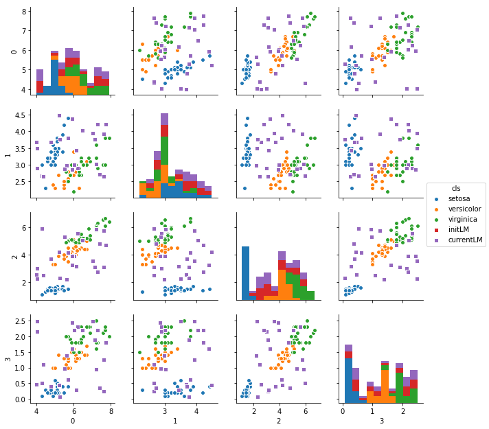

*  [no parameters](#no-parameters)
*  [set landmarks manually](#set-landmarks-manually)
*  [set landmarks manually (2)](#set-landmarks-manually-(2))
*  [set landmarks automatically on input x](#set-landmarks-automatically-on-input-x)
*  [by default, landmarks are not trained](#by-default,-landmarks-are-not-trained)
*  [use 'make_model_gkernel3' to train lm](#use-'make_model_gkernel3'-to-train-lm)

```python
%matplotlib inline
import os, sys

import numpy as np
import pandas as pd
import matplotlib.pyplot as plt
import seaborn as sns
from sklearn import datasets, linear_model
from sklearn.metrics import f1_score, classification_report, confusion_matrix, make_scorer
from sklearn.preprocessing import OneHotEncoder
import keras
from keras.models import Sequential
from keras.layers import Input, Dense
from keras.models import Model
from keras.optimizers import SGD
from keras import regularizers
from keras.wrappers.scikit_learn import KerasClassifier, KerasRegressor
from keras import backend as K
import tensorflow as tf
```

    Using TensorFlow backend.


```python
sys.path.append('/home/admin/github/wordroid.sblo.jp/lib')
from keras_ex.gkernel import GaussianKernel, GaussianKernel2, GaussianKernel3
from keras_ex.gkernel.sklearn import (
    RBFClassifier, RBFRegressor,
    make_model_gkernel3,
    make_model_gkernel2,
    make_model_gkernel1,
    make_model_out,
    make_model
)
```


```python
iris = datasets.load_iris()
X = iris.data.astype(np.float32)
Y = iris.target
N = Y.size
Y2 = keras.utils.to_categorical(Y, num_classes=3)

index = np.arange(N)
xtrain = X[index[index % 2 != 0],:]
ytrain = Y2[index[index % 2 != 0]]
xtest = X[index[index % 2 == 0],:]
yans = Y2[index[index % 2 == 0]]
```


```python
import warnings
warnings.filterwarnings('ignore')
```

## no parameters
* lm (landmarks) is set automatically
* default is 2

```python
    if lm is None:
        rs = np.random.RandomState(random_state)
        lm = rs.random_sample((num_lm, nn))
```


```python
clf = RBFClassifier()
hst = clf.fit(xtrain, ytrain, epochs=1, verbose=0)
```

    WARNING: Logging before flag parsing goes to stderr.
    W1004 23:39:13.315784 139969912796992 deprecation_wrapper.py:119] From /home/admin/miniconda3/envs/da02/lib/python3.6/site-packages/keras/backend/tensorflow_backend.py:95: The name tf.reset_default_graph is deprecated. Please use tf.compat.v1.reset_default_graph instead.
    
    W1004 23:39:13.319056 139969912796992 deprecation_wrapper.py:119] From /home/admin/miniconda3/envs/da02/lib/python3.6/site-packages/keras/backend/tensorflow_backend.py:98: The name tf.placeholder_with_default is deprecated. Please use tf.compat.v1.placeholder_with_default instead.
    
    W1004 23:39:13.355248 139969912796992 deprecation_wrapper.py:119] From /home/admin/miniconda3/envs/da02/lib/python3.6/site-packages/keras/backend/tensorflow_backend.py:102: The name tf.get_default_graph is deprecated. Please use tf.compat.v1.get_default_graph instead.
    
    W1004 23:39:13.356208 139969912796992 deprecation_wrapper.py:119] From /home/admin/miniconda3/envs/da02/lib/python3.6/site-packages/keras/backend/tensorflow_backend.py:517: The name tf.placeholder is deprecated. Please use tf.compat.v1.placeholder instead.
    
    W1004 23:39:13.359779 139969912796992 deprecation_wrapper.py:119] From /home/admin/miniconda3/envs/da02/lib/python3.6/site-packages/keras/backend/tensorflow_backend.py:4138: The name tf.random_uniform is deprecated. Please use tf.random.uniform instead.
    
    W1004 23:39:13.448873 139969912796992 deprecation_wrapper.py:119] From /home/admin/miniconda3/envs/da02/lib/python3.6/site-packages/keras/optimizers.py:790: The name tf.train.Optimizer is deprecated. Please use tf.compat.v1.train.Optimizer instead.
    
    W1004 23:39:13.576558 139969912796992 deprecation.py:323] From /home/admin/miniconda3/envs/da02/lib/python3.6/site-packages/tensorflow/python/ops/math_grad.py:1250: add_dispatch_support.<locals>.wrapper (from tensorflow.python.ops.array_ops) is deprecated and will be removed in a future version.
    Instructions for updating:
    Use tf.where in 2.0, which has the same broadcast rule as np.where


```python
'''
get landmarks
'''
lm = clf.current_lm()
lm
```


    array([[0.38541904, 0.86173606, 0.29138315, 0.55025774],
           [0.18000647, 0.61885023, 0.88004404, 0.9072325 ]], dtype=float32)


```python
df = pd.DataFrame(np.r_[xtrain, lm])
df['cls'] = [iris.target_names[ii] for ii in np.argmax(ytrain, axis=1)] + ['LM']*lm.shape[0]
df.head()

fig = sns.pairplot(df, markers=['o']*3+['s'], hue='cls', size=2.2, diag_kind='hist')
```


## set landmarks manually


```python
num_lm = 15
init_lm = np.c_[
    np.random.random((num_lm,))*4+4,
    np.random.random((num_lm,))*2+2.5,
    np.random.random((num_lm,))*4+2,
    np.random.random((num_lm,))*2.5
]
```


```python
df = pd.DataFrame(np.r_[xtrain, init_lm])
df['cls'] = [iris.target_names[ii] for ii in np.argmax(ytrain, axis=1)] + ['LM']*init_lm.shape[0]
df.head()

fig = sns.pairplot(df, markers=['o']*3+['s'], hue='cls', size=2.2, diag_kind='hist')
```


```python
clf = RBFClassifier(
    num_lm=num_lm,
    lm=init_lm
)
```


```python
hst = clf.fit(xtrain, ytrain, epochs=1, verbose=0)
```

## set landmarks manually (2)


```python
num_lm = 15
init_lm = xtrain[np.random.choice(np.arange(xtrain.shape[0]), num_lm, replace=False)]
```


```python
df = pd.DataFrame(np.r_[xtrain, init_lm])
df['cls'] = [iris.target_names[ii] for ii in np.argmax(ytrain, axis=1)] + ['LM']*init_lm.shape[0]
df.head()

fig = sns.pairplot(df, markers=['o']*3+['s'], hue='cls', size=2.2, diag_kind='hist')
```


```python
clf = RBFClassifier(
    num_lm=num_lm,
    lm=init_lm
)
```


```python
hst = clf.fit(xtrain, ytrain, epochs=1, verbose=0)
```

## set landmarks automatically on input x
* lm_select_from_x=True
* even if lm is given, it is ignored


```python
num_lm = 15
clf = RBFClassifier(
    num_lm=num_lm,
    lm_select_from_x=True,
    random_state=10001
)
```


```python
'''lm is not set unless fit is executed'''
hst = clf.fit(xtrain, ytrain, epochs=0, verbose=0)
```


```python
lm = clf.current_lm()
lm
```


    array([[6. , 3.4, 4.5, 1.6],
           [6.1, 3. , 4.9, 1.8],
           [6.4, 3.2, 5.3, 2.3],
           [5.5, 4.2, 1.4, 0.2],
           [5.7, 4.4, 1.5, 0.4],
           [6. , 2.2, 5. , 1.5],
           [4.6, 3.1, 1.5, 0.2],
           [5.5, 2.3, 4. , 1.3],
           [4.9, 3. , 1.4, 0.2],
           [6.3, 2.8, 5.1, 1.5],
           [5.6, 2.5, 3.9, 1.1],
           [5.7, 2.5, 5. , 2. ],
           [5. , 3.4, 1.5, 0.2],
           [5.7, 2.6, 3.5, 1. ],
           [6.8, 3.2, 5.9, 2.3]], dtype=float32)


```python
df = pd.DataFrame(np.r_[xtrain, lm])
df['cls'] = [iris.target_names[ii] for ii in np.argmax(ytrain, axis=1)] + ['LM']*lm.shape[0]
df.head()

fig = sns.pairplot(df, markers=['o']*3+['s'], hue='cls', size=2.2, diag_kind='hist')
```


## by default, landmarks are not trained


```python
'''set landmarks manually'''
num_lm = 25
init_lm = np.c_[
    np.random.random((num_lm,))*4+4,
    np.random.random((num_lm,))*2+2.5,
    np.random.random((num_lm,))*4+2,
    np.random.random((num_lm,))*2.5
]
init_lm
```


    array([[5.63129675, 2.98388224, 2.19929466, 1.38799428],
           [7.62805051, 3.92303932, 5.75648468, 1.24711146],
           [4.30269759, 2.66941501, 5.93456124, 0.51923027],
           [5.71739909, 3.81214085, 4.15152553, 0.6162737 ],
           [7.62649147, 2.65380886, 3.11553416, 0.25190096],
           [6.23278533, 2.90393331, 5.56482047, 2.31127389],
           [4.00121337, 3.67952161, 2.54903774, 0.46303085],
           [7.41266472, 2.71683731, 4.78838746, 0.36592774],
           [6.48997265, 4.03510444, 5.07107352, 2.19828023],
           [7.74992272, 4.21406111, 4.70210716, 1.79546737],
           [7.15555064, 3.75105962, 3.11567405, 1.89699482],
           [5.51755759, 2.8766336 , 5.33783799, 0.96274289],
           [6.03432815, 2.99786943, 3.91933156, 2.18874576],
           [7.22290622, 3.02509463, 5.86904189, 0.93820178],
           [4.03729274, 3.49185443, 2.24268444, 2.48736694],
           [4.03175465, 2.90114768, 3.00266123, 2.13903227],
           [5.22541567, 4.4778041 , 4.21746447, 0.44301295],
           [5.92420188, 4.38160936, 3.24247061, 1.60214436],
           [4.78230954, 3.68782578, 3.68376376, 0.39851192],
           [5.27811242, 3.75755025, 2.30191537, 0.07214083],
           [6.15130986, 3.44238168, 3.1685447 , 0.28098934],
           [7.2815316 , 4.22052072, 2.76551915, 2.18859529],
           [5.93949382, 2.85299151, 3.90382608, 2.43031922],
           [7.0276238 , 3.93742162, 3.56038138, 2.47127428],
           [4.38280132, 2.65295118, 2.47188416, 1.09185815]])


```python
df = pd.DataFrame(np.r_[xtrain, init_lm])
df['cls'] = [iris.target_names[ii] for ii in np.argmax(ytrain, axis=1)] + ['LM']*init_lm.shape[0]
df.head()

fig = sns.pairplot(df, markers=['o']*3+['s'], hue='cls', size=2.2, diag_kind='hist')
```


```python
%%time
clf = RBFClassifier(
    num_lm=num_lm,
    lm=init_lm
)

hst = clf.fit(xtrain, ytrain, epochs=200, verbose=0)
```

    CPU times: user 3.29 s, sys: 57.9 ms, total: 3.35 s
    Wall time: 2.96 s


```python
fig, ax = plt.subplots(1, 3, figsize=(20,5))
ax[0].set_title('loss')
ax[0].plot(list(range(len(hst["loss"]))), hst["loss"], label="Train loss")
ax[1].set_title('accuracy')
ax[1].plot(list(range(len(hst["loss"]))), hst["acc"], label="accuracy")
ax[2].set_title('learning rate')
ax[2].plot(list(range(len(hst["loss"]))), hst["lr"], label="learning rate")
ax[0].legend()
ax[1].legend()
ax[2].legend()
```


    <matplotlib.legend.Legend at 0x7f4ca4fe9198>


```python
lm = clf.current_lm()
lm
```


    array([[5.6312966 , 2.9838822 , 2.1992946 , 1.3879943 ],
           [7.6280503 , 3.9230394 , 5.7564845 , 1.2471114 ],
           [4.3026977 , 2.669415  , 5.9345613 , 0.51923025],
           [5.717399  , 3.812141  , 4.1515255 , 0.6162737 ],
           [7.6264915 , 2.6538088 , 3.115534  , 0.25190097],
           [6.232785  , 2.9039333 , 5.5648203 , 2.3112738 ],
           [4.0012136 , 3.6795216 , 2.5490377 , 0.46303084],
           [7.412665  , 2.7168374 , 4.7883873 , 0.36592776],
           [6.4899726 , 4.0351043 , 5.0710735 , 2.1982803 ],
           [7.7499228 , 4.2140613 , 4.702107  , 1.7954674 ],
           [7.1555505 , 3.7510595 , 3.115674  , 1.8969948 ],
           [5.5175576 , 2.8766336 , 5.337838  , 0.96274287],
           [6.034328  , 2.9978695 , 3.9193316 , 2.1887457 ],
           [7.222906  , 3.0250947 , 5.869042  , 0.9382018 ],
           [4.037293  , 3.4918544 , 2.2426844 , 2.487367  ],
           [4.0317545 , 2.9011476 , 3.0026612 , 2.1390324 ],
           [5.2254157 , 4.477804  , 4.2174644 , 0.44301295],
           [5.924202  , 4.3816094 , 3.2424705 , 1.6021444 ],
           [4.7823095 , 3.6878257 , 3.6837637 , 0.39851192],
           [5.2781124 , 3.7575502 , 2.3019154 , 0.07214084],
           [6.15131   , 3.4423816 , 3.1685448 , 0.28098935],
           [7.281532  , 4.2205205 , 2.7655191 , 2.1885953 ],
           [5.9394937 , 2.8529916 , 3.903826  , 2.4303193 ],
           [7.0276237 , 3.9374216 , 3.5603814 , 2.4712744 ],
           [4.3828015 , 2.6529512 , 2.4718843 , 1.0918581 ]], dtype=float32)


```python
df = pd.DataFrame(np.r_[xtrain, init_lm, lm])
df['cls'] = [iris.target_names[ii] for ii in np.argmax(ytrain, axis=1)] + ['initLM']*init_lm.shape[0] + ['currentLM']*lm.shape[0]
df.head()

fig = sns.pairplot(df, markers=['o']*3+['s','s'], hue='cls', size=2.2, diag_kind='hist')
```





## use 'make_model_gkernel3' to train lm


```python
%%time
clf = RBFClassifier(
    num_lm=num_lm,
    lm=init_lm,
    make_model_gkernel=make_model_gkernel3
)

hst = clf.fit(xtrain, ytrain, epochs=200, verbose=0)
```

    CPU times: user 3.24 s, sys: 46.5 ms, total: 3.28 s
    Wall time: 2.98 s


```python
fig, ax = plt.subplots(1, 3, figsize=(20,5))
ax[0].set_title('loss')
ax[0].plot(list(range(len(hst["loss"]))), hst["loss"], label="Train loss")
ax[1].set_title('accuracy')
ax[1].plot(list(range(len(hst["loss"]))), hst["acc"], label="accuracy")
ax[2].set_title('learning rate')
ax[2].plot(list(range(len(hst["loss"]))), hst["lr"], label="learning rate")
ax[0].legend()
ax[1].legend()
ax[2].legend()
```


    <matplotlib.legend.Legend at 0x7f4ce0526860>


```python
lm = clf.current_lm()
lm
```


    array([[5.340373  , 3.5325294 , 1.6683158 , 0.3751398 ],
           [7.2104683 , 3.5679188 , 6.1950803 , 2.6341126 ],
           [4.744102  , 2.4680147 , 5.545306  , 2.4258027 ],
           [6.49154   , 3.5136006 , 4.1276016 , 0.4573303 ],
           [7.19449   , 3.3954074 , 3.715576  , 0.5460261 ],
           [5.9377904 , 2.642581  , 5.247819  , 2.6633434 ],
           [4.9675007 , 3.544225  , 1.5145204 , 0.1599679 ],
           [7.1581616 , 3.3716145 , 4.297781  , 0.48505384],
           [5.909827  , 3.4150555 , 5.2326217 , 2.7534325 ],
           [7.265577  , 3.8535724 , 5.9954996 , 2.860518  ],
           [7.171419  , 3.4512744 , 3.5293953 , 0.7312583 ],
           [5.6450872 , 2.4264975 , 4.785955  , 2.583419  ],
           [6.4298825 , 3.1456647 , 3.5866702 , 0.906336  ],
           [6.8144507 , 2.4796135 , 6.091831  , 2.2626307 ],
           [4.791518  , 3.790855  , 1.1588333 , 1.1432071 ],
           [4.1095896 , 2.3637698 , 2.8985329 , 1.0472997 ],
           [5.8607297 , 4.0250273 , 4.2027617 , 0.2512817 ],
           [6.930048  , 3.9837375 , 3.5536327 , 0.6580937 ],
           [5.199137  , 3.2155998 , 3.7819455 , 0.26920915],
           [5.090886  , 3.6742556 , 1.2822734 , 0.14350632],
           [6.6285877 , 3.2814307 , 3.5701888 , 0.39665163],
           [7.3751574 , 3.7843256 , 3.2429225 , 0.90190434],
           [5.405767  , 2.229453  , 3.6258702 , 1.9079447 ],
           [7.4215074 , 3.76297   , 3.5806193 , 1.4989405 ],
           [5.091094  , 3.2181017 , 1.9421431 , 0.2951398 ]], dtype=float32)


```python
df = pd.DataFrame(np.r_[xtrain, init_lm, lm])
df['cls'] = [iris.target_names[ii] for ii in np.argmax(ytrain, axis=1)] + ['initLM']*init_lm.shape[0] + ['trainedLM']*lm.shape[0]
df.head()

fig = sns.pairplot(df, markers=['.']*3+['s','s'], hue='cls', size=2.2, diag_kind='hist')
```


```python

```


```python

```


```python

```
