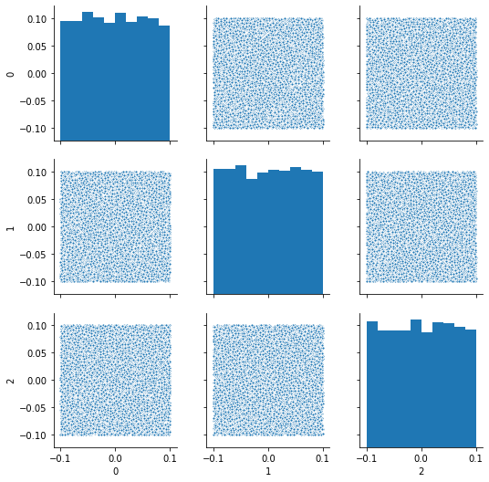
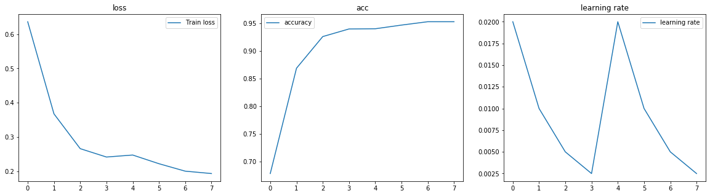
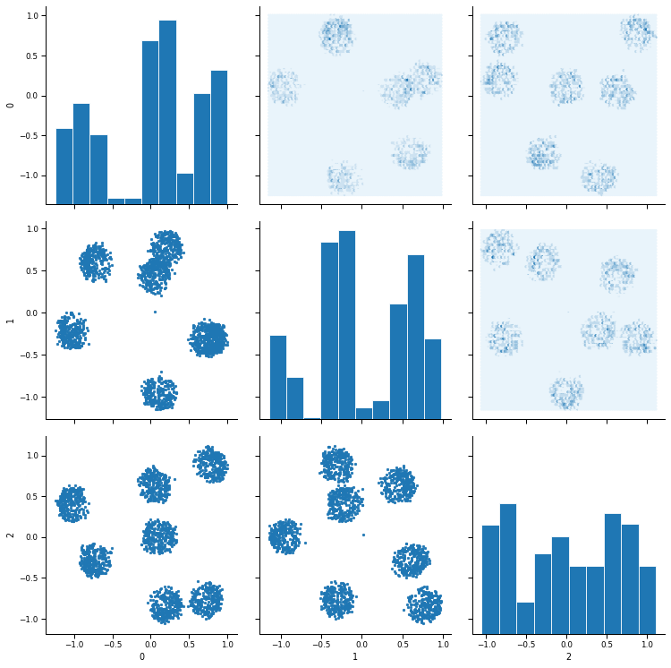
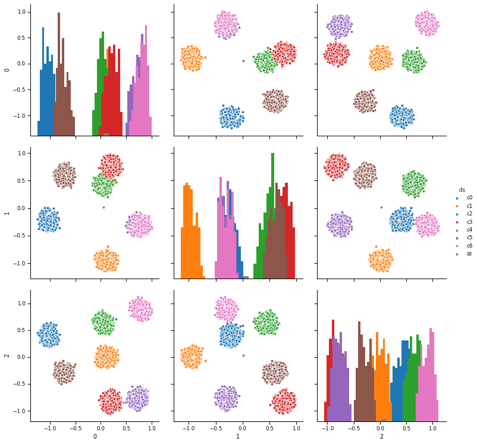
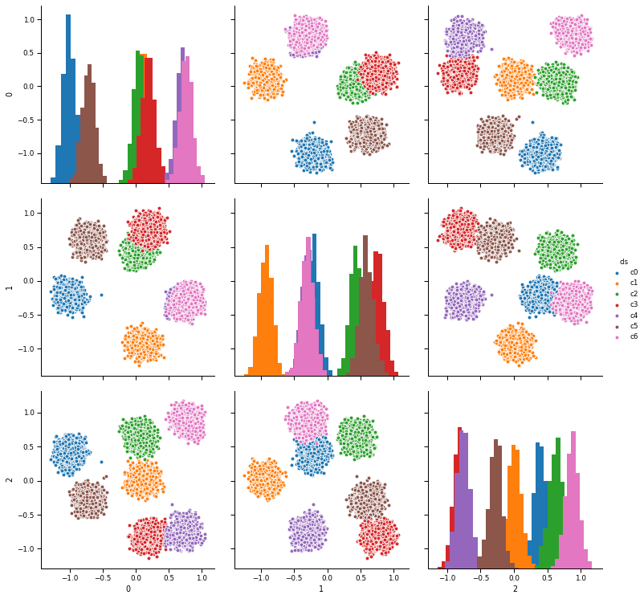

* negative sampling
* num_features = 3


```
row - col
|
neg:col - row
```

[wd2v module3 (omit no-rated, no genre)](https://www.kaggle.com/wordroid/wd2v-module3-omit-no-rated-no-genre)


```python
%matplotlib inline
from IPython.display import SVG
from keras.utils.vis_utils import model_to_dot
```

    Using TensorFlow backend.
    /home/admin/miniconda3/envs/da03/lib/python3.6/site-packages/tensorflow/python/framework/dtypes.py:516: FutureWarning: Passing (type, 1) or '1type' as a synonym of type is deprecated; in a future version of numpy, it will be understood as (type, (1,)) / '(1,)type'.
      _np_qint8 = np.dtype([("qint8", np.int8, 1)])
    /home/admin/miniconda3/envs/da03/lib/python3.6/site-packages/tensorflow/python/framework/dtypes.py:517: FutureWarning: Passing (type, 1) or '1type' as a synonym of type is deprecated; in a future version of numpy, it will be understood as (type, (1,)) / '(1,)type'.
      _np_quint8 = np.dtype([("quint8", np.uint8, 1)])
    /home/admin/miniconda3/envs/da03/lib/python3.6/site-packages/tensorflow/python/framework/dtypes.py:518: FutureWarning: Passing (type, 1) or '1type' as a synonym of type is deprecated; in a future version of numpy, it will be understood as (type, (1,)) / '(1,)type'.
      _np_qint16 = np.dtype([("qint16", np.int16, 1)])
    /home/admin/miniconda3/envs/da03/lib/python3.6/site-packages/tensorflow/python/framework/dtypes.py:519: FutureWarning: Passing (type, 1) or '1type' as a synonym of type is deprecated; in a future version of numpy, it will be understood as (type, (1,)) / '(1,)type'.
      _np_quint16 = np.dtype([("quint16", np.uint16, 1)])
    /home/admin/miniconda3/envs/da03/lib/python3.6/site-packages/tensorflow/python/framework/dtypes.py:520: FutureWarning: Passing (type, 1) or '1type' as a synonym of type is deprecated; in a future version of numpy, it will be understood as (type, (1,)) / '(1,)type'.
      _np_qint32 = np.dtype([("qint32", np.int32, 1)])
    /home/admin/miniconda3/envs/da03/lib/python3.6/site-packages/tensorflow/python/framework/dtypes.py:525: FutureWarning: Passing (type, 1) or '1type' as a synonym of type is deprecated; in a future version of numpy, it will be understood as (type, (1,)) / '(1,)type'.
      np_resource = np.dtype([("resource", np.ubyte, 1)])
    /home/admin/miniconda3/envs/da03/lib/python3.6/site-packages/tensorboard/compat/tensorflow_stub/dtypes.py:541: FutureWarning: Passing (type, 1) or '1type' as a synonym of type is deprecated; in a future version of numpy, it will be understood as (type, (1,)) / '(1,)type'.
      _np_qint8 = np.dtype([("qint8", np.int8, 1)])
    /home/admin/miniconda3/envs/da03/lib/python3.6/site-packages/tensorboard/compat/tensorflow_stub/dtypes.py:542: FutureWarning: Passing (type, 1) or '1type' as a synonym of type is deprecated; in a future version of numpy, it will be understood as (type, (1,)) / '(1,)type'.
      _np_quint8 = np.dtype([("quint8", np.uint8, 1)])
    /home/admin/miniconda3/envs/da03/lib/python3.6/site-packages/tensorboard/compat/tensorflow_stub/dtypes.py:543: FutureWarning: Passing (type, 1) or '1type' as a synonym of type is deprecated; in a future version of numpy, it will be understood as (type, (1,)) / '(1,)type'.
      _np_qint16 = np.dtype([("qint16", np.int16, 1)])
    /home/admin/miniconda3/envs/da03/lib/python3.6/site-packages/tensorboard/compat/tensorflow_stub/dtypes.py:544: FutureWarning: Passing (type, 1) or '1type' as a synonym of type is deprecated; in a future version of numpy, it will be understood as (type, (1,)) / '(1,)type'.
      _np_quint16 = np.dtype([("quint16", np.uint16, 1)])
    /home/admin/miniconda3/envs/da03/lib/python3.6/site-packages/tensorboard/compat/tensorflow_stub/dtypes.py:545: FutureWarning: Passing (type, 1) or '1type' as a synonym of type is deprecated; in a future version of numpy, it will be understood as (type, (1,)) / '(1,)type'.
      _np_qint32 = np.dtype([("qint32", np.int32, 1)])
    /home/admin/miniconda3/envs/da03/lib/python3.6/site-packages/tensorboard/compat/tensorflow_stub/dtypes.py:550: FutureWarning: Passing (type, 1) or '1type' as a synonym of type is deprecated; in a future version of numpy, it will be understood as (type, (1,)) / '(1,)type'.
      np_resource = np.dtype([("resource", np.ubyte, 1)])


```python
import sys
sys.path.append('/home/admin/github/wordroid.sblo.jp/lib')

from feature_eng.neg_smpl3 import (
    WordAndDoc2vec,
    MySparseMatrixSimilarity,
    Seq, Seq2, Dic4seq,
    get_sim
)
```


```python
import os.path
import sys
import re
import itertools
import csv
import datetime
import pickle
import random
from collections import defaultdict, Counter
import gc

import matplotlib.pyplot as plt
from matplotlib.ticker import NullFormatter
import seaborn as sns
import pandas as pd
import numpy as np
import scipy
import gensim
from sklearn.metrics import f1_score, classification_report, confusion_matrix, log_loss
from sklearn.model_selection import train_test_split
import gensim
from keras.preprocessing.sequence import skipgrams
import tensorflow as tf
```


```python
def hexbin(x, y, color, **kwargs):
    cmap = sns.light_palette(color, as_cmap=True)
    plt.hexbin(x, y, cmap=cmap, **kwargs)
def scatter(x, y, color, **kwargs):
    plt.scatter(x, y, marker='.')
```

### create sample data


```python
NN_word = 2000
NN_sentence = 10000
NN_SEG = 7
```


```python
product_list = [ee+1 for ee in range(NN_word)]
user_list = [ee+1 for ee in range(NN_sentence)]
```


```python
a, _ = divmod(len(user_list), NN_SEG)
print(a)
cls_user = [int(user_id / (a+1)) for user_id in range(1, 1+len(user_list))]
```

    1428


```python
a, _ = divmod(len(product_list), NN_SEG)
print(a)
cls_prod = [int(prod_id / (a+1)) for prod_id in range(1, 1+len(product_list))]
```

    285


```python
random.seed(0)

X_list = []

for ii in range(len(user_list)):
    cls = cls_user[ii]
    product_group = np.array(product_list)[np.array(cls_prod) == cls]
    nword = random.randint(5, 20)
    prods = random.sample(product_group.tolist(), nword)
    irow = np.zeros((1,NN_word))
    irow[0,np.array(prods)-1] = 1
    X_list.append(irow)

X = np.concatenate(X_list)
print(X.shape)
X
```

    (10000, 2000)


    array([[0., 0., 0., ..., 0., 0., 0.],
           [0., 0., 0., ..., 0., 0., 0.],
           [1., 0., 0., ..., 0., 0., 0.],
           ...,
           [0., 0., 0., ..., 0., 0., 0.],
           [0., 0., 0., ..., 0., 1., 0.],
           [0., 0., 0., ..., 0., 0., 0.]])


```python
X_df = pd.DataFrame(X, dtype=int)
X_df.index = ['r'+ee.astype('str') for ee in (np.arange(X_df.shape[0])+1)]
X_df.columns = ['c'+ee.astype('str') for ee in np.arange(X_df.shape[1])+1]
print(X_df.shape)
X_df.head()
```

    (10000, 2000)


<div>
<style scoped>
    .dataframe tbody tr th:only-of-type {
        vertical-align: middle;
    }

    .dataframe tbody tr th {
        vertical-align: top;
    }

    .dataframe thead th {
        text-align: right;
    }
</style>
<table border="1" class="dataframe">
  <thead>
    <tr style="text-align: right;">
      <th></th>
      <th>c1</th>
      <th>c2</th>
      <th>c3</th>
      <th>c4</th>
      <th>c5</th>
      <th>c6</th>
      <th>c7</th>
      <th>c8</th>
      <th>c9</th>
      <th>c10</th>
      <th>...</th>
      <th>c1991</th>
      <th>c1992</th>
      <th>c1993</th>
      <th>c1994</th>
      <th>c1995</th>
      <th>c1996</th>
      <th>c1997</th>
      <th>c1998</th>
      <th>c1999</th>
      <th>c2000</th>
    </tr>
  </thead>
  <tbody>
    <tr>
      <th>r1</th>
      <td>0</td>
      <td>0</td>
      <td>0</td>
      <td>0</td>
      <td>0</td>
      <td>0</td>
      <td>0</td>
      <td>0</td>
      <td>0</td>
      <td>0</td>
      <td>...</td>
      <td>0</td>
      <td>0</td>
      <td>0</td>
      <td>0</td>
      <td>0</td>
      <td>0</td>
      <td>0</td>
      <td>0</td>
      <td>0</td>
      <td>0</td>
    </tr>
    <tr>
      <th>r2</th>
      <td>0</td>
      <td>0</td>
      <td>0</td>
      <td>0</td>
      <td>0</td>
      <td>0</td>
      <td>0</td>
      <td>0</td>
      <td>0</td>
      <td>0</td>
      <td>...</td>
      <td>0</td>
      <td>0</td>
      <td>0</td>
      <td>0</td>
      <td>0</td>
      <td>0</td>
      <td>0</td>
      <td>0</td>
      <td>0</td>
      <td>0</td>
    </tr>
    <tr>
      <th>r3</th>
      <td>1</td>
      <td>0</td>
      <td>0</td>
      <td>0</td>
      <td>0</td>
      <td>0</td>
      <td>0</td>
      <td>1</td>
      <td>0</td>
      <td>0</td>
      <td>...</td>
      <td>0</td>
      <td>0</td>
      <td>0</td>
      <td>0</td>
      <td>0</td>
      <td>0</td>
      <td>0</td>
      <td>0</td>
      <td>0</td>
      <td>0</td>
    </tr>
    <tr>
      <th>r4</th>
      <td>0</td>
      <td>0</td>
      <td>0</td>
      <td>0</td>
      <td>0</td>
      <td>0</td>
      <td>0</td>
      <td>0</td>
      <td>0</td>
      <td>0</td>
      <td>...</td>
      <td>0</td>
      <td>0</td>
      <td>0</td>
      <td>0</td>
      <td>0</td>
      <td>0</td>
      <td>0</td>
      <td>0</td>
      <td>0</td>
      <td>0</td>
    </tr>
    <tr>
      <th>r5</th>
      <td>0</td>
      <td>0</td>
      <td>0</td>
      <td>0</td>
      <td>0</td>
      <td>0</td>
      <td>0</td>
      <td>0</td>
      <td>0</td>
      <td>0</td>
      <td>...</td>
      <td>0</td>
      <td>0</td>
      <td>0</td>
      <td>0</td>
      <td>0</td>
      <td>0</td>
      <td>0</td>
      <td>0</td>
      <td>0</td>
      <td>0</td>
    </tr>
  </tbody>
</table>
<p>5 rows × 2000 columns</p>
</div>


```python
X_df.values.shape
```


    (10000, 2000)


```python
plt.figure(figsize=(10, 10))
plt.imshow(X_df.values.T)
```


    <matplotlib.image.AxesImage at 0x7fe17722c4e0>


```python

```


```python
from collections.abc import Sequence

class DocSeq(Sequence):
    '''
    doc_dic  : doc_name (unique)
    word_dic : index=0 must be place holder.
    '''
    def __init__(self, df):
        self.df = df
        self.cols = self.df.columns.values
        
        self.doc_dic = gensim.corpora.Dictionary([df.index.values.tolist()], prune_at=None)
        
        
        '''
        index=0 must be place holder.
        '''
        self.word_dic = gensim.corpora.Dictionary([['PL_DUMMY']], prune_at=None)
        
        self.word_dic.add_documents([list(self.cols)], prune_at=None)
    
    def __getitem__(self, idx):
        return self._get(idx)
    
    def _get(self, idx):
        try:
            ebid = self.doc_dic[idx]
        except KeyError:
            raise IndexError
        irow = self.df.loc[ebid]
        res = []
        for icol in self.cols:
            if irow[icol] == 1:
                res.append(icol)
        return res
    
    def __len__(self):
        return self.df.shape[0]
```


```python
doc_seq = DocSeq(X_df)
len(doc_seq)
```


    10000


```python
# %%time
# corpus_csr = gensim.matutils.corpus2csc(
#     (doc_seq.word_dic.doc2bow(ee) for ee in doc_seq),
#     num_terms=max(doc_seq.word_dic.keys())+1
# ).T
# corpus_csr.shape
```


```python
# scipy.sparse.save_npz('tt01_corpus_csr', corpus_csr)
# doc_seq.word_dic.save('tt01_word_dic')
# doc_seq.doc_dic.save('tt01_doc_dic')
```


```python
%%time
corpus_csr = scipy.sparse.load_npz('tt01_corpus_csr.npz')
word_dic = gensim.corpora.dictionary.Dictionary.load('tt01_word_dic')
doc_dic = gensim.corpora.dictionary.Dictionary.load('tt01_doc_dic')

wd2v = WordAndDoc2vec(corpus_csr, word_dic, doc_dic, logging=False)
wd2v
```

    max(doc_dic.keys()) + 1 >>> 10000
    num_features >>> 2001
    corpus_csr.shape >>> (10000, 2001)
    ### creating tfidf...
    ### creating MySparseMatrixSimilarity...
    <feature_eng.neg_smpl.MySparseMatrixSimilarity object at 0x7fe16cfbae80>
    ### creating Dic4seq...
    <feature_eng.neg_smpl.Dic4seq object at 0x7fe16cfbae48>
    CPU times: user 1.03 s, sys: 17.1 ms, total: 1.04 s
    Wall time: 1.03 s


    <feature_eng.neg_smpl3.WordAndDoc2vec at 0x7fe17725a5f8>


```python
mysim, doc_dic, word_dic = wd2v.mysim, wd2v.doc_dic, wd2v.word_dic
mysim, doc_dic, word_dic
```


    (<feature_eng.neg_smpl.MySparseMatrixSimilarity at 0x7fe16cfbae80>,
     <gensim.corpora.dictionary.Dictionary at 0x7fe16d134f98>,
     <gensim.corpora.dictionary.Dictionary at 0x7fe17725a550>)


## train


```python
num_features = 3
wd2v.make_model(num_features=num_features, embeddings_val=0.1, debug=False)
```

    WARNING:tensorflow:From /home/admin/miniconda3/envs/da03/lib/python3.6/site-packages/keras/backend/tensorflow_backend.py:517: The name tf.placeholder is deprecated. Please use tf.compat.v1.placeholder instead.
    
    WARNING:tensorflow:From /home/admin/miniconda3/envs/da03/lib/python3.6/site-packages/keras/backend/tensorflow_backend.py:4138: The name tf.random_uniform is deprecated. Please use tf.random.uniform instead.
    
    WARNING:tensorflow:From /home/admin/miniconda3/envs/da03/lib/python3.6/site-packages/keras/backend/tensorflow_backend.py:74: The name tf.get_default_graph is deprecated. Please use tf.compat.v1.get_default_graph instead.
    
    WARNING:tensorflow:From /home/admin/miniconda3/envs/da03/lib/python3.6/site-packages/keras/optimizers.py:790: The name tf.train.Optimizer is deprecated. Please use tf.compat.v1.train.Optimizer instead.
    
    WARNING:tensorflow:From /home/admin/miniconda3/envs/da03/lib/python3.6/site-packages/keras/backend/tensorflow_backend.py:3376: The name tf.log is deprecated. Please use tf.math.log instead.
    
    WARNING:tensorflow:From /home/admin/miniconda3/envs/da03/lib/python3.6/site-packages/tensorflow/python/ops/nn_impl.py:180: add_dispatch_support.<locals>.wrapper (from tensorflow.python.ops.array_ops) is deprecated and will be removed in a future version.
    Instructions for updating:
    Use tf.where in 2.0, which has the same broadcast rule as np.where


    {'model_neg_prod': <keras.engine.training.Model at 0x7fe16ce48b70>,
     'model_neg_prod_user': <keras.engine.training.Model at 0x7fe16ce6c320>,
     'model_user': <keras.engine.training.Model at 0x7fe191aa2898>,
     'model_prod': <keras.engine.training.Model at 0x7fe16ce48470>,
     'model_dist2_a': <keras.engine.training.Model at 0x7fe16cfbafd0>,
     'model_prob': <keras.engine.training.Model at 0x7fe16c627438>,
     'model_userXprod': <keras.engine.training.Model at 0x7fe16c5948d0>,
     'model_userXneg_prod': <keras.engine.training.Model at 0x7fe16c5dd278>,
     'model_neg_prodXneg_prod_user': <keras.engine.training.Model at 0x7fe16c594278>,
     'model': <keras.engine.training.Model at 0x7fe16c497278>}


```python

```


```python
wgt_prod = wd2v.wgt_col
print(wgt_prod.shape)
df = pd.DataFrame(wgt_prod[:,:5])
sns.pairplot(df, markers='.')
```

    WARNING:tensorflow:From /home/admin/miniconda3/envs/da03/lib/python3.6/site-packages/keras/backend/tensorflow_backend.py:174: The name tf.get_default_session is deprecated. Please use tf.compat.v1.get_default_session instead.
    
    (2001, 3)


    <seaborn.axisgrid.PairGrid at 0x7fe190a46390>


```python
wgt_user = wd2v.wgt_row
print(wgt_user.shape)
df = pd.DataFrame(wgt_user[:,:5])
sns.pairplot(df, markers='.')
```

    (10000, 3)


    <seaborn.axisgrid.PairGrid at 0x7fe164751f28>





```python
from keras.callbacks import ModelCheckpoint, LearningRateScheduler, ReduceLROnPlateau

def lr_schedule(epoch):
    lr0 = 0.02
    epoch1 = 16
    epoch2 = 16
    epoch3 = 16
    epoch4 = 16
    
    if epoch<epoch1:
        lr = lr0
    elif epoch<epoch1+epoch2:
        lr = lr0/2
    elif epoch<epoch1+epoch2+epoch3:
        lr = lr0
    elif epoch<epoch1+epoch2+epoch3+epoch4:
        lr = lr0/2
    else:
        lr = lr0/16
    
    if divmod(epoch,4)[1] == 3:
        lr *= (1/8)
    elif divmod(epoch,4)[1] == 2:
        lr *= (1/4)
    elif divmod(epoch,4)[1] == 1:
        lr *= (1/2)
    elif divmod(epoch,4)[1] == 0:
        pass
    print('Learning rate: ', lr)
    return lr

lr_scheduler = LearningRateScheduler(lr_schedule)

callbacks = [lr_scheduler]

hst = wd2v.train(epochs=8, verbose=1, batch_size=32,
           use_multiprocessing=True, workers=4,
           callbacks=callbacks)
hst_history = hst.history
```

    len(seq) >>> 313
    Epoch 1/8
    Learning rate:  0.02
    313/313 [==============================] - 34s 107ms/step - loss: 0.6367 - acc: 0.6785
    Epoch 2/8
    Learning rate:  0.01
    313/313 [==============================] - 33s 104ms/step - loss: 0.3675 - acc: 0.8687
    Epoch 3/8
    Learning rate:  0.005
    313/313 [==============================] - 33s 104ms/step - loss: 0.2657 - acc: 0.9258
    Epoch 4/8
    Learning rate:  0.0025
    313/313 [==============================] - 33s 104ms/step - loss: 0.2412 - acc: 0.9396
    Epoch 5/8
    Learning rate:  0.02
    313/313 [==============================] - 33s 104ms/step - loss: 0.2471 - acc: 0.9399
    Epoch 6/8
    Learning rate:  0.01
    313/313 [==============================] - 33s 105ms/step - loss: 0.2218 - acc: 0.9466
    Epoch 7/8
    Learning rate:  0.005
    313/313 [==============================] - 33s 105ms/step - loss: 0.2000 - acc: 0.9527
    Epoch 8/8
    Learning rate:  0.0025
    313/313 [==============================] - 39s 124ms/step - loss: 0.1930 - acc: 0.9526


```python
fig, ax = plt.subplots(1, 3, figsize=(20,5))
ax[0].set_title('loss')
ax[0].plot(list(range(len(hst_history["loss"]))), hst_history["loss"], label="Train loss")
ax[1].set_title('acc')
ax[1].plot(list(range(len(hst_history["loss"]))), hst_history["acc"], label="accuracy")
ax[2].set_title('learning rate')
ax[2].plot(list(range(len(hst_history["loss"]))), hst_history["lr"], label="learning rate")
ax[0].legend()
ax[1].legend()
ax[2].legend()
```


    <matplotlib.legend.Legend at 0x7fe141b9ac18>





```python
wgt_prod = wd2v.wgt_col[doc_seq.word_dic.doc2idx(['PL_DUMMY']+X_df.columns.tolist())]
print(wgt_prod.shape)
df = pd.DataFrame(wgt_prod[:,:5])
sns.set_context('paper')
g = sns.PairGrid(df, height=3.5)
g.map_diag(plt.hist, edgecolor="w")
g.map_lower(scatter)
g.map_upper(hexbin)
```

    (2001, 3)


    <seaborn.axisgrid.PairGrid at 0x7fe141b33f28>





```python
df = pd.DataFrame(wgt_prod[:,:5])
df['cls'] = ['zz'] + ['c'+str(ii) for ii in cls_prod]
sns.pairplot(df, markers='o', hue='cls', hue_order=['c'+str(ee) for ee in range(7)]+['zz'], height=3.5, diag_kind='hist')
```


    <seaborn.axisgrid.PairGrid at 0x7fe141680978>





```python
wgt_user = wd2v.wgt_row[doc_seq.doc_dic.doc2idx(X_df.index.tolist())]
print(wgt_user.shape)
df = pd.DataFrame(wgt_user[:,:5])
sns.set_context('paper')
g = sns.PairGrid(df, height=3.5)
g.map_diag(plt.hist, edgecolor="w")
g.map_lower(scatter)
g.map_upper(hexbin)
```

    (10000, 3)


    <seaborn.axisgrid.PairGrid at 0x7fe140f07d68>


```python
df = pd.DataFrame(wgt_user[:,:5])
df['cls'] = ['c'+str(ii) for ii in cls_user]
sns.pairplot(df, markers='o', hue='cls', height=3.5, diag_kind='hist')
```


    <seaborn.axisgrid.PairGrid at 0x7fe14039a438>





```python
sim = wd2v.sim
print(sim.num_features)
print(sim.sim_row)
```

    3
    Similarity<10000 docs, 3 features>


```python
query = sim.sim_row.index[sim.row_dic.token2id['r1']]
query
```


    array([-1.1957827 , -0.13550521,  0.45149288], dtype=float32)


```python
sim.get_sim_byrow(query, num_best=20)
```


    [('r1', 1.0),
     ('r289', 0.9981630444526672),
     ('r1319', 0.9978554248809814),
     ('r908', 0.9978138208389282),
     ('r16', 0.9975966215133667),
     ('r1276', 0.9964738488197327),
     ('r92', 0.9935390949249268),
     ('r239', 0.992611289024353),
     ('r33', 0.9925276041030884),
     ('r1198', 0.9923549890518188),
     ('r128', 0.9916069507598877),
     ('r702', 0.9904413223266602),
     ('r1001', 0.9895443320274353),
     ('r439', 0.9893534183502197),
     ('r97', 0.9893170595169067),
     ('r127', 0.9891061186790466),
     ('r1388', 0.9890819191932678),
     ('r1317', 0.9890491962432861),
     ('r1304', 0.9886193871498108),
     ('r542', 0.9883119463920593)]


```python

```
