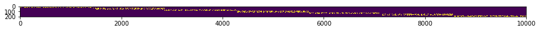
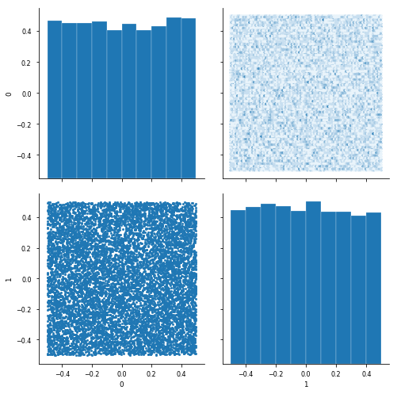
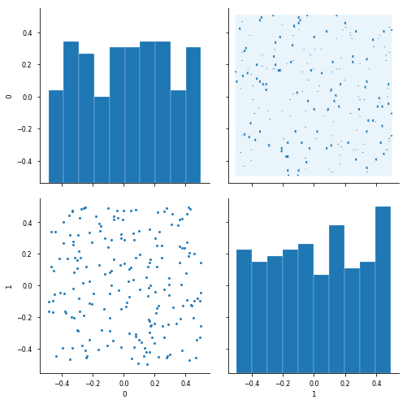
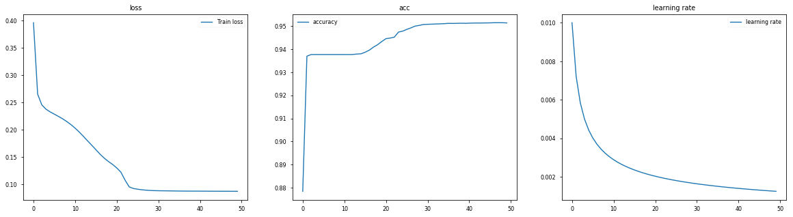
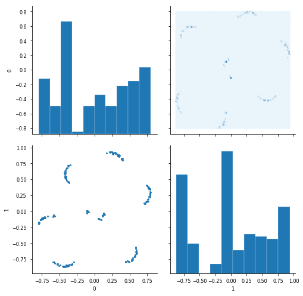
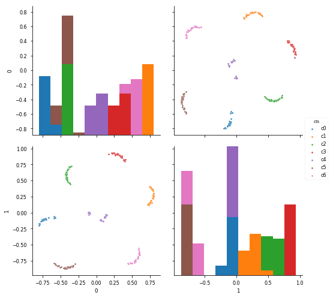
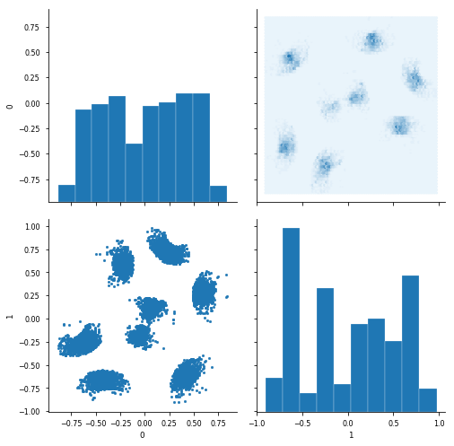
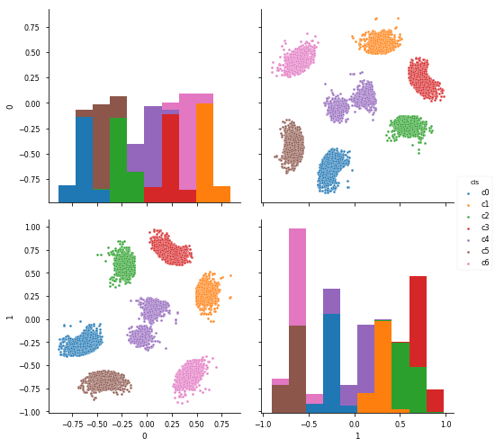
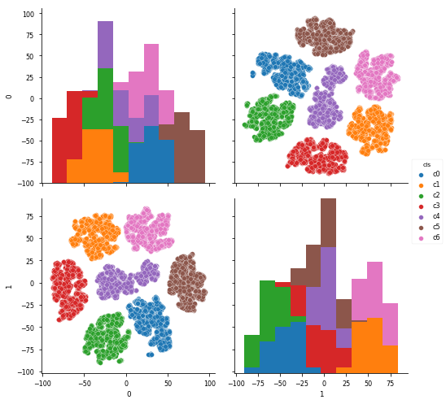

no negative sampling  

NN_word = 200  
num_features = 2

(2019.6.3) use fit (not fit_generator)  
(2019.6.16) lr_scheduler  


```python
%matplotlib inline
from IPython.display import SVG
from keras.utils.vis_utils import model_to_dot
```

    Using TensorFlow backend.


```python
import sys
sys.path.append('/home/admin/github/wordroid.sblo.jp/lib')
from feature_eng import lowcols
```


```python
import os.path
import sys
import re
import itertools
import csv
import datetime
import pickle
import random
from collections import defaultdict, Counter
import gc

import matplotlib.pyplot as plt
from matplotlib.ticker import NullFormatter
import seaborn as sns
import pandas as pd
import numpy as np
import scipy
import gensim
from sklearn.metrics import f1_score, classification_report, confusion_matrix, log_loss
from sklearn.model_selection import train_test_split
import gensim
from keras.preprocessing.sequence import skipgrams
import tensorflow as tf
```


```python
def hexbin(x, y, color, **kwargs):
    cmap = sns.light_palette(color, as_cmap=True)
    plt.hexbin(x, y, cmap=cmap, **kwargs)
def scatter(x, y, color, **kwargs):
    plt.scatter(x, y, marker='.')
```

### create sample data


```python
NN_word = 200
NN_sentence = 10000
NN_SEG = 7
```


```python
product_list = [ee+1 for ee in range(NN_word)]
user_list = [ee+1 for ee in range(NN_sentence)]
```


```python
a, _ = divmod(len(user_list), NN_SEG)
a
cls_user = [int(user_id / (a+1)) for user_id in range(1, 1+len(user_list))]
```


```python
a, _ = divmod(len(product_list), NN_SEG)
print(a)

cls_prod = [int(prod_id / (a+1)) for prod_id in range(1, 1+len(product_list))]
```

    28


```python
random.seed(0)

X_list = []

for ii in range(len(user_list)):
    cls = cls_user[ii]
    product_group = np.array(product_list)[np.array(cls_prod) == cls]
    nword = random.randint(5, 20)
    prods = random.sample(product_group.tolist(), nword)
    irow = np.zeros((1,NN_word))
    irow[0,np.array(prods)-1] = 1
    X_list.append(irow)

X = np.concatenate(X_list)
print(X.shape)
X
```

    (10000, 200)


    array([[0., 1., 1., ..., 0., 0., 0.],
           [0., 0., 1., ..., 0., 0., 0.],
           [1., 1., 1., ..., 0., 0., 0.],
           ...,
           [0., 0., 0., ..., 0., 0., 1.],
           [0., 0., 0., ..., 1., 1., 0.],
           [0., 0., 0., ..., 1., 1., 1.]])


```python
X_df = pd.DataFrame(X, dtype=int)
X_df.index = ['r'+ee.astype('str') for ee in (np.arange(X_df.shape[0])+1)]
X_df.columns = ['c'+ee.astype('str') for ee in np.arange(X_df.shape[1])+1]
print(X_df.shape)
X_df.head()
```

    (10000, 200)


<div>
<style>
    .dataframe thead tr:only-child th {
        text-align: right;
    }

    .dataframe thead th {
        text-align: left;
    }

    .dataframe tbody tr th {
        vertical-align: top;
    }
</style>
<table border="1" class="dataframe">
  <thead>
    <tr style="text-align: right;">
      <th></th>
      <th>c1</th>
      <th>c2</th>
      <th>c3</th>
      <th>c4</th>
      <th>c5</th>
      <th>c6</th>
      <th>c7</th>
      <th>c8</th>
      <th>c9</th>
      <th>c10</th>
      <th>...</th>
      <th>c191</th>
      <th>c192</th>
      <th>c193</th>
      <th>c194</th>
      <th>c195</th>
      <th>c196</th>
      <th>c197</th>
      <th>c198</th>
      <th>c199</th>
      <th>c200</th>
    </tr>
  </thead>
  <tbody>
    <tr>
      <th>r1</th>
      <td>0</td>
      <td>1</td>
      <td>1</td>
      <td>0</td>
      <td>1</td>
      <td>0</td>
      <td>1</td>
      <td>0</td>
      <td>1</td>
      <td>1</td>
      <td>...</td>
      <td>0</td>
      <td>0</td>
      <td>0</td>
      <td>0</td>
      <td>0</td>
      <td>0</td>
      <td>0</td>
      <td>0</td>
      <td>0</td>
      <td>0</td>
    </tr>
    <tr>
      <th>r2</th>
      <td>0</td>
      <td>0</td>
      <td>1</td>
      <td>1</td>
      <td>1</td>
      <td>0</td>
      <td>0</td>
      <td>0</td>
      <td>0</td>
      <td>1</td>
      <td>...</td>
      <td>0</td>
      <td>0</td>
      <td>0</td>
      <td>0</td>
      <td>0</td>
      <td>0</td>
      <td>0</td>
      <td>0</td>
      <td>0</td>
      <td>0</td>
    </tr>
    <tr>
      <th>r3</th>
      <td>1</td>
      <td>1</td>
      <td>1</td>
      <td>0</td>
      <td>0</td>
      <td>0</td>
      <td>1</td>
      <td>0</td>
      <td>1</td>
      <td>0</td>
      <td>...</td>
      <td>0</td>
      <td>0</td>
      <td>0</td>
      <td>0</td>
      <td>0</td>
      <td>0</td>
      <td>0</td>
      <td>0</td>
      <td>0</td>
      <td>0</td>
    </tr>
    <tr>
      <th>r4</th>
      <td>0</td>
      <td>0</td>
      <td>0</td>
      <td>0</td>
      <td>0</td>
      <td>0</td>
      <td>0</td>
      <td>0</td>
      <td>0</td>
      <td>0</td>
      <td>...</td>
      <td>0</td>
      <td>0</td>
      <td>0</td>
      <td>0</td>
      <td>0</td>
      <td>0</td>
      <td>0</td>
      <td>0</td>
      <td>0</td>
      <td>0</td>
    </tr>
    <tr>
      <th>r5</th>
      <td>0</td>
      <td>0</td>
      <td>1</td>
      <td>0</td>
      <td>1</td>
      <td>0</td>
      <td>1</td>
      <td>1</td>
      <td>0</td>
      <td>0</td>
      <td>...</td>
      <td>0</td>
      <td>0</td>
      <td>0</td>
      <td>0</td>
      <td>0</td>
      <td>0</td>
      <td>0</td>
      <td>0</td>
      <td>0</td>
      <td>0</td>
    </tr>
  </tbody>
</table>
<p>5 rows × 200 columns</p>
</div>


```python
X_df.values.shape
```


    (10000, 200)


```python
plt.figure(figsize=(15, 15))
plt.imshow(X_df.values.T)
```


    <matplotlib.image.AxesImage at 0x7fddaabbc6a0>





```python

```


```python
wd2v = lowcols.WD2vec(X_df)
wd2v
```


    <feature_eng.lowcols.WD2vec at 0x7fddc99c5128>


```python
num_features = 2

models = wd2v.make_model(num_user=X_df.shape[0], num_product=NN_word, num_features=num_features)
models['model_gk1'].summary()
models['model_user'].summary()
print('\n\n##################### model >>>')
model = models['model']
model.summary()
```

    _________________________________________________________________
    Layer (type)                 Output Shape              Param #   
    =================================================================
    input_user (InputLayer)      (None, 1)                 0         
    _________________________________________________________________
    user_embedding (Embedding)   (None, 1, 2)              20000     
    _________________________________________________________________
    flatten_1 (Flatten)          (None, 2)                 0         
    _________________________________________________________________
    gkernel1 (GaussianKernel3)   (None, 200)               401       
    =================================================================
    Total params: 20,401
    Trainable params: 20,401
    Non-trainable params: 0
    _________________________________________________________________
    _________________________________________________________________
    Layer (type)                 Output Shape              Param #   
    =================================================================
    input_user (InputLayer)      (None, 1)                 0         
    _________________________________________________________________
    user_embedding (Embedding)   (None, 1, 2)              20000     
    _________________________________________________________________
    flatten_1 (Flatten)          (None, 2)                 0         
    =================================================================
    Total params: 20,000
    Trainable params: 20,000
    Non-trainable params: 0
    _________________________________________________________________
    
    
    ##################### model >>>
    _________________________________________________________________
    Layer (type)                 Output Shape              Param #   
    =================================================================
    input_user (InputLayer)      (None, 1)                 0         
    _________________________________________________________________
    user_embedding (Embedding)   (None, 1, 2)              20000     
    _________________________________________________________________
    flatten_1 (Flatten)          (None, 2)                 0         
    _________________________________________________________________
    gkernel1 (GaussianKernel3)   (None, 200)               401       
    =================================================================
    Total params: 20,401
    Trainable params: 20,401
    Non-trainable params: 0
    _________________________________________________________________


```python
wd2v.models['model'].get_layer('user_embedding').get_weights()[0].shape
```


    (10000, 2)


```python
wgt_user = wd2v.get_wgt_byrow()
# wgt_user = model.get_layer('user_embedding').get_weights()[0]
print(wgt_user.shape)
df = pd.DataFrame(wgt_user[:,:5])
sns.set_context('paper')
g = sns.PairGrid(df, size=3.5)
g.map_diag(plt.hist, edgecolor="w")
g.map_lower(scatter)
g.map_upper(hexbin)
```

    (10000, 2)


    <seaborn.axisgrid.PairGrid at 0x7fdda9a5f7f0>





```python
wgt_lm = wd2v.get_wgt_bycol()
print(wgt_lm.shape)
df = pd.DataFrame(wgt_lm[:,:5])
sns.set_context('paper')
g = sns.PairGrid(df, size=3.5)
g.map_diag(plt.hist, edgecolor="w")
g.map_lower(scatter)
g.map_upper(hexbin)
```

    (200, 2)


    <seaborn.axisgrid.PairGrid at 0x7fdda5dea198>





### 1


```python
# from keras.callbacks import ModelCheckpoint, LearningRateScheduler, ReduceLROnPlateau

# def lr_schedule(epoch):
#     def reduce(epoch, lr):
#         if divmod(epoch,4)[1] == 3:
#             lr *= (1/8)
#         elif divmod(epoch,4)[1] == 2:
#             lr *= (1/4)
#         elif divmod(epoch,4)[1] == 1:
#             lr *= (1/2)
#         elif divmod(epoch,4)[1] == 0:
#             pass
#         return lr
    
#     lr0 = 0.01
#     epoch1 = 8
#     epoch2 = 8
#     epoch3 = 8
#     epoch4 = 8
    
#     if epoch<epoch1:
#         lr = lr0
#         #lr = reduce(epoch, lr)
#     elif epoch<epoch1+epoch2:
#         lr = lr0/2
#         #lr = reduce(epoch, lr)
#     elif epoch<epoch1+epoch2+epoch3:
#         lr = lr0/4
#         #lr = reduce(epoch, lr)
#     elif epoch<epoch1+epoch2+epoch3+epoch4:
#         lr = lr0/8
#         #lr = reduce(epoch, lr)
#     else:
#         lr = lr0/16
    
#     print('Learning rate: ', lr)
#     return lr

# lr_scheduler = LearningRateScheduler(lr_schedule)
# callbacks = [lr_scheduler]

# hst = wd2v.train(epochs=32, batch_size=32, verbose=2,
#            callbacks=callbacks)
```


```python
hst = wd2v.train(epochs=50, batch_size=32, verbose=2)
```

    Epoch 1/50
    Learning rate:  0.01
     - 1s - loss: 0.3964 - acc: 0.8784
    Epoch 2/50
    Learning rate:  0.007204268570481045
     - 1s - loss: 0.2656 - acc: 0.9370
    Epoch 3/50
    Learning rate:  0.005834135746073483
     - 1s - loss: 0.2459 - acc: 0.9377
    Epoch 4/50
    Learning rate:  0.0050013254202696785
     - 1s - loss: 0.2380 - acc: 0.9377
    Epoch 5/50
    Learning rate:  0.004432620519199698
     - 1s - loss: 0.2331 - acc: 0.9377
    Epoch 6/50
    Learning rate:  0.004014837552604439
     - 1s - loss: 0.2289 - acc: 0.9377
    Epoch 7/50
    Learning rate:  0.00369216769989574
     - 1s - loss: 0.2248 - acc: 0.9377
    Epoch 8/50
    Learning rate:  0.003433714942906377
     - 1s - loss: 0.2204 - acc: 0.9377
    Epoch 9/50
    Learning rate:  0.003220895793898085
     - 1s - loss: 0.2154 - acc: 0.9377
    Epoch 10/50
    Learning rate:  0.0030418116587033316
     - 1s - loss: 0.2097 - acc: 0.9377
    Epoch 11/50
    Learning rate:  0.0028884628098809063
     - 1s - loss: 0.2033 - acc: 0.9377
    Epoch 12/50
    Learning rate:  0.0027552555781387256
     - 1s - loss: 0.1961 - acc: 0.9377
    Epoch 13/50
    Learning rate:  0.0026381505830680055
     - 1s - loss: 0.1882 - acc: 0.9377
    Epoch 14/50
    Learning rate:  0.002534151184934775
     - 1s - loss: 0.1799 - acc: 0.9379
    Epoch 15/50
    Learning rate:  0.0024409828962551417
     - 1s - loss: 0.1720 - acc: 0.9380
    Epoch 16/50
    Learning rate:  0.0023568851052123392
     - 1s - loss: 0.1638 - acc: 0.9387
    Epoch 17/50
    Learning rate:  0.0022804715278789056
     - 1s - loss: 0.1556 - acc: 0.9396
    Epoch 18/50
    Learning rate:  0.002210634178153207
     - 1s - loss: 0.1483 - acc: 0.9409
    Epoch 19/50
    Learning rate:  0.0021464757216000914
     - 1s - loss: 0.1422 - acc: 0.9420
    Epoch 20/50
    Learning rate:  0.002087260830499979
     - 1s - loss: 0.1369 - acc: 0.9433
    Epoch 21/50
    Learning rate:  0.0020323805553448624
     - 1s - loss: 0.1304 - acc: 0.9446
    Epoch 22/50
    Learning rate:  0.0019813257979569548
     - 1s - loss: 0.1227 - acc: 0.9448
    Epoch 23/50
    Learning rate:  0.0019336672671061345
     - 1s - loss: 0.1081 - acc: 0.9452
    Epoch 24/50
    Learning rate:  0.0018890401285365371
     - 1s - loss: 0.0957 - acc: 0.9474
    Epoch 25/50
    Learning rate:  0.0018471321061274935
     - 1s - loss: 0.0928 - acc: 0.9478
    Epoch 26/50
    Learning rate:  0.0018076741552439314
     - 1s - loss: 0.0915 - acc: 0.9486
    Epoch 27/50
    Learning rate:  0.0017704330774042942
     - 1s - loss: 0.0905 - acc: 0.9492
    Epoch 28/50
    Learning rate:  0.001735205617116534
     - 1s - loss: 0.0897 - acc: 0.9500
    Epoch 29/50
    Learning rate:  0.001701813702416052
     - 1s - loss: 0.0892 - acc: 0.9503
    Epoch 30/50
    Learning rate:  0.001670100576643398
     - 1s - loss: 0.0889 - acc: 0.9507
    Epoch 31/50
    Learning rate:  0.0016399276310837452
     - 1s - loss: 0.0887 - acc: 0.9508
    Epoch 32/50
    Learning rate:  0.001611171793445072
     - 1s - loss: 0.0886 - acc: 0.9508
    Epoch 33/50
    Learning rate:  0.0015837233606549829
     - 1s - loss: 0.0885 - acc: 0.9509
    Epoch 34/50
    Learning rate:  0.0015574841894612367
     - 1s - loss: 0.0884 - acc: 0.9510
    Epoch 35/50
    Learning rate:  0.0015323661771647283
     - 1s - loss: 0.0882 - acc: 0.9511
    Epoch 36/50
    Learning rate:  0.001508289979143041
     - 1s - loss: 0.0881 - acc: 0.9512
    Epoch 37/50
    Learning rate:  0.0014851839208119217
     - 1s - loss: 0.0880 - acc: 0.9512
    Epoch 38/50
    Learning rate:  0.0014629830701671676
     - 1s - loss: 0.0880 - acc: 0.9512
    Epoch 39/50
    Learning rate:  0.0014416284436659722
     - 1s - loss: 0.0880 - acc: 0.9512
    Epoch 40/50
    Learning rate:  0.0014210663233967624
     - 1s - loss: 0.0880 - acc: 0.9512
    Epoch 41/50
    Learning rate:  0.0014012476675849387
     - 1s - loss: 0.0879 - acc: 0.9513
    Epoch 42/50
    Learning rate:  0.0013821275997388009
     - 1s - loss: 0.0879 - acc: 0.9513
    Epoch 43/50
    Learning rate:  0.001363664964343722
     - 1s - loss: 0.0878 - acc: 0.9513
    Epoch 44/50
    Learning rate:  0.0013458219391061501
     - 1s - loss: 0.0878 - acc: 0.9513
    Epoch 45/50
    Learning rate:  0.0013285636954414256
     - 1s - loss: 0.0877 - acc: 0.9514
    Epoch 46/50
    Learning rate:  0.0013118581002746184
     - 1s - loss: 0.0877 - acc: 0.9514
    Epoch 47/50
    Learning rate:  0.0012956754533465648
     - 1s - loss: 0.0877 - acc: 0.9515
    Epoch 48/50
    Learning rate:  0.0012799882551385894
     - 1s - loss: 0.0877 - acc: 0.9515
    Epoch 49/50
    Learning rate:  0.0012647710012886498
     - 1s - loss: 0.0876 - acc: 0.9515
    Epoch 50/50
    Learning rate:  0.00125
     - 1s - loss: 0.0876 - acc: 0.9514


```python
hst_history = hst.history
```


```python
fig, ax = plt.subplots(1, 3, figsize=(20,5))
ax[0].set_title('loss')
ax[0].plot(list(range(len(hst_history["loss"]))), hst_history["loss"], label="Train loss")
ax[1].set_title('acc')
ax[1].plot(list(range(len(hst_history["loss"]))), hst_history["acc"], label="accuracy")
ax[2].set_title('learning rate')
ax[2].plot(list(range(len(hst_history["loss"]))), hst_history["lr"], label="learning rate")
ax[0].legend()
ax[1].legend()
ax[2].legend()
```


    <matplotlib.legend.Legend at 0x7fdda32c7b38>





```python
wgt_prod = wd2v.get_wgt_bycol()
print(wgt_prod.shape)
df = pd.DataFrame(wgt_prod[:,:5])
sns.set_context('paper')
g = sns.PairGrid(df, size=3.5)
g.map_diag(plt.hist, edgecolor="w")
g.map_lower(scatter)
g.map_upper(hexbin)
```

    (200, 2)


    <seaborn.axisgrid.PairGrid at 0x7fdda33c9b38>





```python
wgt_prod = wd2v.get_wgt_bycol()
print(wgt_prod.shape)
df = pd.DataFrame(wgt_prod[:,:5])
df['cls'] = ['c'+str(ii) for ii in cls_prod]
sns.pairplot(df, markers='.', hue='cls', size=3.5)
```

    (200, 2)


    <seaborn.axisgrid.PairGrid at 0x7fdda2df9128>





```python
wgt_user = wd2v.get_wgt_byrow()
print(wgt_user.shape)
df = pd.DataFrame(wgt_user[:,:5])
sns.set_context('paper')
g = sns.PairGrid(df, size=3.5)
g.map_diag(plt.hist, edgecolor="w")
g.map_lower(scatter)
g.map_upper(hexbin)
```

    (10000, 2)


    <seaborn.axisgrid.PairGrid at 0x7fdda28644e0>





```python
wgt_user = wd2v.get_wgt_byrow()
print(wgt_user.shape)
df = pd.DataFrame(wgt_user[:,:5])
df['cls'] = ['c'+str(ii) for ii in cls_user]
sns.pairplot(df, markers='.', hue='cls', size=3.5)
```

    (10000, 2)


    <seaborn.axisgrid.PairGrid at 0x7fdda245d780>





```python
'''show row side and col side at the same time'''
df1 = pd.DataFrame(wgt_prod)
df1['cls'] = ['c'+str(ii) for ii in cls_prod]
df2 = pd.DataFrame(wgt_user)
df2['cls'] = ['r'+str(ii) for ii in cls_user]
df = pd.concat([df2, df1])
df.head()

sns.pairplot(df, markers=['.']*7+['s']*7, hue='cls', size=3.5, diag_kind='hist')
```


    <seaborn.axisgrid.PairGrid at 0x7fdda9a73c18>


```python

```


```python
'''PCA'''
from sklearn import decomposition
pca = decomposition.PCA(n_components=2)
pca.fit(np.vstack([wgt_prod, wgt_user]))
```


    PCA(copy=True, iterated_power='auto', n_components=2, random_state=None,
      svd_solver='auto', tol=0.0, whiten=False)


```python
f = pca.transform(np.vstack([wgt_prod, wgt_user]))
f.shape
```


    (10200, 2)


```python
df = pd.DataFrame(f)
df['cls'] = ['c'+str(ii) for ii in cls_prod] + ['c'+str(ii) for ii in cls_user]
df.head()
```


<div>
<style>
    .dataframe thead tr:only-child th {
        text-align: right;
    }

    .dataframe thead th {
        text-align: left;
    }

    .dataframe tbody tr th {
        vertical-align: top;
    }
</style>
<table border="1" class="dataframe">
  <thead>
    <tr style="text-align: right;">
      <th></th>
      <th>0</th>
      <th>1</th>
      <th>cls</th>
    </tr>
  </thead>
  <tbody>
    <tr>
      <th>0</th>
      <td>0.421728</td>
      <td>-0.613851</td>
      <td>c0</td>
    </tr>
    <tr>
      <th>1</th>
      <td>0.506099</td>
      <td>-0.640646</td>
      <td>c0</td>
    </tr>
    <tr>
      <th>2</th>
      <td>0.343649</td>
      <td>-0.490157</td>
      <td>c0</td>
    </tr>
    <tr>
      <th>3</th>
      <td>0.409292</td>
      <td>-0.596915</td>
      <td>c0</td>
    </tr>
    <tr>
      <th>4</th>
      <td>0.396046</td>
      <td>-0.594736</td>
      <td>c0</td>
    </tr>
  </tbody>
</table>
</div>


```python
sns.pairplot(df, markers='o', hue='cls', size=3.5, diag_kind='hist')
```


    <seaborn.axisgrid.PairGrid at 0x7fdda2df9630>


```python
'''t-SNE'''
from sklearn import manifold
wgt = np.vstack([wgt_prod, wgt_user])
print(wgt.shape)
tsne = manifold.TSNE(n_components=2, init='pca', random_state=0)
X_tsne = tsne.fit_transform(wgt)
```

    (10200, 2)


```python
df = pd.DataFrame(X_tsne)
df['cls'] = ['c'+str(ii) for ii in cls_prod] + ['c'+str(ii) for ii in cls_user]
df.head()
```


<div>
<style>
    .dataframe thead tr:only-child th {
        text-align: right;
    }

    .dataframe thead th {
        text-align: left;
    }

    .dataframe tbody tr th {
        vertical-align: top;
    }
</style>
<table border="1" class="dataframe">
  <thead>
    <tr style="text-align: right;">
      <th></th>
      <th>0</th>
      <th>1</th>
      <th>cls</th>
    </tr>
  </thead>
  <tbody>
    <tr>
      <th>0</th>
      <td>28.952606</td>
      <td>-80.454330</td>
      <td>c0</td>
    </tr>
    <tr>
      <th>1</th>
      <td>41.076191</td>
      <td>-74.883942</td>
      <td>c0</td>
    </tr>
    <tr>
      <th>2</th>
      <td>3.561611</td>
      <td>-28.019958</td>
      <td>c0</td>
    </tr>
    <tr>
      <th>3</th>
      <td>28.498266</td>
      <td>-80.571404</td>
      <td>c0</td>
    </tr>
    <tr>
      <th>4</th>
      <td>28.237532</td>
      <td>-80.679688</td>
      <td>c0</td>
    </tr>
  </tbody>
</table>
</div>


```python
sns.pairplot(df, markers='o', hue='cls', size=3.5, diag_kind='hist')
```


    <seaborn.axisgrid.PairGrid at 0x7fdda142e320>





```python

```


```python

```
