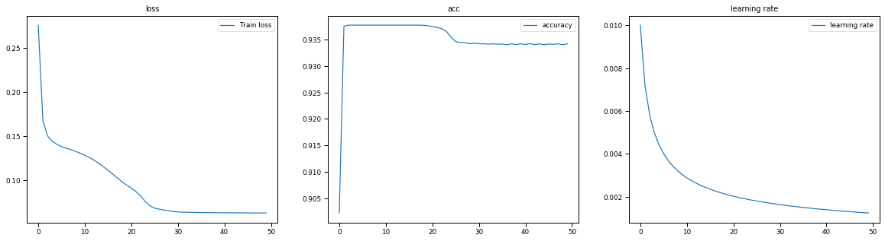
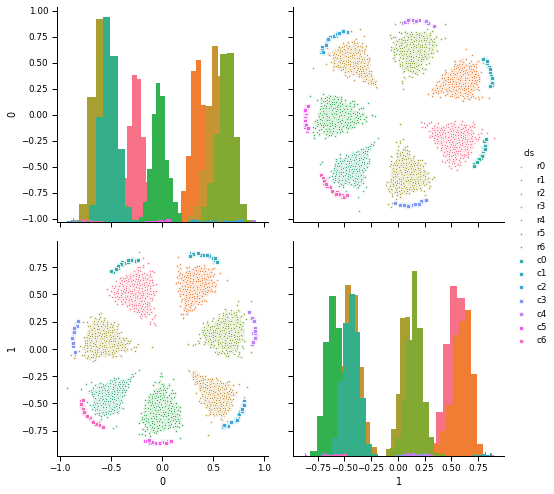

no negative sampling  

NN_word = 200  
num_features = 2

(2019.6.3) use fit (not fit_generator)  
(2019.6.16) lr_scheduler  


```python
%matplotlib inline
from IPython.display import SVG
from keras.utils.vis_utils import model_to_dot
```

    Using TensorFlow backend.
    /home/admin/miniconda3/envs/da03/lib/python3.6/site-packages/tensorflow/python/framework/dtypes.py:516: FutureWarning: Passing (type, 1) or '1type' as a synonym of type is deprecated; in a future version of numpy, it will be understood as (type, (1,)) / '(1,)type'.
      _np_qint8 = np.dtype([("qint8", np.int8, 1)])
    /home/admin/miniconda3/envs/da03/lib/python3.6/site-packages/tensorflow/python/framework/dtypes.py:517: FutureWarning: Passing (type, 1) or '1type' as a synonym of type is deprecated; in a future version of numpy, it will be understood as (type, (1,)) / '(1,)type'.
      _np_quint8 = np.dtype([("quint8", np.uint8, 1)])
    /home/admin/miniconda3/envs/da03/lib/python3.6/site-packages/tensorflow/python/framework/dtypes.py:518: FutureWarning: Passing (type, 1) or '1type' as a synonym of type is deprecated; in a future version of numpy, it will be understood as (type, (1,)) / '(1,)type'.
      _np_qint16 = np.dtype([("qint16", np.int16, 1)])
    /home/admin/miniconda3/envs/da03/lib/python3.6/site-packages/tensorflow/python/framework/dtypes.py:519: FutureWarning: Passing (type, 1) or '1type' as a synonym of type is deprecated; in a future version of numpy, it will be understood as (type, (1,)) / '(1,)type'.
      _np_quint16 = np.dtype([("quint16", np.uint16, 1)])
    /home/admin/miniconda3/envs/da03/lib/python3.6/site-packages/tensorflow/python/framework/dtypes.py:520: FutureWarning: Passing (type, 1) or '1type' as a synonym of type is deprecated; in a future version of numpy, it will be understood as (type, (1,)) / '(1,)type'.
      _np_qint32 = np.dtype([("qint32", np.int32, 1)])
    /home/admin/miniconda3/envs/da03/lib/python3.6/site-packages/tensorflow/python/framework/dtypes.py:525: FutureWarning: Passing (type, 1) or '1type' as a synonym of type is deprecated; in a future version of numpy, it will be understood as (type, (1,)) / '(1,)type'.
      np_resource = np.dtype([("resource", np.ubyte, 1)])
    /home/admin/miniconda3/envs/da03/lib/python3.6/site-packages/tensorboard/compat/tensorflow_stub/dtypes.py:541: FutureWarning: Passing (type, 1) or '1type' as a synonym of type is deprecated; in a future version of numpy, it will be understood as (type, (1,)) / '(1,)type'.
      _np_qint8 = np.dtype([("qint8", np.int8, 1)])
    /home/admin/miniconda3/envs/da03/lib/python3.6/site-packages/tensorboard/compat/tensorflow_stub/dtypes.py:542: FutureWarning: Passing (type, 1) or '1type' as a synonym of type is deprecated; in a future version of numpy, it will be understood as (type, (1,)) / '(1,)type'.
      _np_quint8 = np.dtype([("quint8", np.uint8, 1)])
    /home/admin/miniconda3/envs/da03/lib/python3.6/site-packages/tensorboard/compat/tensorflow_stub/dtypes.py:543: FutureWarning: Passing (type, 1) or '1type' as a synonym of type is deprecated; in a future version of numpy, it will be understood as (type, (1,)) / '(1,)type'.
      _np_qint16 = np.dtype([("qint16", np.int16, 1)])
    /home/admin/miniconda3/envs/da03/lib/python3.6/site-packages/tensorboard/compat/tensorflow_stub/dtypes.py:544: FutureWarning: Passing (type, 1) or '1type' as a synonym of type is deprecated; in a future version of numpy, it will be understood as (type, (1,)) / '(1,)type'.
      _np_quint16 = np.dtype([("quint16", np.uint16, 1)])
    /home/admin/miniconda3/envs/da03/lib/python3.6/site-packages/tensorboard/compat/tensorflow_stub/dtypes.py:545: FutureWarning: Passing (type, 1) or '1type' as a synonym of type is deprecated; in a future version of numpy, it will be understood as (type, (1,)) / '(1,)type'.
      _np_qint32 = np.dtype([("qint32", np.int32, 1)])
    /home/admin/miniconda3/envs/da03/lib/python3.6/site-packages/tensorboard/compat/tensorflow_stub/dtypes.py:550: FutureWarning: Passing (type, 1) or '1type' as a synonym of type is deprecated; in a future version of numpy, it will be understood as (type, (1,)) / '(1,)type'.
      np_resource = np.dtype([("resource", np.ubyte, 1)])


```python
import sys
sys.path.append('/home/admin/github/wordroid.sblo.jp/lib')
from feature_eng import lowcols
```


```python
import os.path
import sys
import re
import itertools
import csv
import datetime
import pickle
import random
from collections import defaultdict, Counter
import gc

import matplotlib.pyplot as plt
from matplotlib.ticker import NullFormatter
import seaborn as sns
import pandas as pd
import numpy as np
import scipy
import gensim
from sklearn.metrics import f1_score, classification_report, confusion_matrix, log_loss
from sklearn.model_selection import train_test_split
import gensim
from keras.preprocessing.sequence import skipgrams
import tensorflow as tf
```


```python
def hexbin(x, y, color, **kwargs):
    cmap = sns.light_palette(color, as_cmap=True)
    plt.hexbin(x, y, cmap=cmap, **kwargs)
def scatter(x, y, color, **kwargs):
    plt.scatter(x, y, marker='.')
```

## create sample data
* The value can be set between 0 and 1.


```python
NN_word = 200
NN_sentence = 10000
NN_SEG = 7
```


```python
product_list = [ee+1 for ee in range(NN_word)]
user_list = [ee+1 for ee in range(NN_sentence)]
```


```python
a, _ = divmod(len(user_list), NN_SEG)
a
cls_user = [int(user_id / (a+1)) for user_id in range(1, 1+len(user_list))]
```


```python
a, _ = divmod(len(product_list), NN_SEG)
print(a)

cls_prod = [int(prod_id / (a+1)) for prod_id in range(1, 1+len(product_list))]
```

    28


```python
np.random.random()
```


    0.811852898309217


```python
random.seed(0)

X_list = []

for ii in range(len(user_list)):
    cls = cls_user[ii]
    product_group = np.array(product_list)[np.array(cls_prod) == cls]
    nword = random.randint(5, 20)
    prods = random.sample(product_group.tolist(), nword)
    irow = np.zeros((1,NN_word))
    #irow[0,np.array(prods)-1] = 1
    irow[0,np.array(prods)-1] = np.random.random()
    X_list.append(irow)

X = np.concatenate(X_list)
print(X.shape)
X
```

    (10000, 200)


    array([[0.        , 0.8249244 , 0.8249244 , ..., 0.        , 0.        ,
            0.        ],
           [0.        , 0.        , 0.01153025, ..., 0.        , 0.        ,
            0.        ],
           [0.55614573, 0.55614573, 0.55614573, ..., 0.        , 0.        ,
            0.        ],
           ...,
           [0.        , 0.        , 0.        , ..., 0.        , 0.        ,
            0.10413546],
           [0.        , 0.        , 0.        , ..., 0.0269037 , 0.0269037 ,
            0.        ],
           [0.        , 0.        , 0.        , ..., 0.60813316, 0.60813316,
            0.60813316]])


```python
X_df = pd.DataFrame(X, dtype=float)
X_df.index = ['r'+ee.astype('str') for ee in (np.arange(X_df.shape[0])+1)]
X_df.columns = ['c'+ee.astype('str') for ee in np.arange(X_df.shape[1])+1]
print(X_df.shape)
X_df.head()
```

    (10000, 200)


<div>
<style scoped>
    .dataframe tbody tr th:only-of-type {
        vertical-align: middle;
    }

    .dataframe tbody tr th {
        vertical-align: top;
    }

    .dataframe thead th {
        text-align: right;
    }
</style>
<table border="1" class="dataframe">
  <thead>
    <tr style="text-align: right;">
      <th></th>
      <th>c1</th>
      <th>c2</th>
      <th>c3</th>
      <th>c4</th>
      <th>c5</th>
      <th>c6</th>
      <th>c7</th>
      <th>c8</th>
      <th>c9</th>
      <th>c10</th>
      <th>...</th>
      <th>c191</th>
      <th>c192</th>
      <th>c193</th>
      <th>c194</th>
      <th>c195</th>
      <th>c196</th>
      <th>c197</th>
      <th>c198</th>
      <th>c199</th>
      <th>c200</th>
    </tr>
  </thead>
  <tbody>
    <tr>
      <td>r1</td>
      <td>0.000000</td>
      <td>0.824924</td>
      <td>0.824924</td>
      <td>0.00000</td>
      <td>0.824924</td>
      <td>0.0</td>
      <td>0.824924</td>
      <td>0.000000</td>
      <td>0.824924</td>
      <td>0.824924</td>
      <td>...</td>
      <td>0.0</td>
      <td>0.0</td>
      <td>0.0</td>
      <td>0.0</td>
      <td>0.0</td>
      <td>0.0</td>
      <td>0.0</td>
      <td>0.0</td>
      <td>0.0</td>
      <td>0.0</td>
    </tr>
    <tr>
      <td>r2</td>
      <td>0.000000</td>
      <td>0.000000</td>
      <td>0.011530</td>
      <td>0.01153</td>
      <td>0.011530</td>
      <td>0.0</td>
      <td>0.000000</td>
      <td>0.000000</td>
      <td>0.000000</td>
      <td>0.011530</td>
      <td>...</td>
      <td>0.0</td>
      <td>0.0</td>
      <td>0.0</td>
      <td>0.0</td>
      <td>0.0</td>
      <td>0.0</td>
      <td>0.0</td>
      <td>0.0</td>
      <td>0.0</td>
      <td>0.0</td>
    </tr>
    <tr>
      <td>r3</td>
      <td>0.556146</td>
      <td>0.556146</td>
      <td>0.556146</td>
      <td>0.00000</td>
      <td>0.000000</td>
      <td>0.0</td>
      <td>0.556146</td>
      <td>0.000000</td>
      <td>0.556146</td>
      <td>0.000000</td>
      <td>...</td>
      <td>0.0</td>
      <td>0.0</td>
      <td>0.0</td>
      <td>0.0</td>
      <td>0.0</td>
      <td>0.0</td>
      <td>0.0</td>
      <td>0.0</td>
      <td>0.0</td>
      <td>0.0</td>
    </tr>
    <tr>
      <td>r4</td>
      <td>0.000000</td>
      <td>0.000000</td>
      <td>0.000000</td>
      <td>0.00000</td>
      <td>0.000000</td>
      <td>0.0</td>
      <td>0.000000</td>
      <td>0.000000</td>
      <td>0.000000</td>
      <td>0.000000</td>
      <td>...</td>
      <td>0.0</td>
      <td>0.0</td>
      <td>0.0</td>
      <td>0.0</td>
      <td>0.0</td>
      <td>0.0</td>
      <td>0.0</td>
      <td>0.0</td>
      <td>0.0</td>
      <td>0.0</td>
    </tr>
    <tr>
      <td>r5</td>
      <td>0.000000</td>
      <td>0.000000</td>
      <td>0.466568</td>
      <td>0.00000</td>
      <td>0.466568</td>
      <td>0.0</td>
      <td>0.466568</td>
      <td>0.466568</td>
      <td>0.000000</td>
      <td>0.000000</td>
      <td>...</td>
      <td>0.0</td>
      <td>0.0</td>
      <td>0.0</td>
      <td>0.0</td>
      <td>0.0</td>
      <td>0.0</td>
      <td>0.0</td>
      <td>0.0</td>
      <td>0.0</td>
      <td>0.0</td>
    </tr>
  </tbody>
</table>
<p>5 rows × 200 columns</p>
</div>


```python
X_df.values.shape
```


    (10000, 200)


```python
plt.figure(figsize=(15, 15))
plt.imshow(X_df.values.T)
```


    <matplotlib.image.AxesImage at 0x7f66ff788da0>


```python

```

## create model


```python
wd2v = lowcols.WD2vec(X_df)
wd2v
```


    <feature_eng.lowcols.WD2vec at 0x7f66fdb38748>


```python
num_features = 2

models = wd2v.make_model(num_user=X_df.shape[0], num_product=NN_word, num_features=num_features)

print('\n\n##################### model_gk1 >>>')
models['model_gk1'].summary()
print('\n\n##################### model_user >>>')
models['model_user'].summary()
print('\n\n##################### model >>>')
model = models['model']
model.summary()
```

    WARNING:tensorflow:From /home/admin/miniconda3/envs/da03/lib/python3.6/site-packages/keras/backend/tensorflow_backend.py:517: The name tf.placeholder is deprecated. Please use tf.compat.v1.placeholder instead.
    
    WARNING:tensorflow:From /home/admin/miniconda3/envs/da03/lib/python3.6/site-packages/keras/backend/tensorflow_backend.py:74: The name tf.get_default_graph is deprecated. Please use tf.compat.v1.get_default_graph instead.
    
    WARNING:tensorflow:From /home/admin/miniconda3/envs/da03/lib/python3.6/site-packages/keras/backend/tensorflow_backend.py:4138: The name tf.random_uniform is deprecated. Please use tf.random.uniform instead.
    
    WARNING:tensorflow:From /home/admin/miniconda3/envs/da03/lib/python3.6/site-packages/keras/backend/tensorflow_backend.py:174: The name tf.get_default_session is deprecated. Please use tf.compat.v1.get_default_session instead.
    
    WARNING:tensorflow:From /home/admin/miniconda3/envs/da03/lib/python3.6/site-packages/keras/backend/tensorflow_backend.py:181: The name tf.ConfigProto is deprecated. Please use tf.compat.v1.ConfigProto instead.
    
    WARNING:tensorflow:From /home/admin/miniconda3/envs/da03/lib/python3.6/site-packages/keras/optimizers.py:790: The name tf.train.Optimizer is deprecated. Please use tf.compat.v1.train.Optimizer instead.
    
    WARNING:tensorflow:From /home/admin/miniconda3/envs/da03/lib/python3.6/site-packages/tensorflow/python/ops/nn_impl.py:180: add_dispatch_support.<locals>.wrapper (from tensorflow.python.ops.array_ops) is deprecated and will be removed in a future version.
    Instructions for updating:
    Use tf.where in 2.0, which has the same broadcast rule as np.where
    
    
    ##################### model_gk1 >>>
    _________________________________________________________________
    Layer (type)                 Output Shape              Param #   
    =================================================================
    input_user (InputLayer)      (None, 1)                 0         
    _________________________________________________________________
    user_embedding (Embedding)   (None, 1, 2)              20000     
    _________________________________________________________________
    flatten_1 (Flatten)          (None, 2)                 0         
    _________________________________________________________________
    gkernel1 (GaussianKernel3)   (None, 200)               401       
    =================================================================
    Total params: 20,401
    Trainable params: 20,401
    Non-trainable params: 0
    _________________________________________________________________
    
    
    ##################### model_user >>>
    _________________________________________________________________
    Layer (type)                 Output Shape              Param #   
    =================================================================
    input_user (InputLayer)      (None, 1)                 0         
    _________________________________________________________________
    user_embedding (Embedding)   (None, 1, 2)              20000     
    _________________________________________________________________
    flatten_1 (Flatten)          (None, 2)                 0         
    =================================================================
    Total params: 20,000
    Trainable params: 20,000
    Non-trainable params: 0
    _________________________________________________________________
    
    
    ##################### model >>>
    _________________________________________________________________
    Layer (type)                 Output Shape              Param #   
    =================================================================
    input_user (InputLayer)      (None, 1)                 0         
    _________________________________________________________________
    user_embedding (Embedding)   (None, 1, 2)              20000     
    _________________________________________________________________
    flatten_1 (Flatten)          (None, 2)                 0         
    _________________________________________________________________
    gkernel1 (GaussianKernel3)   (None, 200)               401       
    =================================================================
    Total params: 20,401
    Trainable params: 20,401
    Non-trainable params: 0
    _________________________________________________________________


```python
wd2v.models['model'].get_layer('user_embedding').get_weights()[0].shape
```


    (10000, 2)


```python
wgt_user = wd2v.get_wgt_byrow()
# wgt_user = model.get_layer('user_embedding').get_weights()[0]
print(wgt_user.shape)
df = pd.DataFrame(wgt_user[:,:5])
sns.set_context('paper')
g = sns.PairGrid(df, size=3.5)
g.map_diag(plt.hist, edgecolor="w")
g.map_lower(scatter)
g.map_upper(hexbin)
```

    (10000, 2)


    /home/admin/miniconda3/envs/da03/lib/python3.6/site-packages/seaborn/axisgrid.py:1241: UserWarning: The `size` paramter has been renamed to `height`; please update your code.
      warnings.warn(UserWarning(msg))


    <seaborn.axisgrid.PairGrid at 0x7f66fde9a470>


```python
wgt_lm = wd2v.get_wgt_bycol()
print(wgt_lm.shape)
df = pd.DataFrame(wgt_lm[:,:5])
sns.set_context('paper')
g = sns.PairGrid(df, size=3.5)
g.map_diag(plt.hist, edgecolor="w")
g.map_lower(scatter)
g.map_upper(hexbin)
```

    (200, 2)


    <seaborn.axisgrid.PairGrid at 0x7f66fdbda588>


```python
models['model_user'].predict([0,1,2])
```


    array([[-0.00076687,  0.0479542 ],
           [-0.13491344,  0.2006259 ],
           [-0.0261513 , -0.13049746]], dtype=float32)


```python
models['model_gk1'].predict([0,1,2]).shape
```


    array([[0.70300543, 0.31404695, 0.88039625, 0.236751  , 0.565584  ,
            0.24187078, 0.32386822, 0.181757  , 0.978773  , 0.3465193 ,
            0.15749477, 0.3170618 , 0.30190682, 0.53017765, 0.39349407,
            0.606647  , 0.51231045, 0.8285043 , 0.40090936, 0.40190762,
            0.7380341 , 0.9284845 , 0.27951235, 0.74720967, 0.19227555,
            0.65317583, 0.8063931 , 0.73368055, 0.55471146, 0.2486021 ,
            0.3430903 , 0.37798443, 0.59706473, 0.1814683 , 0.22257395,
            0.5669026 , 0.25494474, 0.369129  , 0.56857777, 0.28098562,
            0.7125977 , 0.7100985 , 0.8227334 , 0.99394065, 0.17697488,
            0.9452255 , 0.6378729 , 0.45895866, 0.33598018, 0.80120265,
            0.31240794, 0.20546068, 0.23159318, 0.61696863, 0.08729413,
            0.11867861, 0.20047776, 0.1893763 , 0.15453336, 0.22330171,
            0.16535755, 0.79341596, 0.19300756, 0.3848049 , 0.2632972 ,
            0.40493336, 0.6233521 , 0.32826287, 0.72967505, 0.76238215,
            0.1425961 , 0.57065314, 0.5466783 , 0.2956666 , 0.43228084,
            0.32502687, 0.60392916, 0.39090487, 0.5575091 , 0.37472925,
            0.22957091, 0.19944552, 0.7725426 , 0.3068967 , 0.38475412,
            0.98305774, 0.32448083, 0.38287926, 0.5174714 , 0.19767007,
            0.60392267, 0.38379815, 0.68493944, 0.53433067, 0.70579875,
            0.5873828 , 0.5043057 , 0.92194057, 0.8075173 , 0.19909859,
            0.3435409 , 0.46903795, 0.64696395, 0.7299234 , 0.3269227 ,
            0.16952613, 0.33697936, 0.19260569, 0.47380996, 0.19365288,
            0.9053274 , 0.5365105 , 0.46487445, 0.16365793, 0.10530932,
            0.1959019 , 0.29018193, 0.1802772 , 0.6100902 , 0.34279352,
            0.14840102, 0.17311688, 0.11603721, 0.46278673, 0.51779187,
            0.24916407, 0.6975035 , 0.14022559, 0.49063522, 0.427124  ,
            0.20885673, 0.3213596 , 0.5646687 , 0.19084665, 0.1509499 ,
            0.09136145, 0.79748535, 0.11600468, 0.40024924, 0.12375496,
            0.63142943, 0.8447317 , 0.40894347, 0.9767454 , 0.49851143,
            0.6055443 , 0.79389304, 0.32727903, 0.08512204, 0.19582644,
            0.66455835, 0.1524878 , 0.20455915, 0.11255749, 0.11546895,
            0.56854516, 0.3951161 , 0.23641175, 0.5788465 , 0.272513  ,
            0.5706934 , 0.0845485 , 0.18224737, 0.31931233, 0.26601192,
            0.1602506 , 0.5531432 , 0.35614818, 0.96192855, 0.61548024,
            0.39100683, 0.3334447 , 0.21524867, 0.38124186, 0.1491615 ,
            0.61409914, 0.29914626, 0.91963005, 0.2323747 , 0.26562822,
            0.6335712 , 0.40206185, 0.28461486, 0.64654607, 0.6400879 ,
            0.2350468 , 0.19943023, 0.29343718, 0.652896  , 0.80283767,
            0.40274328, 0.20125589, 0.3902823 , 0.29407096, 0.6910084 ,
            0.3957947 , 0.3963641 , 0.27652532, 0.51872164, 0.23044215],
           [0.93289286, 0.40491566, 0.8199548 , 0.60807633, 0.21038252,
            0.06536367, 0.14635581, 0.05549283, 0.6628965 , 0.34129256,
            0.13845435, 0.14791383, 0.47387925, 0.5302608 , 0.481313  ,
            0.23600839, 0.7898574 , 0.990301  , 0.80050665, 0.12233581,
            0.85429597, 0.7297378 , 0.6689398 , 0.8913099 , 0.12272238,
            0.6700149 , 0.4550881 , 0.41649157, 0.2304528 , 0.16186506,
            0.63572663, 0.3976336 , 0.39804542, 0.5175611 , 0.47979355,
            0.21234575, 0.06296302, 0.7493948 , 0.9306774 , 0.10691199,
            0.31788394, 0.36694527, 0.6372523 , 0.83787376, 0.04070495,
            0.91298425, 0.50322866, 0.15814461, 0.11038454, 0.64927185,
            0.10991446, 0.53870493, 0.27851143, 0.81549037, 0.05056405,
            0.08848469, 0.05125673, 0.23371269, 0.03292941, 0.05655624,
            0.15885332, 0.38599557, 0.53779143, 0.35506642, 0.13398664,
            0.5401583 , 0.24963887, 0.2711209 , 0.33926332, 0.517196  ,
            0.10037044, 0.23233257, 0.27523556, 0.2474557 , 0.1657425 ,
            0.18676203, 0.34182352, 0.2390385 , 0.20490117, 0.71108806,
            0.16574553, 0.13951652, 0.9780259 , 0.57653415, 0.20794071,
            0.75258684, 0.2732338 , 0.43992043, 0.20049424, 0.04588538,
            0.86065626, 0.4273998 , 0.734344  , 0.6425048 , 0.95429736,
            0.9454404 , 0.35481498, 0.8784184 , 0.51483244, 0.22462228,
            0.11008524, 0.51248854, 0.26837218, 0.383199  , 0.7286837 ,
            0.0533077 , 0.6970956 , 0.22843257, 0.855487  , 0.04672197,
            0.7114408 , 0.35339385, 0.3563307 , 0.03669861, 0.01881923,
            0.09590437, 0.6719042 , 0.04031212, 0.28877014, 0.6468405 ,
            0.11714582, 0.03652526, 0.09755889, 0.618948  , 0.8751318 ,
            0.06268218, 0.79277086, 0.02826947, 0.20429601, 0.13989274,
            0.08096611, 0.13520057, 0.21223044, 0.18111435, 0.08959848,
            0.01564858, 0.7027927 , 0.02200421, 0.79692733, 0.10530905,
            0.96157336, 0.47062084, 0.16530383, 0.70804757, 0.19460262,
            0.9524691 , 0.9632041 , 0.12138951, 0.05014665, 0.5401731 ,
            0.6586804 , 0.06412078, 0.17276593, 0.08435111, 0.378479  ,
            0.57138896, 0.12120873, 0.51279324, 0.7755602 , 0.09512456,
            0.549307  , 0.06568731, 0.14603686, 0.10412535, 0.12227337,
            0.09111303, 0.49580583, 0.10425489, 0.63252366, 0.24216057,
            0.50755084, 0.37010577, 0.19607806, 0.6031122 , 0.09959094,
            0.29728115, 0.08247731, 0.5405539 , 0.05692168, 0.6407299 ,
            0.2583739 , 0.18568479, 0.07922882, 0.7996229 , 0.6875703 ,
            0.05804352, 0.20427093, 0.37809014, 0.27039793, 0.9648398 ,
            0.1566315 , 0.05462898, 0.22501722, 0.68385816, 0.58890045,
            0.36062345, 0.77591026, 0.21389788, 0.71630156, 0.18952502],
           [0.5086462 , 0.3659752 , 0.8078568 , 0.09842033, 0.75216645,
            0.51957023, 0.6705996 , 0.46867055, 0.8714191 , 0.4884292 ,
            0.29964283, 0.18889847, 0.291476  , 0.2291126 , 0.14192441,
            0.7316336 , 0.38489062, 0.509972  , 0.21116805, 0.55702025,
            0.37590098, 0.9159775 , 0.11987761, 0.38723734, 0.4152505 ,
            0.6841066 , 0.64644176, 0.98450726, 0.8749158 , 0.4957428 ,
            0.11856565, 0.14043331, 0.8611778 , 0.06969538, 0.16038856,
            0.77292013, 0.4362197 , 0.20940575, 0.28730392, 0.19811931,
            0.74649084, 0.56693625, 0.9162787 , 0.77421016, 0.39919123,
            0.64338505, 0.33489603, 0.49643847, 0.6675254 , 0.47357833,
            0.25376654, 0.10315306, 0.07022408, 0.27850088, 0.23779507,
            0.0380525 , 0.21503328, 0.26816985, 0.3466683 , 0.26203778,
            0.29316968, 0.8766319 , 0.07632994, 0.54840124, 0.13639143,
            0.4139098 , 0.6983253 , 0.1299738 , 0.71318823, 0.4891184 ,
            0.04944434, 0.54208535, 0.38044655, 0.4889898 , 0.784319  ,
            0.16305941, 0.9140733 , 0.69405806, 0.69451666, 0.13955098,
            0.4445056 , 0.07552918, 0.53303194, 0.23266514, 0.21521907,
            0.75357604, 0.519488  , 0.13886708, 0.83212507, 0.41174787,
            0.45141256, 0.47413838, 0.33157077, 0.5348449 , 0.36944586,
            0.3283863 , 0.76422083, 0.59223825, 0.9875048 , 0.29898456,
            0.3388195 , 0.18690196, 0.853824  , 0.9830857 , 0.14971736,
            0.4495445 , 0.20053837, 0.28049555, 0.27277577, 0.22900157,
            0.91916454, 0.2925985 , 0.69533086, 0.3784876 , 0.18327251,
            0.46687856, 0.11257252, 0.24513957, 0.4864984 , 0.24215521,
            0.04849339, 0.30021244, 0.0345578 , 0.17671818, 0.2346924 ,
            0.4750354 , 0.339677  , 0.30807745, 0.4028679 , 0.48440266,
            0.51368153, 0.21354058, 0.6434204 , 0.06030367, 0.0595153 ,
            0.20605765, 0.45184594, 0.17476985, 0.2145007 , 0.25450665,
            0.33442742, 0.7293556 , 0.31596178, 0.9196682 , 0.8290838 ,
            0.31904534, 0.44894972, 0.68033874, 0.23139007, 0.07266506,
            0.710149  , 0.4057965 , 0.06982037, 0.03554958, 0.04944748,
            0.65058446, 0.4952212 , 0.16346553, 0.48911816, 0.21056636,
            0.6746602 , 0.0245572 , 0.35380775, 0.2926724 , 0.15136531,
            0.06618149, 0.69884795, 0.44940302, 0.8268655 , 0.7817038 ,
            0.13908522, 0.11642353, 0.3692093 , 0.3290645 , 0.33608967,
            0.4781791 , 0.55395234, 0.88799846, 0.30933884, 0.12916234,
            0.8417294 , 0.26516262, 0.3247966 , 0.29896873, 0.6500783 ,
            0.3087458 , 0.06159306, 0.3502574 , 0.83887124, 0.58236694,
            0.32444465, 0.48044652, 0.70880973, 0.11952632, 0.36323243,
            0.5634428 , 0.161849  , 0.48891035, 0.21048447, 0.41391283]],
          dtype=float32)


```python

```

## train


```python
# from keras.callbacks import ModelCheckpoint, LearningRateScheduler, ReduceLROnPlateau

# def lr_schedule(epoch):
#     def reduce(epoch, lr):
#         if divmod(epoch,4)[1] == 3:
#             lr *= (1/8)
#         elif divmod(epoch,4)[1] == 2:
#             lr *= (1/4)
#         elif divmod(epoch,4)[1] == 1:
#             lr *= (1/2)
#         elif divmod(epoch,4)[1] == 0:
#             pass
#         return lr
    
#     lr0 = 0.01
#     epoch1 = 8
#     epoch2 = 8
#     epoch3 = 8
#     epoch4 = 8
    
#     if epoch<epoch1:
#         lr = lr0
#         #lr = reduce(epoch, lr)
#     elif epoch<epoch1+epoch2:
#         lr = lr0/2
#         #lr = reduce(epoch, lr)
#     elif epoch<epoch1+epoch2+epoch3:
#         lr = lr0/4
#         #lr = reduce(epoch, lr)
#     elif epoch<epoch1+epoch2+epoch3+epoch4:
#         lr = lr0/8
#         #lr = reduce(epoch, lr)
#     else:
#         lr = lr0/16
    
#     print('Learning rate: ', lr)
#     return lr

# lr_scheduler = LearningRateScheduler(lr_schedule)
# callbacks = [lr_scheduler]

# hst = wd2v.train(epochs=32, batch_size=32, verbose=2,
#            callbacks=callbacks)
```


```python
%%time
hst = wd2v.train(epochs=50, batch_size=32, verbose=2)
#hst = wd2v.train(epochs=50, batch_size=32, verbose=2, callbacks=[])
```

    Epoch 1/50
    Learning rate:  0.01
     - 4s - loss: 0.2760 - acc: 0.9022
    Epoch 2/50
    Learning rate:  0.007204268570481045
     - 2s - loss: 0.1674 - acc: 0.9375
    Epoch 3/50
    Learning rate:  0.005834135746073483
     - 2s - loss: 0.1505 - acc: 0.9377
    Epoch 4/50
    Learning rate:  0.0050013254202696785
     - 2s - loss: 0.1444 - acc: 0.9377
    Epoch 5/50
    Learning rate:  0.004432620519199698
     - 2s - loss: 0.1410 - acc: 0.9377
    Epoch 6/50
    Learning rate:  0.004014837552604439
     - 2s - loss: 0.1386 - acc: 0.9377
    Epoch 7/50
    Learning rate:  0.00369216769989574
     - 2s - loss: 0.1367 - acc: 0.9377
    Epoch 8/50
    Learning rate:  0.003433714942906377
     - 2s - loss: 0.1349 - acc: 0.9377
    Epoch 9/50
    Learning rate:  0.003220895793898085
     - 2s - loss: 0.1330 - acc: 0.9377
    Epoch 10/50
    Learning rate:  0.0030418116587033316
     - 2s - loss: 0.1310 - acc: 0.9377
    Epoch 11/50
    Learning rate:  0.0028884628098809063
     - 2s - loss: 0.1287 - acc: 0.9377
    Epoch 12/50
    Learning rate:  0.0027552555781387256
     - 2s - loss: 0.1260 - acc: 0.9377
    Epoch 13/50
    Learning rate:  0.0026381505830680055
     - 2s - loss: 0.1229 - acc: 0.9377
    Epoch 14/50
    Learning rate:  0.002534151184934775
     - 2s - loss: 0.1195 - acc: 0.9377
    Epoch 15/50
    Learning rate:  0.0024409828962551417
     - 2s - loss: 0.1157 - acc: 0.9377
    Epoch 16/50
    Learning rate:  0.0023568851052123392
     - 2s - loss: 0.1116 - acc: 0.9377
    Epoch 17/50
    Learning rate:  0.0022804715278789056
     - 2s - loss: 0.1073 - acc: 0.9377
    Epoch 18/50
    Learning rate:  0.002210634178153207
     - 2s - loss: 0.1029 - acc: 0.9377
    Epoch 19/50
    Learning rate:  0.0021464757216000914
     - 2s - loss: 0.0986 - acc: 0.9377
    Epoch 20/50
    Learning rate:  0.002087260830499979
     - 2s - loss: 0.0948 - acc: 0.9376
    Epoch 21/50
    Learning rate:  0.0020323805553448624
     - 2s - loss: 0.0913 - acc: 0.9374
    Epoch 22/50
    Learning rate:  0.0019813257979569548
     - 2s - loss: 0.0875 - acc: 0.9372
    Epoch 23/50
    Learning rate:  0.0019336672671061345
     - 2s - loss: 0.0824 - acc: 0.9370
    Epoch 24/50
    Learning rate:  0.0018890401285365371
     - 2s - loss: 0.0763 - acc: 0.9365
    Epoch 25/50
    Learning rate:  0.0018471321061274935
     - 2s - loss: 0.0713 - acc: 0.9354
    Epoch 26/50
    Learning rate:  0.0018076741552439314
     - 2s - loss: 0.0687 - acc: 0.9346
    Epoch 27/50
    Learning rate:  0.0017704330774042942
     - 2s - loss: 0.0676 - acc: 0.9344
    Epoch 28/50
    Learning rate:  0.001735205617116534
     - 2s - loss: 0.0666 - acc: 0.9344
    Epoch 29/50
    Learning rate:  0.001701813702416052
     - 2s - loss: 0.0657 - acc: 0.9342
    Epoch 30/50
    Learning rate:  0.001670100576643398
     - 2s - loss: 0.0650 - acc: 0.9343
    Epoch 31/50
    Learning rate:  0.0016399276310837452
     - 2s - loss: 0.0644 - acc: 0.9342
    Epoch 32/50
    Learning rate:  0.001611171793445072
     - 2s - loss: 0.0642 - acc: 0.9342
    Epoch 33/50
    Learning rate:  0.0015837233606549829
     - 2s - loss: 0.0640 - acc: 0.9341
    Epoch 34/50
    Learning rate:  0.0015574841894612367
     - 2s - loss: 0.0639 - acc: 0.9342
    Epoch 35/50
    Learning rate:  0.0015323661771647283
     - 2s - loss: 0.0638 - acc: 0.9341
    Epoch 36/50
    Learning rate:  0.001508289979143041
     - 2s - loss: 0.0637 - acc: 0.9341
    Epoch 37/50
    Learning rate:  0.0014851839208119217
     - 2s - loss: 0.0636 - acc: 0.9340
    Epoch 38/50
    Learning rate:  0.0014629830701671676
     - 2s - loss: 0.0636 - acc: 0.9342
    Epoch 39/50
    Learning rate:  0.0014416284436659722
     - 2s - loss: 0.0635 - acc: 0.9340
    Epoch 40/50
    Learning rate:  0.0014210663233967624
     - 2s - loss: 0.0635 - acc: 0.9342
    Epoch 41/50
    Learning rate:  0.0014012476675849387
     - 2s - loss: 0.0635 - acc: 0.9340
    Epoch 42/50
    Learning rate:  0.0013821275997388009
     - 2s - loss: 0.0634 - acc: 0.9342
    Epoch 43/50
    Learning rate:  0.001363664964343722
     - 2s - loss: 0.0634 - acc: 0.9340
    Epoch 44/50
    Learning rate:  0.0013458219391061501
     - 2s - loss: 0.0634 - acc: 0.9341
    Epoch 45/50
    Learning rate:  0.0013285636954414256
     - 2s - loss: 0.0633 - acc: 0.9340
    Epoch 46/50
    Learning rate:  0.0013118581002746184
     - 2s - loss: 0.0633 - acc: 0.9341
    Epoch 47/50
    Learning rate:  0.0012956754533465648
     - 2s - loss: 0.0633 - acc: 0.9341
    Epoch 48/50
    Learning rate:  0.0012799882551385894
     - 2s - loss: 0.0633 - acc: 0.9342
    Epoch 49/50
    Learning rate:  0.0012647710012886498
     - 2s - loss: 0.0633 - acc: 0.9340
    Epoch 50/50
    Learning rate:  0.00125
     - 2s - loss: 0.0632 - acc: 0.9342
    CPU times: user 2min 12s, sys: 34.6 s, total: 2min 47s
    Wall time: 1min 57s


```python
hst_history = hst.history
```


```python
fig, ax = plt.subplots(1, 3, figsize=(20,5))
ax[0].set_title('loss')
ax[0].plot(list(range(len(hst_history["loss"]))), hst_history["loss"], label="Train loss")
ax[1].set_title('acc')
ax[1].plot(list(range(len(hst_history["loss"]))), hst_history["acc"], label="accuracy")
ax[2].set_title('learning rate')
ax[2].plot(list(range(len(hst_history["loss"]))), hst_history["lr"], label="learning rate")
ax[0].legend()
ax[1].legend()
ax[2].legend()
```


    <matplotlib.legend.Legend at 0x7f66f43d3f98>





## show column features


```python
wgt_prod = wd2v.get_wgt_bycol()
print(wgt_prod.shape)
df = pd.DataFrame(wgt_prod[:,:5])
sns.set_context('paper')
g = sns.PairGrid(df, size=3.5)
g.map_diag(plt.hist, edgecolor="w")
g.map_lower(scatter)
g.map_upper(hexbin)
```

    (200, 2)


    /home/admin/miniconda3/envs/da03/lib/python3.6/site-packages/seaborn/axisgrid.py:1241: UserWarning: The `size` paramter has been renamed to `height`; please update your code.
      warnings.warn(UserWarning(msg))


    <seaborn.axisgrid.PairGrid at 0x7f66f435ae10>


```python
wgt_prod = wd2v.get_wgt_bycol()
print(wgt_prod.shape)
df = pd.DataFrame(wgt_prod[:,:5])
df['cls'] = ['c'+str(ii) for ii in cls_prod]
sns.pairplot(df, markers='o', hue='cls', height=3.5, diag_kind='hist')
```

    (200, 2)


    <seaborn.axisgrid.PairGrid at 0x7f66f413eac8>


## show row feature


```python
wgt_user = wd2v.get_wgt_byrow()
print(wgt_user.shape)
df = pd.DataFrame(wgt_user[:,:5])
sns.set_context('paper')
g = sns.PairGrid(df, size=3.5)
g.map_diag(plt.hist, edgecolor="w")
g.map_lower(scatter)
g.map_upper(hexbin)
```

    (10000, 2)


    <seaborn.axisgrid.PairGrid at 0x7f66f4168400>


```python
wgt_user = wd2v.get_wgt_byrow()
print(wgt_user.shape)
df = pd.DataFrame(wgt_user[:,:5])
df['cls'] = ['c'+str(ii) for ii in cls_user]
sns.pairplot(df, markers='o', hue='cls', height=3.5, diag_kind='hist')
```

    (10000, 2)


    <seaborn.axisgrid.PairGrid at 0x7f66d0dafe10>


## show row side and col side


```python
'''show row side and col side at the same time'''
df1 = pd.DataFrame(wgt_prod)
df1['cls'] = ['c'+str(ii) for ii in cls_prod]
df2 = pd.DataFrame(wgt_user)
df2['cls'] = ['r'+str(ii) for ii in cls_user]
df = pd.concat([df2, df1])
df.head()

sns.pairplot(df, markers=['.']*7+['s']*7, hue='cls', size=3.5, diag_kind='hist')
```

    /home/admin/miniconda3/envs/da03/lib/python3.6/site-packages/seaborn/axisgrid.py:2065: UserWarning: The `size` parameter has been renamed to `height`; pleaes update your code.
      warnings.warn(msg, UserWarning)


    <seaborn.axisgrid.PairGrid at 0x7f66d070e630>





```python

```


```python
'''PCA'''
from sklearn import decomposition
pca = decomposition.PCA(n_components=2)
pca.fit(np.vstack([wgt_prod, wgt_user]))
```


    PCA(copy=True, iterated_power='auto', n_components=2, random_state=None,
        svd_solver='auto', tol=0.0, whiten=False)


```python
f = pca.transform(np.vstack([wgt_prod, wgt_user]))
f.shape
```


    (10200, 2)


```python
df = pd.DataFrame(f)
df['cls'] = ['c'+str(ii) for ii in cls_prod] + ['c'+str(ii) for ii in cls_user]
df.head()
```


<div>
<style scoped>
    .dataframe tbody tr th:only-of-type {
        vertical-align: middle;
    }

    .dataframe tbody tr th {
        vertical-align: top;
    }

    .dataframe thead th {
        text-align: right;
    }
</style>
<table border="1" class="dataframe">
  <thead>
    <tr style="text-align: right;">
      <th></th>
      <th>0</th>
      <th>1</th>
      <th>cls</th>
    </tr>
  </thead>
  <tbody>
    <tr>
      <td>0</td>
      <td>-0.252654</td>
      <td>-0.848354</td>
      <td>c0</td>
    </tr>
    <tr>
      <td>1</td>
      <td>-0.207080</td>
      <td>-0.863580</td>
      <td>c0</td>
    </tr>
    <tr>
      <td>2</td>
      <td>-0.119917</td>
      <td>-0.874706</td>
      <td>c0</td>
    </tr>
    <tr>
      <td>3</td>
      <td>-0.174312</td>
      <td>-0.874576</td>
      <td>c0</td>
    </tr>
    <tr>
      <td>4</td>
      <td>-0.063511</td>
      <td>-0.881610</td>
      <td>c0</td>
    </tr>
  </tbody>
</table>
</div>


```python
sns.pairplot(df, markers='o', hue='cls', size=3.5, diag_kind='hist')
```

    /home/admin/miniconda3/envs/da03/lib/python3.6/site-packages/seaborn/axisgrid.py:2065: UserWarning: The `size` parameter has been renamed to `height`; pleaes update your code.
      warnings.warn(msg, UserWarning)


    <seaborn.axisgrid.PairGrid at 0x7f66bbfea198>


```python
'''t-SNE'''
from sklearn import manifold
wgt = np.vstack([wgt_prod, wgt_user])
print(wgt.shape)
tsne = manifold.TSNE(n_components=2, init='pca', random_state=0)
X_tsne = tsne.fit_transform(wgt)
```

    (10200, 2)


```python
df = pd.DataFrame(X_tsne)
df['cls'] = ['c'+str(ii) for ii in cls_prod] + ['c'+str(ii) for ii in cls_user]
df.head()
```


<div>
<style scoped>
    .dataframe tbody tr th:only-of-type {
        vertical-align: middle;
    }

    .dataframe tbody tr th {
        vertical-align: top;
    }

    .dataframe thead th {
        text-align: right;
    }
</style>
<table border="1" class="dataframe">
  <thead>
    <tr style="text-align: right;">
      <th></th>
      <th>0</th>
      <th>1</th>
      <th>cls</th>
    </tr>
  </thead>
  <tbody>
    <tr>
      <td>0</td>
      <td>-22.897026</td>
      <td>-93.342155</td>
      <td>c0</td>
    </tr>
    <tr>
      <td>1</td>
      <td>-22.192999</td>
      <td>-94.202644</td>
      <td>c0</td>
    </tr>
    <tr>
      <td>2</td>
      <td>-20.829494</td>
      <td>-95.603729</td>
      <td>c0</td>
    </tr>
    <tr>
      <td>3</td>
      <td>-21.561979</td>
      <td>-94.892273</td>
      <td>c0</td>
    </tr>
    <tr>
      <td>4</td>
      <td>-20.305542</td>
      <td>-96.055634</td>
      <td>c0</td>
    </tr>
  </tbody>
</table>
</div>


```python
sns.pairplot(df, markers='o', hue='cls', size=3.5, diag_kind='hist')
```

    /home/admin/miniconda3/envs/da03/lib/python3.6/site-packages/seaborn/axisgrid.py:2065: UserWarning: The `size` parameter has been renamed to `height`; pleaes update your code.
      warnings.warn(msg, UserWarning)


    <seaborn.axisgrid.PairGrid at 0x7f66bb97cfd0>


```python

```


```python

```
